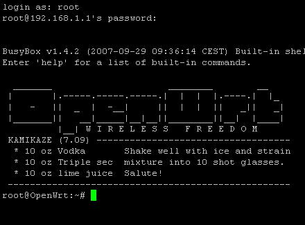

## Contents

* [1 OpenWRT Connections](#OpenWRT_Connections)
  + [1.1 1. ¿Qué es OpenWRT?](#1._.C2.BFQu.C3.A9_es_OpenWRT.3F)
  + [1.2 2. Descripción de la propuesta](#2._Descripci.C3.B3n_de_la_propuesta)
  + [1.3 3. Conceptos utilizados](#3._Conceptos_utilizados)
    - [1.3.1 Sistemas Operativos](#Sistemas_Operativos)
    - [1.3.2 Redes de computadores](#Redes_de_computadores)
  + [1.4 4. Futuras ampliaciones](#4._Futuras_ampliaciones)
    - [1.4.1 Comunicación cliente - router](#Comunicaci.C3.B3n_cliente_-_router)
    - [1.4.2 Aplicación](#Aplicaci.C3.B3n)

# OpenWRT Connections[[edit](/pti/index.php?title=Categor%C3%ADa:OpenWRT_Connections&veaction=edit&section=1 "Edit section: OpenWRT Connections") | [edit source](/pti/index.php?title=Categor%C3%ADa:OpenWRT_Connections&action=edit&section=1 "Edit section: OpenWRT Connections")]

[File:Openwrt-logo.png](/pti/index.php?title=Special:Upload&wpDestFile=Openwrt-logo.png "File:Openwrt-logo.png")

## 1. ¿Qué es OpenWRT?[[edit](/pti/index.php?title=Categor%C3%ADa:OpenWRT_Connections&veaction=edit&section=2 "Edit section: 1. ¿Qué es OpenWRT?") | [edit source](/pti/index.php?title=Categor%C3%ADa:OpenWRT_Connections&action=edit&section=2 "Edit section: 1. ¿Qué es OpenWRT?")]

Openwrt es una distribución GNU/Linux altamente extensible para dispositivos embebidos. A
diferencia de muchas otras distribuciones para routers, OpenWrt está construido desde el piso para
ser completamente funcional y ser un sistema operativo fácilmente modificable para un router. En la
práctica, esto significa que uno puede tener todas las funcionalidades que requiera sin ningún
exceso, impulsado por un núcleo Linux que es más reciente que la mayoría de las otras
distribuciones.

En vez de intentar crear un firmware estático, Openwrt provee un sistema de ficheros
completamente escribible con un gestor de paquetes. Esto le libera de las restricciones de
aplicaciones, funciones y configuraciones proporcionadas por el vendedor y le permite utilizar los
paquetes para personalizar un dispositivo integrado, para que pueda adaptarse a cualquier
aplicación. Para los desarrolladores, OpenWrt proporciona un marco para crear una aplicación sin
tener que crear una imagen de firmware completa y distribuirla alrededor. Para los usuarios, esto
significa la libertad de personalización completa, lo que permite el uso de un dispositivo embebido
en formas que el vendedor nunca imaginó.

## 2. Descripción de la propuesta[[edit](/pti/index.php?title=Categor%C3%ADa:OpenWRT_Connections&veaction=edit&section=3 "Edit section: 2. Descripción de la propuesta") | [edit source](/pti/index.php?title=Categor%C3%ADa:OpenWRT_Connections&action=edit&section=3 "Edit section: 2. Descripción de la propuesta")]

El proyecto consiste en la implementación de una aplicación capaz de gestionar el sistema operativo
de un router con el objetivo de poder ejecutar funcionalidades previamente preparadas para
ejecutarse de manera automática. Para lograrlo, instalaremos el sistema operativo OpenWRT en el
equipo que hará a la vez de router. Al SO una vez esté corriendo en el dispositivo deseado será
preparado para ejecutar las distintas las funcionalidades se han propuesto implementar en el
proyecto.
El usuario para comunicarse con el router utilizará una UI desde la cual podrá gestionar las distintas
funcionalidades implementadas. El router, de acuerdo con la petición enviada por el usuario 5
ejecutará las acciones correspondientes y reportará al usuario los resultados de la operación
demandada.
La idea principal es que el usuario pueda ejecutar de manera fácil las diferentes opciones ofrecidas
por el router y que este reciba los resultados de manera clara sin tener que acceder al router
directamente para consultar los datos obtenidos.

[File:Comunicacion.png](/pti/index.php?title=Special:Upload&wpDestFile=Comunicacion.png "File:Comunicacion.png")

## 3. Conceptos utilizados[[edit](/pti/index.php?title=Categor%C3%ADa:OpenWRT_Connections&veaction=edit&section=4 "Edit section: 3. Conceptos utilizados") | [edit source](/pti/index.php?title=Categor%C3%ADa:OpenWRT_Connections&action=edit&section=4 "Edit section: 3. Conceptos utilizados")]

Con la realización de este proyecto pretendemos poner en práctica conocimientos obtenidos en la
especialidad que cursamos (Tecnologías de la Información), concretamente aplicamos conceptos de
las dos ramas de la especialidad como son la de administración de Sistemas Operativos y la de redes:

### Sistemas Operativos[[edit](/pti/index.php?title=Categor%C3%ADa:OpenWRT_Connections&veaction=edit&section=5 "Edit section: Sistemas Operativos") | [edit source](/pti/index.php?title=Categor%C3%ADa:OpenWRT_Connections&action=edit&section=5 "Edit section: Sistemas Operativos")]

* Instalación de OpenWRT en un equipo para que haga funciones de router
* Instalación de un server ssh en el router
* Configurar un servidor http en la aplicación cliente
* Configurar el SO para que sea apto para el trabajo que queremos realizar:
  + Instalación de software necesario para la ejecución de los scripts
  + Creación de Scripts para automatizar acciones

### Redes de computadores[[edit](/pti/index.php?title=Categor%C3%ADa:OpenWRT_Connections&veaction=edit&section=6 "Edit section: Redes de computadores") | [edit source](/pti/index.php?title=Categor%C3%ADa:OpenWRT_Connections&action=edit&section=6 "Edit section: Redes de computadores")]

* Comunicación entre dos extremos:
  + Protocolo ssh
  + Prootocolo HTTP

* Manipulación del router:
  + Configuración de interfaces
  + Gestión de direcciones @IP (estáticas, dinámicas)
  + Configuración de modos de acceso al equipo (por ejemplo AP)
  + Configuración Firewall i Servidor DHCP

* Seguridad:
  + Una de las funcionalidades consiste en descifrar claves web.4

* Análisis de tráfico:
  + Mediante una de las opciones dadas al usuario se pueden consultar el tráfico que transita por las interfaces del router.

## 4. Futuras ampliaciones[[edit](/pti/index.php?title=Categor%C3%ADa:OpenWRT_Connections&veaction=edit&section=7 "Edit section: 4. Futuras ampliaciones") | [edit source](/pti/index.php?title=Categor%C3%ADa:OpenWRT_Connections&action=edit&section=7 "Edit section: 4. Futuras ampliaciones")]

El proyecto deja muchas puertas abiertas para seguir mejorando la aplicación, por una parte
tenemos la parte de la comunicación entre el cliente y el servidor, y la otra se corresponde con las
funcionalidades disponibles para el usuario.

### Comunicación cliente - router[[edit](/pti/index.php?title=Categor%C3%ADa:OpenWRT_Connections&veaction=edit&section=8 "Edit section: Comunicación cliente - router") | [edit source](/pti/index.php?title=Categor%C3%ADa:OpenWRT_Connections&action=edit&section=8 "Edit section: Comunicación cliente - router")]

En lo referente a la comunicación entre el cliente y el servidor una mejora importante, y de primera
necesidad, es dotar al sistema de mayor flexibilidad a la hora de configurar el entorno. Modificar
todos los datos hardcodeados en el código para que puedan ser introducidos por el usuario seria un
avance importante así como una mayor interacción con el usuario en la realización de la
funcionalidad del descifrado de claves WEP. Con esta última se conseguiría una rebaja de la
complejidad del script a realizar.

### Aplicación[[edit](/pti/index.php?title=Categor%C3%ADa:OpenWRT_Connections&veaction=edit&section=9 "Edit section: Aplicación") | [edit source](/pti/index.php?title=Categor%C3%ADa:OpenWRT_Connections&action=edit&section=9 "Edit section: Aplicación")]

Una vez mejorada la comunicación entre el servidor y el cliente el siguiente avance sería añadir
nuevas funcionalidades a la aplicación para seguir dando facilidades al usuario a la hora de utilizar
OpenWRT. En el caso de seguir implementando funcionalidades se podría incluso, muy a largo plazo,
conseguir una interfaz gráfica complementaria a LuCi capaz de gestionar otros ámbitos del router sin
necesidad de tener que acceder por consola para configurarlos. También una posible mejora seria la
de dar posiblidad al cliente de ejecutar las funcionalidades concurrentemente, aunque no lo hemos
considerado como una parte prioritaria para este proyecto.