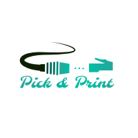

## Contents

* [1 Introducció](#Introducci.C3.B3)
  + [1.1 ¿Què és Pick&Print?](#.C2.BFQu.C3.A8_.C3.A9s_Pick.26Print.3F)
* [2 Infraestructura](#Infraestructura)
  + [2.1 Pàgina Web](#P.C3.A0gina_Web)
  + [2.2 Aplicació mòbil](#Aplicaci.C3.B3_m.C3.B2bil)
  + [2.3 API](#API)
  + [2.4 Servidor d'impressió en RaspberryPi](#Servidor_d.27impressi.C3.B3_en_RaspberryPi)
  + [2.5 Impressora 3D](#Impressora_3D)

# Introducció[[edit](/pti/index.php?title=Categor%C3%ADa:PICK%26PRINT&veaction=edit&section=1 "Edit section: Introducció") | [edit source](/pti/index.php?title=Categor%C3%ADa:PICK%26PRINT&action=edit&section=1 "Edit section: Introducció")]

## ¿Què és Pick&Print?[[edit](/pti/index.php?title=Categor%C3%ADa:PICK%26PRINT&veaction=edit&section=2 "Edit section: ¿Què és Pick&Print?") | [edit source](/pti/index.php?title=Categor%C3%ADa:PICK%26PRINT&action=edit&section=2 "Edit section: ¿Què és Pick&Print?")]

L’objectiu de Pick&Print ha estat crear un espai multi-plataforma on poder opinar, compartir i fins-i-tot comprar models en 3 dimensions creats per la comunitat, o per empreses especialitzades. Apropar la tecnologia d’impressió en 3D a la comunitat, per aprofitar tots els seu avantatges en diferents camps, professionals o no, i crear una nou mercat de demanda de bens relacionats amb aquestes tecnologies.

A més, també s’ha posat com a objectiu el fet d’automatitzar al màxim tot el procés de compra i d’impressió, per a poder reduir els costos de venda i tenir un sistema autònom amb mes reticència a fallades i fàcilment escalable, que permeti aprofitar al màxim els recursos inicials del grup.

# Infraestructura[[edit](/pti/index.php?title=Categor%C3%ADa:PICK%26PRINT&veaction=edit&section=3 "Edit section: Infraestructura") | [edit source](/pti/index.php?title=Categor%C3%ADa:PICK%26PRINT&action=edit&section=3 "Edit section: Infraestructura")]

El projecte de Pick & Print és una eina multi-plataforma per crear, compartir i comprar models en 3D. La plataforma oferirà eines per pujar, administrar i posar a la venda models; pensades per als usuaris i/o empreses que contribueixin. Així com aplicacions mòbils per als clients.
Això es tradueix en una plataforma amb una gran varietat de models, de diferents categories, i per a diversos usos, per a que qualsevol usuari sigui capaç de trobar el que necessita en forma de model tridimensional imprès. A més, la plataforma serà accessible per la major quantitat d’usuaris possibles, utilitzant mitjants web i mòbil. L’ús de la plataforma és senzill, i també inclou funcionalitats bàsiques, així com d’especialitzades per als dissenyadors.

## Pàgina Web[[edit](/pti/index.php?title=Categor%C3%ADa:PICK%26PRINT&veaction=edit&section=4 "Edit section: Pàgina Web") | [edit source](/pti/index.php?title=Categor%C3%ADa:PICK%26PRINT&action=edit&section=4 "Edit section: Pàgina Web")]

Per tal de que els diferents dissenyadors o empreses dissenyadores puguin tenir la seva plataforma específica per gestionar els seus dissenys, hem optat per tenir una pàgina web per els usuaris “Administradors”. No hem vist la necessitat de portar-ho a alguna altre plataforma, com podria ser mòbil, ja que les creacions 3D es produeixen des de l’ordinador i en cap moment entren altres dispositius en joc.
  
  
Així doncs, la pàgina web proveeix totes les funcionalitats d’administració dels models 3D del nostre servei:
  
  
– Pujar nous models per començar-los a monetitzar al moment, proveint una breu descripció i les dades i arxius d’aquest model.

– Administrar tots els models que has penjat al nostre servei. Es poden modificar les dades descriptives i el seu preu, com també es poden esborrar models que ja no són d’interès o s’han quedat obsolets.

– Veure les estadístiques de vendes sobre els teus models. A partir d’aquestes estadístiques, que es van actualitzant “in time”, el dissenyador o empresa dissenyadora per veure el seu mercat, i prendre accions vers aquest.
  
  
Cal recalcar que al nostre servei web només hi podran entrar usuaris que s’hagin registrat mitjançant la mateixa web, ja que es vol fer una clara distinció entre els creadors de contingut i els consumidors. Per tant un usuari registrat com a “Consumidor”, mitjançant l’aplicació mòbil, no podrà fer “log in” en la web i viceversa.

## Aplicació mòbil[[edit](/pti/index.php?title=Categor%C3%ADa:PICK%26PRINT&veaction=edit&section=5 "Edit section: Aplicació mòbil") | [edit source](/pti/index.php?title=Categor%C3%ADa:PICK%26PRINT&action=edit&section=5 "Edit section: Aplicació mòbil")]

Les tecnologies mòbils han resultat un element de importància primordial ens els últims anys, convertint-se en un una eina emprada per milers de milions de persones cada dia. Per tal d’arribar al major públic possible, des de Pick & Print em vist convenient utilitzar la plataforma mòbil Android per crear un producte fàcil d’utilitzar, amb novedoses tecnologies i a l’abast de tothom. A més, les xarxes socials tenen un dels seus pilars en aquestes tecnologies, fent que resulti de molta utilitat per incloure funcionalitats com, per exemple, compartir models a través de Facebook, utilitzat així el Word of Mouth.

Així doncs, l’aplicació mòbil serà la principal interfície d’interacció per a l’usuari client, i tindrà les següents funcionalitats:

- Ús de compte privat i personal per a poder interactuar amb els models.

- Accés a tota la nostra base de dades de models a través de categories predefinides, que guien a l’usuari a mode de filtres.

- Visualització de qualsevol model utilitzant tecnologies de realitat augmentada, permetent a l’usuari aconseguir un nou punt de vista del que vol comprar.

- Monetització dels models ofertats, i possibilitat de que el client els adquireixi a través de diferents mètodes de pagament.

Per tant, l’aplicació mòbil representa una part important del projecte, ja que a través del dispositiu permet utilitzar elements hardware, com la càmera, el GPS o la connexió 4G, que fan possible la major part de funcionalitats que té aquesta part del projecte.

## API[[edit](/pti/index.php?title=Categor%C3%ADa:PICK%26PRINT&veaction=edit&section=6 "Edit section: API") | [edit source](/pti/index.php?title=Categor%C3%ADa:PICK%26PRINT&action=edit&section=6 "Edit section: API")]

Tenim una API per la connexió de l’aplicació mòbil i la comunicació amb el servidor d’impressió. En particular, proveeix els següents endpoints i comportaments:

- Login: comprovar les credencials d'usuari contra la base de dades

- Register: registrar un nou usuari a la base de dades

- GetTags: obtenir el llistat de categories dels models

- GetModels: obtenir els models filtrats per categoria

- GetInfoModel: obtenir l'informació dels models

- Get3DModel: obtenir el fitxer .STL associat a un model

- Buy: registrar una compra i enviar-la al servidor d'impressió

## Servidor d'impressió en RaspberryPi[[edit](/pti/index.php?title=Categor%C3%ADa:PICK%26PRINT&veaction=edit&section=7 "Edit section: Servidor d'impressió en RaspberryPi") | [edit source](/pti/index.php?title=Categor%C3%ADa:PICK%26PRINT&action=edit&section=7 "Edit section: Servidor d'impressió en RaspberryPi")]

L’objectiu del nostre servidor d’impressió és optimitzar tot el procés entre la compra i la fabricació del model 3D automatitzant aquest procés. El servidor d’impressió ens ofereix una API a través de la qual podrem, de forma automàtica, afegir, eliminar o aturar models 3D de la cua d’impressió. D’aquesta manera, cada cop que un usuari compra un model 3D, de forma automàtica s’afegeix el model 3D a la cua d’impressió per imprimir-se el més aviat possible.

Per tal d'efectuar les accions anteriors, utilitzem el servidor d'impresions anomenat OctoPi desplegat sobre una RaspberryPi.

## Impressora 3D[[edit](/pti/index.php?title=Categor%C3%ADa:PICK%26PRINT&veaction=edit&section=8 "Edit section: Impressora 3D") | [edit source](/pti/index.php?title=Categor%C3%ADa:PICK%26PRINT&action=edit&section=8 "Edit section: Impressora 3D")]

Connectada al servidor d'impressió hi tenim una impressora "Geeetech Acrylic Prusa I3
pro B", que és la que processarà i imprimirà tots el models enviats a la cua d'impressió.

