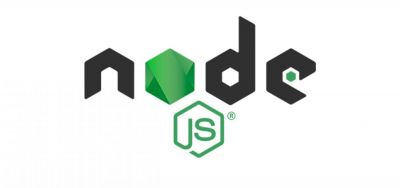
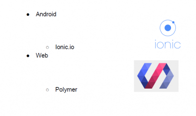
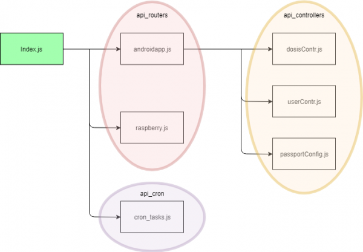
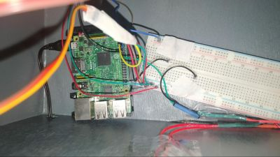
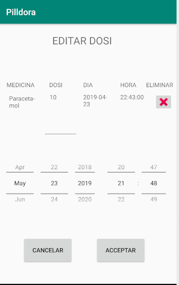
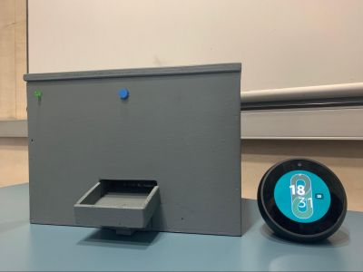

Logo del projecte.

## Contents

* [1 Introducció projecte Pilldora](#Introducci.C3.B3_projecte_Pilldora)
  + [1.1 Motivació](#Motivaci.C3.B3)
  + [1.2 ¿Que és Pilldora?](#.C2.BFQue_.C3.A9s_Pilldora.3F)
  + [1.3 Teconologies](#Teconologies)
* [2 Apartats](#Apartats)
  + [2.1 Servidor](#Servidor)
  + [2.2 Pillbox](#Pillbox)
  + [2.3 Aplicació mòbil](#Aplicaci.C3.B3_m.C3.B2bil)
  + [2.4 Assistent virtual](#Assistent_virtual)
* [3 Informació](#Informaci.C3.B3)

# Introducció projecte Pilldora[[edit](/pti/index.php?title=Categor%C3%ADa:Pilldora&veaction=edit&section=1 "Edit section: Introducció projecte Pilldora") | [edit source](/pti/index.php?title=Categor%C3%ADa:Pilldora&action=edit&section=1 "Edit section: Introducció projecte Pilldora")]

## Motivació[[edit](/pti/index.php?title=Categor%C3%ADa:Pilldora&veaction=edit&section=2 "Edit section: Motivació") | [edit source](/pti/index.php?title=Categor%C3%ADa:Pilldora&action=edit&section=2 "Edit section: Motivació")]

Actualment és molt comú el fet que una persona gran o una persona que hagi de seguir una medicació periòdica tingui problemes per gestionar els horaris en què s’ha de prendre la medicació, a més, moltes vegades, la medicació es pot perdre per casa fent que acabi caducant i es generin més residus mèdics els quals acaben perjudicant el medi ambient de forma indirecta.

Aquest projecte té com a finalitat solucionar aquest problema. Per tal de resoldre-ho, s’ha dissenyat un sistema que permet monitoritzar la dosificació de la medicació del pacient. El sistema consta d’un pastiller intel·ligent, que juntament amb una aplicació web i un assistent de veu, ens permetrà gestionar aquestes dosificacions, també incorporarà un sistema de notificacions per tal d’assegurar que el pacient es pren la medicació de forma controlada. Tots aquests elements es comuniquen mitjançant un servidor que rep i envia informació del pacient.

## ¿Que és Pilldora?[[edit](/pti/index.php?title=Categor%C3%ADa:Pilldora&veaction=edit&section=3 "Edit section: ¿Que és Pilldora?") | [edit source](/pti/index.php?title=Categor%C3%ADa:Pilldora&action=edit&section=3 "Edit section: ¿Que és Pilldora?")]

La nostra proposta es basa en el desenvolupament d’un pastiller intel·ligent que permet dosificar els medicaments necessaris en la franja horària necessària. Aquest tindrà un sistema automàtic de dosificació i allotjament que farà que no hàgem de carregar el pastiller cada dia sinó que s’haurà de carregar un cop no quedin pastilles a les càpsules que les contindran. El mecanisme de dosificació funcionarà mitjançant servos, per tal d’automatitzar al màxim el procés de dosificació. A més, comptarem amb una APP que ens permetrà tant informar com gestionar tota la presa de pastilles del pacient, i ens notificarà envers el tractament del pacient segons sigui necessari. Finalment, es comptarà amb un assistent de veu el qual ens proporcionarà certes accions i informació sobre l’estat del nostre tractament.

Estructura del projecte

L’objectiu d’aquest projecte facilitar la feina a la gent gran i persones amb medicació regular per no haver de recordar totes les pastilles que s’han de prendre, a més, gestionar tot el procés de dosificació tan sols tocant un botó, o mitjançant una comanda de veu. Per a poder complir els nostres objectius requerim diferents tecnologies, per tant els objectius tecnològics són els següents: Una raspberry PI 3b+ a la qual li hem d’implementar multithreading per tal de poder gestionar tots els events. Aquests són control de servos, il·luminació led, control manual i intercanvi d’informació amb el servidor. També contindrà l’endpoint d’Alexa. Com que es tracta d’un dispositiu mèdic, no podem tolerar errors d’entorn, per tant haurem de fer que el nostre dispositiu sigui capaç de funcionar sense una connexió a internet.

## Teconologies[[edit](/pti/index.php?title=Categor%C3%ADa:Pilldora&veaction=edit&section=4 "Edit section: Teconologies") | [edit source](/pti/index.php?title=Categor%C3%ADa:Pilldora&action=edit&section=4 "Edit section: Teconologies")]

Per al servidor que gestiona totes les dades, utilitzem Node.js, amb els seus corresponents complements. Dins del servidor hi haurà una base de dades programada amb MariaDB que contindrà tota la informació dels pacients i de les seves medicines.

NodeJs

Per poder controlar totes les dades que tindrà la raspberry i el servidor, desenvoluparem una app amb Android que permetrà poder subministrar/supervisar tot el sistema Pilldora des de tots els àmbits.

Android Studio

[File:Raspberry.jpg](/pti/index.php?title=Special:Upload&wpDestFile=Raspberry.jpg "File:Raspberry.jpg")

Raspberry PI

Per afegir algun extra més al projecte, hem decidit implementar un skill d’Amazon Alexa per poder obtenir informació i controlar la Pillbox per comandes de veu.

Amazon Alexa

# Apartats[[edit](/pti/index.php?title=Categor%C3%ADa:Pilldora&veaction=edit&section=5 "Edit section: Apartats") | [edit source](/pti/index.php?title=Categor%C3%ADa:Pilldora&action=edit&section=5 "Edit section: Apartats")]

## Servidor[[edit](/pti/index.php?title=Categor%C3%ADa:Pilldora&veaction=edit&section=6 "Edit section: Servidor") | [edit source](/pti/index.php?title=Categor%C3%ADa:Pilldora&action=edit&section=6 "Edit section: Servidor")]

El nostre projecte necessita un backend per poder mantenir el control de les dosis.
Per fer-ho tenim un servidor, que és el nostre backend per comunicar l’App mòbil, per gestionar pastilles i la Raspberry (Pillbox), on hi ha les pastilles.   
Ho hem instal·lat a la màquina virtual de la FIB on disposem d’una IP privada.   
  
Les serves principals funcions són:   
- Gestió de la BD i mantenir les seves taules actualitzades.   
- Gestionar l'autenticació d’usuaris de l'APP.   
- Processar les peticions de dosis la Pillbox (Raspberry).   
- Processar les peticions de l’App.

Estrucutra servidor

## Pillbox[[edit](/pti/index.php?title=Categor%C3%ADa:Pilldora&veaction=edit&section=7 "Edit section: Pillbox") | [edit source](/pti/index.php?title=Categor%C3%ADa:Pilldora&action=edit&section=7 "Edit section: Pillbox")]

Els objectius a satisfer al crear el prototip eren crear una caixa unipersonal que pogués acollir més d’un tipus de pastilla i que hi hagués espai suficient per la Raspberry, el circuit electrònic i la rampa de caiguda.

A més, havia de comptar amb un un LED per notificar a l’usuari que té pastilles pendents i un botó físic per iniciar el procés de dispensar les pastilles.

Conexions físiques

## Aplicació mòbil[[edit](/pti/index.php?title=Categor%C3%ADa:Pilldora&veaction=edit&section=8 "Edit section: Aplicació mòbil") | [edit source](/pti/index.php?title=Categor%C3%ADa:Pilldora&action=edit&section=8 "Edit section: Aplicació mòbil")]

L’aplicació mòbil Android té com a objectiu principal poder administrar i supervisar tot el sistema Pilldora des de tots els àmbits. L’app cobreix tota la part de gestió de medicacions per la part del metge amb finalitat de controlar que tots els seus pacients tinguin les dosis de medicaments inicialitzades correctament.   
  
Per la part del familiar volem comprovar que els nostres familiars tinguin també les medicacions inicialitzades i en el seu estat correcte. També volem rebre a través de notificacions push les dosis que fa més de mitja hora que s’haurien d’haver pres els nostres familiars.
Per la part del pacient volem veure les nostres 5 dosis més pròximes a la data actual i que tinguin estat = 0 (no hagin estat consumides). També volem rebre per notificació push les dosis que no ens hem pres quan tocaven i han passat 5 minuts o més.

Edició dosis

## Assistent virtual[[edit](/pti/index.php?title=Categor%C3%ADa:Pilldora&veaction=edit&section=9 "Edit section: Assistent virtual") | [edit source](/pti/index.php?title=Categor%C3%ADa:Pilldora&action=edit&section=9 "Edit section: Assistent virtual")]

Per tal de satisfer al màxim als nostres usuaris, vam considerar l’incorporació d’un assistent virtual al nostre projecte. Aquest, permet fer diverses consultes sobre l’estat de les dosis, o inclus dispensar la dosis mitjançant comandes de veu. Per temes de disponibilitat i coneixement s’ha decidit implementar Amazon Alexa com assistent de veu. L’aparell que soporta l'assistent es Amazon Echo Spot.

Assistent virtual i Pillbox

# Informació[[edit](/pti/index.php?title=Categor%C3%ADa:Pilldora&veaction=edit&section=10 "Edit section: Informació") | [edit source](/pti/index.php?title=Categor%C3%ADa:Pilldora&action=edit&section=10 "Edit section: Informació")]

Projecte desenvolupat per Marc Casellas, Martí Fernández, Aniol Gàmiz i Sergi Sendrós.

Grupo 20 PTI Q2 2018/19