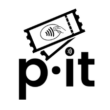
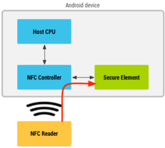
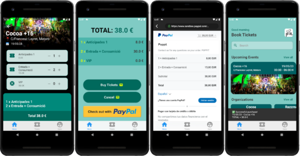

## Contents

* [1 Poppit: Your tickets have never been this secure](#Poppit:_Your_tickets_have_never_been_this_secure)
  + [1.1 Infrastructure and DevOps techniques](#Infrastructure_and_DevOps_techniques)
  + [1.2 The Backbone of the System: BackEnd Engine Managment](#The_Backbone_of_the_System:_BackEnd_Engine_Managment)
  + [1.3 FrontEnd: Crafting a user-friendly design](#FrontEnd:_Crafting_a_user-friendly_design)
  + [1.4 Annexes](#Annexes)

# Poppit: Your tickets have never been this secure[[edit](/pti/index.php?title=Categor%C3%ADa:Poppit&veaction=edit&section=1 "Edit section: Poppit: Your tickets have never been this secure") | [edit source](/pti/index.php?title=Categor%C3%ADa:Poppit&action=edit&section=1 "Edit section: Poppit: Your tickets have never been this secure")]

Project logo.

In the realm of event ticketing, combating illegal revenue and ensuring the authenticity of tickets have long been persistent challenges. To address these issues head-on, we are proud to present an innovative project that leverages Near Field Communication (NFC) technology to revolutionize the event ticket selling process. By incorporating robust mobile authentication and NFC tags, our system aims to provide a secure and transparent ticketing platform that eliminates illegal revenue while safeguarding the interests of event organizers and attendees.

***Poppit*** offers subscribing organizations a comprehensive platform through which they can publish their events and facilitate ticket sales to users. The foundation of our solution lies in the integration of NFC technology. Each user's mobile device is equipped with an NFC tag, establishing a unique identifier for their ticketing transactions.

The utilization of NFC tags allows for seamless and secure authentication at every step of the ticketing process. When purchasing a ticket, the user's NFC tag is authenticated, ensuring that only genuine users can access and acquire tickets for the desired events. This eradicates the possibility of counterfeit tickets being sold or unauthorized individuals gaining entry to events.

Moreover, our system goes beyond mere ticket authentication. We recognize that circumstances may change, leading to ticket holders being unable to attend an event they had initially planned for. To address this, we have implemented an innovative revenue system that enables users to resell their tickets within our platform. When official tickets are sold out, interested users can browse and purchase tickets from those who no longer require them. This feature not only prevents tickets from going unused but also offers users an opportunity to recoup their investment.

By adopting our NFC-based ticketing system, event organizers can effectively combat illegal revenue and minimize the financial losses associated with scalping and counterfeiting. The advanced authentication mechanisms provided by NFC technology offer a robust defense against fraudulent activities. Meanwhile, attendees can enjoy a heightened level of confidence, knowing that their tickets are legitimate and can be securely transferred if circumstances dictate.

With our technical prowess in NFC technology and mobile authentication, we are revolutionizing the event ticket selling landscape. Our solution promises to reshape the industry by offering a secure and transparent platform that eliminates illegal revenue while ensuring the authenticity of every ticket transaction. Say goodbye to the challenges of counterfeit tickets and unauthorized access, and embrace the future of event ticketing through our cutting-edge NFC-based system.

System Architecture.

## Infrastructure and DevOps techniques[[edit](/pti/index.php?title=Categor%C3%ADa:Poppit&veaction=edit&section=2 "Edit section: Infrastructure and DevOps techniques") | [edit source](/pti/index.php?title=Categor%C3%ADa:Poppit&action=edit&section=2 "Edit section: Infrastructure and DevOps techniques")]

In our quest to create a scalable and efficient system, we recognized the importance of accelerating the development process for our Continuous Integration/Continuous Deployment (CI/CD) subsystem. To achieve this, we made it a priority to establish the CI/CD infrastructure early on in the system development phase, enabling us to automate and deploy our system rapidly and effectively in the Kubernetes Cluster.

At the heart of our CI/CD infrastructure lies a GitLab repository, serving as a central hub for our source code management which allows our BackEnd and FrontEnd teams to work separatedly through branches. To seamlessly integrate our development workflow, we have implemented a webhook that notifies Jenkins, our CI/CD tool, whenever changes are pushed to the repository. Jenkins then steps into action, orchestrating the build process, constructing the Docker image, and pushing it to Dockerhub, a trusted container registry.

Docker Image Life-cycle.

Once the Docker image is securely stored in Dockerhub, our focus shifts to deploying and managing the application on our Kubernetes cluster. To simplify this process, we rely on two key components: Keel.sh and the Webhook relay of k3s. Keel.sh acts as our deployment automation tool, monitoring Dockerhub for new image versions. When a new image is detected, Keel.sh initiates the deployment process, seamlessly updating the application in our Kubernetes cluster. The Webhook relay of k3s complements this setup by ensuring secure and reliable communication between Dockerhub and our Kubernetes cluster, allowing for efficient and timely updates to the running application.

By establishing a well-structured and automated infrastructure, encompassing GitLab, Jenkins, Dockerhub, Keel.sh, and the Webhook relay of k3s, we have laid the foundation for rapid and reliable deployment of our system. This infrastructure empowers us to automate the deployment process, ensuring that updates and enhancements to our application are seamlessly rolled out to our Kubernetes cluster, guaranteeing a smooth and efficient user experience.

## The Backbone of the System: BackEnd Engine Managment[[edit](/pti/index.php?title=Categor%C3%ADa:Poppit&veaction=edit&section=3 "Edit section: The Backbone of the System: BackEnd Engine Managment") | [edit source](/pti/index.php?title=Categor%C3%ADa:Poppit&action=edit&section=3 "Edit section: The Backbone of the System: BackEnd Engine Managment")]

The backend work of our system revolves around utilizing Node.js and Express to build a powerful API, with MongoDB as the database management system. It focuses on four main entities: Tickets representing event passes, Events occurring at specific times and venues, Organizations offering events, and Users who can purchase tickets.

It manages and stores ticket information, facilitates event creation and organization, enables organization registration and event publication, and handles user authentication, ticket purchasing, and transaction management. Through this robust backend infrastructure, our system ensures efficient data handling, seamless communication, and a secure and user-friendly experience for event consumers, organizers, and organizations alike.

The API of our system serves as the central hub, seamlessly connecting with two frontend applications and managing critical processes such as ticket purchase, revenue tracking, and validation. It facilitates secure transactions, verifies user details, and ensures accurate ticket availability during the purchase process. Additionally, it tracks and manages financial transactions, offers comprehensive revenue reporting, and authenticates tickets for entry, enhancing security and preventing fraudulent activities. With its seamless integration and robust functionalities, the backend ensures a cohesive and efficient experience for users across both frontend applications, establishing a solid foundation for a reliable and user-friendly ticketing system.

API Principal Security measures.

System plays a vital role in ensuring robust security measures, implementing four key components to safeguard user data and protect system integrity. With the utilization of JSON Web Tokens (JWT), secure authentication and authorization are enforced, preventing unauthorized access to protected resources. Additionally, a class hasher utilizes the SHA256 hash algorithm to protect sensitive data, ensuring its integrity and confidentiality. Furthermore, an encryption class operates at the application level, encrypting all data exchanged, providing an additional layer of security against unauthorized access and tampering. Lastly, the entire system operates over HTTPS, employing secure communication protocols to encrypt data in transit, bolstering the overall security posture. Through the implementation of these measures, the backend strengthens security, safeguarding user data and maintaining a secure environment for all interactions within the system.

## FrontEnd: Crafting a user-friendly design[[edit](/pti/index.php?title=Categor%C3%ADa:Poppit&veaction=edit&section=4 "Edit section: FrontEnd: Crafting a user-friendly design") | [edit source](/pti/index.php?title=Categor%C3%ADa:Poppit&action=edit&section=4 "Edit section: FrontEnd: Crafting a user-friendly design")]

In this project, two applications were developed: one for common users and another for organizations. The user application allows individuals to create an account, view event listings, and purchase tickets for events created by organizations. The ticket purchases are facilitated through the integration of the PayPal API, enabling secure online transactions.

The organization application, on the other hand, provides functionalities for organizations to create, modify, and manage events. Additionally, this application has the capability to validate tickets using NFC (Near Field Communication) technology. The ticket validation process occurs between the two applications, running on separate mobile devices.

Screenshots showing Flutter Application.

Overall, the project consists of a user-focused application that enables account creation, ticket browsing, and purchasing, while the organization application empowers event management and ticket validation using NFC technology. The integration of PayPal API ensures secure transactions for ticket purchases made by users.

## Annexes[[edit](/pti/index.php?title=Categor%C3%ADa:Poppit&veaction=edit&section=5 "Edit section: Annexes") | [edit source](/pti/index.php?title=Categor%C3%ADa:Poppit&action=edit&section=5 "Edit section: Annexes")]

[Poppit Technical Report](https://mwiki.fib.upc.edu/pti/images/0/01/Mem%C3%B2ria.pdf)