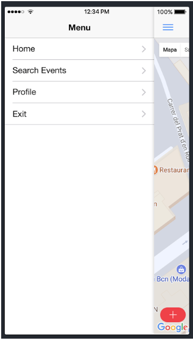
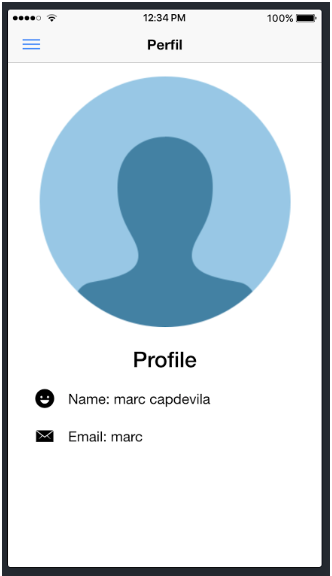

# Presence[[edit](/pti/index.php?title=Categor%C3%ADa:Presence&veaction=edit&section=1 "Edit section: Presence") | [edit source](/pti/index.php?title=Categor%C3%ADa:Presence&action=edit&section=1 "Edit section: Presence")]

**1 Introducción**

La idea de nuestro proyecto es crear una red social que se salga del paradigma tradicional de las redes sociales que conocemos actualmente. Para ello, nos basaremos en dos conceptos básicos:
Por una parte, las publicaciones, que llamaremos eventos, no irán dirigidas a un círculo de amistades dentro de la red social, sino a todos los usuarios que estén compartiendo nuestra misma experiencia. Es decir, todos aquellos usuarios que están geográficamente cerca del evento, y que por tanto, puedan compartir información de interés común. Para ver la actividad que se desarrolla en un evento, será imprescindible participar físicamente en él.
El otro punto distintivo de nuestro proyecto es el anonimato de los usuarios. Estos solo se identificaran con un nombre de usuario de libre elección, y no contaran con perfiles de usuario propios. De esta forma, la identidad del usuario queda en un segundo plano, de manera que este pueda participar en los eventos sin temor a ser identificado.

---

**2 Contexto del proyecto**

La oferta de redes sociales que existe actualmente es muy variada, pero a pesar de ello todas se basan en un mismo concepto.
Los usuarios cuentan con un perfil completo, con imágenes e información personal de todo tipo (fecha nacimiento, estado civil, etc). Este perfil se puede vincular con el perfil de otros usuarios para establecer relaciones de amistad. Así, podemos subir contenidos de cualquier tipo a nuestro perfil, y definir quién tendrá acceso a estos en función de la relación que tengamos con los otros usuarios. Podemos tener un perfil público al que todos los usuarios pueden acceder, o podemos limitar nuestros contenidos a nuestras amistades dentro de la red social.
Partiendo de esta idea, podemos ver que el anonimato no es el principal atractivo. Debemos tener mucho cuidado con la información que publicamos en nuestros perfiles, y más aún con quien establecemos relaciones y qué limitaciones ponemos para acceder a nuestra información personal.
Además del hecho de exponer información personal a un público sobre el que tenemos poco control, la atención se centra mucho más en la persona que publica el contenido, y no tanto en el contenido en si.
Por todo lo expuesto anteriormente, nos ha parecido interesante buscar la forma de poder publicar contenidos de cualquier tipo, para que estos lleguen a aquellos que realmente puedan tener interés en ellos, sin importar tanto quien los ha publicado.

---

**3 Descripción entorno**

Para desarrollar nuestra aplicación, hemos hecho un breve trabajo de investigación para ver qué tecnologías se adaptan mejor a nuestras necesidades, y qué podemos aprovechar de cada una de ellas.
En un primer lugar, buscamos la forma óptima de desarrollar la aplicación para los sistemas operativos móviles más comunes.
Entre las opciones disponibles debatimos entre dos opciones: Ionic y React Native.
A pesar de que algunos ya conocían React Native, al final nos decidimos por Ionic, pues la idea era aprender a usar tecnologías que no conocieramos. Además, Ionic nos ofrece algunas ventajas importantes, principalmente su mayor versatilidad, que permite llegar a más plataformas (iOS, Android, Windows Phone y web) y la eficiencia de la app desarrollada, pues permite separar en 2 threads la lógica y la UI logrando mayores rendimientos.
La elección de Ionic 3, su ultima versión, implica trabajar con Angular 4, HTML y CSS. De todos ellos, el único lenguaje que no conocíamos es Angular 4, por lo que el trabajo de aprendizaje sería menor.
Para el back-end, elegimos Node.js, pues nos permitía trabajar con javascript en el lado del servidor, y usamos npm como gestor de paquetes. Este nos permite instalar los módulos necesarios para desarrollar nuestra API con mayor facilidad. Los principales módulos que usamos son Express para facilitar la creación del servidor, MongoDB como base de datos NoSQL, y Mongoose para mapear los modelos de datos y conectar con Mongo.
Por último, tuvimos que elegir un servidor al que subir nuestra API. Finalmente la elección fue Heroku, pues a pesar que al principio nos dio algunos problemas, y nos generó algunas dudas, era una elección gratuita y de la cual disponíamos de mucha información en Internet. Entre estas dudas, estaba el hecho de tener que instalar todos los componentes a través de un numero de cuenta bancaria, aunque estos fueran gratis. Un ejemplo es MongoDB, un complemento totalmente necesario para nuestra API, pero que al final pudimos instalar sin más problemas.

---

**4 Descripción del sistema**

Partiendo de los dos conceptos básicos que queremos desarrollar con nuestra aplicación, imaginamos el funcionamiento de la misma de la siguiente forma:
La aplicación permitirá poner en contacto a usuarios cercanos en el espacio, sobre un mismo tema de interés, durante un tiempo determinado. El usuario va a poder crear eventos y/o interactuar con ellos solo cuando estén en el radio de acción de estos, es decir, solo veremos la actividad de los eventos una vez hayamos entrado físicamente en su radio de actuación.
Estos eventos estarán formados por hilos, como si de un foro se tratara. Estos hilos pueden estar ordenados por fecha de creación, por número de likes, por número de comentarios, etc. Una vez entremos en uno de estos hilos podremos comentar en ellos, dejando mensajes en el muro. Los eventos van a ser temporales, por lo que una vez pasado, va a quedar bloqueado y no se va a poder participar más en este.
En lo que a los usuarios se refiere, podràn buscar eventos, entrar en ellos una vez estén en su área y ver e interactuar en los hilos que haya en ellos. A su vez, podrán crear eventos y guardar eventos pasados para rememorar los hilos que se crearon y sus comentarios. El grado de anonimato de los usuarios dependerá exclusivamente de ellos, pues podran escoger el nombre de usuario que deseen, y será el único identificador que podrán ver el resto de usuarios. De este modo, podrán usar un nombre falso para ser totalmente anónimos, su nombre real, o un mote que solo algunos puedan identificar.
Cuando un usuario se encuentra en el radio de acción de un evento, este tiene la posibilidad de entrar en él. Una vez se entre en el evento, se descargan todos los hilos y sus respectivos mensajes. Finalmente, si el usuario quiere entrar un hilo se le previsualizarian los 10 últimos mensajes, con la opción de visualizar otros más antiguos.

---

**5 Aspectos positivos y negativos**

Durante el desarrollo de la app, no hemos ido encontrando con algunas de las limitaciones que nos imponían las tecnologías que habíamos elegido, así como otros aspectos que nos han beneficiado mucho. Con todo ello hemos podido destacar algunos aspectos positivos y negativos de todo lo que hemos probado.
Por una parte, en el front-end, el uso de Ionic nos ha facilitado la creación de un app híbrida, que podíamos exportar a las principales plataformas actuales, iOS, Android y Windows. Este hecho es totalmente transparente durante el desarrollo de la aplicación, de forma que solo debes preocuparte por ello una vez has terminado.
A su vez, esto implica algunas limitaciones a la hora de mejorar la interfaz de usuario, pues los objetos estandard con los que trabaja para visualizar los contenidos son muy simples, pues han de ser compatibles para todos los entornos. Se pueden adquirir complementos para trabajar con objetos específicos de cada plataforma y dotar de mayor personalidad a la UI, pero suponen un coste adicional.
Otro detalle importante es que a pesar de poder exportar la aplicación para iOS, no la puedes probar en un dispositivo físico si no eres desarrollador certificado de Apple, lo que supone otro gasto extra. En nuestro caso, optamos por hacer la demo en un entorno iOS desde el entorno de ejecución que nos proporcionaba Ionic, para ahorrarnos el coste de la licencia, ya que por otra parte si que podiamos hacer la demostración en un dispositivo Android.
Por la parte del back-end, el uso de Node.js nos supuso una gran cantidad de ventajas, empezando por la facilidad de gestión de los paquetes que brinda npm. Gracias a él, la instalación de módulos es extremadamente simple, y estos facilitan en gran medida la creación de la API. Desde la creación del servidor y la realización de llamadas HTTP mediante Express, la implementación y personalización de los métodos HTTP con methodOverride(), hasta la integración de MongoDB como base de datos y la conexión a ella mediante Mongoose.
Prácticamente todas las tecnologías escogidas forman parte de lo que se conoce como “MEAN Stack”, un conjunto de tecnologías para el desarrollo web, con el principal distintivo que se basa en javascript tanto para el lado del cliente como del servidor. Las principales tecnologías que forman parte de este framework son MongoDB, Express, Angular y Node.js.
El uso de “MEAN Stack” nos ha facilitado mucho el trabajo de investigación, pues existen gran cantidad de tutoriales y documentación de todo tipo para aprender desde cero su uso.
Aunque esto suponga un ventaja, al principio de todo el proceso puede volverse en contra, sobretodo si no se conoce ninguna de las tecnologías a emplear. Entre toda la información disponible, muchos tutoriales han quedado obsoletos, se mezclan diferentes versiones de las tecnologías, así como te encuentras diferentes modos de usarlas. Con todo este desorden, puede resultar complicado sacar una idea general, a partir del cual empezar a desarrollar tu proyecto con confianza.

---

**6 Propuestas de mejora**

Una vez definida la base de nuestra aplicación, todas la funcionalidades que queríamos implementar, nos propusimos algunas mejoras que se podrían aplicar en cas de tener suficiente tiempo.
Una primera idea de mejora se centraría en mejorar el radio de acción de los eventos. En un primer momento, estos estarán definidos por el radio de la circunferencia en la que estará activo el evento. Pero si pensamos en posibles situaciones en que las podría ser útil a los usuarios nuestra aplicación, nos vienen a la mente eventos como manifestaciones, fiestas universitarias, etc. Éstas se desarrollan a lo largo de calles con diferentes recorridos, o en espacios universitarios (difícilmente circulares). Por eso, nos pareció interesante la posibilidad de definir el àrea de acción de un evento mediante parámetros más complejos que el radio de una circunferencia. Una posibilidad sería poder dibujar con el dedo sobre un mapa el àrea del evento, o poder seleccionar calles, plazas y otros recintos.
Dado que esto supondría una mejora de un algoritmo propio más que profundizar en las tecnologías que estamos descubriendo, decidimos dejarlo en un segundo plano para centrarnos en aspectos más funcionales de nuestra [File:Exemple.jpg](/pti/index.php?title=Special:Upload&wpDestFile=Exemple.jpg "File:Exemple.jpg")aplicación.
Otra funcionalidad opcional que se podría implementar, es la de poder chatear con un usuario en concreto. De esta forma, los usuarios tendrán la posibilidad de hablar de forma privada y sin la necesidad de que los demás usuarios del evento lo vean. Una vez el evento finalice, el chat privado con otro usuario quedará bloqueado hasta que los dos vuelvan a coincidir en el mismo evento.
De nuevo, decidimos dejar el chat en segundo plano para dar prioridad a funcionalidades más básicas de nuestra aplicación.

---

**7 API Google Maps**

Para solucionar el problema de la geolocalización de los usuarios y los eventos, así como para determinara las distancias entre ellos, pensamos en ayudarnos de la API de Google Maps, una solución robusta y confiable que nos dará la solución a una de nuestras mayores dificultades.
Con Google Maps, resulta fácil incluir la vista de un mapa que nos muestre nuestra ubicación de forma fluida, así como los eventos dentro de cuyo radio de acción nos encontremos. Tareas básicas como ampliar el mapa, seleccionar un punto para crear un evento o seleccionar uno a existente resultan mucho más fáciles.
Por eso, desde el primer momento tuvimos claro que debíamos usar la API de Google Maps en nuestro proyecto. Además, formaba parte de los requerimientos mínimos del proyecto, por lo que era perfecta para nosotros.

---

**8 Capturas de pantalla**

  

  

  