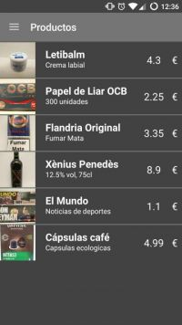

## Contents

* [1 Proyecto PushMarket](#Proyecto_PushMarket)
* [2 Tecnologías](#Tecnolog.C3.ADas)
  + [2.1 Flujo principal](#Flujo_principal)
  + [2.2 PushMarket](#PushMarket)
  + [2.3 PullMarket](#PullMarket)

# Proyecto PushMarket[[edit](/pti/index.php?title=Categor%C3%ADa:PushMarket&veaction=edit&section=1 "Edit section: Proyecto PushMarket") | [edit source](/pti/index.php?title=Categor%C3%ADa:PushMarket&action=edit&section=1 "Edit section: Proyecto PushMarket")]

PushMarket es una plataforma que pretiende mejorar el flujo y la eficacia de los supermercados, a través de una aplicación móbil, que permite realizar la lista de todos los productos que vamos añadiendo a nuestro carro a través de [NFC](https://es.wikipedia.org/wiki/Near_field_communication), [Código de Barras](https://es.wikipedia.org/wiki/C%C3%B3digo_de_barras), o manualmente desde la lista general de productos. Así, al llegar al cajero, este no tendrá que marcar todos nuestros productos buscando su codigo de barras, sino que simplemente tendremos que transmitir-le la lista que hemos ido generando a través de NFC al dispositivo del cajero, que tendrá PullMarket como aplicación de gestión.
Esta mostrará el precio total de los productos, permitiendo al cajero verificar que la lista se corresponde y cobrar al cliente. Finalmente al confirmar la compra, se enviarán todos los datos de la compra al servidor del supermercado.

Este proyecto se caracteriza por tener un modelo WIN-WIN, ya que no solo busca que el cliente tenga mejoras al evitar colas y preparar previamente listas de la compra, sino que ademas busca que el supermercado pueda obtener de manera inherente a las compras datos que les servirán para hacer análisis Big Data sobre que franja de edad compra cierto producto o las tendencias de compras según la nacionalidad, etc. Además, es un proyecto con mucho futuro de expansión, ya que basándose en este mismo se pueden implementar filtros para gente con intolerancias o con diabetes.

La plataforma consta de dos aplicaciones Android (PushMarket para el cliente i PullMarket para el cajero) y un servicio web [REST](https://es.wikipedia.org/wiki/Representational_State_Transfer) para conectarse con el servidor.Este servicio web REST programado en [PHP](https://es.wikipedia.org/wiki/PHP), se encarga de comunicar el servidor de la base de datos con la aplicación PushMarket para el inicio de sesión y registro de los usuarios, y con la aplicación PullMarket para el envió de los datos de cada compra. Las comunicaciones se producen en forma de mensajes [JSON](https://es.wikipedia.org/wiki/JSON) que PHP entiende nativamente, y Android parsea al recibir respuestas.

# Tecnologías[[edit](/pti/index.php?title=Categor%C3%ADa:PushMarket&veaction=edit&section=2 "Edit section: Tecnologías") | [edit source](/pti/index.php?title=Categor%C3%ADa:PushMarket&action=edit&section=2 "Edit section: Tecnologías")]

    

## Flujo principal[[edit](/pti/index.php?title=Categor%C3%ADa:PushMarket&veaction=edit&section=3 "Edit section: Flujo principal") | [edit source](/pti/index.php?title=Categor%C3%ADa:PushMarket&action=edit&section=3 "Edit section: Flujo principal")]

El flujo de nuestra aplicación empieza por el usuario registrandose o iniciando sessión en PushMarket, que se comunicara con el webservice para verificar o añadir el usuario a la base de datos del supermercado. Seguidamente, añadirá los productos en la lista de la compra de PushMarket, ya sea leyendo tags NFC de los productos, escaneando su código de barras, o seleccionándolos de la lista de productos.

A continuación estos datos se transfieren a la aplicación PullMarket del cajero a través de NFC, enviando un fichero [CSV](https://es.wikipedia.org/wiki/CSV) con los datos mínimos necesarios para que la comunicación NFC sea eficiente y rápida.

Finalmente, si el cajero valida la compra una vez pagada, PullMarket se conectará con el webservice, enviándole los datos de la nueva compra.

## PushMarket[[edit](/pti/index.php?title=Categor%C3%ADa:PushMarket&veaction=edit&section=4 "Edit section: PushMarket") | [edit source](/pti/index.php?title=Categor%C3%ADa:PushMarket&action=edit&section=4 "Edit section: PushMarket")]

  

  

## PullMarket[[edit](/pti/index.php?title=Categor%C3%ADa:PushMarket&veaction=edit&section=5 "Edit section: PullMarket") | [edit source](/pti/index.php?title=Categor%C3%ADa:PushMarket&action=edit&section=5 "Edit section: PullMarket")]

[200px](/pti/index.php?title=Special:Upload&wpDestFile=PullMarket1.jpg "File:PullMarket1.jpg")  