Rasp[File:Smalllogo.png](/pti/index.php?title=Special:Upload&wpDestFile=Smalllogo.png "File:Smalllogo.png")Media

Entrega final: 30 - 5 - 2014

RaspMedia és un media center controlat remotament mitjançant una aplicació per Android que permet tant la pujada de fitxers com la seva reproducció i control. A més de la aplicació Android disposa d'una interfície web que els usuaris poden fer servir per a gestionar els arxius remotament. El servidor és una RaspBerry Pi model B i el codi que executa està implementat completament utilitzant Node.js.

**Participants:**

Adrián Álvarez, Miquel Masriera, Carles Capellas, Antonio Domínguez

**Tutor:**   
Rubén Tous

[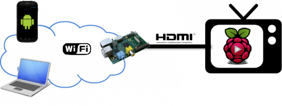](/pti/index.php/File:Esquema2.png)

  

Tecnologies implicades: Android, Node.js, HTTP, JSON, webSockets, web(HTML+CSS+JS & Bootstrap), Raspberry Pi, Raspbian

  

---

**Aplicació Android**

El primer que fa l'aplicació Raspmedia quan arrenca, és escanejar la nostra xarxa local en busca de la RaspBerry Pi, la qual està programada per respondre a les peticions del dispositiu Android. Perquè el mòbil i el servidor es puguin comunicar, cal que els dos sidpositius estiguin a la mateixa xarxa WiFi. Al trobar el servidor, apareix un botó de Start a la pantalla a través del qual es pot accedir al menú principal de la aplicació.

[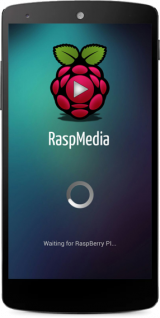](/pti/index.php/File:2.png)[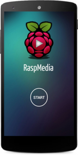](/pti/index.php/File:1.png)

En el menú principal disposem de 4 opcions: reproduir música, video, fotos i pujar contingut d'aquests tipus des del mòbil al servidor.

[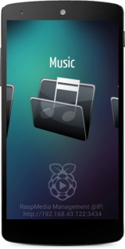](/pti/index.php/File:3.png)

A l'entrar en qualsevol de les opcions per a reproduir arxius (music, video o photo), sortirà per pantalla una llista amb tot el contingut d'aquell tipus que s'hagi pujat a la RaspBerry, i informació de cada un. En el cas de les fotografies per a cada una en veurem una miniatura, per els videos, es mostrà una miniatura de amb una imatge del video, i el seu nom, i en el cas de la música, per a cada cançó es mostrarà títol, grup, any, i una foto sempre que sigui possible.

[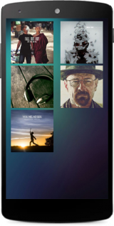](/pti/index.php/File:4.png)[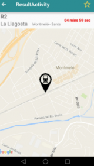](/pti/index.php/File:5.png)[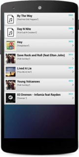](/pti/index.php/File:6.png)

si seleccionem algun arxiu de la llista, inmediatament es començarà a reproduir al televisor que està connectat a la RaspBerry, i mentre s'estigui reproduint tindrem algunes opcions de control desde la aplicació, que ens servirà com a comandament a distància, en el cas de los fotos i els videos podrem pausari tornar a reproduir, o sortir. En el cas de les fotos podem passar a la següent i anterior, posar-les en pnatalla completa o sortir.

[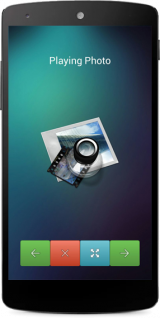](/pti/index.php/File:9.png)[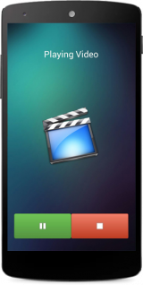](/pti/index.php/File:10.png)[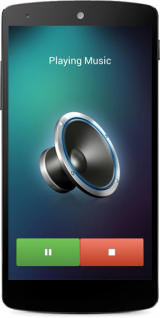](/pti/index.php/File:11.png)

En cas de voler pujar un fitxer, seleccionem la opció de upload, que ens portarà a un menú en el qual s'ha de triar quin tipus de contingut volem pujar (fotos, videos o música), per dirigir-se directament a la part de la galeria d'Android d'on s'han que seleccionar, un cop s'hagi escollit un arxiu es començarà a pujar al servidor i es mostrarà una barra de progés del procés.

[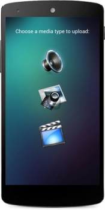](/pti/index.php/File:7.png)[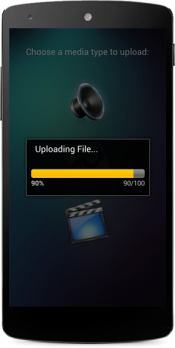](/pti/index.php/File:8.png)

A part d'això, en tot moment apareix a la part inferior de al aplicació una IP de gestió, que podem fer servir des del navegador de qualsevol dispositiu de la nostra xarxa local per a gestionar els arxius del servidor desde una web que permet pujar i esborrar fitxers.

  

[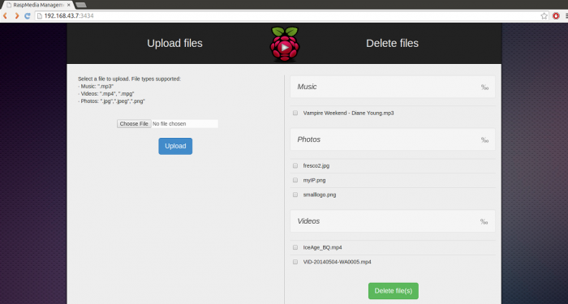](/pti/index.php/File:RaspWeb.png)

  
  

---

**Servidor**

Aquesta secció tracta sobre la aplicació servidor que corre sobre la Raspberry, i amb la que interactuen tant l'aplicació Android com la web esmentada anteriorment. El servidor esta programat amb Node.js, el principal paquet que fem servir és Express, que és el framework web més famós i usat per a aplicacions Node. La aplicació servidor crea una instància de express que inicialitza un servidor http al port 8000, i és sobre aquesta, sobre la qual afegim les funcions associades a cada petició. La aplicació té un arxiu main.js, que és el que conté tots els moduls en els que hem dividit la aplicació. Per executar-la només cal executar aquest arxiu.

  

El servidor està dividit en 5 parts que es corresponen amb les funcionalitats principals: el sistema de fitxers, l'uploader d'arxius, gestor de llistes, gestor d'esdeveniments amb la aplicació i la web, i la part corresponent a la interacció amb la web.

El sistema de fitxers correspon a l’ arxiu fsManager.js de la aplicació i fa servir el modul "fs" pròpi de Node.js. La idea és que crei i verifiqui que l’estructura del sistema de fitxers és la que toca. En el directori del servidor hi ha un directori per al codi anomenat serverCode, i tres directoris més, un per a cada tipus de contingut (imatges, videos i música) que és on es guardaran els arxius que es pugin al sistema, i els que es llegiran per a obtenir llistes i reproduir arxius.

  

[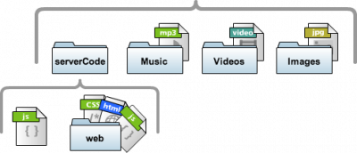](/pti/index.php/File:FileSystem.png)

La funcionalitat de pujar fitxers es correspon amb l’uploader.js i fa servir els moduls express i imagemagick. Aquesta part de la aplicació s’encarrega de rebre els fitxers que li arriben via web o aplicació Android, i els guarda al directori que toqui depenent del tipus d’arxiu que sigui. Els arxius arriben en una (o varies) peticions post, el servidor, comprova el tipus d’arxiu i decideix on emmagatezemar-lo, en el cas que es pujim imatges, crea les miniatures.

  

El gestor de llistes correspon a ListManager.js en el directori del servidor, i utilitza els moduls Express, imagemagick, musicmetadata i base64. La principal funcionalitat d’aquesta part del codi, és respondre a les peticions de llistes d’arxius que conté el servidor multimèdia. Quan un usuari prem una carpeta de la aplicació (música, vídeos o imatges), es genera una petició cap al servidor, i aquest respon amb la llista de fitxers demanats. Quan rep una petició el servidor obre el directori corresponent, i crea una llista d’elements JSON per a les dades de cada arxiu, les dades que no són text, és a dir les imatges de les miniatures i thumbnails es codifiquen a base64 abans de ser enviades.

var jsonSong = { name:"-", title:"-", artist:"-", year:"-", pic:"-" }

var jsonVideo = { name:"", base64:"" }

var jsonPhoto = { name:"", base64:"" }

  

El codi que implementa la gestió d’events és a eventManager.js. El problema a resoldre era que els esdeveniments per al que fa a reproducció de continguts que genera el mòbil, tenen que passar a través del servidor fins al reproductor. La manera més correcte i senzilla que hem trobat per a que aquesta comunicació es dugui a terme és que el mòbil i el servidor es comuniquin de la mateixa manera que amb la resta de la aplicació, és a dir, amb peticions i respostes HTTP,i la comunicació sevidor-repoductor sigui utilitzant un modul de Node dissenyat específicament per a controlar el reproductor OMXPlayer anomenat omxctrl per a musica i vídeo, que proporciona una API molt senzilla i que funciona molt bé per a aquest propòsit, i gpicview per a les imagtes.

  

Tots els esdeveniments que associats a la web es troben a webManager.js. Pel que fa a la comunicació entre la web i el servidor, hem decidit basar-la en websockets. Ja que un dels mòduls més famosos de Node.js és socket.io, que ofereix una API a alt nivell per a tractar comunicació en temps real. El servidor es posa a escoltar pel port 3434 i la web fa les peticions a aquest port.