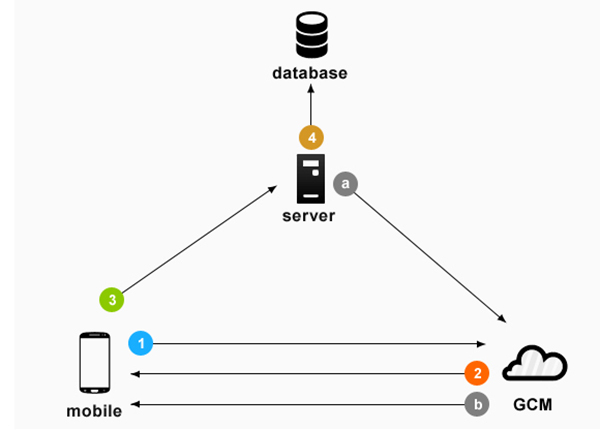
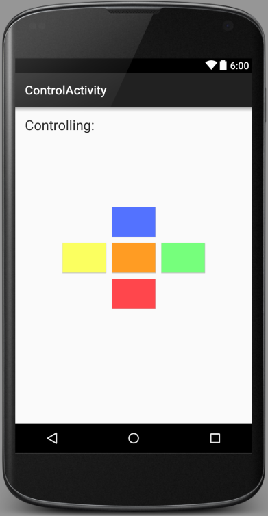
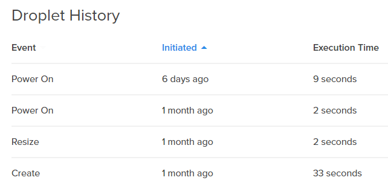

[500px|center](/pti/index.php/Fitxer:Ribbo.png "Fitxer:Ribbo.png")

## Contents

* [1 Introducció](#Introducci.C3.B3)
  + [1.1 Descripció general del projecte](#Descripci.C3.B3_general_del_projecte)
  + [1.2 Objectius](#Objectius)
* [2 Descripció dels components](#Descripci.C3.B3_dels_components)
  + [2.1 Estructura del projecte](#Estructura_del_projecte)
  + [2.2 Hardware, els motors](#Hardware.2C_els_motors)
  + [2.3 Arduino](#Arduino)
  + [2.4 Dispositiu mòbil](#Dispositiu_m.C3.B2bil)
  + [2.5 Servidor](#Servidor)
    - [2.5.1 Servidor Web](#Servidor_Web)
    - [2.5.2 Servidor Multimèdia](#Servidor_Multim.C3.A8dia)
    - [2.5.3 Servidor GCM](#Servidor_GCM)
  + [2.6 Client Web](#Client_Web)
* [3 Paquets del projecte](#Paquets_del_projecte)
  + [3.1 Paquets de treball del projecte](#Paquets_de_treball_del_projecte)
    - [3.1.1 Configuració del HW](#Configuraci.C3.B3_del_HW)
    - [3.1.2 Comunicació dispositiu mòbil - servidor Wowza](#Comunicaci.C3.B3_dispositiu_m.C3.B2bil_-_servidor_Wowza)
    - [3.1.3 Comunicació servidor GCM - dispositiu mòbil](#Comunicaci.C3.B3_servidor_GCM_-_dispositiu_m.C3.B2bil)
    - [3.1.4 Comunicació dispositiu mòbil - arduino](#Comunicaci.C3.B3_dispositiu_m.C3.B2bil_-_arduino)
    - [3.1.5 Interfície web - no funcional](#Interf.C3.ADcie_web_-_no_funcional)
    - [3.1.6 Interfície web - funcional](#Interf.C3.ADcie_web_-_funcional)
  + [3.2 Dependències entre els diferents paquets de treball](#Depend.C3.A8ncies_entre_els_diferents_paquets_de_treball)
  + [3.3 Paquets de treball assignats a cada membre](#Paquets_de_treball_assignats_a_cada_membre)
  + [3.4 Pla de treball](#Pla_de_treball)
* [4 Arduino](#Arduino_2)
  + [4.1 Descripció](#Descripci.C3.B3)
  + [4.2 Plataforma LightBlue Bean](#Plataforma_LightBlue_Bean)
  + [4.3 Esquema electrònic i de connexions](#Esquema_electr.C3.B2nic_i_de_connexions)
  + [4.4 Motors: Modificació, Control PWM i Servo.h](#Motors:_Modificaci.C3.B3.2C_Control_PWM_i_Servo.h)
    - [4.4.1 Modificació](#Modificaci.C3.B3)
    - [4.4.2 Control amb PWM](#Control_amb_PWM)
    - [4.4.3 Servo.h](#Servo.h)
  + [4.5 Codi de l’Arduino](#Codi_de_l.E2.80.99Arduino)
* [5 Dispositiu mòbil](#Dispositiu_m.C3.B2bil_2)
  + [5.1 Per què un dispositiu mòbil?](#Per_qu.C3.A8_un_dispositiu_m.C3.B2bil.3F)
  + [5.2 Preparació del dispositiu](#Preparaci.C3.B3_del_dispositiu)
  + [5.3 Aplicacions File:](#Aplicacions_File:)
    - [5.3.1 App Ribbo Launcher](#App_Ribbo_Launcher)
      * [5.3.1.1 Main Activity](#Main_Activity)
      * [5.3.1.2 Control Activity](#Control_Activity)
    - [5.3.2 App Ribbo Streaming](#App_Ribbo_Streaming)
      * [5.3.2.1 Llibreria libstreaming](#Llibreria_libstreaming)
      * [5.3.2.2 Implementació de la llibreria libstreaming a l’aplicació](#Implementaci.C3.B3_de_la_llibreria_libstreaming_a_l.E2.80.99aplicaci.C3.B3)
* [6 Servidor](#Servidor_2)
  + [6.1 Objectius](#Objectius_2)
  + [6.2 Configuració](#Configuraci.C3.B3)
    - [6.2.1 Servidor virtual](#Servidor_virtual)
      * [6.2.1.1 Requeriments software](#Requeriments_software)
    - [6.2.2 Domini](#Domini)
* [7 Client web](#Client_web_2)
  + [7.1 Introducció](#Introducci.C3.B3_2)
  + [7.2 Requisits](#Requisits)
  + [7.3 Docker](#Docker)
    - [7.3.1 Entorn de desenvolupament](#Entorn_de_desenvolupament)
      * [7.3.1.1 Contenidors docker](#Contenidors_docker)
    - [7.3.2 Entorn de producció](#Entorn_de_producci.C3.B3)
      * [7.3.2.1 Contenidors docker](#Contenidors_docker_2)
    - [7.3.3 Com es despleguen els entorns](#Com_es_despleguen_els_entorns)
  + [7.4 Model de la base de dades](#Model_de_la_base_de_dades)
    - [7.4.1 Usuaris](#Usuaris)
    - [7.4.2 Robots](#Robots)
  + [7.5 Funcionalitats](#Funcionalitats)
    - [7.5.1 Registre d’usuaris](#Registre_d.E2.80.99usuaris)
    - [7.5.2 Login](#Login)
    - [7.5.3 Logout](#Logout)
    - [7.5.4 Llistar els robots](#Llistar_els_robots)
    - [7.5.5 Control de robots](#Control_de_robots)
    - [7.5.6 Control d’usuaris](#Control_d.E2.80.99usuaris)
    - [7.5.7 Interfície multidispositiu](#Interf.C3.ADcie_multidispositiu)
* [8 Desenvolupament del treball](#Desenvolupament_del_treball)
* [9 Glossari de Tecnologies emprades](#Glossari_de_Tecnologies_emprades)
* [10 Conclusió](#Conclusi.C3.B3)
* [11 Bibliografia](#Bibliografia)

# Introducció[[edit](/pti/index.php?title=Categor%C3%ADa:Ribbo&veaction=edit&section=1 "Edit section: Introducció") | [edit source](/pti/index.php?title=Categor%C3%ADa:Ribbo&action=edit&section=1 "Edit section: Introducció")]

El projecte desenvolupat s’anomena *Ribbo - Robot remotament controlat a través d’Internet amb streaming de vídeo* . La idea conceptual del robot com a tal està inspirada en els robots que s’empren en l’àmbit militar o científic, els quals són capaços de ser operats remotament.'

## Descripció general del projecte[[edit](/pti/index.php?title=Categor%C3%ADa:Ribbo&veaction=edit&section=2 "Edit section: Descripció general del projecte") | [edit source](/pti/index.php?title=Categor%C3%ADa:Ribbo&action=edit&section=2 "Edit section: Descripció general del projecte")]

En aquest projecte, ens hem proposat muntar un sistema i una infraestructura que ens permeti disposar un robot de molt baix cost amb la possibilitat de ser controlat remotament des de qualsevol lloc amb connexió a Internet.  
A més, el robot disposarà d’streaming de vídeo per poder veure la seva situació en tot moment.  
Finalment també disposarem d’un directori amb els robots (Ribbos) disponibles al moment per poder elegir i controlar cada un d’ells i un sistema d’usuaris per reservar i controlar-ne el seu ús.

## Objectius[[edit](/pti/index.php?title=Categor%C3%ADa:Ribbo&veaction=edit&section=3 "Edit section: Objectius") | [edit source](/pti/index.php?title=Categor%C3%ADa:Ribbo&action=edit&section=3 "Edit section: Objectius")]

Els objectius tecnològics emprats per al projecte són:

* Retransmetre a temps real el vídeo capturat pel dispositiu mitjançant RTSP.
* Connectar via Bluetooth el dispositiu amb l’arduino.
* Servir, mitjançant nginx o node.js, una pàgina web dinàmica (PHP i jQuery) via HTTP als clients.
* Moure les rodes del dispositiu mitjançant l’arduino
* Fer ús d’un servidor central en el núvol
* Establir un flux d’ordres entre l’usuari i el robot a través de missatges GCM.
* Mantenir el cost del robot al mínim per tal de fer-lo el màxim d’accessible.
* Experimentar amb tecnologies menys comunes que les que veiem usualment a la universitat.

# Descripció dels components[[edit](/pti/index.php?title=Categor%C3%ADa:Ribbo&veaction=edit&section=4 "Edit section: Descripció dels components") | [edit source](/pti/index.php?title=Categor%C3%ADa:Ribbo&action=edit&section=4 "Edit section: Descripció dels components")]

## Estructura del projecte[[edit](/pti/index.php?title=Categor%C3%ADa:Ribbo&veaction=edit&section=5 "Edit section: Estructura del projecte") | [edit source](/pti/index.php?title=Categor%C3%ADa:Ribbo&action=edit&section=5 "Edit section: Estructura del projecte")]

En el diagrama de la Figura 2.1 hem detallat els diferents components del projecte i quin paper juguen en el projecte en global amb les comunicacions entre ells.

[](/pti/index.php/File:Esquema.png)

Esquema conceptual de totes les comunicacions

A continuació descriurem cada un d’ells, les seves característiques i perquè hem elegit aquests en concret.

## Hardware, els motors[[edit](/pti/index.php?title=Categor%C3%ADa:Ribbo&veaction=edit&section=6 "Edit section: Hardware, els motors") | [edit source](/pti/index.php?title=Categor%C3%ADa:Ribbo&action=edit&section=6 "Edit section: Hardware, els motors")]

Com a component físic dels motors, hem re-utilitzat una estructura existent d’un vell robot de Mini Sumo, extraient tots els seus components lògics.  
Es tracta d’una plataforma doble amb dos Servomotors trucats per a rotació continua i un parell de rodes de 12cm de diàmetre.  
A la figura 2.2 es veu la unitat Ribbo finalitzada.

[](/pti/index.php/File:Estructura.png)

Resultat final del Ribbo

Per a mes informació sobre el control dels motors, al capítol 4 s’explica amb més detall el seu funcionament.

## Arduino[[edit](/pti/index.php?title=Categor%C3%ADa:Ribbo&veaction=edit&section=7 "Edit section: Arduino") | [edit source](/pti/index.php?title=Categor%C3%ADa:Ribbo&action=edit&section=7 "Edit section: Arduino")]

Els motors es controlaran amb una placa Arduino. Teníem a la nostra disposició dues possibilitats per tal d’efectuar aquesta comunicació:

* **Arduino UNO + HC06 Mòdul:**

  + **Arduino UNO:** Disposem d’una placa de desenvolupament Arduino UNO. És actualment el model d’Arduino més popular i existeix gran quantitat d’informació i codi a Internet, però no disposa de comunicació bluetooth, per tant, necessitem un mòdul de bluetooth per poder usar aquesta opció.  
    Es pot aconseguir un Arduino UNO entre 4 i
  + **HC06:** HC06 és un mòdul Bluetooth (Una petita placa amb els components necessaris per simplificar l’ús de Bluetooth) d’ús industrial.  
    Disposem d’una d’aquestes plaques per dotar de comunicació Bluetooth al nostre Arduino.  
    És un dels mòduls Bluetooth més usats i té un preu aproximat de .  
    *El datasheet d’aquest mòdul es pot consultar aquí:  
    <https://www.olimex.com/Products/Components/RF/BLUETOOTH-SERIAL-HC-06/resources/hc06.pdf> '*

    [](/pti/index.php/File:Hc06.jpg)

    Mòdul HC06
* **Lightblue Bean:**  És un petit Arduino amb Bluetooth incorporat pensat per a aplicacions de IoT. Disposa també d’un SDK i una API per a facilitar el seu ús amb dispositius mòbils.  
  Es va obtenir gratuïtament com a promoció de presentació, però el seu preu és d’aproximada-ment .  
  El principal problema és que el seu suport oficial només és per a iOS i MacOS, existint una petita comunitat de desenvolupadors fent enginyeria inversa per a portar-ho cap a altres plataformes com File:.  
  Tampoc es tracta d’una placa molt potent, però suficient per a les nostres necessitats.

Finalment, hem decidit usar l’opció del LightBlue Bean, ja que ocupa menys espai i és més compacte i addicional-ment ens permet col·laborar amb aquesta petita comunitat de desenvolupadors que està fent enginyeria inversa per a File:.

Les proves fetes amb el dispositiu es registraran i es penjaran com a documentació pública com a referència de gent que vulgui usar-ho en un futur.

Durant el desenvolupament, es van detectar un parell d’errors en el SDK i es van reportar. Els errors van ser localitzats i solucionats.

S’entrarà amb mes detall al Arduino en el capítol 4.

[](/pti/index.php/File:Lightblue.png)

LightBlue Bean

## Dispositiu mòbil[[edit](/pti/index.php?title=Categor%C3%ADa:Ribbo&veaction=edit&section=8 "Edit section: Dispositiu mòbil") | [edit source](/pti/index.php?title=Categor%C3%ADa:Ribbo&action=edit&section=8 "Edit section: Dispositiu mòbil")]

Com a “ordinador” del Ribbo, s’usarà un dispositiu mòbil amb File:, Hem decidit que la versió mínima que usarem és File: 5.0.

El paper que tindrà aquest dispositiu és:

* Establir la connexió amb el servidor principal i registrar-se un cop un Ribbo passa a estar disponible.
* Establir una connexió amb el servidor multimèdia, negociar la connexió i retransmetre vídeo.
* Establir la connexió amb l’Arduino per Bluetooth i enviar ordres cap als motors.
* Oferir una interfície al usuari per configurar el Ribbo i controlar manualment els motors.

Hem usat els nostres propis dispositiu mòbils per a fer les proves. Per a mes informació sobre el dispositiu File:, consultar el capítol 5.

## Servidor[[edit](/pti/index.php?title=Categor%C3%ADa:Ribbo&veaction=edit&section=9 "Edit section: Servidor") | [edit source](/pti/index.php?title=Categor%C3%ADa:Ribbo&action=edit&section=9 "Edit section: Servidor")]

En aquest projecte s’usen 3 servidors, dos d’ells s’allotjaran en la mateixa màquina Virtual en una Granja de Servidors a Frankfurt (Digital Ocean) el tercer (GCM) es un servidor de Google.

[](/pti/index.php/File:Remconrob.png)

Màquina Virtual utilitzada

Per a mes informació sobre els servidors, consultar els capítols 6 i 7.

### Servidor Web[[edit](/pti/index.php?title=Categor%C3%ADa:Ribbo&veaction=edit&section=10 "Edit section: Servidor Web") | [edit source](/pti/index.php?title=Categor%C3%ADa:Ribbo&action=edit&section=10 "Edit section: Servidor Web")]

Disposarem d’un servidor web que s’encarregarà de gestionar tots els registres i mostrar la interfície d’usuari. Aquesta interfície permetrà tant controlar el robot com gestionar els usuaris.

### Servidor Multimèdia[[edit](/pti/index.php?title=Categor%C3%ADa:Ribbo&veaction=edit&section=11 "Edit section: Servidor Multimèdia") | [edit source](/pti/index.php?title=Categor%C3%ADa:Ribbo&action=edit&section=11 "Edit section: Servidor Multimèdia")]

També necessitem un servidor que s’encarregui de rebre el flux multimèdia del dispositiu File:, codificar-lo al format desitjat i servir-lo al servidor web perquè sigui mostrat al ususari.  
Utilitzarem per comoditat en aquest cas Wowza Engine, però realment serviria qualsevol altre servidor multimèdia que pogués negociar i rebre un flux RTSP i servir-lo al servidor web.

[](/pti/index.php/File:Wowza3.png)

El paper del Wowza en el projecte es ser un intermediari entre el flux de video i el client.

### Servidor GCM[[edit](/pti/index.php?title=Categor%C3%ADa:Ribbo&veaction=edit&section=12 "Edit section: Servidor GCM") | [edit source](/pti/index.php?title=Categor%C3%ADa:Ribbo&action=edit&section=12 "Edit section: Servidor GCM")]

Per tal de realitzar la comunicació Client - Ribbo, usem el servei GCM de google. Mes endavant es descriurà amb detall el seu funcionament.

[](/pti/index.php/File:EsquemaGCM.jpg)

Esquema del funcionament de GCM

El funcionament general de GCM es el següent:

1. El dispositiu File: envia un missatge al servidor GCM de google indicant la ID del dispositiu i la ID de la Aplicació (Que s’ha obtingut anteriorment)
2. El servidor de GCM efectua el registre i retorna un ID de registre
3. El dispositiu File:, envia aquesta ID de registre al servidor de l’aplicació.
4. En aquest moment el registre ha sigut efectuat amb èxit i el servidor de l’aplicació pot desar la ID de registre per a usos futurs.

En el moment que el servidor de l’aplicació vol enviar un missatge al dispositiu File:, enlloc d’enviar-lo al dispositiu, l’envia al servidor de GCM indicant el ID de registre, i serà el servidor de GCM el que s’encarregarà de que arribi al dispositiu File: de forma push.

## Client Web[[edit](/pti/index.php?title=Categor%C3%ADa:Ribbo&veaction=edit&section=13 "Edit section: Client Web") | [edit source](/pti/index.php?title=Categor%C3%ADa:Ribbo&action=edit&section=13 "Edit section: Client Web")]

Finalment, es disposarà d’un client en forma de pàgina web per a que el usuari disposi d’una interfície funcional, intuïtiva i agradable per controlar el robot. Els detalls sobre el seu funcionament es troben al .

# Paquets del projecte[[edit](/pti/index.php?title=Categor%C3%ADa:Ribbo&veaction=edit&section=14 "Edit section: Paquets del projecte") | [edit source](/pti/index.php?title=Categor%C3%ADa:Ribbo&action=edit&section=14 "Edit section: Paquets del projecte")]

En aquest apartat, parlarem de la planificació prèvia que vam realitzar.

## Paquets de treball del projecte[[edit](/pti/index.php?title=Categor%C3%ADa:Ribbo&veaction=edit&section=15 "Edit section: Paquets de treball del projecte") | [edit source](/pti/index.php?title=Categor%C3%ADa:Ribbo&action=edit&section=15 "Edit section: Paquets de treball del projecte")]

Durant la preparació del projecte, es van definir uns paquets de treball per simplificar a on centrar els nostres esforços, així com per tenir en compte les dependències d’unes tasques amb les altres. En aquest apartat definim cada una de les tasques que s’han de realitzar per paquet de treball:

### Configuració del HW[[edit](/pti/index.php?title=Categor%C3%ADa:Ribbo&veaction=edit&section=16 "Edit section: Configuració del HW") | [edit source](/pti/index.php?title=Categor%C3%ADa:Ribbo&action=edit&section=16 "Edit section: Configuració del HW")]

Aquest paquet de treball consisteix en el muntatge del dispositiu a nivell físic. Es tracta de muntar l’estructura dels servomotors connectats a l’Arduino formant una plataforma d’on es connectarà el dispositiu mòbil. Aquest paquet també inclou la configuració i programació de l’Arduino per poder controlar els servomotors.

### Comunicació dispositiu mòbil - servidor Wowza[[edit](/pti/index.php?title=Categor%C3%ADa:Ribbo&veaction=edit&section=17 "Edit section: Comunicació dispositiu mòbil - servidor Wowza") | [edit source](/pti/index.php?title=Categor%C3%ADa:Ribbo&action=edit&section=17 "Edit section: Comunicació dispositiu mòbil - servidor Wowza")]

En aquest apartat es tractarà de transmetre l’streaming que gravi la càmera del dispositiu mòbil sobre la plataforma del robot, cap al servidor Wowza, que serà l’encarregat de codificar i de servir aquestes imatges cap a la nostra web.

### Comunicació servidor GCM - dispositiu mòbil[[edit](/pti/index.php?title=Categor%C3%ADa:Ribbo&veaction=edit&section=18 "Edit section: Comunicació servidor GCM - dispositiu mòbil") | [edit source](/pti/index.php?title=Categor%C3%ADa:Ribbo&action=edit&section=18 "Edit section: Comunicació servidor GCM - dispositiu mòbil")]

Des del client web s’enviarà una ordre per registrar-se contra el servidor GCM, un cop completada aquesta autenticació, es podran enviar les ordres cap al servidor GCM, el primer pas per a que arribin les ordres fins a les rodes del robot.

### Comunicació dispositiu mòbil - arduino[[edit](/pti/index.php?title=Categor%C3%ADa:Ribbo&veaction=edit&section=19 "Edit section: Comunicació dispositiu mòbil - arduino") | [edit source](/pti/index.php?title=Categor%C3%ADa:Ribbo&action=edit&section=19 "Edit section: Comunicació dispositiu mòbil - arduino")]

Aquest paquet no es podrà començar fins que no s’hagi completat el paquet de Comunicació servidor GCM - dispositiu mòbil, degut a que es necessiten les ordres prèvies que provenen del servidor GCM per poder retransmetre-les cap a l’Arduino.  
Un cop es reben les ordres Push des del servidor GCM aquestes s’envien via Bluetooth a l’Arduino, al que, com està connectat als servomotors, farà complir les ordres de moviment de les rodes.

### Interfície web - no funcional[[edit](/pti/index.php?title=Categor%C3%ADa:Ribbo&veaction=edit&section=20 "Edit section: Interfície web - no funcional") | [edit source](/pti/index.php?title=Categor%C3%ADa:Ribbo&action=edit&section=20 "Edit section: Interfície web - no funcional")]

El paquet d’interfície web l’hem dividit en dues parts degut al tema de dependències. Hem començat per un nivell no funcional, el que ens permet anar avançant en el disseny web sense dependre d’altres paquets de treball, així que des del principi del projecte ja vam anar treballant en el disseny de la web.  
En aquest paquet es tractava de muntar una interfície disponible pels usuaris (creació de comptes, informació sobre el funcionament de la web...).

### Interfície web - funcional[[edit](/pti/index.php?title=Categor%C3%ADa:Ribbo&veaction=edit&section=21 "Edit section: Interfície web - funcional") | [edit source](/pti/index.php?title=Categor%C3%ADa:Ribbo&action=edit&section=21 "Edit section: Interfície web - funcional")]

Aquest paquet es podrà començar a treballar un cop ja s’hagin completat els paquets de comunicació des del dispositiu mòbil retransmetent l’streaming cap al servidor Wowza i les ordres push que enviem des del servidor GCM cap al dispositiu mòbil.  
Aquest paquet incorporarà mostrar l’streaming que envia el servidor Wowza, també tindrà uns controls per poder moure els robots des de la pàgina web.  
Finalment, aquest paquet també tindrà un llistat de tots els robots registrats, tant els que estan disponibles, com els que ja es van registrat i no ho estan i més funcionalitats que s’explicaran més endavant.

## Dependències entre els diferents paquets de treball[[edit](/pti/index.php?title=Categor%C3%ADa:Ribbo&veaction=edit&section=22 "Edit section: Dependències entre els diferents paquets de treball") | [edit source](/pti/index.php?title=Categor%C3%ADa:Ribbo&action=edit&section=22 "Edit section: Dependències entre els diferents paquets de treball")]

[](/pti/index.php/File:Dependencies_entre_tasques.png)

Dependències entre els diferents paquets de treball

Tal com es pot veure a la figura 3.1, totes les tasques es podien començar al principi del projecte menys un parell: l’nterfície web a mode funcional i l’enviament de les ordres des del dispositiu mòbil fins a l’arduino via bluetooth.  
Les fletxes signifiquen les dependències, per tant, un paquet de treball no es podia començar a fer si no estava el paquet del que depèn acabat.  
Per exemple el dispositiu mòbil no podia enviar les ordres a l’arduino si encara no rebia les ordres des del servidor GCM, ni tampoc si no estava configurat l’arduino, amb el codi per interpretar aquestes ordres via bluetooth.

## Paquets de treball assignats a cada membre[[edit](/pti/index.php?title=Categor%C3%ADa:Ribbo&veaction=edit&section=23 "Edit section: Paquets de treball assignats a cada membre") | [edit source](/pti/index.php?title=Categor%C3%ADa:Ribbo&action=edit&section=23 "Edit section: Paquets de treball assignats a cada membre")]

[](/pti/index.php/File:Reparticio_feina_1.png "image") [](/pti/index.php/File:Reparticio_feina_2.png "fig:")

En aquest apartat hem assignat els diferents paquets del projecte entre els membres del grup. L’assignació es pot veure a la Figura 3.2, on estan els noms dels paquets de treball descrits anteriorment amb una persona com a responsable del paquet i altres membres que participaran en la realització d’aquests.

## Pla de treball[[edit](/pti/index.php?title=Categor%C3%ADa:Ribbo&veaction=edit&section=24 "Edit section: Pla de treball") | [edit source](/pti/index.php?title=Categor%C3%ADa:Ribbo&action=edit&section=24 "Edit section: Pla de treball")]

[](/pti/index.php/File:Pla_treball_1.png "image")  
[](/pti/index.php/File:Pla_treball_2.png "fig:")

El pla de treball que hem anat seguint durant tot el curs de l’assignatura és el que es pot observar a la figura 3.3. És un diagrama de Gantt el qual està el nom del paquet de treball i la duració d’aquest en dies.  
Per exemple veuríem que el paquet de Configuració del HW el vam començar el dia 14 de març (al començament del projecte) i el vam donar per finalitzat el dia el dia 30 del mateix mes. També per exemple vam tenir dues setmanes per fer testing perquè la pràctica del projecte funcionés correctament (del 6 de maig fins el dia 20).

# Arduino[[edit](/pti/index.php?title=Categor%C3%ADa:Ribbo&veaction=edit&section=25 "Edit section: Arduino") | [edit source](/pti/index.php?title=Categor%C3%ADa:Ribbo&action=edit&section=25 "Edit section: Arduino")]

## Descripció[[edit](/pti/index.php?title=Categor%C3%ADa:Ribbo&veaction=edit&section=26 "Edit section: Descripció") | [edit source](/pti/index.php?title=Categor%C3%ADa:Ribbo&action=edit&section=26 "Edit section: Descripció")]

Com ja hem parlat en la descripció del projecte, com a component lògic del Ribbo hem decidit usar un Arduino, en aquest cas un LightBlue Bean, ja que simplifica la part del hardware de Bluetooth sent un Arduino amb Bluetooth incorporat.

## Plataforma LightBlue Bean[[edit](/pti/index.php?title=Categor%C3%ADa:Ribbo&veaction=edit&section=27 "Edit section: Plataforma LightBlue Bean") | [edit source](/pti/index.php?title=Categor%C3%ADa:Ribbo&action=edit&section=27 "Edit section: Plataforma LightBlue Bean")]

## Esquema electrònic i de connexions[[edit](/pti/index.php?title=Categor%C3%ADa:Ribbo&veaction=edit&section=28 "Edit section: Esquema electrònic i de connexions") | [edit source](/pti/index.php?title=Categor%C3%ADa:Ribbo&action=edit&section=28 "Edit section: Esquema electrònic i de connexions")]

Elecrònicament és un esquema molt senzill, la Figura es el esquema de connexions de la part del Ribbo, sent BLE BEAN l’Arduino i S1 i S2 els Servomotors modificats.

[](/pti/index.php/File:Shematic1.png "fig:")

Com podem veure, disposem de dues bateries, ja que l’Arduino s’alimenta a 3 Volts (una pila de botó en el nostre cas), però els Servomotors requereixen entre 5 i 12 Volts (Usarem una pila de cartutxe de 9 Volts en el nostre cas) per tant necessitem dos bateries.

Pel que fa als ports usats del Arduino, com podem veure a la Figura , els ports 2 i 3 poden usar PWM, per tant, aquests són els que elegim com a pins que usarem per a controlar els motors.

[](/pti/index.php/File:Scheme2.png "fig:")

Com ja hem mencionat anteriorment, el software oficial per a programar via Bluetooth aquest Arduino en concret, només està disponible per a iOS i MacOS, així que per a programar-lo des de i per a un File:, s’ha usat (i participat en el desenvolupament escrivint documentació i avisos d’errors detectats) una interfície i un SDK no oficial.  
La interfície, l’SDK, la seva documentació i els bugs reportats que encara no s’hagin resolt es poden consular al repositori: <https://github.com/PunchThrough/bean-sdk-File>:

## Motors: Modificació, Control PWM i Servo.h[[edit](/pti/index.php?title=Categor%C3%ADa:Ribbo&veaction=edit&section=29 "Edit section: Motors: Modificació, Control PWM i Servo.h") | [edit source](/pti/index.php?title=Categor%C3%ADa:Ribbo&action=edit&section=29 "Edit section: Motors: Modificació, Control PWM i Servo.h")]

#### Modificació[[edit](/pti/index.php?title=Categor%C3%ADa:Ribbo&veaction=edit&section=30 "Edit section: Modificació") | [edit source](/pti/index.php?title=Categor%C3%ADa:Ribbo&action=edit&section=30 "Edit section: Modificació")]

Els motors que usem per a controlar les rodes són servomotors que han estat modificats per a que en lloc de tenir un angle d’actuació restringit puguin rotar de forma continua. És possible que no siguin la millor elecció de motor per a aquest tipus d’aplicació, els servomotors són molt precisos en moure uns angles en concret, però molt poc precisos en la seva velocitat, però com que ja els teníem disponibles, vam decidir usar-los per mantenir el cost al mínim. La principal modificació es pot veure a la Figura.
[](/pti/index.php/File:Serv.png "fig:")

#### Control amb PWM[[edit](/pti/index.php?title=Categor%C3%ADa:Ribbo&veaction=edit&section=31 "Edit section: Control amb PWM") | [edit source](/pti/index.php?title=Categor%C3%ADa:Ribbo&action=edit&section=31 "Edit section: Control amb PWM")]

Els servomotors es controlen enviant una senyal PWM per al seu connector de control (Els servomotors usualment tenen tres connectors: GND, Vcc i Control).

En un servomotor estàndard, la mida d’aquests plusos, modificarà l’angle de l’eix del servomotor respecte el punt neutre. En els nostres servomotors modificats, però, el que farà és modificar la velocitat en la que l’eix es mou en una o altre direcció, sent un valor pròxim a 90 el punt neutre (com ja hem dit, la velocitat no és molt precisa, i pot variar entre servomotors).

[](/pti/index.php/File:Serv2.JPG "fig:")

#### Servo.h[[edit](/pti/index.php?title=Categor%C3%ADa:Ribbo&veaction=edit&section=32 "Edit section: Servo.h") | [edit source](/pti/index.php?title=Categor%C3%ADa:Ribbo&action=edit&section=32 "Edit section: Servo.h")]

Per programar això necessitem fer ús del timer0 i el timer1 de l’Arduino, per definir la durada del cicle i del pols.

Addicionalment cal adreçar un últim problema: Si simplement creéssim una funció que mogués el motor al ser cridada, aquesta funció ocuparia el flux d’execució del nostre Arduino de forma indefinida i no permetria que el Ribbo es posés a punt per a escoltar noves ordres.

Per tant, cal tenir una manera de desar l’últim valor escrit en un servomotor i programar el seu moviment en una rutina d’interrupció, de tal forma que el Ribbo pugui seguir escoltant ordres mentre la rutina d’interrupció s’encarrega de moure els motors en “background”.

Per simplificar aquesta operació, existeix la llibreria “Servo.h” que es distribueix amb la IDE d’Arduino i abstrau part d’aquest procés a l’usuari.

## Codi de l’Arduino[[edit](/pti/index.php?title=Categor%C3%ADa:Ribbo&veaction=edit&section=33 "Edit section: Codi de l’Arduino") | [edit source](/pti/index.php?title=Categor%C3%ADa:Ribbo&action=edit&section=33 "Edit section: Codi de l’Arduino")]

El codi que core l’Arduino ha estat escrit i falshejat en el xip enterament des d’un dispositiu File:. El codi que conté l’Arduino és el següent:

```
#include <Servo.h>

String command;
boolean commandStarted = false;

Servo leftServo;  
Servo rightServo; 

uint16_t servoStillL = 86; //Calibrat per al motor
uint16_t servoStillR = 87; //^

uint16_t servoFrontL = 150;
uint16_t servoFrontR = 30;

uint16_t servoBackL= 31;
uint16_t servoBackR= 151;


void setup() {
   Serial.begin(57600); // Iniciem la comunicacio serie
   Bean.enableConfigSave(false);
   Bean.setBeanName("PTIbot");
   
   leftServo.attach(2);  // Vinculem el servo del pin 2 a un objecte servo 
   rightServo.attach(3); 
   
   leftServo.write(servoStillL);
   rightServo.write(servoStillR)
}

void loop() {
  getCommand();
}


void getCommand() {
   while (Serial.available()) {
    char newChar = (char)Serial.read();
    if (newChar == '#') { //Comensa una ordre
      commandStarted = true;
      command = "\0";
    } else if (newChar == ';') { //Acaba una ordre
      commandStarted = false;
      commandCompleted(); //Executem l'ordre
      command = "\0";
    } else if (commandStarted == true) {
      command += newChar;
    }
  }
}


void commandCompleted() {

  if (command == "front") {
    Bean.setLed( 0, 0, 255 );
    leftServo.write(servoFrontL);
    rightServo.write(servoFrontR);
    delay(750);
    leftServo.write(servoStillL);
    rightServo.write(servoStillR);
  }
  
  if (command == "back") {
    Bean.setLed( 255, 0, 0 ); 
    leftServo.write(servoBackL);
    rightServo.write(servoBackR);
    delay(750);
    leftServo.write(servoStillL);
    rightServo.write(servoStillR);
  }
  
  if (command == "tl") {
    Bean.setLed(255, 255, 0 );
    leftServo.write(servoFrontL);
    rightServo.write(servoStillR);
    delay(250);
    leftServo.write(servoStillL);
    rightServo.write(servoStillR);
  }
  
  if (command == "tr") {
    Bean.setLed( 0, 255, 0 );
    leftServo.write(servoStillL);
    rightServo.write(servoFrontR);
    delay(250);
    leftServo.write(servoStillL);
    rightServo.write(servoStillR);
  }
  
  if (command == "stop") {
    Bean.setLed( 0, 0, 0 );
    leftServo.write(servoStillL);
    rightServo.write(servoStillR);
  }
}

void off() {
  Bean.setLed( 0, 0, 0 );
  leftServo.write(servoStillL);
  rightServo.write(servoStillR);
}
```

El codi està comentat per a claredat, però un resum del seu funcionament és:

1. **Velocitats dels servos:** Definim variables que seran els valors que hem d’escriure els servos perquè es moguin a la velocitat desitjada. Com hem dit, aquests valors canvien entre servos, i s’han trobat fent proves.
2. **Comunicació sèrie:** Iniciem la comunicació sèrie, l’Arduino rebrà per la interfície sèrie les dades que rebi per Bluetooth.
3. **Objectes servo:** Es creen dos objectes Servo de la classe Servo.h i es vinculen als pins on tenim connectats els servos.
4. **Escoltant missatges:** S’escolta de forma continua la comunicació sèrie esperant rebre ordres. al rebre un “#”, s’interpreta que es comença a rebre una ordre i s’enregistrarà fins a rebre un “”, moment en el que s’executarà l’ordre corresponent.

# Dispositiu mòbil[[edit](/pti/index.php?title=Categor%C3%ADa:Ribbo&veaction=edit&section=34 "Edit section: Dispositiu mòbil") | [edit source](/pti/index.php?title=Categor%C3%ADa:Ribbo&action=edit&section=34 "Edit section: Dispositiu mòbil")]

## Per què un dispositiu mòbil?[[edit](/pti/index.php?title=Categor%C3%ADa:Ribbo&veaction=edit&section=35 "Edit section: Per què un dispositiu mòbil?") | [edit source](/pti/index.php?title=Categor%C3%ADa:Ribbo&action=edit&section=35 "Edit section: Per què un dispositiu mòbil?")]

Una primera aproximació en el projecte havia sigut usar un micro-ordinador (Com per exemple una *Raspberry Pi* ) com a component principal del robot.  
La segona opció era usar un dispositiu *File:* . Usant el micro-ordinador, ens dona la facilitat de que treballar amb ell és igual que treballar amb qualsevol altre ordinador amb Linux, és molt senzill trobar codi existent a Internet i usar-lo en el nostre projecte.  
Al final, però, ens vam decantar per usar un telèfon File: per els següents motius:'''

* Un dispositiu File: incorpora connexió a Internet, càmera i bateria pròpies, cosa que redueix el cost i complexitat en comparació amb un micro-ordinador, per al qual hauríem d’aconseguir bateries, càmera i adaptador per a xarxa sense fils.
* També disposa de pantalla, cosa que facilita la interacció amb el robot.
* La majoria de gent disposa d’un telèfon i això abarateix molt el cos del robot. Un dels nostres objectius era que fos més econòmicament accessible que les alternatives que existeixen al mercat.
* Un dispositiu File: disposa de sensors extra que poden servir per ampliar la funcionalitat del robot de moltes més maneres que un micro-ordinador (GPS, Giroscopis, Acceleròmetres, Sensors de llum...)
* Finalment també ens ofereix la possibilitat de fer coses que no s’hagin fet abans, provar noves maneres d’implementar coses i no només basar-nos en codi i programari ja existent.

## Preparació del dispositiu[[edit](/pti/index.php?title=Categor%C3%ADa:Ribbo&veaction=edit&section=36 "Edit section: Preparació del dispositiu") | [edit source](/pti/index.php?title=Categor%C3%ADa:Ribbo&action=edit&section=36 "Edit section: Preparació del dispositiu")]

El dispositiu mòbil emprat pel projecte és un smartphone File: que incorpori càmera frontal i posterior i amb una versió mínima d’File: 5.0 *Lollipop* . El motiu de tenir com a versió mínima File: 5.0 és perquè per realitzar la comunicació GCM es requereix l’API 21 d’File:, i aquesta és la versió mínima que suporta la llibreria *Google Play Services* , un requeriment necessari per que funcionés.  
Un cop instal·lades les aplicacions desenvolupades en el dispositiu, aquest es munta en el robot en posició vertical, ja que aporta una major estabilitat al robot que en horitzontal i també per la pròpia estructura del robot.'''

[](/pti/index.php/File:Orientacions.jpg)

Diagrames de les dues orientacions plantejades en la fase de disseny del robot

## Aplicacions File:[[edit](/pti/index.php?title=Categor%C3%ADa:Ribbo&veaction=edit&section=37 "Edit section: Aplicacions File:") | [edit source](/pti/index.php?title=Categor%C3%ADa:Ribbo&action=edit&section=37 "Edit section: Aplicacions File:")]

Per a facilitat de programació, hem decidit dividir la programació File: en 2 apartats: *Ribbo Launcher* , aplicació que servirà per controlar el robot i registrar-lo a la base de dades de robot actius i també que realitzarà la comunicació Bluetooth amb l’Arduino, i *Ribbo Streaming* , que s’encarregarà de realitzar l’Streaming cap al servidor multimèdia.  
Per a desenvolupar les dues aplicacions, s’ha optat per fer servir l’entorn *File: Studio* ja que està enfocat en la programació d’aplicacions en File: i ofereix d’una manera còmoda eines com la depuració de codi i l’ús del format Gradle per a definir l’estructura del projecte. A més, incorpora un plugin de Git que permet fàcilment fer *push* i *pull* . En el nostre cas, hem fet servir per guardar el projecte un repositori Git a *bitbucket.org* .  
'''''''''''''''''''

### App Ribbo Launcher[[edit](/pti/index.php?title=Categor%C3%ADa:Ribbo&veaction=edit&section=38 "Edit section: App Ribbo Launcher") | [edit source](/pti/index.php?title=Categor%C3%ADa:Ribbo&action=edit&section=38 "Edit section: App Ribbo Launcher")]

En el cas de l’aplicació *Ribbo Launcher* hem començat primerament programant la part del Bluetooth i després de comprovar el correcte funcionament se li ha afegit la llibreria *Google Play Services* per fer la comunicació GCM.  
'''

[](/pti/index.php/File:EstructuraRibboLauncher.png)

Estructura del projecte Ribbo Launcher en File: Studio

A continuació s’explica de manera resumida el funcionament de l’aplicació així com els trossos de codi més destacats:

#### Main Activity[[edit](/pti/index.php?title=Categor%C3%ADa:Ribbo&veaction=edit&section=39 "Edit section: Main Activity") | [edit source](/pti/index.php?title=Categor%C3%ADa:Ribbo&action=edit&section=39 "Edit section: Main Activity")]

[](/pti/index.php/File:ScreenMainActivity.png)

Layout del MainActivity de l’app Ribbo Launcher

L’aplicació s’inicia amb el main layout en el qual es demana a l’usuari que introdueixi un nom pel robot, tal i com es mostra a la figura 5.3. Després ha de clicar a “Find Ribbo”. En el cas que no s’hagi especificat cap nom, un *Toast* s’encarrega d’avisar a l’usuari que ha d’introduir un nom. Tanmateix, si el Bluetooth encarà no ha estat activat, també se li avisa. El nom es guarda com a *SharedPreferences* per a poder ser re-utilitzat de nou.  
'''

A la figura 5.4. es mostra el codi encarregat de buscar dispositius Bluetooth ( Amb un Discovery Listener, de forma asíncrona) i filtrar els que son de tipus Bean, es a dir els que son probablement Robots Ribbo.

A mesura que es van trobant dispositius es van afegint a la llista de forma asíncrona.

[](/pti/index.php/File:CodeSearchBT.png)

Codi que implementa la recerca dispositius Ribbo

Com ja hem dit, el *discover* anirà llistant els diferents Ribbos, el nom que anuncien i la seva MAC. Després, només caldrà clicar a sobre seu i aleshores l’aplicació llençarà un *intent* donant pas al *Control Activity* .'''''''

#### Control Activity[[edit](/pti/index.php?title=Categor%C3%ADa:Ribbo&veaction=edit&section=40 "Edit section: Control Activity") | [edit source](/pti/index.php?title=Categor%C3%ADa:Ribbo&action=edit&section=40 "Edit section: Control Activity")]

[](/pti/index.php/File:ScreenControlActivity.png)

Layout del ControlActivity de l’app Ribbo Launcher

El layout del control activity, tal i com es mostra a la figura 5.5. disposa d’una etiqueta “Controlling:” i el nom del Ribbo que estem controlant. Al centre del layout es disposa dels controls de moviment, cadascun dels quals està representat per un color.  
Aquests controls permeten controlar el Ribbo de forma manual com si es tractés d’un comandament a distància

En quant a la funcionalitat d’aquesta activitat, cada botó està programat de manera que quan es cliqui sobre seu s’enviï per Bluetooth una ordre (de moviment). Les ordres son strings començades per el símbol “#” acabades amb el símbol “;” Aquest format és per minimitzar el risc de que el robot comenci a interpretar soroll (O altres senyals Bluetooth) com a ordres. Ja que simplement són strings, és molt senzill ampliar la seva funcionalitat, només cal enviar la string que es desitgi i programar en l’Arduino quines de les strings tenen funcionalitat específica.  
A la figura 5.6. podem veure el tros de codi encarregat d’aquesta tasca.

[](/pti/index.php/File:CodeButtons.png)

Codi dels botons encarregats del moviment del robot

Paral·lelament, trobem un servei GCM el qual un cop ja ha estat registrat (Al iniciar el control Activity es fa assíncronament tot el proces de registre) es troba en background esperant rebre alguna notificació GCM.

Com ja hem dit, un cop s’ha iniciat l’activitat de Control, automàticament l’aplicació es registrarà contra el servidor de GCM i estarà preparada per a poder rebre notificacions. El procés de registre és llançat com a servei, per tal de realitzar-se fàcilment de forma asíncrona. Aquest demana un token al servidor GCM de Google i quan li és retornat es guarda com a SharedPreferences, ja que sempre serà el mateix token per a la mateixa aplicació.

[](/pti/index.php/File:CodeToken.png)

Codi encarregat del registre contra Google

Després d’obtenir el token de Google, cridem a la funció *sendRegistrationToServer* la qual s’encarrega d’enviar per HTTP POST tant el nom del robot com el seu token associat al nostre servidor principal. El servidor ens retorna un booleà que indica si ha hagut un error, així com un missatge amb més detalls del registre. Un toast és l’encarregat de mostrar per pantalla l’èxit o fracàs del registre.'

[](/pti/index.php/File:CodeHTTPPost.png)

Codi encarregat d’enviar el nom i token mitjançant una petició HTTP Post contra el servidor

En el cas que hi hagi hagut un problema durant el registre automàticament es reiniciarà i retornarà a l’activitat principal. Per dur això a terme, es crida a la funció *restartFirstActivity* com es mostra a la figura 5.8. En el cas que el registre hagi anat bé, es llençarà el servei *MyInstanceIDListenerService* el qual espera a rebre un missatge GCM i passar-lo a l’aplicació. Gràcies a que es tracta d’un servei, pot estar corrent en background a la vegada que es fa servir una altra aplicació. A la figura 5.9. podem veure la seva implementació.'''

[](/pti/index.php/File:CodeRestartActivity.png)

Codi encarregat de reiniciar i retornar al Main Activity

[](/pti/index.php/File:CodeListenerService.png)

Codi que implementa el servei d’escolta de missatges GCM

### App Ribbo Streaming[[edit](/pti/index.php?title=Categor%C3%ADa:Ribbo&veaction=edit&section=41 "Edit section: App Ribbo Streaming") | [edit source](/pti/index.php?title=Categor%C3%ADa:Ribbo&action=edit&section=41 "Edit section: App Ribbo Streaming")]

L’aplicació Ribbo Streaming està basada en un exemple extret del repositori de GitHub *<https://github.com/fyhertz/libstreaming>* . Es basa en l’ús d’una llibreria de codi obert anomenada *libstreaming* .'''

#### Llibreria libstreaming[[edit](/pti/index.php?title=Categor%C3%ADa:Ribbo&veaction=edit&section=42 "Edit section: Llibreria libstreaming") | [edit source](/pti/index.php?title=Categor%C3%ADa:Ribbo&action=edit&section=42 "Edit section: Llibreria libstreaming")]

*Libstreaming* és una llibreria/API la qual, un cop afegida al projecte d’File:, et permet capturar i retransmetre el contingut de la càmera i/o el micròfon fent ús del protocol RTSP sobre UDP. Requereix File: 4.0 i disposa dels següents *encoders*de vídeo: H.264, H.263, AAC and AMR. Implementa tres maneres diferents de codificar el vídeo/àudio:'''

Per a començar una retransmissió, el primer pas s’anomena *“signaling”* . Durant aquest pas, ens connectem al receptor i negociem la descripció del stream.'

[](/pti/index.php/File:Rtpcoses.png)

Esquema simplificat del funcionament d’RTP/RTSP

Libstreaming pot fer això de tres maneres:

* **Des del client RTSP:**  En aquest cas és el client el que es troba esperant una connexió (El servidor multimèdia en el nostre cas) i des del servidor (El nostre telèfon) iniciem una comunicació amb aquest client. Aquest es el mètode que usem nosaltres.
* **Des del servidor RTSP:** En aquest cas, libstreaming fa que el telèfon es comporti com un un servidor de RTSP i espera a que un client li demani una connexió. Un ús per aquest mode és per exemple una càmera de vigilància que només volem que faci streaming quan ho demanem explícitament.
* **sense RTSP:** La ultima opció que ens permet libstreaming és no usar el protocol RTSP, si no enviar la sessió a través d’un protocol que vulguem nosaltres mateixos. Això suposaria, es clar, la necessitat d’implementar el protocol sencer.

Un cop negociat l’streaming, libstreaming s’encarregarà d’obtenir el vídeo de la càmera i enviar-ho per RTP cap al nostre servidor multimèdia.

#### Implementació de la llibreria libstreaming a l’aplicació[[edit](/pti/index.php?title=Categor%C3%ADa:Ribbo&veaction=edit&section=43 "Edit section: Implementació de la llibreria libstreaming a l’aplicació") | [edit source](/pti/index.php?title=Categor%C3%ADa:Ribbo&action=edit&section=43 "Edit section: Implementació de la llibreria libstreaming a l’aplicació")]

Per al desenvolupament de l’aplicació Ribbo Streaming, hem aprofitat l’exemple número 3 del propi repositori del libstreaming. Aquest exemple és una base de la implementació del primer cas descrit anteriorment (És el telèfon el que inicia l’streaming cap un client que es troba escoltant per connexions).  
El layout principal mostra l’aspecte de la figura 5.12.

[](/pti/index.php/File:ScreenVideoStreaming.png)

Layout de l’activitat principal de l’aplicació Ribbo Streaming

En aquesta aplicació, introduïm quin és el streaming que estem realitzant (Senyalant la IP del nostre servidor de vídeo, i la pàgina específica del robot que hem registrat) A més l’streaming es pot protegir amb contrasenya si volem ser els únics en poder fer streaming per aquell Ribbo en concret.

# Servidor[[edit](/pti/index.php?title=Categor%C3%ADa:Ribbo&veaction=edit&section=44 "Edit section: Servidor") | [edit source](/pti/index.php?title=Categor%C3%ADa:Ribbo&action=edit&section=44 "Edit section: Servidor")]

En aquesta punt tractarem totes les parts involucrades en el costat del servidor. Separarem aquest apartat en diversos punts per poder entrar en mes detall en el que volem aconseguir i com ho hem fet.

## Objectius[[edit](/pti/index.php?title=Categor%C3%ADa:Ribbo&veaction=edit&section=45 "Edit section: Objectius") | [edit source](/pti/index.php?title=Categor%C3%ADa:Ribbo&action=edit&section=45 "Edit section: Objectius")]

Com ja hem descrit en detall al , les funcionalitats de

* Retransmetre d’una manera portable, segura i controlada el streaming rebut des del dispositiu mòbil.
* Comunicar el servidor amb el dispositiu mòbil.

## Configuració[[edit](/pti/index.php?title=Categor%C3%ADa:Ribbo&veaction=edit&section=46 "Edit section: Configuració") | [edit source](/pti/index.php?title=Categor%C3%ADa:Ribbo&action=edit&section=46 "Edit section: Configuració")]

### Servidor virtual[[edit](/pti/index.php?title=Categor%C3%ADa:Ribbo&veaction=edit&section=47 "Edit section: Servidor virtual") | [edit source](/pti/index.php?title=Categor%C3%ADa:Ribbo&action=edit&section=47 "Edit section: Servidor virtual")]

Per disposar d’un servidor virtual, hem usat el paquet per a estudiants que ofereix github (més informació a <https://education.github.com/pack>) que ens proporciona crèdit a Digital Ocean per poder llogar un servidor virtual privat (VPS). En el nostre cas hem configurat un servidor amb les característiques de la figura.

[](/pti/index.php/File:Remconrob.png "fig:")

Tot i així, donat que el Wowza Engine (que detallarem més endavant), consumia molts recursos vam haver de fer varis canvis de ram (augmentant de 512MB a 1GB) que es reflecteixen en el log d’activitat del servidor de la figura. Gràcies a que es tractava d’un VPS, aquesta modificació es va poder dur a terme amb molta facilitat.

[](/pti/index.php/File:Ribbo-server-conf2.png "fig:")

#### Requeriments software[[edit](/pti/index.php?title=Categor%C3%ADa:Ribbo&veaction=edit&section=48 "Edit section: Requeriments software") | [edit source](/pti/index.php?title=Categor%C3%ADa:Ribbo&action=edit&section=48 "Edit section: Requeriments software")]

El software que hem instal·lat en el servidor es el següent:

* **Docker:** per poder desplegar tota la web i els recursos necessaris. S’empaquetaran els components del servidor en contenidors per tal de facilitar el trasllat entre servidors i poder oferir un paquet com a producte.
* **Wowza engine** que ens permetrà fer d’intermediari entre el streaming de vídeo i el client.

Per instal·lar *Docker* hem d’executar les següents comandes en un terminal, com podem veure a la taula [lst:docker-install].

```
$ sudo apt-get update
    $ sudo apt-get install apt-transport-https ca-certificates
    $ sudo apt-key adv --keyserver hkp://p80.pool.sks-keyservers.net:80 --recv-keys 58118E89F3A912897C070ADBF76221572C52609D
    $ sudo cat "deb https://apt.dockerproject.org/repo ubuntu-trusty main" > /etc/apt/sources.list.d/docker.list
    $ sudo apt-get update
    $ sudo apt-get purge lxc-docker
    $ apt-cache policy docker-engine
    $ sudo apt-get install linux-image-extra-$(uname -r)
    $ sudo apt-get install docker-engine
    $ sudo service docker start
```

Més informació: <https://docs.docker.com/engine/installation/>

Per instal·lar *Wowza* haurem de seguir els seguents passos:

1. Registrar-se i obtenir la llicencia de 6 mesos: <https://www.wowza.com/pricing/trial/>
2. Descarregar-lo de la seva pàgina web: <https://www.wowza.com/pricing/installer>
3. Executar les comandes de la taula [lst:wowza-install].
4. Accedir al WowzaStreamingEngineManager: <http://localhost:8088/enginemanager> *Nota: En canvi de localhost haurem de posar el nostre domini '*
5. Loguejar-te i provar el test-player (el que fa es provar-ho amb un vídeo guardat).

```
$ sudo chmod +x WowzaStreamingEngine-4.4.1-linux-x64-installer.run
    $ sudo ./WowzaStreamingEngine-4.4.1-linux-x64-installer.run
    $ sudo service WowzaStreamingEngine start
    $ sudo service WowzaStreamingEngineManager start
```

Una vegada instal·lat, opcional-ment, podem crear identitats perquè els usuaris puguin publicar *stremaings* en el nostre servidor anant a Server->Source Authentication i fent click a “Add Source”. Podem veure la imatge del panell a la figura.

[](/pti/index.php/File:Wowza-publishers.png "fig:")

### Domini[[edit](/pti/index.php?title=Categor%C3%ADa:Ribbo&veaction=edit&section=49 "Edit section: Domini") | [edit source](/pti/index.php?title=Categor%C3%ADa:Ribbo&action=edit&section=49 "Edit section: Domini")]

Una vegada teníem el servidor l’hem de fer accessible per Internet per poder-nos hi connectar de manera fàcil, per aconseguir-ho hem configurat un domini (<http://ribbo.tk/>). Hem fet ús d’un domini “.tk” donat que són gratuïts (més informació a <http://www.dot.tk/es/index.html>). Després de registrar el domini hem canviat el DNS que ens ofereix al registar i afegim un record apuntant a la IP del nostre servidor.

# Client web[[edit](/pti/index.php?title=Categor%C3%ADa:Ribbo&veaction=edit&section=50 "Edit section: Client web") | [edit source](/pti/index.php?title=Categor%C3%ADa:Ribbo&action=edit&section=50 "Edit section: Client web")]

## Introducció[[edit](/pti/index.php?title=Categor%C3%ADa:Ribbo&veaction=edit&section=51 "Edit section: Introducció") | [edit source](/pti/index.php?title=Categor%C3%ADa:Ribbo&action=edit&section=51 "Edit section: Introducció")]

Tot el codi del core de la web està escrit en *Python* fent ús del framework *Flask*. Totes les pàgines estan estructurades amb *HTML* i estilitzades amb *LESS*. La web i els components es troben en contenidors docker. En aquest apartat detallarem com fem funcionar tot.

## Requisits[[edit](/pti/index.php?title=Categor%C3%ADa:Ribbo&veaction=edit&section=52 "Edit section: Requisits") | [edit source](/pti/index.php?title=Categor%C3%ADa:Ribbo&action=edit&section=52 "Edit section: Requisits")]

Per poder desenvolupar necessitem:

* Docker
* Python [opcional]\*
* PIP [opcional]\*
* Less

Donat que els contenidors de Docker que usem ja tenen per defecte Python i les seves llibreries, no es estrictament necessari instalarles. Tot i així, hem desenvolupat uns scripts per fer deploy de la web. Aquests scripts si que requereixen disposar de Python.

## Docker[[edit](/pti/index.php?title=Categor%C3%ADa:Ribbo&veaction=edit&section=53 "Edit section: Docker") | [edit source](/pti/index.php?title=Categor%C3%ADa:Ribbo&action=edit&section=53 "Edit section: Docker")]

Fem ús de docker poder abstreure’ns de les dependències i disposar una manera ràpida de servir la web i els diferents serveis que aquesta ofereix com un sol “paquet” que un usuari pot instal·lar al seu servidor i esta llest per usar. Amb aquest sistema podem provar qualsevol part sota el mateix entorn, independentment de la versió del sistema operatiu que tenim o d’altres característiques. Tot i així, hem de diferenciar dos entorns: *l’entorn de desenvolupament* i *l’entorn de producció*.

### Entorn de desenvolupament[[edit](/pti/index.php?title=Categor%C3%ADa:Ribbo&veaction=edit&section=54 "Edit section: Entorn de desenvolupament") | [edit source](/pti/index.php?title=Categor%C3%ADa:Ribbo&action=edit&section=54 "Edit section: Entorn de desenvolupament")]

Aquest entorn és especific per realitzar totes les tasques de desenvolupament en **local** i poder provar els canvis que més tard es veuran reflectits en el servidor. L’entorn de desenvolupament té la particularitat de que ha de ser un entorn molt dinàmic donat que qualsevol part del codi és **susceptible a canvis**.

Altrament, a part dels possibles canvis de codi, també serveix els recursos de forma dinàmica (fotografies, fonts, javascripts..) sense tenir-ne una caché per poder treballar amb les versions mes recents.

#### Contenidors docker[[edit](/pti/index.php?title=Categor%C3%ADa:Ribbo&veaction=edit&section=55 "Edit section: Contenidors docker") | [edit source](/pti/index.php?title=Categor%C3%ADa:Ribbo&action=edit&section=55 "Edit section: Contenidors docker")]

L’entorn de desenvolupament es desplega fent ús dels següents contenidors:

* **Web:** Encarregat de servir la web mitjançant Python amb la comanda *runserver*. Aquesta manera de servir la web és una manera molt particular donat que tot i que ofereix característiques molt bones pel *debugging* no és la millor opció per un entorn de producció.
* **Data:** Contenidor on tenim les dades de la web isolades de la instància que usarem per les consultes per motius de seguretat i persistència. Podem moure aquest contenidor si necessitem migrar el nostre servei, però no necessàriament un altre usuari hagi de disposar de les mateixes dades.
* **Postgres:** Instància Postgres amb la que farem les operacions sobre la base de dades. Aquesta instància ens permet separar la base de dades del contenidor Web principal pel mateix motiu que el de Data.

Tots aquests contenidors estan definits al arxiu *docker-compose.yml*, vegem-ne el contingut a la taula [lst:docker-compose]

```
web:
      restart: always
      build: ./web
      expose:
        - "8080"
      ports:
        - "8080:5000"
      links:
        - postgres:postgres
      volumes:
        - ./static/:/usr/src/app/static
        - ./web/:/usr/src/app/
      env_file: .env
      command: /usr/local/bin/python app.py runserver -d
    
    data:
      image: postgres:latest
      volumes:
        - /var/lib/postgresql
      command: "true"
    
    postgres:
      restart: always
      image: postgres:latest
      volumes_from:
        - data
      ports:
        - "5432:5432"
```

Aquest docker-compose defineix els contenidors de la següent , línia per línia:

* **Contenidor Web**
  1. El contenidor serà sempre reiniciat sigui el que sigui el que hagi provocat el tancament (per exemple, stop).
  2. Defineix la ruta de context.
  3. El contenidor serà accessible externament mitjançant el port *8080* (fem ús d’aquest port per evitar els ports *well-known* que poden estar en ús).
  4. Exposem el port *5000* a altres contenidors mitjançant el port *8080*.
  5. Enllacem el Contenidor Postgres amb el Contenidor Web.
  6. Muntem els volums *static* a */usr/src/app/static* i web a */usr/src/app/*.
  7. Defineix l’arxiu d’*environment* amb les seves variables d’entorn.
  8. Defineix la comanda mitjançant la qual muntarem el contenidor.
* **Contenidor Data**
  1. Usarem la última imatge de Postgres disponible a dockerhub.
  2. Muntem el volum pel Postgres
  3. Defineix la comanda mitjançant la qual muntarem el contenidor.
* **Contenidor Postgres**
  1. El contenidor serà sempre reiniciat sigui el que sigui el que hagi provocat el tancament (per exemple, stop).
  2. Usarem la última imatge de Postgres disponible a dockerhub.
  3. Exposem el port *5000* a altres contenidors mitjançant el port *5000*.
  4. Defineix la comanda mitjançant la qual muntarem el contenidor.

### Entorn de producció[[edit](/pti/index.php?title=Categor%C3%ADa:Ribbo&veaction=edit&section=56 "Edit section: Entorn de producció") | [edit source](/pti/index.php?title=Categor%C3%ADa:Ribbo&action=edit&section=56 "Edit section: Entorn de producció")]

Aquest entorn ha de ser molt més **estàtic**, **robust** i **consistent** donat que és accessible a través d’Internet. Per evitar forats de seguretat també te deshabilitades les opcions de *debug* que podrien exposar vulnerabilitats als possibles atacants.

#### Contenidors docker[[edit](/pti/index.php?title=Categor%C3%ADa:Ribbo&veaction=edit&section=57 "Edit section: Contenidors docker") | [edit source](/pti/index.php?title=Categor%C3%ADa:Ribbo&action=edit&section=57 "Edit section: Contenidors docker")]

Aquest entorn es desplega amb els següents contenidors:

* **Web:** encarregat de oferir la web a altres serveis de host mitjançant *Gunicorn* al port 8000.
* **Nginx:** encarregat de servir la web. Serveix tots els recursos de forma estàtica amb un petit nivell de *cahcing* per servir les dades de manera ràpida.
* **Data:** Igual que en el entorn de desenvolupament.
* **Postgres:** Igual que en el entorn de desenvolupament.

Tots aquests contenidors estan definits al arxiu *docker-compose-prod.yml*, vegem-ne el contingut a la taula [lst:docker-compose-prod]

```
web:
      restart: always
      build: ./web
      expose:
        - "8000"
      links:
        - postgres:postgres
      volumes:
        - ./static/:/usr/src/app/static
      env_file: .env
      command: /usr/local/bin/gunicorn -w 2 -b :8000 app:app
    
    nginx:
      restart: always
      build: ./nginx/
      ports:
        - "80:80"
      volumes:
        - /www/static
      volumes_from:
        - web
      links:
        - web:web
    
    data:
      image: postgres:latest
      volumes:
        - /var/lib/postgresql
      command: "true"
    
    postgres:
      restart: always
      image: postgres:latest
      volumes_from:
        - data
      ports:
        - "5432:5432"
```

Les principals diferències amb el *docker-compose.yml* de l’entorn de desenvolupament són les següents:

* El contenidor web ja no és accessible externament mitjançant cap port.
* La web ja no és servida mitjançant la comanda runserver de Python sinó que es fa servir *Gunicorn*.
* Tenim un contenidor nginx que s’encarrega de servir la web gràcies als enllaços establerts amb el contenidor web. En aquest contenidor, contràriament al de web, s’apliquen caches.

### Com es despleguen els entorns[[edit](/pti/index.php?title=Categor%C3%ADa:Ribbo&veaction=edit&section=58 "Edit section: Com es despleguen els entorns") | [edit source](/pti/index.php?title=Categor%C3%ADa:Ribbo&action=edit&section=58 "Edit section: Com es despleguen els entorns")]

Els entorns es despleguen mitjançant un petit script, *clean-start.py*, escrit en Python. En aquest script és mira la variable d’entorn *ENV* i es comprova si està en mode *dev*. En cas d’estar en *mode developement* fem ús del docker-compose.yml, altrament usem docker-compose-prod.yml. Podem veure-ho en el fragment de codi de la taula [lst:clean-start]'

Per canviar entre els dos entorns de desenvolupament editarem l’arxiu *.env*canviant el valor de la variable *ENV* entre *prod* o *dev* .'''''''''''

```
    if os.environ.get("ENV") == "dev":
        print(bcolors.HEADER + bcolors.BOLD + "\nSETTING UP DEVELOPER MODE:\n" + bcolors.ENDC)
        os.system('docker-compose up -d')
        print(bcolors.OKBLUE + "     2) CONTAINERS BUILD" + bcolors.ENDC)
    
    else:
        print(bcolors.HEADER + bcolors.BOLD + "\nSETTING UP PRODUCTION MODE:\n" + bcolors.ENDC)
        os.system("docker-compose -f docker-compose-prod.yml up -d")
        print(bcolors.OKBLUE + "     2) CONTAINERS BUILD" + bcolors.ENDC)
```

## Model de la base de dades[[edit](/pti/index.php?title=Categor%C3%ADa:Ribbo&veaction=edit&section=59 "Edit section: Model de la base de dades") | [edit source](/pti/index.php?title=Categor%C3%ADa:Ribbo&action=edit&section=59 "Edit section: Model de la base de dades")]

A l’arxiu *models.py*està definit tot el model i les seves regles de les bases de dades.'

### Usuaris[[edit](/pti/index.php?title=Categor%C3%ADa:Ribbo&veaction=edit&section=60 "Edit section: Usuaris") | [edit source](/pti/index.php?title=Categor%C3%ADa:Ribbo&action=edit&section=60 "Edit section: Usuaris")]

```
class User(db.Model, UserMixin):
        __tablename__ = 'users'
    
        id = db.Column(db.Integer, index=True, unique=True, primary_key=True)
        username = db.Column(db.String, nullable=False, unique=True)
        password = db.Column(db.String, nullable=False)
        active = db.Column(db.Boolean, nullable=False, default=True)
        authenticated = db.Column(db.Boolean, nullable=False, default=False)
        robots = db.relationship('Robot', backref='users', lazy='dynamic')
        admin = db.Column(db.Boolean, nullable=False, default=False)
        date_registred = db.Column(db.DateTime, nullable=False)
        date_lastlogin = db.Column(db.DateTime, nullable=True)
    
        def __init__(self, username, password, admin=False):
            self.username = username
            self.set_password(password)
            self.admin = admin
            self.date_registred = datetime.datetime.utcnow()
    
        def __repr__(self):
            return '<User %r>' % self.username
    
        def is_active(self):
            return self.active
    
        def get_id(self):
            return self.id
    
        def is_authenticated(self):
            return self.authenticated
    
        @staticmethod
        def is_anonymous():
            return False
    
        def logout(self):
            self.date_lastlogin = datetime.datetime.utcnow()
            self.authenticated = False
    
        def set_password(self, password):
            self.password = generate_password_hash(password)
    
        def check_password(self, password):
            return check_password_hash(self.password, password)
    
        def is_admin(self):
            return self.admin
    
        def release_robots(self):
            for robot in self.robots.all():
                robot.release_control()
    
        def change_state(self):
            self.active = not self.active
```

En aquest model podem observar els atributs que tenim pels usuaris:

* un identificador ***id''''***
* un nom d’usuari ***username''''***
* un camp per la contrasenya ***password*** '
* un camp on tenir tots els robots que l’usuari està controlant ***robots''''***
* un camp per marcar si l’usuari està loginat ***authenticated***. '
* un camp que indica si l’usuari és un administrador ***admin***. '
* un timestamp de la data en que s’ha registrat ***date\_registred***. '
* un timestamp de la data en que s’ha loginat per última vegada ***date\_last\_login''''***

Com podem veure a partir dels camps anteriors, distingim dos tipus d’usuaris: els *administradors*i els *usuaris sense privilegis*. A la web els diferenciem per restringir l’accés segons el nivell de permisos requerits per dur a terme la petició realitzada.'''

*Nota:* totes les contrasenyes estan xifrats amb md5 per motius de seguretat. Els administradors no poden conèixer mai les contrasenyes reals dels usuaris.'

### Robots[[edit](/pti/index.php?title=Categor%C3%ADa:Ribbo&veaction=edit&section=61 "Edit section: Robots") | [edit source](/pti/index.php?title=Categor%C3%ADa:Ribbo&action=edit&section=61 "Edit section: Robots")]

```
class Robot(db.Model):
    colors = {"Online": "success", "Offline": "danger", "In use": "warning"}

    __tablename__ = 'robots'

    id = db.Column(db.Integer, index=True, unique=True, primary_key=True)
    name = db.Column(db.String, nullable=False, unique=True)
    location = db.Column(db.String, nullable=False)
    active = db.Column(db.Boolean, nullable=False, default=True)
    in_use = db.Column(db.Boolean, nullable=False, default=False)
    user_id = db.Column(db.Integer, db.ForeignKey('users.id'), nullable=True, default=None)
    token = db.Column(db.String, nullable=True, default=None)
    date_registred = db.Column(db.DateTime, nullable=False)
    date_last_use = db.Column(db.DateTime, nullable=True)

    def __init__(self, name, location, active):
        self.name = name.lower()
        self.location = location.lower()
        self.active = active
        self.date_registred = datetime.datetime.utcnow()

    def is_in_use(self):
        return self.in_use

    def is_active(self):
        return self.active

    def control(self, user_id):
        self.in_use = True
        self.user_id = user_id

    def release_control(self):
        self.in_use = False
        self.user_id = None
        self.date_last_use = datetime.datetime.utcnow()

    def can_release_control(self, user_id):
        return self.user_id == user_id or \
               (user_id and User.query.get(user_id).is_admin())

    def get_state(self):
        if self.is_active():
            if self.is_in_use():
                return 'In use'
            else:
                return 'Online'
        else:
            return 'Offline'

    def get_state_class(self):
        return self.colors[self.get_state()]
```

En aquest model podem observar els atributs que tenim pels robots:

* un identificador ***id''''***
* un nom ***name''''***
* un camp per la localització ***location''''***
* un camp per marcar si el robot està actiu ***active''''***
* un camp per saber quin usuari l’està controlant ***user\_id''''***
* un camp per tenir el identificador GCM del robot ***token** '*
* un timestamp de la data en que s’ha registrat ***date\_registred***. '
* un timestamp de la data en que s’ha usat per última vegada ***date\_last\_use''''***

## Funcionalitats[[edit](/pti/index.php?title=Categor%C3%ADa:Ribbo&veaction=edit&section=62 "Edit section: Funcionalitats") | [edit source](/pti/index.php?title=Categor%C3%ADa:Ribbo&action=edit&section=62 "Edit section: Funcionalitats")]

La web ha de proporcionar unes funcions bàsiques per tal de poder realitzar totes les tasques de forma fàcil i intuïtiva, les principals tasques que haurà de dur a terme la web són:

* Alta, Baixa, Modificació (ABM) d’*usuaris*. '
* Alta, Baixa, Modificació (ABM) de *robots*. '
* Control de *robots*. '
* Control d’accés dels *usuaris* **(ADMIN)**. '
* Control de comportament dels *robots* **(ADMIN)**. '

Per tant, la web disposarà de les següents parts, cada una amb la seva funcionalitat.

Parts accessibles sense estar per a qualsevol usuari sigui o no registrat:

* **Home:** Pàgina de presentació del robot i les seves funcionalitats.
* **Signup:** Pàgina per registrar nous usuaris.
* **Login:** Pàgina per introduir les credencials i entrar com a usuari registrat.

Parts accessibles nomes per als usuaris registrats que han iniciat sessió:

* **Logout:** Pàgina per tancar sessió.
* **Llista robots:** Pàgina on es mostren tots els robots disponibles i el seu estat, i des de la que es poden seleccionar robots per controlar.
* **Control robots:** Pàgina on es mostren els controls del robot i el vídeo en streaming.

Parts accessibles nomes per a usuaris registrats amb privilegis d’ administrador:

* **Llistat d’usuaris:** En aquesta pàgina es mostren tots els usuaris registrats.

### Registre d’usuaris[[edit](/pti/index.php?title=Categor%C3%ADa:Ribbo&veaction=edit&section=63 "Edit section: Registre d’usuaris") | [edit source](/pti/index.php?title=Categor%C3%ADa:Ribbo&action=edit&section=63 "Edit section: Registre d’usuaris")]

Qualsevol usuari pot registrar-se a la web a través de la pàgina <http://ribbo.tk/signup/>. Donat que no es tracta d’un entorn real els usuaris passen a estar actius sense una validació del perfil prèvia. En un entorn real, es podria requerir que un administrador activés el perfil o que s’hagués de confirmar amb un email.

Com podem veure a la figura només es necessari emplenar el nom i la contrasenya per poder crear un usuari.

[](/pti/index.php/File:Signup.png "fig:")

Una vegada emplenem totes les dades, aquestes son validades abans de ser enviades al servidor mitjançant *POST*. En el servidor tornen a ser validades i si no hi ha cap usuari més amb aquest nom d’usuari passarem a estar registrats i amb sessió iniciada amb el usuari que acabem de crear.

### Login[[edit](/pti/index.php?title=Categor%C3%ADa:Ribbo&veaction=edit&section=64 "Edit section: Login") | [edit source](/pti/index.php?title=Categor%C3%ADa:Ribbo&action=edit&section=64 "Edit section: Login")]

Com hem esmentat abans, per poder fer servir algunes de les funcionalitats de la web hem d’accedir-hi amb el nostre usuari, per fer-ho haurem d’entrar a <http://ribbo.tk/login/> i emplenar els camps de les nostres credencials (usuari i contrasenya), com podem veure a la figura.

[](/pti/index.php/File:Login2.png "fig:")

En cas de intentar accedir a alguna funcionalitat restringida a usuaris se’ns re-dirigirà al login. Una vegada iniciada sesió serem re-dirigits a la pàgina que preteníem accedir.

### Logout[[edit](/pti/index.php?title=Categor%C3%ADa:Ribbo&veaction=edit&section=65 "Edit section: Logout") | [edit source](/pti/index.php?title=Categor%C3%ADa:Ribbo&action=edit&section=65 "Edit section: Logout")]

Accessible mitjançant <http://ribbo.tk/logout/> s’encarrega d’alliberar el control sobre tots els robots que l’usuari estigués fent servir i tancar la seva sessió.

### Llistar els robots[[edit](/pti/index.php?title=Categor%C3%ADa:Ribbo&veaction=edit&section=66 "Edit section: Llistar els robots") | [edit source](/pti/index.php?title=Categor%C3%ADa:Ribbo&action=edit&section=66 "Edit section: Llistar els robots")]

Podem accedir al llistat de robots entrant a la pàgina <http://ribbo.tk/robots/>. En aquest pàgina veurem el llistat de robots i si es troben en us (en aquest cas no els podrem utilitzar a no se que siguem l’administrador, per motius de seguretat). També podrem conèixer la localització del robot i veure si el robot ha deixat d’estar operatiu. Podem veure com es mostra aquesta pàgina a la figura.

[](/pti/index.php/File:Robots-list.png "fig:")

Només l’administrador pot veure el token dels robots per motius de seguretat. Tot i així només pot veure els últims 7 dígits, altre cop per motius de seguretat. Aquesta es una funció útil en cas de necessitar identificar un Ribbo si necessités ser debugejat.

### Control de robots[[edit](/pti/index.php?title=Categor%C3%ADa:Ribbo&veaction=edit&section=67 "Edit section: Control de robots") | [edit source](/pti/index.php?title=Categor%C3%ADa:Ribbo&action=edit&section=67 "Edit section: Control de robots")]

Podem fer ús de qualsevol robot fent click sobre la seva id des del *llistat de robots*. També podem accedir directament al control del robot mitjançant el seu **identificador** <http://ribbo.tk/robots/id/4> (en aquest cas estaríem accedint al robot amb id 4), o bé, amb el seu **nom** <http://ribbo.tk/robots/name/bob> (en aquest cas estaríem accedint al robot amb nom bob, accessible també en majúscules).  
En cas de que el robot amb aquell nom o identificador no existeixi serem re-dirigits a la llista de robots amb una notificació a la part superior que ens adverteix de que no existeix.'

La pàgina de control disposa de la interfície que podem veure a la figura.

[](/pti/index.php/File:Robot-control.png "fig:")

Per controlar els robots iniciarem el streaming fent click al botó *start*, el podrem aturar en qualsevol moment mitjançant el boto *stop*. En cas de que la imatge no es vegi en la orientació adequada podem girar-la mitjançant les fletxes negres.'''

Podem moure el robot tant amb les fletxes que es mostren en pantalla, com amb el teclat amb les fletxes de direcció o amb les lletres W, A, S i D. Tots aquests events son capturats per *jQuery* i creen una petició al servidor per enviar les dades a GCM.  
'

Si l’usuari que controlava el robot és desactivat pels administradors en perd el control i serà re-dirigit a la pantalla d’inici i la seva sessió serà tancada. Totes les ordres son enviades al nostre servidor per *ajax* i filtrades segons les possibilitats que tenim disponibles actualment (UP, BOTTOM, LEFT, RIGHT, STOP). Qualsevol missatge diferent als enumerats anteriorment és descartat per evitar possibles forats de seguretat.'

Una vegada l’usuari vol deixar de controlar un robot per permetre a altres usuaris fer-lo servir ha de fer click al botó release control des de la pàgina de control dels robots, o bé des de la llista. També ho farà en cas de desloginar-se o bé, al intentar controlar un altre robot. D’aquesta manera, actualment, només podem fer ús d’un robot donat que no volem donar la opció de que un usuari pugui controlar més d’un robot alhora. Els robots només poden ser controlats per un usuari sense permisos o per qualsevol dels administradors per controlar-ne el bon ús.

### Control d’usuaris[[edit](/pti/index.php?title=Categor%C3%ADa:Ribbo&veaction=edit&section=68 "Edit section: Control d’usuaris") | [edit source](/pti/index.php?title=Categor%C3%ADa:Ribbo&action=edit&section=68 "Edit section: Control d’usuaris")]

Els administradors poden controlar als usuaris i desactivar-los mitjançant <http://ribbo.tk/users/>, podem veure-ho a la figura. En aquest panell podem veure si l’usuari te sessió iniciada i si està fent servir algun robot (es mostra la ID dels robots que està controlant).

[](/pti/index.php/File:User-control.png "fig:")

Per desactivar qualsevol usuari hem de fer click sobre el botó de la columna active de l’usuari, això canviarà l’estat entre activat i desactivat, impossibilitant a l’usuari de seguir controlant robots i de logginar-se.

### Interfície multidispositiu[[edit](/pti/index.php?title=Categor%C3%ADa:Ribbo&veaction=edit&section=69 "Edit section: Interfície multidispositiu") | [edit source](/pti/index.php?title=Categor%C3%ADa:Ribbo&action=edit&section=69 "Edit section: Interfície multidispositiu")]

Tota la web és responsiva, adaptant-se a qualsevol tipus de dispositiu. Això ha estat possible gràcies al ús de *mediaqueries* com l’exemple que podem apreciar a la figura [lst:media-query], l’ús del framework *Bootstrap* i l’ús de *less*.'''''''

```
h1{
      font-size: @h1-size;
      @media screen and (max-width: 768px) {
        font-size: @h1-size*0.75 !important;
      }
    }
```

En aquest exemple podem observar com hi havia una font-size definida, *@h1-size*, pels headers h1 i com aquest tamany és reduït al 75% amb tamanys de pantalla menors a *768px*.'''

També ens hem recolzat al *grid-system* o sistema de quadricula de Bootstrap, com el que podem veure a la figura '

[](/pti/index.php/File:Grid-system.png "fig:")

A les imatges de la figura podem observar el comportament de la web en mode responsiu amb el menú tancat i amb el menú obert, ambdós sobre la pàgina de inici.

A les imatges de la figura podem observar el comportament de la web en mode responsiu a la llista de robots i al control d’aquests.

# Desenvolupament del treball[[edit](/pti/index.php?title=Categor%C3%ADa:Ribbo&veaction=edit&section=70 "Edit section: Desenvolupament del treball") | [edit source](/pti/index.php?title=Categor%C3%ADa:Ribbo&action=edit&section=70 "Edit section: Desenvolupament del treball")]

Durant el desenvolupament del treball, hem anat fent setmanalment de forma prevista, cada un dels apartats amb pocs imprevistos remarcables.  
Tot i així, durant el desenvolupament del treball, hem realitzat alguns canvis els quals detallem a continuació:

* **Canviar Sockets Web per GCM:** El nostre pla inicial era connectar l’File: a un Socket Web i enviar les dades per allà, però finalment vam decidir provar una tecnologia diferent com GCM, que també simplifica el fet de que l’aplicació pugui córrer de fons.
* **Ús de Docker:** Quan el projecte estava més avançat, vam decidir moure tots els components del servidor a contenidors Docker per poder fer-ho més traslladable.
* **Canvi de la base de dades:** La previsió inicial era usar MySQL com a base de dades, però al final es va decidir usar PostreSQL.
* **PHP per Python com a llenguatge de desenvolupament web:** També vam comentar a la presentació principal que el llenguatge que s’usaria per a programar la banda del servidor seria PHP, finalment però, es va usar Python, així vam poder provar noves tecnologies.

# Glossari de Tecnologies emprades[[edit](/pti/index.php?title=Categor%C3%ADa:Ribbo&veaction=edit&section=71 "Edit section: Glossari de Tecnologies emprades") | [edit source](/pti/index.php?title=Categor%C3%ADa:Ribbo&action=edit&section=71 "Edit section: Glossari de Tecnologies emprades")]

* **File::** és un sistema operatiu per a dispositius mòbils desenvolupat per Google, és el més usat actualment.
* **Arduino:** és una plataforma de Hardware obert que incorpora un microprocessador i tots els components necessaris per a programar-lo i usar-lo de forma senzilla.
* **Bitbucket:** és un servei web de control de versions per projectes Mercurial o Git. Ofereix la possibilitat d’oferir els repositoris de forma pública o privada i poder controlar les versions mitjançant un entorn gràfic.
* **Bluetooth:** és un estàndard per enviar dades a curta distància usant radiofreqüència d’ona curta.
* **Bootstrap:** és un framework HTML, CSS i javascript pensat per desenvolupar pàgines web responsives.
* **CSS:** (Cascading Style Sheets) és un llenguatge de fulls d’estil utilitzat per descriure la semàntica de presentació (l’aspecte i format) d’un document escrit en un llenguatge de marques.
* **Docker:** és un entorn que automitza el desplegament d’aplicacions dins de contenidors linux, facilitant l’aïllament entre ells.
* **Flask:** és un microframework molt lleuger escrit en Python basat en [Werkzeug](http://werkzeug.pocoo.org/) i [Jinja 2](http://jinja.pocoo.org/docs/dev/).
* **GCM:** (Google Cloud Messaging) és un sistema de Google per enviar missatges curts de forma push a un dispositiu File: indicant una aplicació en concret.
* **Git:** és un programari de sistema de control de versions dissenyat per Linus Torvalds, pensat en l’eficiència i confiança de manteniment de versions d’aplicacions amb una enorme quantitat de fitxers de codi font.
* **Gunicorn:** és un servidor WSGI HTTP Python, compatible amb múltiples frameworks capaç de servir recursos de forma ràpida i segura.
* **HTML:** (Hyper Text Markup Language) és un llenguatge de marcat que deriva de l’SGML dissenyat per estructurar textos i relacionar-los en forma d’hipertext.
* **Java:** és un llenguatge de programació que és compil·la per una màquina virtual especialitzada en executar aquest llenguatge.
* **Javascript:** és un llenguatge script basat en el concepte de prototipus (herència per delegació) utilitzat en les pàgines web.
* **jQuery:** és un framework de Javascript que permet simplificar la manera d’interaccionar amb els documents HTML, manipular l’arbre DOM, gestionar esdeveniments, desenvolupar animacions i afegir interacció amb la tecnologia AJAX en pàgines web.
* **LaTeX:** és un sistema de composició de textos compilat. Ha estat usat per a compondre aquest document.
* **Less:** és un pre-processador de CSS que funciona sobre node i que serveix per extendre les funcionalitats d’aquest, afegint-ne de noves (variables, “mixins”, funcions...). Less ens permet fer CSS més fàcil de mantenir, personalitzar i extendre de manera ràpida i organitzada gràcies al seu ventall de possibilitats.
* **libstreaming:** és una llibreria que facilita la implementació del protocol RTSP per a streaming de vídeo en File:.
* **Node.js:** és un entorn de programació dissenyat per escriure aplicacions d’Internet escalables, notablement servidors web. Els programes estan escrits en JavaScript, utilitzant una arquitectura orientada a esdeveniments, i entrada/sortida asíncrona per tal de minimitzar el temps de sistema i maximitzar l’escalabilitat.
* **NPM:** (Node Package Manager): és un gestor de paquet de node.js que ens permet descarregar llibreries i enllaçar-les o descarregar programari de js.
* **PostgreSQL:** és un programari lliure que implementa un sistema de gestió de bases de dades relacional, distribuït amb la llicència PostgreSQL License.
* **Python:** és un llenguatge de programació d’alt nivell i propòsit general molt utilitzat. La seva filosofia de disseny busca llegibilitat en el codi i la seva sintaxi permet als programadors expressar conceptes en menys línies de codi del que seria possible en llenguatges com C.
* **RTSP:** és un protocol estàndard per negociar i transmetre streamings a través d’Internet.
* **SQLAlchemy:** és una eina SQL de mapeig d’objectes relacionals *open-source* per Python distribuïda sota la llicència del MIT.'
* **Wowza:** és un programari destinat a la distribució i gestió del streaming que ofereix una alta fiabilitat i una portabilitat a diferents formats de vídeo.

# Conclusió[[edit](/pti/index.php?title=Categor%C3%ADa:Ribbo&veaction=edit&section=72 "Edit section: Conclusió") | [edit source](/pti/index.php?title=Categor%C3%ADa:Ribbo&action=edit&section=72 "Edit section: Conclusió")]

El projecte s’ha dut a terme fent ús d’una gran diversitat de tecnologies. No és només el desenvolupament de cada tecnologia sinó la combinació de totes elles el que ha permès obtenir el producte final que es buscava inicialment: un robot que és capaç de ser controlat remotament. Creiem que ha estat una bona elecció fer aquest projecte en concret i pensem que ha tingut una bona acceptació per part dels altres grups i del professorat.

Cada membre de l’equip s’ha encarregat d’uns paquets de treball i, com a tal, s’ha responsabilitat de la part del projecte que li corresponia. Finalment, la integració de cada una de les tasques ha permès obtenir un producte final que és factible i usable, i pot ser útil de cara a una possible comercialització, encara que això és només un prototip. És l’esforç i el treball en equip el que ha donat com a resultat aquest producte. A més, s’ha de destacar el valor educatiu que hi ha darrera, perquè cada membre ha pogut aprendre i adquirir una sèrie de capacitats tècniques i posar-les en pràctica durant totes les etapes de recerca i implementació. Per altra banda, s’han reforçat valors com el treball en equip i la responsabilitat. Les reunions setmanals, per exemple, han servit per organitzar-nos millor. Aquests valors apresos de ben segur que seran de gran utilitat pel futur professional de cadascú.

Per últim, informar que tot el nostre projecte és accessible des de *<https://bitbucket.org/PTI-Lab/>*. En aquest enllaç s’hi poden trobar tres repositoris: '

* *web-pti:* on podrem trobar tot el codi emprat pel servidor. '
* *Bluetooth-App:* on podrem trobar tot el codi emprat per l’aplicació *Ribbo Launcher*. '''
* *robot-streaming:* on podrem trobar tot el codi emprat per l’aplicació *Ribbo Streaming*. '''

# Bibliografia[[edit](/pti/index.php?title=Categor%C3%ADa:Ribbo&veaction=edit&section=73 "Edit section: Bibliografia") | [edit source](/pti/index.php?title=Categor%C3%ADa:Ribbo&action=edit&section=73 "Edit section: Bibliografia")]

* Repositori de la llibreria *libstreaming*   
  <https://github.com/fyhertz/libstreaming> '
* Repositori amb exemples d’implementació de la llibreria libstreaming  
  <https://github.com/fyhertz/libstreaming-examples>
* Documentació oficial de *Docker*   
  <https://www.docker.com/> '
* Documentació oficial de *Python*   
  <https://www.python.org/> '
* Documentació oficial de npm  
  <https://docs.npmjs.com/>
* Pàgina oficial de *Wowza*   
  <https://www.wowza.com/> '
* Tutorials Python  
  <https://realpython.com>
* Referencies per al SDK del Arduino  
  <https://github.com/PunchThrough/bean-sdk-File>: