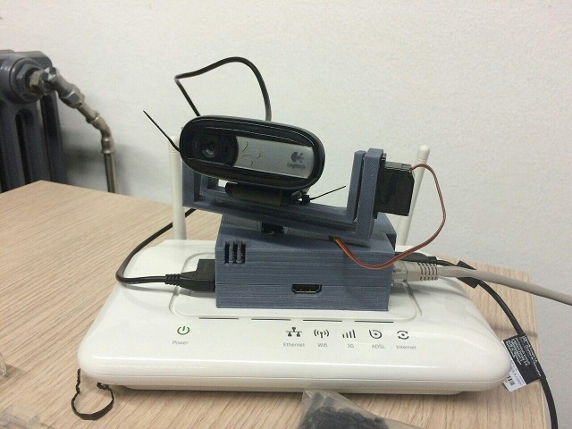

## Contents

* [1 Proyecto SECPI](#Proyecto_SECPI)
  + [1.1 1. Resumen del proyecto](#1._Resumen_del_proyecto)
  + [1.2 2. Hardware](#2._Hardware)
  + [1.3 3. Recursos](#3._Recursos)

# Proyecto SECPI[[edit](/pti/index.php?title=Categor%C3%ADa:SecPI&veaction=edit&section=1 "Edit section: Proyecto SECPI") | [edit source](/pti/index.php?title=Categor%C3%ADa:SecPI&action=edit&section=1 "Edit section: Proyecto SECPI")]

La seguridad en nuestros hogares es una preocupación de cada vez más personas, proteger a nuestros seres queridos y nuestras posesiones es un gran reto, existen apuestas tecnológicas que permiten proteger nuestros hogares ya sea con video vigilancia, sensores de movimiento, sensores de apertura de puertas, etc. Aun así dichos sistemas son en muchos casos caros y fuera del abasto de gran parte de los usuarios, el siguiente proyecto tiene como objetivo solventar esa gran brecha existente entre la seguridad de aquello que nos importa y el coste de conseguirlo.

SECPI es un sistema de videovigilancia que permite interconectar una Raspberry Pi con una webcam por USB y servomotores para variar el ángulo de enfoque. Dicho sistema se podrá controlar a través de una aplicación Android y una aplicación web. Éstas permitirán tanto ver el streaming en directo cómo controlar el movimiento de los motores.

La facilidad de uso es uno de los grandes objetivos del servicio, la imagen de sistema operativo creado es suficiente para tener el servicio en pleno funcionamiento, además, SECPI permite trabajar con cualquier cámara web genérica. Siendo un proyecto modular puede transmitir streaming, mover la cámara usando servomotores, guardar copias de seguridad o todas las opciones a la vez. Con estos objetivos en mente se pretende crear un sistema de seguridad fiable, tolerante a fallos y escalable con componentes económicos y con una instalación sencilla para el usuario.

## 1. Resumen del proyecto[[edit](/pti/index.php?title=Categor%C3%ADa:SecPI&veaction=edit&section=2 "Edit section: 1. Resumen del proyecto") | [edit source](/pti/index.php?title=Categor%C3%ADa:SecPI&action=edit&section=2 "Edit section: 1. Resumen del proyecto")]

El proyecto final, cuenta con los siguientes elementos:

* **Servidor**: Se trata de una Raspberry Pi B, encapsulada en una caja especifica, con dos servomotores y una webcam. Como sistema utilitza una versión debian (Minibian) especialmente diseñada para la RPI, sin interfaz grafica, que cuenta con un servidor Apache.

* **Una aplicación Android**: Se ha escojido esta plataforma porque es la mas utilizada. Se podria decir que su diseño es hibrido ya que la mitad es nativas y la otra mitad embedida por el servidor web. Su apariencia es la siguiente:

* **Una aplicación Web**: Simple y eficaz, con poco diseño, pero funcional. Se ha hecho con PHP, Bootstrap, HTML y CSS. Su apariencia es la siguiente:

## 2. Hardware[[edit](/pti/index.php?title=Categor%C3%ADa:SecPI&veaction=edit&section=3 "Edit section: 2. Hardware") | [edit source](/pti/index.php?title=Categor%C3%ADa:SecPI&action=edit&section=3 "Edit section: 2. Hardware")]

El hardware necesario se detalla a continuación:

Los servomotores y la caja 3D son opcionales.

## 3. Recursos[[edit](/pti/index.php?title=Categor%C3%ADa:SecPI&veaction=edit&section=4 "Edit section: 3. Recursos") | [edit source](/pti/index.php?title=Categor%C3%ADa:SecPI&action=edit&section=4 "Edit section: 3. Recursos")]

A continuación esta disponible el manual de usuario para una puesta a punto:

[File:Manual usuario secpi.pdf](/pti/index.php?title=Special:Upload&wpDestFile=Manual_usuario_secpi.pdf "File:Manual usuario secpi.pdf")