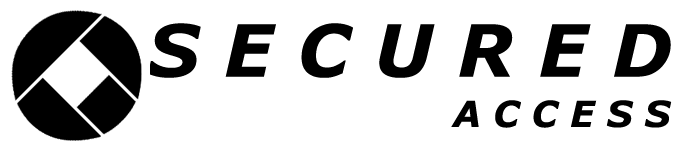
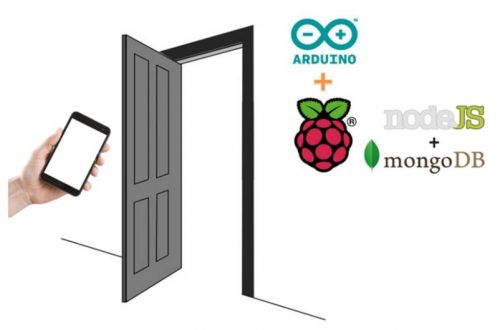
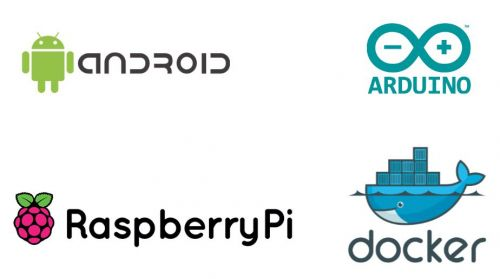

El objetivo de este proyecto es ofrecer una solución que integre tanto componentes hardware como software

para la implementación de un sistema de control de acceso para el hogar, la oficina o cualquier otro entorno.

## Contents

* [1 Contexto](#Contexto)
* [2 Agentes implicados](#Agentes_implicados)
  + [2.1 A quién va dirigido](#A_qui.C3.A9n_va_dirigido)
  + [2.2 Quién lo usará](#Qui.C3.A9n_lo_usar.C3.A1)
  + [2.3 Quién se beneficiará de los resultados](#Qui.C3.A9n_se_beneficiar.C3.A1_de_los_resultados)
* [3 Formulación del problema](#Formulaci.C3.B3n_del_problema)
  + [3.1 Objetivo principal](#Objetivo_principal)
  + [3.2 Objetivos específicos](#Objetivos_espec.C3.ADficos)
* [4 Tecnologías](#Tecnolog.C3.ADas)
* [5 Casos de uso](#Casos_de_uso)
* [6 Análisis de algoritmos](#An.C3.A1lisis_de_algoritmos)
* [7 Empaquetado del proyecto](#Empaquetado_del_proyecto)

# Contexto[[edit](/pti/index.php?title=Categor%C3%ADa:SecuredAccess&veaction=edit&section=1 "Edit section: Contexto") | [edit source](/pti/index.php?title=Categor%C3%ADa:SecuredAccess&action=edit&section=1 "Edit section: Contexto")]

Hoy en día la seguridad es una de las partes más importantes en nuestro día a día, existen empresas que a cambio de remuneración te instalan su sistema. Nuestro objetivo es proporcionar una solución que integre tanto componentes hardware como software para la implementación de un sistema de control de acceso para el hogar, la oficina o cualquier otro entorno para todas aquellas personas que no pueden afrontar los costes de un sistema comercial o simplemente no requieran de un nivel de seguridad tan extremo.

El proyecto consiste en la creación de una plataforma de administración para la apertura de un punto de acceso. Aún así, el sistema es extensible a prácticamente cualquier otro tipo de objeto. En el ámbito de la aplicación existirá un administrador que será el encargado de gestionar los usuarios que podrán acceder y los que no. Además podrá obtener estadísticas de los registros que se generan cada vez que un usuario intente acceder.

# Agentes implicados[[edit](/pti/index.php?title=Categor%C3%ADa:SecuredAccess&veaction=edit&section=2 "Edit section: Agentes implicados") | [edit source](/pti/index.php?title=Categor%C3%ADa:SecuredAccess&action=edit&section=2 "Edit section: Agentes implicados")]

Los principales actores implicados en este proyecto, es decir, todos los usuarios que tendrán algún tipo de relación con el proyecto; usuarios y administrador de la plataforma.

### A quién va dirigido[[edit](/pti/index.php?title=Categor%C3%ADa:SecuredAccess&veaction=edit&section=3 "Edit section: A quién va dirigido") | [edit source](/pti/index.php?title=Categor%C3%ADa:SecuredAccess&action=edit&section=3 "Edit section: A quién va dirigido")]

Este proyecto va dirigido a toda persona que quiera obtener un mínimo de seguridad en el ámbito del acceso de usuarios, invirtiendo poco dinero y recursos.

### Quién lo usará[[edit](/pti/index.php?title=Categor%C3%ADa:SecuredAccess&veaction=edit&section=4 "Edit section: Quién lo usará") | [edit source](/pti/index.php?title=Categor%C3%ADa:SecuredAccess&action=edit&section=4 "Edit section: Quién lo usará")]

Este proyecto está pensado para que pueda ser utilizado tanto por empresas como por usuarios finales que quieran adquirir un mínimo de seguridad por muy poca inversión económica.

### Quién se beneficiará de los resultados[[edit](/pti/index.php?title=Categor%C3%ADa:SecuredAccess&veaction=edit&section=5 "Edit section: Quién se beneficiará de los resultados") | [edit source](/pti/index.php?title=Categor%C3%ADa:SecuredAccess&action=edit&section=5 "Edit section: Quién se beneficiará de los resultados")]

Los beneficiarios serán los propios usuarios que utilizan nuestra solución ya que les proporcionará una manera sencilla y segura de acceder al sitio en concreto que se desea proteger mediante el uso de su propio smartphone. Los creadores del proyecto en ningún momento obtendrán ningún tipo de compensación económica por el uso de la plataforma, sin embargo servirá de referencia para posibles oportunidades de trabajo.

# Formulación del problema[[edit](/pti/index.php?title=Categor%C3%ADa:SecuredAccess&veaction=edit&section=6 "Edit section: Formulación del problema") | [edit source](/pti/index.php?title=Categor%C3%ADa:SecuredAccess&action=edit&section=6 "Edit section: Formulación del problema")]

Para poder llegar a una solución primero se han tenido que definir una serie de objetivos ya sean de forma global o específica. En esta sección se abarcan desde el objetivo principal de la aplicación como el objetivo específico de cada parte que conforma el sistema en su totalidad.

## Objetivo principal[[edit](/pti/index.php?title=Categor%C3%ADa:SecuredAccess&veaction=edit&section=7 "Edit section: Objetivo principal") | [edit source](/pti/index.php?title=Categor%C3%ADa:SecuredAccess&action=edit&section=7 "Edit section: Objetivo principal")]

El proyecto consiste en la creación de una plataforma de administración para la apertura de un punto de acceso. Aún así, el sistema es extensible a prácticamente cualquier otro tipo de objeto. En el ámbito de la aplicación existirá un administrador que será el encargado de gestionar los usuarios que podrán acceder y los que no. Además podrá obtener estadísticas de los registros que se generan cada vez que un usuario intente acceder.

## Objetivos específicos[[edit](/pti/index.php?title=Categor%C3%ADa:SecuredAccess&veaction=edit&section=8 "Edit section: Objetivos específicos") | [edit source](/pti/index.php?title=Categor%C3%ADa:SecuredAccess&action=edit&section=8 "Edit section: Objetivos específicos")]

Diagrama de Secured Access

Los objetivos específicos del proyecto estarán enfocados en la implementación de tecnologías que hasta ahora ninguno de los integrantes del proyecto habíamos utilizado.

* Para el servicio de backend se utilizará **Node.js**. Este lenguaje de programación nos proporcionará el despliegue del servidor sobre el que se creará una **API REST** que proporcionará a los clientes una plataforma sobre la que hacer peticiones a base de datos.

* Para la aplicación móvil se ha usado **Android** debido a su gran uso en el mercado actual. Para desarrollar la aplicación se ha usado Android Studio, un IDE especializado en Android. Para la comunicación entre la aplicación Android y el servidor se ha usado un **REST client** llamado Retrofit que facilita la implementación de las conexiones con el servidor. Para el sistema de notificaciones se ha adaptado el servicio de Geofencing de Google.

* Para el servicio de frontend se utilizará **AngularJS** junto con Angular Material, un framework que nos proporcionará componentes visuales y su lógica de una manera relativamente sencilla.

* Para la creación de la **API REST** se ha utilizado el framework de Node.js llamado **Express** que nos proporcionará de una manera sencilla la creación de los servicios.

* La conexión de la base de datos con el servidor se hará con un framework de Node.js llamado **Mongoose**, desde este framework se podrá realizar queries **NoSQL** a la base de datos y recibir respuesta.

* Se utilizará la herramienta **Docker** con el fin de empaquetar la aplicación en un contenedor. Un contenedor Docker permite que la aplicación sea portable, es decir, que se pueda ejecutar en cualquier máquina independientemente del sistema operativo que corra.

* En la parte del servidor se llamarán a servicios batch para hacer la comprobación entre los patrones en base de datos y los patrones recibidos de la aplicación Android, estos servicios están programados con **Python** y **OpenCV**.

* Para la base de datos se utilizará una **MongoDB**, es decir, una base de datos NoSQL que utiliza como lenguaje de programación JavaScript. El objetivo será aprender cómo funciona Mongo y como utilizarlo dentro de una Raspberry PI 3.

* La función principal del **Arduino** es la de actuar como interfaz entre la Raspberry Pi y la realización de la tarea de dar o denegar acceso.

* La Raspberry Pi será la encargada de alojar el servidor, la base de datos y el BackOffice. Además se encargará de determinar si da la orden de abrir al Arduino. Estará conectada a este mediante un cable USB type A-B. El sistema operativo que se ha utilizado para la Raspberry Pi es Raspbian, una distribución de escritorio derivada de Debian adaptada para su hardware.

# Tecnologías[[edit](/pti/index.php?title=Categor%C3%ADa:SecuredAccess&veaction=edit&section=9 "Edit section: Tecnologías") | [edit source](/pti/index.php?title=Categor%C3%ADa:SecuredAccess&action=edit&section=9 "Edit section: Tecnologías")]

A continuación se listan las tecnologías utilizadas. En caso de tratarse de software, servicios o frameworks se han clasificado según sobre que plataforma se ha ejecutado.

Tecnologías

**Smartphone**

* Android
  + Servicios de Android
  + Librerías externas
    - Retrofit

**Raspberry**

* Frontend
  + AngularJS
  + Angular Material
* Backend
  + Node
    - Express
    - Mongoose
  + MongoDB
* Scripts
  + Python
  + OpenCV
* Docker

**Arduino**

* C

# Casos de uso[[edit](/pti/index.php?title=Categor%C3%ADa:SecuredAccess&veaction=edit&section=10 "Edit section: Casos de uso") | [edit source](/pti/index.php?title=Categor%C3%ADa:SecuredAccess&action=edit&section=10 "Edit section: Casos de uso")]

Un aspecto muy importante en la organización y desarrollo del proyecto es el planteamiento de los casos de uso. A continuación se listan agrupados todos los casos de uso definidos para la aplicación. Algunos de ellos están presentes en más de una plataforma.

**Usuarios**

* Creación del administrador
* Creación de usuarios
* Modificación de usuarios
* Eliminación de usuarios
* Desbloqueo/bloqueo de usuarios

**Credenciales**

* Inicio de sesión
* Cierre de sesión
* Creación de credenciales de acceso
* Introducción de credenciales de acceso
* Modificación de credenciales de acceso
* Eliminación de credenciales de acceso

**Geolocalización**

* Obtención de la geolocalización del punto de acceso
* Modificación de la geolocalización del punto de acceso

**Consultas**

* Consulta de los usuarios
* Consulta de las estadísticas de los registros
* Consulta los datos de los registros

# Análisis de algoritmos[[edit](/pti/index.php?title=Categor%C3%ADa:SecuredAccess&veaction=edit&section=11 "Edit section: Análisis de algoritmos") | [edit source](/pti/index.php?title=Categor%C3%ADa:SecuredAccess&action=edit&section=11 "Edit section: Análisis de algoritmos")]

**Reconocimiento facial**

Para poder llevar a cabo el reconocimiento facial de los usuarios, el sistema ejecutará un algoritmo que se describe con los siguientes pasos:

1. Detectar la región que ocupa la cara en cada una de las cinco imágenes que previamente el usuario ha guardado en la base de datos. Para ello, se emplea un Haar Cascade típico de OpenCV.
2. Se crea un Face Recognition Object al que se le introducen las imágenes para entrenarlo y que así extraiga el patrón de reconocimiento de éstas.
3. Se realizan los dos anteriores pasos para la imagen que se quiere evaluar, se compara con las imágenes que hay en el Face Recognition Object y se obtiene una confianza. Una confianza muy elevada significa que las imágenes de la base de datos son muy diferentes respecto a la del usuario que desea acceder. Mientras que una confianza muy baja significa que las diferencias entre las imágenes de la base de datos y la del usuario son mínimas.
4. Por último, se debe determinar si la confianza obtenida entra en el umbral de aceptación De tal manera que si la confianza obtenida es lo suficientemente pequeña, se puede dar por válido el acceso.

Se han obtenido resultados satisfactorios dando confianzas muy dispares, para usuarios correctos y erróneos. No obstante, la calidad de la cámara, el fondo y la iluminación son factores claves para determinar el umbral de aceptación. El script se ha elaborado con el lenguaje de programación Python y se han necesitado los siguientes módulos: cv2 (OpenCV), os, numpy e Image.

**Contraseña y patrón**

Tanto para el acceso por password como por patrón, lo único que se requiere es que los parámetros que introduce el usuario y los que tiene guardados la base de datos sean idénticos. El script se ha elaborado con el lenguaje de programación Python y se ha necesitado el módulo sys.

# Empaquetado del proyecto[[edit](/pti/index.php?title=Categor%C3%ADa:SecuredAccess&veaction=edit&section=12 "Edit section: Empaquetado del proyecto") | [edit source](/pti/index.php?title=Categor%C3%ADa:SecuredAccess&action=edit&section=12 "Edit section: Empaquetado del proyecto")]

Para llevar a cabo el empaquetado del proyecto se ha utilizado una herramienta innovadora y que está teniendo muchas repercusiones en el mercado y en las aplicaciones portables.

**Docker**

La principal idea de utilizar Docker es poder paquetizar todo el proyecto en una solo contenedor, de esta manera será portable y se podrá ejecutar todo el proyecto en cualquier sistema operativo.

Se ha instalado la versión de Hypriot’s 1.10.3, ya que la versión oficial de Docker sólo llega hasta la 1.3.3, dicha versión es antigua y está desactualizada, con lo cual habrá funcionalidades e imágenes que no funcionarán. Una vez instalado, se ha descargado e instalado la imagen resin/rpi-raspbian/, una imagen de Raspbian básica.