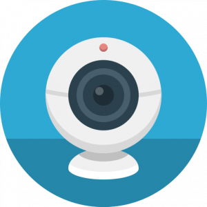
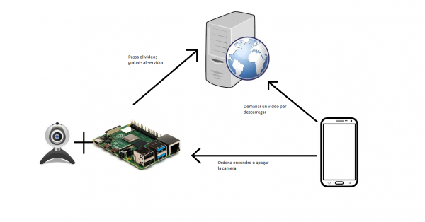
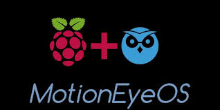

Security Pi.

## Contents

* [1 Introducció](#Introducci.C3.B3)
  + [1.1 Què és Security Pi?](#Qu.C3.A8_.C3.A9s_Security_Pi.3F)
* [2 Infraestructura](#Infraestructura)
  + [2.1 Raspberry Pi](#Raspberry_Pi)
  + [2.2 Servidor](#Servidor)
  + [2.3 App](#App)

# Introducció[[edit](/pti/index.php?title=Categor%C3%ADa:SecurityPi&veaction=edit&section=1 "Edit section: Introducció") | [edit source](/pti/index.php?title=Categor%C3%ADa:SecurityPi&action=edit&section=1 "Edit section: Introducció")]

Vam decidir fer una app de seguretat perquè creiem que seria interessant veure el difícil que podia arribar a ser fer un sistema de seguretat; perquè quan una companyia et munta el seu sistema, el client només veu com munten les càmeres, no veu que hi ha "darrere".

## Què és Security Pi?[[edit](/pti/index.php?title=Categor%C3%ADa:SecurityPi&veaction=edit&section=2 "Edit section: Què és Security Pi?") | [edit source](/pti/index.php?title=Categor%C3%ADa:SecurityPi&action=edit&section=2 "Edit section: Què és Security Pi?")]

És un sistema de seguretat senzill el qual qualsevol persona amb una càmera web, una Raspberry Pi i un mòbil podria muntar seguint les instruccions. Amb el mòbil només s'haurà de registrar a l'app amb un correu propi i el servidor ja el tindrem com a usuari. Després s'hauria de configurar el Motion (programa que utilitzem per gravar) després d'haver-lo instal·lat i instal·lar la VPN per poder connectar-se amb el servidor.

# Infraestructura[[edit](/pti/index.php?title=Categor%C3%ADa:SecurityPi&veaction=edit&section=3 "Edit section: Infraestructura") | [edit source](/pti/index.php?title=Categor%C3%ADa:SecurityPi&action=edit&section=3 "Edit section: Infraestructura")]

Security Pi està construït sobre tres components: Una Raspberry Pi, un servidor i una aplicació per Android. Aquestes tres partes es comuniquen entre si per dur a terme les funcionalitats del sistema.

Estructura del sistema.

## Raspberry Pi[[edit](/pti/index.php?title=Categor%C3%ADa:SecurityPi&veaction=edit&section=4 "Edit section: Raspberry Pi") | [edit source](/pti/index.php?title=Categor%C3%ADa:SecurityPi&action=edit&section=4 "Edit section: Raspberry Pi")]

Per a fer els vídeos i gravar-los fem servir Motion, una aplicació centrada en les gravacions de seguretat.

Motion.

Durant el procés, vam necessitar connectar la RP amb els altres dispositius; a més de fer que el streaming es pogués veure en una IP pública. Per fer això fem servir NO-IP, que és una pàgina web que et deixa crear un DNS dinàmic per crear HTTPS o SSH.

No IP

Per últim, per pujar els vídeos gravats fem servir scripts creats per nosaltres.

## Servidor[[edit](/pti/index.php?title=Categor%C3%ADa:SecurityPi&veaction=edit&section=5 "Edit section: Servidor") | [edit source](/pti/index.php?title=Categor%C3%ADa:SecurityPi&action=edit&section=5 "Edit section: Servidor")]

Per garantir l'objectiu de seguretat i vigilància ens cal tenir un lloc on emmagatzemar les nostres gravacions fetes amb la RB pi, per tal de poder consultar-les quan ho necessitem. Aquest lloc d'emmagatzematge depèn de l'ús que donis al sistema de vigilància, si només l'utilitzes unes poques hores al dia no cal invertir gaires diners en l'emmagatzematge, amb un disc dur a casa es podria fer o amb opcions de pagament com AWS (Amazon Web Services) que va ser una opció per nosaltres.
Finalment, per aquesta tasca vam fer servir la màquina virtual que ens proporcionava la FIB, com a servidor per emmagatzemar els vídeos que pujàvem. Fèiem servir Apache Web Server per fer les sol·licituds de l'App a la nostra màquina virtual.
Fèiem servir scripts PHP per la seva senzillesa a l'hora de fer connexions a SSH o MYSQL, ja que tenia una documentació molt completa i ben explica, també vam escriure scripts en Bash, per facilitar les comandes a Linux.
La base de dades està implementada en MySQL.

## App[[edit](/pti/index.php?title=Categor%C3%ADa:SecurityPi&veaction=edit&section=6 "Edit section: App") | [edit source](/pti/index.php?title=Categor%C3%ADa:SecurityPi&action=edit&section=6 "Edit section: App")]

Per fer l'app de Security PI hem triat utilitzar l'eina oficial de disseny d'aplicacions d'Android: Android Studio, ja que ens permetria assegurar-nos que l'aplicació fos 100% compatible amb els nostres dispositius. La versió d'Android en la qual funciona l'app és la 7.0 (Nougat) o superior.
Per la correcta utilització de l’app és necessari connectar-se primer a la VPN de la Universitat Politècnica de Catalunya, ja que per accedir al servidor és necessari utilitzar aquesta connexió.
Des de l'aplicació podem encendre o apagar la càmera i visualitzar els vídeos de l'usuari amb el qual hem iniciat sessió. Aquests es baixaran des del servidor quan l'usuari ho demani i es guardaran de manera local al dispositiu.

App