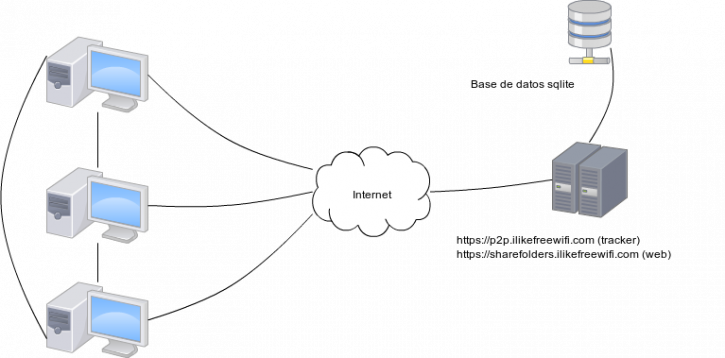
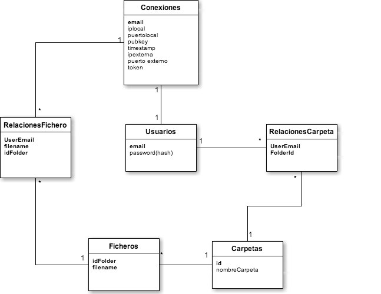
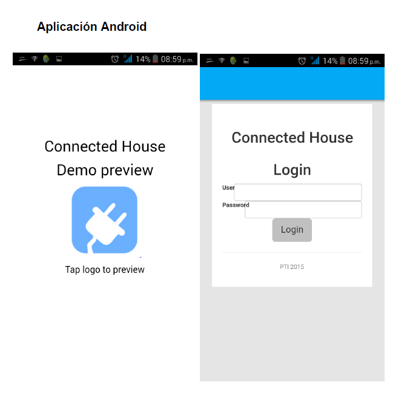
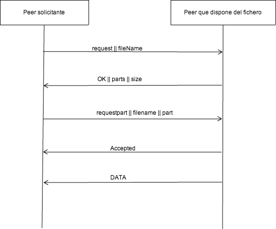

**Sharefolders ...**

## Contents

* [1 1. Qué es Sharefolders?](#1._Qu.C3.A9_es_Sharefolders.3F)
* [2 2. A quién va destinado?](#2._A_qui.C3.A9n_va_destinado.3F)
* [3 3. Cómo funciona?](#3._C.C3.B3mo_funciona.3F)
  + [3.1 Topología](#Topolog.C3.ADa)
  + [3.2 Modelo de datos del tracker](#Modelo_de_datos_del_tracker)
  + [3.3 Estructura de la aplicación](#Estructura_de_la_aplicaci.C3.B3n)
  + [3.4 Mensajes entre clientes](#Mensajes_entre_clientes)
* [4 4. Tecnologías utilizadas](#4._Tecnolog.C3.ADas_utilizadas)
  + [4.1 Página web](#P.C3.A1gina_web)
  + [4.2 Servidor](#Servidor)
  + [4.3 Aplicación](#Aplicaci.C3.B3n)

## 1. Qué es Sharefolders?[[edit](/pti/index.php?title=Categor%C3%ADa:Sharefolders&veaction=edit&section=1 "Edit section: 1. Qué es Sharefolders?") | [edit source](/pti/index.php?title=Categor%C3%ADa:Sharefolders&action=edit&section=1 "Edit section: 1. Qué es Sharefolders?")]

Sharefolders es una plataforma p2p que permite el intercambio de archivos entre usuarios. Tras un registro en la página web, el usuario puede crear carpetas que compartirá con sus compañeros, y añadir archivos a estas carpetas para compartirlos con otros usuarios.

La plataforma dispone de página web y aplicación de escritorio. En la página web el usuario puede registrarse y una vez hecho esto descargar la aplicación de escritorio. Con la aplicación de escritorio, podemos crear carpetas para compartir ficheros. Para compartir un fichero, lo enlazamos desde la aplicación a una carpeta en concreto y invitamos a otros usuarios de la plataforma a poder ver esta carpeta. Desde entonces, otros usuarios verán el fichero que hemos subido y podrán empezar a descargarlo.

Para controlar los diferentes usuarios conectados y qué ficheros comparten, así como sus direcciones IP y más información necesaria para que funcione la plataforma, disponemos de un Tracker programado en PHP, el cual controla los sistemas de autenticación, quién tiene acceso a qué carpetas, y más opciones que se explicarán a continuación.

## 2. A quién va destinado?[[edit](/pti/index.php?title=Categor%C3%ADa:Sharefolders&veaction=edit&section=2 "Edit section: 2. A quién va destinado?") | [edit source](/pti/index.php?title=Categor%C3%ADa:Sharefolders&action=edit&section=2 "Edit section: 2. A quién va destinado?")]

1. Usuarios de internet que buscan una forma de compartir ficheros de forma privada y mediante peer-to-peer.\pause}
2. Empresas que necesitan una forma más eficaz de compartir ficheros de forma interna sin sobrecargar los servidores.\pause}
3. Artistas y creadores culturales que buscan una forma de hacer llegar sus obras al máximo público posible.

## 3. Cómo funciona?[[edit](/pti/index.php?title=Categor%C3%ADa:Sharefolders&veaction=edit&section=3 "Edit section: 3. Cómo funciona?") | [edit source](/pti/index.php?title=Categor%C3%ADa:Sharefolders&action=edit&section=3 "Edit section: 3. Cómo funciona?")]

### Topología[[edit](/pti/index.php?title=Categor%C3%ADa:Sharefolders&veaction=edit&section=4 "Edit section: Topología") | [edit source](/pti/index.php?title=Categor%C3%ADa:Sharefolders&action=edit&section=4 "Edit section: Topología")]

En Sharefolders hay diferentes partes tecnológicas que dan vida a la plataforma. Aquí exponemos estas partes y una pequeña descripción de su función. Además en la captura podéis haceros una idea de como están conectadas.

1. Página web: la página web nos permite registrarnos en la plataforma y poder descargar la aplicación de escritorio. La web está conectada a una base de datos SQLite.
2. Tracker: el tracker se encarga de gestionar los datos de la plataforma, y informar a los diferentes clientes. También está conectado a la misma base de datos SQLite que la página web.
3. Cliente: El cliente es una aplicación Java de escritorio. Nos permite entrar con nuestra cuenta, y una vez autenticados, podremos empezar a utilizar las funcionalidades de la plataforma. Se comunica con el tracker para recopilar la información necesaria de los pares y los archivos registrados.

### Modelo de datos del tracker[[edit](/pti/index.php?title=Categor%C3%ADa:Sharefolders&veaction=edit&section=5 "Edit section: Modelo de datos del tracker") | [edit source](/pti/index.php?title=Categor%C3%ADa:Sharefolders&action=edit&section=5 "Edit section: Modelo de datos del tracker")]

En el modelo de datos del tracker, podemos distinguir entre dos tipos de tablas. Las que son estáticas, y las que son dinámicas. Las estáticas son las que contienen información que no requiere de actualización constante dependiente de los usuarios conectados. Ejemplos de tablas estáticas son Ficheros, Carpetas, Usuarios y RelacionesCarpeta.

Llamamos tablas dinámicas las tablas que varian en función de las conexiones al sistema de los usuarios. Estas tablas son Conexiones y RelacionesFichero. La primera se actualiza con los usuarios que están online, y la segunda con los ficheros que cada usuario online está compartiendo.

### Estructura de la aplicación[[edit](/pti/index.php?title=Categor%C3%ADa:Sharefolders&veaction=edit&section=6 "Edit section: Estructura de la aplicación") | [edit source](/pti/index.php?title=Categor%C3%ADa:Sharefolders&action=edit&section=6 "Edit section: Estructura de la aplicación")]

* ProtocolManager

Esta clase es la encargada de gestionar la parte lógica de la aplicación. Dispone de las funciones básicas que se llamaran desde la parte gráfica de la aplicación. Además, tiene toda la información correspondiente a las descargas y los ficheros para que la parte gráfica pueda ir actualizando la información a medida que el proceso de descarga avanza. Esta clase también se encarga de hacer todas las peticiones hacia el tracker y recibir las respuestas de este (Como por ejemplo hacer login, obtener a qué carpetas tenemos acceso, los ficheros de cada carpeta o los peers conectados con esos ficheros en caso de que queramos descargarlos).

Para la información de las descargas, esta clase dispone de una clase auxiliar llamada DownloadInfo, que, para cada fichero que estemo descargando, nos muestra el tamaño que tienen y la cantidad de bytes que ya llevamos descargados del fichero para poder actualizar la barra de progreso.

* UploadManager

El UploadManager consiste en un Thread que abre un socket server en el puerto 43215 del protocolo TCP. Cuando recibe una petición acepta la conexión entrante y envia este socket a la clase SingleUploadManager, que será la encargada de gestionar la comunicación con el peer y enviarle la información que éste requiera.

* SingleUploadManager

Esta clase consiste en un Thread que recibe un socket ya abierto como parámetro. Su función principal es la de recibir las peticiones del peer que acaba de conectarse para pedirnos una parte. Más adelante comentaremos los mensajes que se intercambian ambos pares para comenzar la descarga.

* DownloadManager

El DownloadManager recibe la petición del protocolManager de que se quiere descargar un fichero. Es una clase muy sencila, dispone de una lista de SingleFileDownloadManager y cuando recibe una petición se encarga de crear una instancia nueva de dicha clase i añadirlo en la lista. Como SingleFileDownloadManager es un Thread, se encarga de empezarlo también.

* SingleFileDownloadManager

Esta clase es una de las más importantes. Es un thread que contiene un bucle hasta que el fichero no haya acabado de descargarse. Se encarga de preguntar al tracker por todos los peers que dispongan del fichero online. Para cada par que disponga del fichero, se encarga de crear un nuevo SinglePartDownlooadManager, enviando que parte del fichero se quiere descargar. Dispone de una lista de SinglePartDownloadManager, para poder gestionarlos.

Además, este Thread tiene un control de qué partes se están descargando, y cuales han sido ya completadas, para poder evitar repeticiones. Al final del bucle, después de abrir nuevas conexiones si es requerido, se encarga de actualizar el DownloadInfo de este fichero. Después de todo este proceso, el Thread se pausa durante 2 segundos y vuelve a comenzar. Si las partes ya se estan descargando de algun peer, no vuelve a crear nuevas conexiones, ya que solo descargamos 1 parte del peer a la vez. Cuando una parte acaba, se borra de la lista y entonces podemos bajar otra parte diferente de ese mismo par.

* SingleFileDownloadManager

Aquesta classe es la que finalment obre la conexió amb el peer per demanar la part seleccionada. Rep el seu corresponent DownloadInfo del seu fitxer, y cada vegada que es reben 1024 bytes, els actualitza per que el pare (SingleFileDownloadManager) pugui tenir constància de quant hem descarregat de moment. El pas de missatges entre amb un peer està explicat més endavant.

Esta clase es la que finalmente abre la conexión con el peer para pedir una parte. Dispone de variabes para saber cuantos bytes se llevan descargados de la parte, y así el padre pueda consultar y sumar todos los bytes descargados de cada parte por separado, ademásde las partes que ya están completadas. El paso de mensajes entre los pares par realizar la descarga está explicado más adelante.

* DataManager

Esta clase es la encargada de tratar con el sistema de ficheros. Se encarga de gestionar que partes tenemos de un fichero, y además dispone de funciones para consultar una parte entera y podersela enviar al peer, o de poner una parte que acabamos de descargar en el lugar correspondiente del fichero.

### Mensajes entre clientes[[edit](/pti/index.php?title=Categor%C3%ADa:Sharefolders&veaction=edit&section=7 "Edit section: Mensajes entre clientes") | [edit source](/pti/index.php?title=Categor%C3%ADa:Sharefolders&action=edit&section=7 "Edit section: Mensajes entre clientes")]

## 4. Tecnologías utilizadas[[edit](/pti/index.php?title=Categor%C3%ADa:Sharefolders&veaction=edit&section=8 "Edit section: 4. Tecnologías utilizadas") | [edit source](/pti/index.php?title=Categor%C3%ADa:Sharefolders&action=edit&section=8 "Edit section: 4. Tecnologías utilizadas")]

### Página web[[edit](/pti/index.php?title=Categor%C3%ADa:Sharefolders&veaction=edit&section=9 "Edit section: Página web") | [edit source](/pti/index.php?title=Categor%C3%ADa:Sharefolders&action=edit&section=9 "Edit section: Página web")]

En la página web hemos utilizado,

1. php para la comunicación con la base de datos,
2. jQuery para la parte gráfica,

### Servidor[[edit](/pti/index.php?title=Categor%C3%ADa:Sharefolders&veaction=edit&section=10 "Edit section: Servidor") | [edit source](/pti/index.php?title=Categor%C3%ADa:Sharefolders&action=edit&section=10 "Edit section: Servidor")]

En el servidor (Tracker):

1. PHP,
2. HTTPS,
3. SQLite para las bases de datos.

### Aplicación[[edit](/pti/index.php?title=Categor%C3%ADa:Sharefolders&veaction=edit&section=11 "Edit section: Aplicación") | [edit source](/pti/index.php?title=Categor%C3%ADa:Sharefolders&action=edit&section=11 "Edit section: Aplicación")]

En la aplicación;

1. JSwing para la parte gráfica,
2. La librería Sockets de Java.
3. weUPNP, librería que implementa el protocolo UPNP para hacer port forwarding de un router accediendo a través de su interfaz web local.