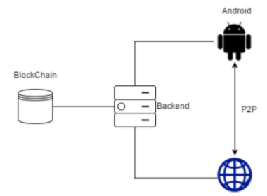

[](/pti/index.php/File:Shhat.png)

[](/pti/index.php/File:Icon_shhat_-_copia.png)

## Contents

* [1 Shhat](#Shhat)
  + [1.1 El proyecto Shhat](#El_proyecto_Shhat)
  + [1.2 Objetivos](#Objetivos)
  + [1.3 Tecnologías](#Tecnolog.C3.ADas)
    - [1.3.1 BlockChain](#BlockChain)
      * [1.3.1.1 Razón de uso](#Raz.C3.B3n_de_uso)
      * [1.3.1.2 Implementación](#Implementaci.C3.B3n)
    - [1.3.2 BackEnd](#BackEnd)
      * [1.3.2.1 Razón de uso](#Raz.C3.B3n_de_uso_2)
      * [1.3.2.2 Instalación](#Instalaci.C3.B3n)
        + [1.3.2.2.1 Características técnicas](#Caracter.C3.ADsticas_t.C3.A9cnicas)
        + [1.3.2.2.2 Geth](#Geth)
        + [1.3.2.2.3 Node](#Node)
        + [1.3.2.2.4 Web3](#Web3)
        + [1.3.2.2.5 Nohup](#Nohup)
      * [1.3.2.3 Implementación](#Implementaci.C3.B3n_2)
    - [1.3.3 Android](#Android)
      * [1.3.3.1 Razón de uso](#Raz.C3.B3n_de_uso_3)
      * [1.3.3.2 Implementación](#Implementaci.C3.B3n_3)
    - [1.3.4 Web](#Web)
      * [1.3.4.1 Razón de uso](#Raz.C3.B3n_de_uso_4)
      * [1.3.4.2 Implementación](#Implementaci.C3.B3n_4)
    - [1.3.5 P2P](#P2P)
      * [1.3.5.1 Razón de uso](#Raz.C3.B3n_de_uso_5)
      * [1.3.5.2 Implementación](#Implementaci.C3.B3n_5)
        + [1.3.5.2.1 Servidor Bootstrap](#Servidor_Bootstrap)
        + [1.3.5.2.2 Clase Peer](#Clase_Peer)
        + [1.3.5.2.3 Implementación en android](#Implementaci.C3.B3n_en_android)
* [2 Resultado final vs esperado](#Resultado_final_vs_esperado)
  + [2.1 Privacidad y anonimato](#Privacidad_y_anonimato)
* [3 Conclusiones](#Conclusiones)
* [4 Memoria](#Memoria)

# Shhat[[edit](/pti/index.php?title=Categor%C3%ADa:Shhat&veaction=edit&section=1 "Edit section: Shhat") | [edit source](/pti/index.php?title=Categor%C3%ADa:Shhat&action=edit&section=1 "Edit section: Shhat")]

## El proyecto Shhat[[edit](/pti/index.php?title=Categor%C3%ADa:Shhat&veaction=edit&section=2 "Edit section: El proyecto Shhat") | [edit source](/pti/index.php?title=Categor%C3%ADa:Shhat&action=edit&section=2 "Edit section: El proyecto Shhat")]

El proyecto “Shhat” surge con la idea de conseguir una herramienta con la que conseguir un mayor nivel de privacidad.
Con esto en mente se ha creado un servicio de mensajería instantánea en el que los usuarios, a través de un cliente de Android o de una página web, pueden crear salas de chat privadas e invitar a sus contactos a ellas.

Para conseguir un nivel de privacidad adecuado, se ha optado por usar la tecnología BlockChain, muy comentada en la actualidad, para mantener la base de datos y la lógica de las salas de chat. Esto permite, además, que el coste del sistema sea muy bajo, ya que esta tecnología, como se explicará posteriormente, permite tener aplicaciones distribuidas de forma fácil, rápida y sin necesidad de servidores.

Mantener la BlockChain sincronizada en todo momento es un requisito necesario para poder usar sus funcionalidades, por lo que se necesita disponer de un servidor que se encargue de ello y reciba y procese peticiones de interacción con la BlockChain enviadas por los usuarios.

Las redes descentralizadas pueden ayudar a mantener niveles de privacidad y tolerancia a fallos más altos, por lo que se ha decidido usar tecnología P2P para el envío de mensajes entre los usuarios.

Un alto nivel de accesibilidad y facilidad a la hora de usar la aplicación era algo que se tenía muy en mente, por lo que una aplicación para Android y un cliente web permitirán el uso del servicio de forma sencilla y directa.

En los siguientes puntos de la memoria se explicarán en detalle cada uno de los 5 grandes paquetes de trabajo y la estructura que forman en conjunto, además de su implementación y una breve guía para facilitar su uso.

[](/pti/index.php/File:Captura.PNG)

Esquema general del proyecto

## Objetivos[[edit](/pti/index.php?title=Categor%C3%ADa:Shhat&veaction=edit&section=3 "Edit section: Objetivos") | [edit source](/pti/index.php?title=Categor%C3%ADa:Shhat&action=edit&section=3 "Edit section: Objetivos")]

El objetivo principal del proyecto es crear un servicio de chat anónimo y descentralizado, desde el cual un usuario pueda comunicarse libremente, ya sea con uno o más usuarios, a través de salas de chat, con la confianza y la certeza de no ser rastreado, identificado, o relacionado de alguna manera con una conversación en concreto.

Dada la tecnología Blockchain, los datos del usuario y chats serán almacenados en la red ethereum, en la cual se tiene la certeza de que nadie se podrá hacer pasar por ti. Tampoco se registrarán datos de las IP’s de los mensajes enviados en los chats dentro de la red ethereum, y lo más importante, no se guardará ningún dato privado del usuario que pueda relacionarlo con su identidad en la vida real, es decir, nadie sabrá quien es el usuario “user17”, ni su nombre real, ni dirección, ni e-mail, ni nada, ya que en la red ethereum solo se guardará el usuario y la contraseña, dando así el máximo grado de anonimidad.

## Tecnologías[[edit](/pti/index.php?title=Categor%C3%ADa:Shhat&veaction=edit&section=4 "Edit section: Tecnologías") | [edit source](/pti/index.php?title=Categor%C3%ADa:Shhat&action=edit&section=4 "Edit section: Tecnologías")]

### BlockChain[[edit](/pti/index.php?title=Categor%C3%ADa:Shhat&veaction=edit&section=5 "Edit section: BlockChain") | [edit source](/pti/index.php?title=Categor%C3%ADa:Shhat&action=edit&section=5 "Edit section: BlockChain")]

Para la persistencia de los dato, tal y como se ha comentado antes, se ha decidido usar la tecnología BlockChain. A continuación se explica el porqué de su uso, como se ha realizado su implementación y las dificultades encontradas durante el proyecto.
Finalmente se explica la experiencia personal sobre el uso de esta nueva tecnología.

#### Razón de uso[[edit](/pti/index.php?title=Categor%C3%ADa:Shhat&veaction=edit&section=6 "Edit section: Razón de uso") | [edit source](/pti/index.php?title=Categor%C3%ADa:Shhat&action=edit&section=6 "Edit section: Razón de uso")]

Esta tecnología nos brinda todo lo que necesitamos para la realización del proyecto. Una base de datos distribuida y descentralizada que nos permite la disposición de los datos en cualquier momento, incluso si alguno de sus nodos llegase a fallar.
La seguridad que nos brinda ésta. El uso de claves pública/privada nos permite dar acceso de lectura/escritura a los usuarios que se quieran, impidiendo así que alguien pueda modificar su base de datos.
El anonimato que nos da debido a que cada usuario se identifica con su clave y no con una identificación directamente relacionada a él.

#### Implementación[[edit](/pti/index.php?title=Categor%C3%ADa:Shhat&veaction=edit&section=7 "Edit section: Implementación") | [edit source](/pti/index.php?title=Categor%C3%ADa:Shhat&action=edit&section=7 "Edit section: Implementación")]

Para la implementación se ha usado un Smart Contract usando el lenguaje de programación Solidity.

### BackEnd[[edit](/pti/index.php?title=Categor%C3%ADa:Shhat&veaction=edit&section=8 "Edit section: BackEnd") | [edit source](/pti/index.php?title=Categor%C3%ADa:Shhat&action=edit&section=8 "Edit section: BackEnd")]

#### Razón de uso[[edit](/pti/index.php?title=Categor%C3%ADa:Shhat&veaction=edit&section=9 "Edit section: Razón de uso") | [edit source](/pti/index.php?title=Categor%C3%ADa:Shhat&action=edit&section=9 "Edit section: Razón de uso")]

La principal razón del uso de un servidor ha sido la necesidad de tener los diferentes usuarios sincronizados a la blockChain. Si cada usuario tuviera que descargar y estar constantemente sincronizado con la blockChain sería necesaria una gran capacidad de almacenamiento por usuario (actualmente pesa unos 30 GB). Esto se hace insostenible ya que un usuario no estaría dispuesto a gastar tal cantidad de memoria para una aplicación. Por ello, se ha decidido colocar un servidor que sirva como intermediario entre los usuarios y la blockChain.
Esto podría vulnerar la propiedad antes citada sobre que el sistema es descentralizado. La idea es que cualquiera pueda instalarse este servidor y tener varios de estos funcionando a la vez.
Además, como el servidor solo actúa de intermediario no existe la posibilidad de ataque sobre la base de datos ya que es el smart contract, el que gestiona tanto la BD como sus permisos.
Se ha elegido crear un servidor usando NodeJS ya que existe Web3 (explicado anteriormente) que no es más que una librería en JavaScript que permite la interacción con el cliente Geth.

#### Instalación[[edit](/pti/index.php?title=Categor%C3%ADa:Shhat&veaction=edit&section=10 "Edit section: Instalación") | [edit source](/pti/index.php?title=Categor%C3%ADa:Shhat&action=edit&section=10 "Edit section: Instalación")]

##### Características técnicas[[edit](/pti/index.php?title=Categor%C3%ADa:Shhat&veaction=edit&section=11 "Edit section: Características técnicas") | [edit source](/pti/index.php?title=Categor%C3%ADa:Shhat&action=edit&section=11 "Edit section: Características técnicas")]

```
   SO: Ubuntu 16.04.2 LTS (GNU/Linux 4.4.0-22-generic x86_64)
   RAM: 3GB
   Almacenamiento: 40GB

```

##### Geth[[edit](/pti/index.php?title=Categor%C3%ADa:Shhat&veaction=edit&section=12 "Edit section: Geth") | [edit source](/pti/index.php?title=Categor%C3%ADa:Shhat&action=edit&section=12 "Edit section: Geth")]

Para instalar el cliente Geth se ha usado una instalación mediante PPA.

```
   sudo apt-get install software-properties-common
   sudo add-apt-repository -y ppa:ethereum/ethereum
   sudo apt-get update
   sudo apt-get install ethereum

```

Actualmente el servidor tiene la versión geth 1.6.1-stable.

##### Node[[edit](/pti/index.php?title=Categor%C3%ADa:Shhat&veaction=edit&section=13 "Edit section: Node") | [edit source](/pti/index.php?title=Categor%C3%ADa:Shhat&action=edit&section=13 "Edit section: Node")]

Para instalar el Node se ha usado una instalación mediante PPA.

```
   sudo apt-get install software-properties-common

```

Actualmente el servidor tiene la versión Node v4.2.6.

##### Web3[[edit](/pti/index.php?title=Categor%C3%ADa:Shhat&veaction=edit&section=14 "Edit section: Web3") | [edit source](/pti/index.php?title=Categor%C3%ADa:Shhat&action=edit&section=14 "Edit section: Web3")]

Para instalar la API Web3 se ha usado una instalación mediante npm:

```
   npm install web3

```

Actualmente el servidor tiene la versión web3 0.19.0.

##### Nohup[[edit](/pti/index.php?title=Categor%C3%ADa:Shhat&veaction=edit&section=15 "Edit section: Nohup") | [edit source](/pti/index.php?title=Categor%C3%ADa:Shhat&action=edit&section=15 "Edit section: Nohup")]

Para poder dejar los procesos tanto de Geth como de NodeJS ejecutándose en el servidor aún habiendo cerrado la consola usamos Nohup. Un ejemplo de como ejecutar node redirigiendo la salida al fichero log.txt:

```
   nohup node app.js > log.txt 2>&1 &

```

#### Implementación[[edit](/pti/index.php?title=Categor%C3%ADa:Shhat&veaction=edit&section=16 "Edit section: Implementación") | [edit source](/pti/index.php?title=Categor%C3%ADa:Shhat&action=edit&section=16 "Edit section: Implementación")]

Para la implementación del servidor se ha decidido dividir las llamadas en dos tipos: las que usan el Smart Contract y las que no. Para las primeras se ha asignado un endpoint del tipo “/executeContract/función”, mientras que para las segundas se ha asignado un endpoint del tipo “/función”.

### Android[[edit](/pti/index.php?title=Categor%C3%ADa:Shhat&veaction=edit&section=17 "Edit section: Android") | [edit source](/pti/index.php?title=Categor%C3%ADa:Shhat&action=edit&section=17 "Edit section: Android")]

#### Razón de uso[[edit](/pti/index.php?title=Categor%C3%ADa:Shhat&veaction=edit&section=18 "Edit section: Razón de uso") | [edit source](/pti/index.php?title=Categor%C3%ADa:Shhat&action=edit&section=18 "Edit section: Razón de uso")]

Hoy en día el 49% de las personas del mundo usan un smartphone, y el 81% de estos usuarios lo hacen bajo la tecnología android. Por lo que creemos necesario que nuestro chat esté presente en esta plataforma. Esto hace posible que cualquiera de nuestro entorno pueda usar nuestro servicio y visualizar su funcionamiento. También se ha elegido esta tecnología ya que tenemos experiencia previa en el desarrollo de aplicaciones y dominio en el lenguaje Java.

#### Implementación[[edit](/pti/index.php?title=Categor%C3%ADa:Shhat&veaction=edit&section=19 "Edit section: Implementación") | [edit source](/pti/index.php?title=Categor%C3%ADa:Shhat&action=edit&section=19 "Edit section: Implementación")]

La aplicación se ha desarrollado con la herramienta de Android Studio bajo la versión sdk 25 que incluye todas las nuevas librerías y adaptada a los terminales que corran como mínimo con la versión 16 de Android.
Para poder soportar todas estas funcionalidades, siguiendo la guía de uso de Android se ha distribuido la aplicación en los siguientes bloques:

**Activities:** Clases principales para gestionar las funcionalidades más específicas como AddUserActivity, DeleteChatActivity, LoginActivity, SignUpActivity o ChatActivity.

**Fragments:** Clases básicas de la aplicación. En estas clases se concentran las funcionalidades más generales y principales como es la gestión de las salas de chats y la gestión de usuarios.

**Adapters:** En este paquete están todas las clases que se encargan de gestionar los datos recibidos del servidor para integrarlos en todas las pantallas que los requieran.

**Managers:** Son instancias de la clase User y ChatRoom a modo de singleton, de manera que los datos más fundamentales del usuario y sus chats sean accesibles desde cualquier punto de la aplicación.

**Utils:** Todas las clases que implementan alguna funcionalidad complementaria pero necesaria para la lógica de la aplicación se encuentran en este apartado.

**Service:** Las llamadas al servidor se encuentran en este paquete.

**Modelos:** En este apartado, es dónde se encuentran los modelos de las distintas clases que componen el proyecto. En este caso son dos, el ModelUser y el ModelChat.

Para acceder a la aplicación se ha de tener una cuenta en Ethereum. Una vez creada la cuenta en Ethereum se creará una contraseña en la aplicación desde la pantalla de sign up, introduciendo el username y la contraseña deseada para la aplicación.

Tras registrarse, la aplicación redirigirá directamente a la pantalla de login donde se realizará la llamada a la función unlockAccount con el userAddress de la cuenta Ethereum para obtener toda la información relacionada con el usuario.

Tras hacer la llamada al servidor y recibir todos los chats correspondientes al usuario, se gestionarán mediante los Managers y se crearán los Fragments para mostrarlos en el ChatFragment y en el ContactFragment, como se muestra a continuación.

Desde la pantalla principal de chats, como se muestra en el diagrama de uso, se puede acceder a un chat.

Se puede crear un chat nuevo, indicando el nombre del chat, que corresponderá al nombre de usuario con el que se desea hablar. Al clicar sobre el botón de añadir se creará automáticamente la sala de chat y una vez creada, se añadirá el usuario seleccionado.

Por otra parte también se puede eliminar un chat ya creado de la misma manera, pero esta vez clicando sobre el icono de papelera situado en la ToolBar. Esta opción requerirá de confirmación posterior, para garantizar una mayor usabilidad de la aplicación.

Aquí también encontraremos la opción de logOut, para cerrar la sesión iniciada y eliminar los datos almacenados sobre nuestra dirección usada para el P2P.

Por último, para añadir contactos desde el ContactFragment, se ha de conocer la dirección de la cuenta Ether del usuario que queremos añadir. De esta manera garantizamos la anonimidad de los usuarios.

### Web[[edit](/pti/index.php?title=Categor%C3%ADa:Shhat&veaction=edit&section=20 "Edit section: Web") | [edit source](/pti/index.php?title=Categor%C3%ADa:Shhat&action=edit&section=20 "Edit section: Web")]

#### Razón de uso[[edit](/pti/index.php?title=Categor%C3%ADa:Shhat&veaction=edit&section=21 "Edit section: Razón de uso") | [edit source](/pti/index.php?title=Categor%C3%ADa:Shhat&action=edit&section=21 "Edit section: Razón de uso")]

Aunque hoy en día la mayoría de los usuarios habituales usan aplicaciones móviles, las aplicaciones web también aportan una gran comodidad a sus consumidores como podemos ver con servicios como WhatsApp o Telegram. Además vimos que con la herramienta de Zeronet realizar la aplicación web nos aportaría un grado más de anonimidad al uso de nuestra aplicación.
Al pensar en esos factores pensamos que lo más apropiado sería también desarrollar la aplicación para uso en la web, además aprovechamos para profundizar más en la creación de webs en javascript, bootstrap y en aprender en la comunicación de estas con APIs o servicios externos.

#### Implementación[[edit](/pti/index.php?title=Categor%C3%ADa:Shhat&veaction=edit&section=22 "Edit section: Implementación") | [edit source](/pti/index.php?title=Categor%C3%ADa:Shhat&action=edit&section=22 "Edit section: Implementación")]

La web se ha desarrollado usando JavaScript para usar las llamadas a la API (usando a la vez una librería externa llamada Ajax) y además gestionar el funcionamiento interno de la web.
Además para guardar información hemos usado el localStorage en el que se pueden guardar diferentes variables para guardar los datos del usuario, token, etc…

### P2P[[edit](/pti/index.php?title=Categor%C3%ADa:Shhat&veaction=edit&section=23 "Edit section: P2P") | [edit source](/pti/index.php?title=Categor%C3%ADa:Shhat&action=edit&section=23 "Edit section: P2P")]

#### Razón de uso[[edit](/pti/index.php?title=Categor%C3%ADa:Shhat&veaction=edit&section=24 "Edit section: Razón de uso") | [edit source](/pti/index.php?title=Categor%C3%ADa:Shhat&action=edit&section=24 "Edit section: Razón de uso")]

Dada la naturaleza de la blockchain y la manera en la que se ejecutan las transacciones, nos podemos encontrar con tiempos de espera altos (hasta 60 segundos en algunos casos) hasta que se completa la transacción, esto provoca que no se tenga una sensación de chat “en directo”, ya que los mensajes pueden o no tardar, pero no será inmediato.

Es por esto que surge la necesidad de usar otra tecnología que permita al usuario tener una sensación más real de chat mientras se comunica con otros usuarios conectados a Shhat, pero manteniendo nuestros principios e ideas de usar redes secundarias y no centrales para transmitir la información.

Se va a estudiar la manera de implementar las librerías sip2peer desenvolupadas por la Univeritat degli Studi di Parma (<http://dsg.ce.unipr.it/>), las cuales implementan el protocolo SIP para comunicarse entre los nodos de la red p2p, para de esta manera, lograr que el usuario de Shhat pueda tener una sensación más real de chat cuando chatea en directo con un amigo que también está conectado, ya que el tiempo en transmitir un mensaje p2p de un dispositivo a otro es muy ràpido (100~200ms, en ámbito de red local).

#### Implementación[[edit](/pti/index.php?title=Categor%C3%ADa:Shhat&veaction=edit&section=25 "Edit section: Implementación") | [edit source](/pti/index.php?title=Categor%C3%ADa:Shhat&action=edit&section=25 "Edit section: Implementación")]

Extenderemos la clase ‘Peer’ que nos facilita sip2peer para poder crear un peer a nuestra medida, la cual se extiende de la clase ‘Node’, que es un nodo SIP , capaz de reconocer los dispositivos de red y abrir conexiones en un determinado puerto para escuchar a otros nodos p2p.

En el caso más simple que usaremos, en red local, la gente de sip2peer nos presenta un escenario en el cual un nuevo nodo, antes de entrar en la red, deberá registrarse en el servidor Bootstrap Peer para que haya constancia de él en la red p2p, y una vez hecho el ‘join’, ya puede entrar en la red y comunicarse con los demás nodos.

##### Servidor Bootstrap[[edit](/pti/index.php?title=Categor%C3%ADa:Shhat&veaction=edit&section=26 "Edit section: Servidor Bootstrap") | [edit source](/pti/index.php?title=Categor%C3%ADa:Shhat&action=edit&section=26 "Edit section: Servidor Bootstrap")]

Como explicaba anteriormente, en todo momento queríamos eliminar todo tipo de servidor que nos obligará a registrar nuestros nodos en la red, pero claro, alguien necesita saber nuestra dirección en el momento que nos conectamos, ya que la IP irá cambiando dependiendo de la red en la que nos conectemos.

Llegados a la conclusión de que en algún momento se debería pasar por un servidor para registrar nuestra IP, y teniendo ya un servidor que precisamente atendía peticiones de login y muchas más funciones del chat, decidimos intentar implementarlo en nuestro propio Backend, sin las tecnologías de Bootstrap server que nos facilitaban las librerías p2p.

Quizás podríamos haber montado el servidor Bootstrap en el Backend, pero en realidad en nuestro escenario, un nodo p2p no necesitaba saber todos los nodos disponibles en su propia red (algo común en las redes p2p, ya que casi siempre se usan para compartir entre los máximos nodos posibles)... en nuestro escenario un nodo simplemente necesitará saber la dirección p2p del nodo con el que quiere comunicarse, no nos sirve de nada saber cuántos nodos hay en la red.

De esta manera, implementamos unas llamadas en el servidor setP2P y getP2P, las cuales setearían nuestra dirección p2p en el servidor una vez hacemos login, y, cuando entráramos en una sala de chat con un compañero, le pediríamos la IP pública del compañero al servidor con getP2P, y de esta manera sabríamos si está conectado, y si está conectado la dirección p2p a la que enviar los mensajes.

##### Clase Peer[[edit](/pti/index.php?title=Categor%C3%ADa:Shhat&veaction=edit&section=27 "Edit section: Clase Peer") | [edit source](/pti/index.php?title=Categor%C3%ADa:Shhat&action=edit&section=27 "Edit section: Clase Peer")]

Se ha extendido la clase Peer para poder hacer nuestras llamadas personalizadas, de manera que cuando recibamos un mensaje p2p podamos actualizar nuestra actividad de chat.

Cuando se crea un Peer, es decir un nuevo node p2p, deberemos crearlo con una clave que será el identificador dentro de la red p2p (en ámbito local no importa mucho, ya que se usará simplemente la IP local, pero igualmente necesita tener una key), el nombre del usuario del nodo, y el puerto en el que escuchará la conexión. El primer campo es opcional y sirve para indicar un fichero de configuración del nodo, pero en nuestro caso será null.

##### Implementación en android[[edit](/pti/index.php?title=Categor%C3%ADa:Shhat&veaction=edit&section=28 "Edit section: Implementación en android") | [edit source](/pti/index.php?title=Categor%C3%ADa:Shhat&action=edit&section=28 "Edit section: Implementación en android")]

Para implementarlo hemos cogido todas las librerías que nos facilitaba sip2peer y las hemos incluido en android.

Al iniciar sesion y entrar dentro de la sala de chat, iniciaremos un nuevo peer, el cual tendrá una key p2p generada aleatoriamente, el nombre del usuario de Shhat, su IP, y su puerto, tal que así:

```
   Pol@192.168.1.36:50520


```

Esta será la dirección de contacto en la red p2p

```
   peer = new SimplePeer(null, key, userManager.getUser().getUsername(),  50250);


```

Con esta sentencia crearemos el peer.

Una vez creado el peer, comunicaremos nuestra dirección p2p al servidor, para que los demás usuarios puedan saberla cuando la necesiten.

```
   String addr = peer.getContactAddressPeer();
   setP2PService(addr);


```

En nuestra versión actual, se puede ver cómo, una vez iniciada la sesión, nos aparece un mensaje en la aplicación el cual dice “Listening on address Miquel@192.168.1.36:50250”, mensaje meramente informativo, para ver que realmente estamos escuchando en esa dirección.

Cuando cliquemos dentro de un chat y accedamos a la chatActivity, el peer se pasará entre las clases, de manera que pueda seguir escuchando en la dirección p2p.

```
   peer = userManager.getPeer();
   peer.setChatActivity(this);


```

También necesitaremos la dirección p2p de la persona con la que queremos hablar.
Si la persona con la que queremos hablar no está conectada, nos retornará un string vacío, por lo tanto no enviaremos el mensaje por p2p, y simplemente lo enviaremos a la blockchain, ya que sabemos con certeza que ese usuario no está en la red p2p en ese momento.La función sendToPeer enviará el mensaje a la dirección p2p de nuestro compañero de chat.

Esta función la implementamos nosotros, aunque tampoco fue muy difícil, ya que los ejemplos que habíamos visto eran muy parecidos, pero normalmente más complejos.
Ahora simplemente nos queda tratar las recepciones de mensajes, simplemente cuando recibamos un mensaje, con la función onReceivedJSONMsg (enviamos los mensajes en formato JSON), comprobaremos que es de texto, y acto seguido le diremos a la chatActivity que se actualice con la función updateChat, le pasaremos el nombre de usuario, de esta manera solo se actualizará la sala de chat que tenga el nombre de la persona de la que hemos recibido el mensaje.
Al hacer ‘logout’ de la aplicación, deberemos parar el peer para que no se quede el socket abierto.

# Resultado final vs esperado[[edit](/pti/index.php?title=Categor%C3%ADa:Shhat&veaction=edit&section=29 "Edit section: Resultado final vs esperado") | [edit source](/pti/index.php?title=Categor%C3%ADa:Shhat&action=edit&section=29 "Edit section: Resultado final vs esperado")]

En esta sección se compararán los resultados obtenidos en el proyecto con los que se deseaba cumplir cuando se empezó con la idea.
Los principales objetivos que teníamos en nuestro proyecto eran obtener un servicio de mensajería fácil de usar, que no necesitase ser configurado para ser usado y con el que se consiguiera privacidad total y evitar cualquier tipo de censura.

### Privacidad y anonimato[[edit](/pti/index.php?title=Categor%C3%ADa:Shhat&veaction=edit&section=30 "Edit section: Privacidad y anonimato") | [edit source](/pti/index.php?title=Categor%C3%ADa:Shhat&action=edit&section=30 "Edit section: Privacidad y anonimato")]

Para conseguir el anonimato se pretendía enrutar el tráfico a través de Tor, de modo que todo usuario que se conectarse usase una dirección de Tor para la comunicación P2P. Esto se descartó debido a la complejidad que conllevaba, con lo que se ha perdido la posibilidad de conseguir anonimato.
Ahora, en su lugar, se usan las direcciones “normales” sin enmascarar, pero aún tenemos cierta privacidad ya que la dirección IP sólo puede obtenerse a través del Smart Contract, por lo que podemos asociar una dirección IP a una cuenta de Ethereum, pero nada más.

# Conclusiones[[edit](/pti/index.php?title=Categor%C3%ADa:Shhat&veaction=edit&section=31 "Edit section: Conclusiones") | [edit source](/pti/index.php?title=Categor%C3%ADa:Shhat&action=edit&section=31 "Edit section: Conclusiones")]

Como primera conclusión podríamos decir que ha sido un experimento bastante interesante, pero quizás para el tema chat, en algunos casos puede tener un comportamiento un poco lento (añadir usuario, crear salas nuevas de chat, incluso a veces hacer login si tenemos muchas salas de chat), lo que no da al usuario una sensación muy cómoda, aun teniendo p2p, lo que hace que vaya mucho más rápido, pero quizás no triunfaría como plataforma de chat.

En cambio, este estudio nos abre muchas puertas para otras opciones, como puede ser un chat en diferido, o algo parecido a aplicaciones que hemos visto anteriormente, como tener formato de foro o de blog.

Estamos contentos con el trabajo realizado y con los conocimientos adquiridos a lo largo del proyecto. El trabajo en equipo ha sido destacable, debido a la necesidad de una continua integración con todas las plataformas. Lo que se podría remarcar, son las complicaciones que hemos tenido con la BlockChain debido al uso de laTestNet, la cual para una aplicación de chat instantáneo en ciertos momentos puede que no sea la mejor opción. Pero en definitiva, la mayoría de las expectativas del proyecto se han cumplido y se ha podido conseguir una versión base con los objetivos establecidos en la propuesta inicial.

# Memoria[[edit](/pti/index.php?title=Categor%C3%ADa:Shhat&veaction=edit&section=32 "Edit section: Memoria") | [edit source](/pti/index.php?title=Categor%C3%ADa:Shhat&action=edit&section=32 "Edit section: Memoria")]

[File:Memoria.pdf](/pti/index.php/File:Memoria.pdf "File:Memoria.pdf")