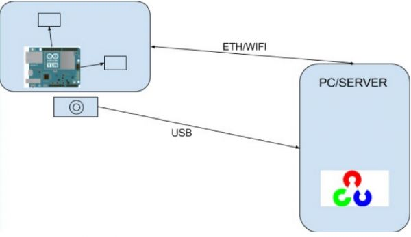

Estructura del proyecto.

# Introducción[[edit](/pti/index.php?title=Categor%C3%ADa:Shoot%E2%80%98emAll&veaction=edit&section=1 "Edit section: Introducción") | [edit source](/pti/index.php?title=Categor%C3%ADa:Shoot%E2%80%98emAll&action=edit&section=1 "Edit section: Introducción")]

## ¿Qué es Shoot'em all?[[edit](/pti/index.php?title=Categor%C3%ADa:Shoot%E2%80%98emAll&veaction=edit&section=2 "Edit section: ¿Qué es Shoot'em all?") | [edit source](/pti/index.php?title=Categor%C3%ADa:Shoot%E2%80%98emAll&action=edit&section=2 "Edit section: ¿Qué es Shoot'em all?")]

La meta que nos propusimos al principio del proyecto era la de diseñar y construir una torreta automática, capaz de seguir e identificar objetos en movimiento, mediante la utilización de un algoritmo de visión por computador, así como poder disparar a estos objetos detectados. Era muy importante que este proceso se llevara a cabo en tiempo real, puesto que si queremos ofrecer una solución, ya sea en el ámbito de la seguridad, o en cualquier otro, es imprescindible reducir la latencia al máximo con el fin de acertar en nuestro objetivo.

# Infraestructura[[edit](/pti/index.php?title=Categor%C3%ADa:Shoot%E2%80%98emAll&veaction=edit&section=3 "Edit section: Infraestructura") | [edit source](/pti/index.php?title=Categor%C3%ADa:Shoot%E2%80%98emAll&action=edit&section=3 "Edit section: Infraestructura")]

El diseño final de nuestra torreta se describiría de la siguiente manera:

1. Torreta: La estructura que sostiene la pistola. Tiene dos servos, alza y deriva, para permitir el seguimiento a objetivos. Esta estará formada esencialmente por dos componentes:  
- Arduino Yún: Encargada de controlar los movimientos de la torreta (mediante los servos de alza y deriva). Está conectada al PC/Server mediante WiFi o Ethernet.  
- Webcam: Acoplada a la torreta, es la encargada de enviar imágenes al PC/Server para que este tome una decisión.  
  
2. PC/Server: Aquí es donde se toman las decisiones que la torreta llevará a cabo. Cuando se detecte un objeto, este enviará la posición del mismo a la Arduino Yún, ya sea mediante Ethernet o Wifi. Está conectado con la cámara mediante USB.