## Contents

* [1 Smart Core](#Smart_Core)
  + [1.1 Autors](#Autors)
* [2 Tecnologies](#Tecnologies)
  + [2.1 Base de dades](#Base_de_dades)
  + [2.2 Servidors](#Servidors)
  + [2.3 Raspberry Pi](#Raspberry_Pi)
  + [2.4 Arduino](#Arduino)
    - [2.4.1 Llum exterior](#Llum_exterior)
    - [2.4.2 Temperatura](#Temperatura)
    - [2.4.3 Alarma](#Alarma)
    - [2.4.4 Llum interior (ultrasons)](#Llum_interior_.28ultrasons.29)
  + [2.5 Seguretat](#Seguretat)
    - [2.5.1 Comunicació Externa](#Comunicaci.C3.B3_Externa)
    - [2.5.2 Comunicació Interna](#Comunicaci.C3.B3_Interna)
  + [2.6 Aplicació Android](#Aplicaci.C3.B3_Android)
  + [2.7 Pàgina Web](#P.C3.A0gina_Web)
* [3 Demostracions](#Demostracions)

## Smart Core[[edit](/pti/index.php?title=Categor%C3%ADa:Smart_Core&veaction=edit&section=1 "Edit section: Smart Core") | [edit source](/pti/index.php?title=Categor%C3%ADa:Smart_Core&action=edit&section=1 "Edit section: Smart Core")]

[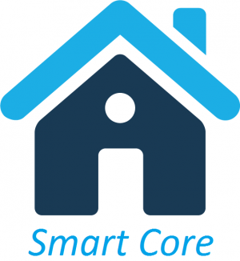](/pti/index.php/File:SmartCore.png)

L’anomenat Internet de les Coses (Internet of Things, IoT) està propiciant la creació de dispositius intel·ligents per part de grans marques comercials, que a més, ofereixen plataformes de gestió per aquests. Però no només les grans empreses estan desenvolupant aparells per a què formin part d’aquesta nova xarxa.

Pràcticament qualsevol dispositiu de casa nostra pot ser transformat a un aparell amb funcions smart, des d’un llum de menjador fins a una rentadora, però no existeix una manera fàcil i senzilla de gestionar-los tots còmodament. D'aquesta idea neix el nostres projecte, Smart Core. Volíem proposar un servei homogeni d’automatització i control per a qualsevol dispositiu intel·ligent de la llar, per així unificar tota la gestió en una sola plataforma i fer que aquest procés sigui eficient i senzill.

Aquesta plataforma dóna a l‘usuari el control de casa seva sigui on sigui, permetent que controli la il·luminació, la temperatura, i qualsevol aparell més que prèviament hagi connectat al servei. Oferim als usuaris una manera de controlar les seves cases per tal de garantir seguretat i tranquil·litat.

Per aconseguir aquest objectiu, partirem d’uns elements no intel·ligents que ens agradaria poder controlar a casa nostra, els convertirem en dispositius smart mitjançant vàries tecnologies de comunicació i plaques de circuit imprès, instal·lant un minicomputador i sensors per aconseguir algunes funcions que pot tenir un dispositiu smart. Tot això s’elaborarà amb dispositius de baix consum, per millorar també el consum energètic i procurar deixar la mínima petjada energètica possible al realitzar-ho.

Després, implementarem les aplicacions Android i Web per poder comunicar-nos amb l’usuari i un servidor capaç de processar les peticions demanades per l’usuari.

Finalment, afegirem mètodes que puguin protegir el nostre sistema dels atacs i de les intrusions, com per exemple utilitzant protocols segurs, i a més, evitar la pèrdua de dades.

### Autors[[edit](/pti/index.php?title=Categor%C3%ADa:Smart_Core&veaction=edit&section=2 "Edit section: Autors") | [edit source](/pti/index.php?title=Categor%C3%ADa:Smart_Core&action=edit&section=2 "Edit section: Autors")]

Els membres que han realitzat el desenvolupament d'aquest projecte són:

- Coordinador del Projecte i Responsable de Raspberry Pi: Sergi Bartolomé Muñoz

- Responsable d’Arduino: Joan Rodas Cusidó

- Responsable d’Android: Riogemm Panopio Magsaysay

- Responsable de Web i Backend: David Molins Gomà

- Responsable Seguretat: Ricard Pastor Navarro

## Tecnologies[[edit](/pti/index.php?title=Categor%C3%ADa:Smart_Core&veaction=edit&section=3 "Edit section: Tecnologies") | [edit source](/pti/index.php?title=Categor%C3%ADa:Smart_Core&action=edit&section=3 "Edit section: Tecnologies")]

### Base de dades[[edit](/pti/index.php?title=Categor%C3%ADa:Smart_Core&veaction=edit&section=4 "Edit section: Base de dades") | [edit source](/pti/index.php?title=Categor%C3%ADa:Smart_Core&action=edit&section=4 "Edit section: Base de dades")]

La persistència de dades s'ha decidit treballar amb SQLite, prenent les precaucions necessàries per a emmagatzemar les nostres dades.

### Servidors[[edit](/pti/index.php?title=Categor%C3%ADa:Smart_Core&veaction=edit&section=5 "Edit section: Servidors") | [edit source](/pti/index.php?title=Categor%C3%ADa:Smart_Core&action=edit&section=5 "Edit section: Servidors")]

La selecció de tecnologies que hem fet servir està basada en el propòsit d’oferir escalabilitat al projecte a l’hora d’afegir més usuaris i més dispositius. Per això hem optat per una arquitectura centralitzada localment, utilitzant una Raspberry Pi com a servidor pel seu baix consum, la seva mida, el seu rendiment i el poc impacte sonor i visual que comporta. També hem fet servir un Web Service, de tipus Restful, ja que és una tecnologia que hem après que permet escalabilitat i portabilitat.

Aquest Web Service s’ha muntat sobre un servidor d’aplicacions Glassfish, aprofitant la seva capacitat de gestió web que ofereix a tots els integrants de pujar projectes remotament ja que aquest lloc web també està allotjat al Glassfish. El fet d’escollir Glassfish és degut a què l’IDE utilitzat per crear el codi i les seves funcions és el Netbeans, que té una millor integració amb Glassfish que amb Tomcat.

### Raspberry Pi[[edit](/pti/index.php?title=Categor%C3%ADa:Smart_Core&veaction=edit&section=6 "Edit section: Raspberry Pi") | [edit source](/pti/index.php?title=Categor%C3%ADa:Smart_Core&action=edit&section=6 "Edit section: Raspberry Pi")]

Per gestionar els aparells de la llar de manera centralitzada, primer necessitem un nexe per tots ells; un dispositiu on es puguin connectar entre ells i comunicar-se amb els servidors, però que també sigui assequible i energèticament eficient.
Per això vam decidir utilitzar una Raspberry Pi B+, ja que les seves prestacions eren suficients pel nostre projecte i té un preu molt adequat pel que ofereix.

La seva funció és mantenir una comunicació constant i bidireccional amb els Arduinos, ja sigui per enviar-hi ordres o per rebre el seu estat actual. Perquè aquests no hagin d’estar al costat de la Raspberry Pi i tinguin certa mobilitat, la comunicació la duem a terme mitjançant Bluetooth, ja que ens permet un radi d’acció de fins a 10 metres i evitem haver de cablejar tota la zona, apart de ser una tecnologia molt estesa i per tant força econòmica (Només necessitarem un receptor Bluetooth USB 4.0 per la Raspberry Pi i un adaptador serial Bluetooth per a cada Arduino, ambdós amb preus molt correctes).

[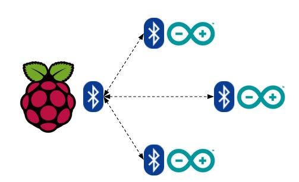](/pti/index.php/File:Raspberry-Bluetooth.jpg)

Per gestionar els Arduinos connectats vam decidir utilitzar scripts de Python, ja que les seves llibreries per tractar amb comunicació serial són molt flexibles i pràctiques, i també teníem curiositat per experimentar amb aquest llenguatge de programació que encara no havíem tingut la oportunitat de conèixer a fons.

L’execució dels scripts la fem via CGI executats des de peticions POST del webservice, així que la Raspberry Pi també compta amb un servidor web Apache2 que ens permet enviar-ne i rebre’n. Després de configurar el router on aquesta està connectada, assignant-li una IP estàtica i obrint els ports web i SSH (Per fer-hi una gestió remota), vam contractar un domini de Dynamic DNS No-IP per comptar amb una direcció actualitzada que apunti sempre a la Raspberry Pi. A l’hora de les demostracions i les reunions on havíem de provar la comunicació entre Arduinos i Raspberry Pi, situacions on aquesta última no disposava d’una IP pública perquè estava connectada a la xarxa de la Universitat, hem usat un servei que crea un túnel entre un host i una direcció pública, permetent així l’accés a la Raspberry Pi mitjançant una URL temporal, anomenat Ngrok.

També ens va sorgir la idea d’enviar un correu electrònic quan passés cert esdeveniment, com en el cas de la detecció d’extranys quan l’alarma està activada. Per això vam instal·lar també un servidor de correu, SSMTP, per poder enviar correus de manera fàcil i directa des dels propis scripts Python.

Vistes totes aquestes necessitats el sistema operatiu que vam instal·lar a la Raspberry Pi va ser Raspbian, una distribució d’escriptori derivada de Debian i adaptada al seu hardware, ja que així la gestió de diferents servidors i la interacció entre diferents dispositius Bluetooth seria més còmode, apart de l’avantatge de conèixer amb anterioritat i de manera avançada el funcionament d’una distribució basada en Debian a altres assignatures cursades a l’especialitat.

### Arduino[[edit](/pti/index.php?title=Categor%C3%ADa:Smart_Core&veaction=edit&section=7 "Edit section: Arduino") | [edit source](/pti/index.php?title=Categor%C3%ADa:Smart_Core&action=edit&section=7 "Edit section: Arduino")]

Els Arduino tenen bàsicament dues funcions. Per una banda, s’encarreguen d’obtenir dades de diferents sensors (temperatura, llum, moviment, etc.) i de comunicar-les a la Raspberry. L’altra funció seria la de controlar els dispositius de la llar, ja sigui per ells mateixos o a través d’ordres rebudes desde la Raspberry.

#### Llum exterior[[edit](/pti/index.php?title=Categor%C3%ADa:Smart_Core&veaction=edit&section=8 "Edit section: Llum exterior") | [edit source](/pti/index.php?title=Categor%C3%ADa:Smart_Core&action=edit&section=8 "Edit section: Llum exterior")]

Llum amb LDR

Un dels dispositius que vam muntar simula un llum exterior (p.e. en una terrassa). Per fer-lo hem utilitzat un LED, un parell de resistències i un LDR (per detectar la lluminositat).

A part de poder obrir i tancar el llum via webservice/Raspberry, també podem posar el dispositiu en mode automàtic. Quan l’Arduino es troba en aquest mode, obrirà i tancarà el llum automàticament segons la lluminositat de l’ambient. Això es fa agafant el valor que ens dona el LDR, ja que aquest dispositiu varia la seva resistència segons la llum que rep.

#### Temperatura[[edit](/pti/index.php?title=Categor%C3%ADa:Smart_Core&veaction=edit&section=9 "Edit section: Temperatura") | [edit source](/pti/index.php?title=Categor%C3%ADa:Smart_Core&action=edit&section=9 "Edit section: Temperatura")]

[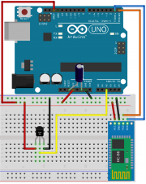](/pti/index.php/File:TMP.png)

Sensor de temperatura

Per obtenir la temperatura hem comprat un sensor TMP36, que té un rang operatiu de -40ºC a 125ºC i un error de +-2ºC.

Donem la temperatura mitjançant un serial Bluetooth connectat als ports 0 (RX) i 1 (TX). Connectant-lo directament a aquests ports, no fa falta utilitzar cap llibreria externa i podem enviar missatges a través de Serial.write() o Serial.print().

Tots els dispositius haurien de funcionar a través de Bluetooth, pero no disposem de més serials. De tota manera, el codi de l’Arduino no es veu modificat si utilitzem Bluetooth o ens connectem directament via USB.

#### Alarma[[edit](/pti/index.php?title=Categor%C3%ADa:Smart_Core&veaction=edit&section=10 "Edit section: Alarma") | [edit source](/pti/index.php?title=Categor%C3%ADa:Smart_Core&action=edit&section=10 "Edit section: Alarma")]

[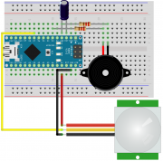](/pti/index.php/File:Alarm.png)

Alarma amb PIR

Per fer l’alarma hem utilitzat un detector de moviment (PIR) i un brunzidor piezoelèctric, que emetrà un so en cas que l'alarma estigui activada i es detecti qualsevol moviment en la zona.

Aquesta alarma es pot trobar en tres possibles estats: desactivada, activada amb so i activada en mode silenciós.

Si l'alarma està activada, el dispositiu utilitzarà el PIR per detectar moviments i avisarà a la Raspberry en cas de detectar alguna cosa. Un cop avisa a la Raspbery, aquesta s'encarregarà de cridar al webservice i avisar a l'usuari mitjançant un correu electrònic. Si el so està activat, sonarà el buzzer, pero si no volem que el lladre s'adoni que ha estat detectat, amb l'opció d'alarma silenciosa el dispositiu realitzarà les mateixes tasques pero sense emetre cap so.

#### Llum interior (ultrasons)[[edit](/pti/index.php?title=Categor%C3%ADa:Smart_Core&veaction=edit&section=11 "Edit section: Llum interior (ultrasons)") | [edit source](/pti/index.php?title=Categor%C3%ADa:Smart_Core&action=edit&section=11 "Edit section: Llum interior (ultrasons)")]

[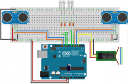](/pti/index.php/File:Llum-interior.png)

Llum amb ultrasons

Per mostrar un comportament una mica més intel·ligent dels dispositius, hem utilitzat un Arduino per controlar un llum de manera automàtica gràcies a 2 sensors d’ultrasons.

També hem posat un relé, que ens permet endollar qualsevol dispositiu a la corrent (230V). Per fer les proves hem utilitzat una làmpada i un LED.

Igual que amb la llum exterior, el dispositiu pot estar en “on”, “off” i mode automàtic. Amb aquest últim mode, fem servir dos sensors d’ultrasons per saber si una persona entra o surt d’una habitació i obrir els llums només quan hi ha algú dins. Hem afegit un comptador binari format per 4 leds per poder visualitzar fàcilment el nombre de persones que indica l’Arduino.

**Nota:** En tots els esquemes utilitzem un condensador de 10µF, connectat entre GND (negatiu) i RESET per evitar que la placa es reiniciï quan establim una comunicació.

### Seguretat[[edit](/pti/index.php?title=Categor%C3%ADa:Smart_Core&veaction=edit&section=12 "Edit section: Seguretat") | [edit source](/pti/index.php?title=Categor%C3%ADa:Smart_Core&action=edit&section=12 "Edit section: Seguretat")]

#### Comunicació Externa[[edit](/pti/index.php?title=Categor%C3%ADa:Smart_Core&veaction=edit&section=13 "Edit section: Comunicació Externa") | [edit source](/pti/index.php?title=Categor%C3%ADa:Smart_Core&action=edit&section=13 "Edit section: Comunicació Externa")]

[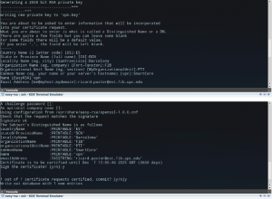](/pti/index.php/File:OpenVPN.png)

Exemple OpenVPN

Per la comunicació entre la raspberry pi i el servidor principal utilitzem OpenVPN, una eina per crear VPN fàcilment, ja que ofereix major seguretat que HTTPS i no volem que algú pugui interactuar amb el nostre sistema sense permís.

#### Comunicació Interna[[edit](/pti/index.php?title=Categor%C3%ADa:Smart_Core&veaction=edit&section=14 "Edit section: Comunicació Interna") | [edit source](/pti/index.php?title=Categor%C3%ADa:Smart_Core&action=edit&section=14 "Edit section: Comunicació Interna")]

Per la comunicació interna la primera idea va ser utilitzar Kerberos un protocol del MIT per fer la identificació dels dispositius, però Bluetooth utilitza adreces MAC i a Kerberos es necessiten adreces IP, per tant vam acabar fent servir un altre mètode, quan la Raspberry Pi es vol comunicar amb cada un dels arduinos, primer genera un número de 256 bits aleatoris i envia aquest sense encriptar al arduino, el arduino agafa aquest número i li fa el hash (SHA256), vam trobar problemes en enviar aquest hash, ja que el seu tipus era uint8\_t, al final vam descobrir que havíem de fer un a descodificació a hexadecimal. Després generem una clau per cada parella raspberry pie/arduino, i la introduïm en els dos dispositius. Es fa una Xor entre la clau i el número generat i llavors la raspberry pi encripta les ordres que enviem amb un AES-256 CBC, que l’arduino desencripta i executa l’ordre. La nostra idea és que l’arduino no hagi de codificar res.

### Aplicació Android[[edit](/pti/index.php?title=Categor%C3%ADa:Smart_Core&veaction=edit&section=15 "Edit section: Aplicació Android") | [edit source](/pti/index.php?title=Categor%C3%ADa:Smart_Core&action=edit&section=15 "Edit section: Aplicació Android")]

Per desenvolupar aquesta aplicació Android, s’han utilitzat els coneixements apresos de les altres assignatures de la carrera. Primer, s’han analitzat els requisits i casos d’ús i s’ha creat l’esquema i el disseny de l’aplicació. S’ha instal·lat l’IDE per desenvolupar-la; s’ha optat per l’Android Studio entre les tecnologies existents, ja que, incorpora eines per simular l’aplicació en un dispositiu virtual per poder provar-la a qualsevol lloc, permetent un treball més còmode i portable.

S’han desenvolupat 4 vistes per portar a terme les funcionalitats analitzades:

[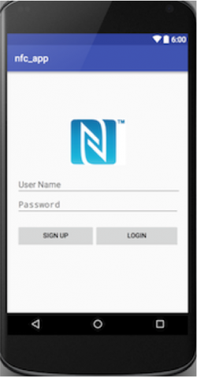](/pti/index.php/File:Login.png)[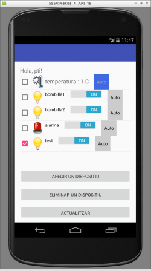](/pti/index.php/File:Home.png)[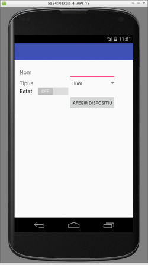](/pti/index.php/File:Add.png)

### Pàgina Web[[edit](/pti/index.php?title=Categor%C3%ADa:Smart_Core&veaction=edit&section=16 "Edit section: Pàgina Web") | [edit source](/pti/index.php?title=Categor%C3%ADa:Smart_Core&action=edit&section=16 "Edit section: Pàgina Web")]

Per la web s'ha emprat les tecnologies Html per mostrar les vistes, CSS per donar-li un aspecte agradable, Java Servlets per administrar les dades dels formularis i Java Sessions per afegir seguretat. Òbviament, les dades sensibles s’envien per peticions POST al Web Service.

En aquesta imatge podem veure que el lloc web disposa d’un Login on cada usuari de la plataforma es pot autenticar per a poder accedir a la part d’administració i gestió de dispositius.

[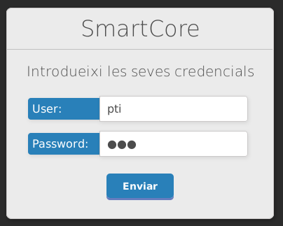](/pti/index.php/File:SmarcoreWebLogin.png)

En aquesta altra imatge, es mostra l’administració de dispositius que podria fer un usuari. Podem veure que li oferim la possiblitat de canviar l’estat de certs dispositius i en un futur, oferir també la possibilitat d’enviar alertes/alarmes quan certs dispositius entren en estat crític com podrien ser les alarmes. Aquest estat es registraria i es mostraria en un mail que l’usuari rebrà i l’informarà.

[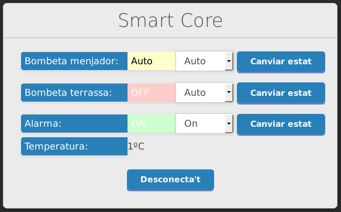](/pti/index.php/File:SmartCoreWebMenu.png)

## Demostracions[[edit](/pti/index.php?title=Categor%C3%ADa:Smart_Core&veaction=edit&section=17 "Edit section: Demostracions") | [edit source](/pti/index.php?title=Categor%C3%ADa:Smart_Core&action=edit&section=17 "Edit section: Demostracions")]

A continuació, es mostren videos que ensenyen el funcionament del projecte:
[File:Demo1.mov](/pti/index.php?title=Special:Upload&wpDestFile=Demo1.mov "File:Demo1.mov")