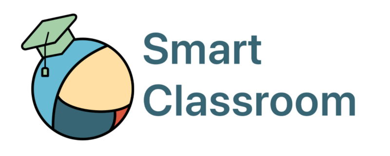
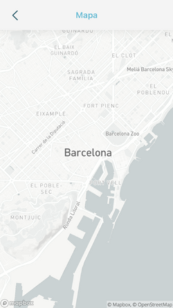
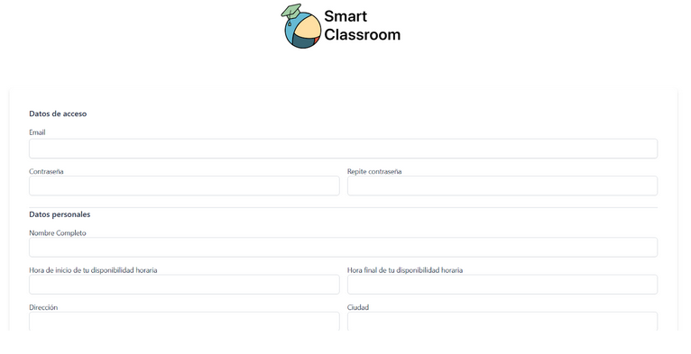
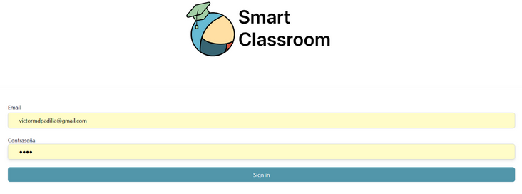
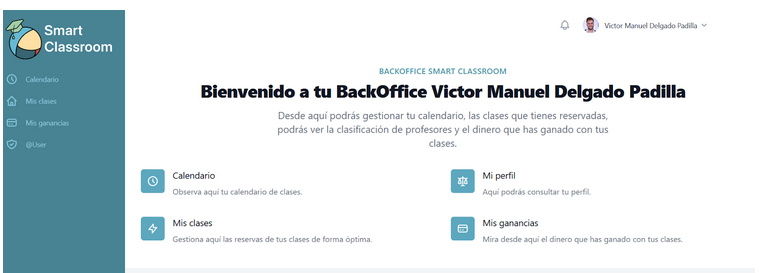
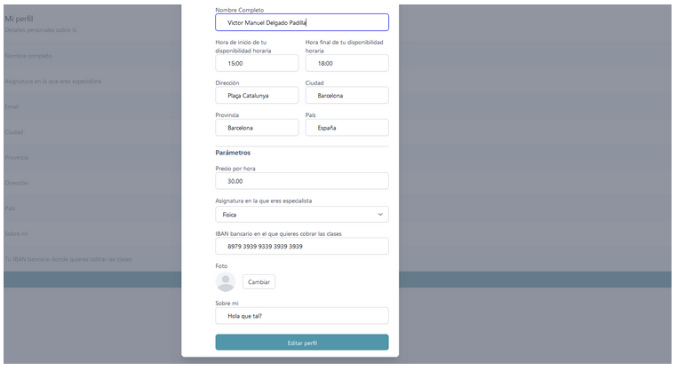
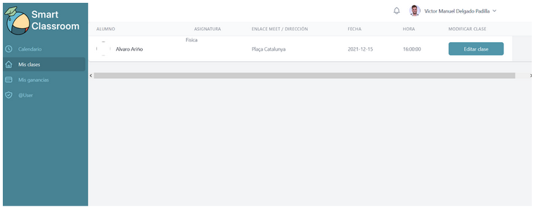
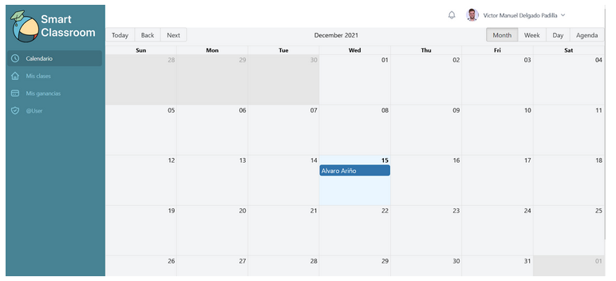
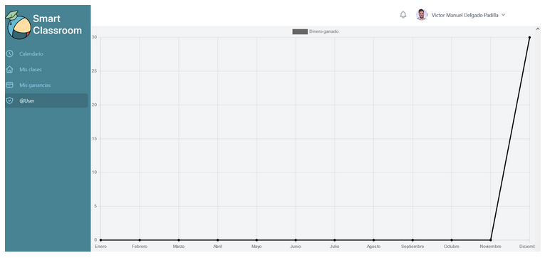
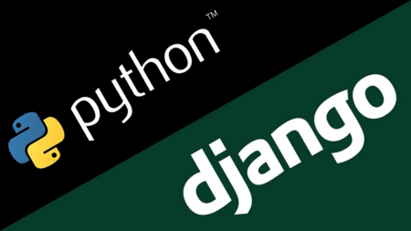

SmartClassroom

## Contents

* [1 Introducción: ¿por qué hemos decidido hacer este proyecto?](#Introducci.C3.B3n:_.C2.BFpor_qu.C3.A9_hemos_decidido_hacer_este_proyecto.3F)
* [2 Infraestructura](#Infraestructura)
* [3 Aplicación móvil](#Aplicaci.C3.B3n_m.C3.B3vil)
  + [3.1 Características](#Caracter.C3.ADsticas)
  + [3.2 Diseño de la app](#Dise.C3.B1o_de_la_app)
    - [3.2.1 Explora](#Explora)
    - [3.2.2 Búsqueda](#B.C3.BAsqueda)
    - [3.2.3 Profesor](#Profesor)
    - [3.2.4 Perfil](#Perfil)
* [4 BackOffice](#BackOffice)
* [5 Backend](#Backend)
  + [5.1 Características](#Caracter.C3.ADsticas_2)
  + [5.2 Django](#Django)
* [6 Demo](#Demo)
* [7 Conclusiones](#Conclusiones)

## Introducción: ¿por qué hemos decidido hacer este proyecto?[[edit](/pti/index.php?title=Categor%C3%ADa:SmartClassroom&veaction=edit&section=1 "Edit section: Introducción: ¿por qué hemos decidido hacer este proyecto?") | [edit source](/pti/index.php?title=Categor%C3%ADa:SmartClassroom&action=edit&section=1 "Edit section: Introducción: ¿por qué hemos decidido hacer este proyecto?")]

Antes de entrar en los aspectos técnicos de nuestro proyecto, queremos explicaros por qué hemos decidido hacer un proyecto de estas características.
Debido a que somos estudiantes, a menudo hemos tenido que dar clases particulares para sacar algún dinero para nuestros gastos. El problema es que muchas veces, el tener que desplazarse para dar clase a un alumno que vive lejos supone un esfuerzo innecesario teniendo en cuenta que podrían existir alumnos más cercanos. Entonces, ¿cómo conectar la necesidad de los profesores para dar clase con la necesidad de los alumnos de recibirlas pero estando ambos cerca? La respuesta la tenéis en este proyecto: SmartClassroom.
Nuestro principal objetivo con este trabajo es disponer de una aplicación móvil para que estudiantes de todo el mundo puedan encontrar profesores a su disposición y muy cerca suyo. Damos la posibilidad de que las clases se puedan realizar online o presencial.
A continuación os presentamos cómo está compuesto técnicamente nuestro proyecto, esperamos que os guste.

Nuestro objetivo principal es que los estudiantes puedan encontrar profesores particulares cerca suyo.

# Infraestructura[[edit](/pti/index.php?title=Categor%C3%ADa:SmartClassroom&veaction=edit&section=2 "Edit section: Infraestructura") | [edit source](/pti/index.php?title=Categor%C3%ADa:SmartClassroom&action=edit&section=2 "Edit section: Infraestructura")]

Nuestra infraestructura se basa en un frontend gestionado por una app para móviles y una página web. Para toda la gestión de datos hacemos uso de un backend junto a una serie de servicios complementarios.

A continuación se puede ver la conexión que tiene cada una de las partes:

Diagrama de las conexiones de la infraestructura

* **Aplicación móvil**: parte del frontend. Está hecha con Flutter y el lenguaje de programación Dart, es la que permite a los alumnos reservar clases y hacer todo el proceso de pago.
* **Backoffice**: parte del frontend. Está hecho con React y se aloja en el servicio de alojamiento web, Netlify. Su principal función es permitir a los profesores gestionar sus clases y reservas, así como obtener información de sus ingresos.
* **Backend**: diseñado en Django. Se encarga de toda la gestión de datos y peticiones del frontend. Toda la información se almacena en una base de datos hecha en PostgreSQL.
* **Stripe**: toda la gestión de pagos queda apoyada en esta plataforma. La app y el backend hacen uso de ella para realizarlos.
* **AWS S3**: Es un servicio de almacenamiento de imágenes y documentos gestionado por Amazon.

# Aplicación móvil[[edit](/pti/index.php?title=Categor%C3%ADa:SmartClassroom&veaction=edit&section=3 "Edit section: Aplicación móvil") | [edit source](/pti/index.php?title=Categor%C3%ADa:SmartClassroom&action=edit&section=3 "Edit section: Aplicación móvil")]

## Características[[edit](/pti/index.php?title=Categor%C3%ADa:SmartClassroom&veaction=edit&section=4 "Edit section: Características") | [edit source](/pti/index.php?title=Categor%C3%ADa:SmartClassroom&action=edit&section=4 "Edit section: Características")]

Logo de Flutter

La app está diseñada en Flutter, esto nos permite tener un misma base de código escrita en Dart y que genera la versión para iOS y Android.
Entre las principales funcionalidades de la misma se encuentran:

* Capacidad de reserva de clases
* Búsqueda de profesores por: Ubicación y Assignatura
* Procesamiento de la reserva y el pago

## Diseño de la app[[edit](/pti/index.php?title=Categor%C3%ADa:SmartClassroom&veaction=edit&section=5 "Edit section: Diseño de la app") | [edit source](/pti/index.php?title=Categor%C3%ADa:SmartClassroom&action=edit&section=5 "Edit section: Diseño de la app")]

### Explora[[edit](/pti/index.php?title=Categor%C3%ADa:SmartClassroom&veaction=edit&section=6 "Edit section: Explora") | [edit source](/pti/index.php?title=Categor%C3%ADa:SmartClassroom&action=edit&section=6 "Edit section: Explora")]

* Vista rápida de las diferentes asignaturas, temas de la app, ordenadas según los intereses del usuario en el proceso de onboarding.
* Esta se encuentra personalizada con el nombre de la persona

* Listado de los profesores de la asignatura cercanos al usuario y ordenados por distancia
* La ubicación se usa a partir de la ubicación expresada por el profesor
* Mapa para una mejor visibilidad

|  |  |
| --- | --- |
|  Pantalla de exploración de asignaturas |  Pantalla del listado de profesores de cada asignatura |

### Búsqueda[[edit](/pti/index.php?title=Categor%C3%ADa:SmartClassroom&veaction=edit&section=7 "Edit section: Búsqueda") | [edit source](/pti/index.php?title=Categor%C3%ADa:SmartClassroom&action=edit&section=7 "Edit section: Búsqueda")]

* Buscar profesores en otros lugares
* Capacidad de filtraje según asignatura
* Mapa para navegar a través de toda nuestra base de datos de una forma visual, y encontrar al profesor que más nos interesa en otras zonas

|  |  |
| --- | --- |
|  Pantalla de búsqueda |  Pantalla de mapa completo de la aplicación |

### Profesor[[edit](/pti/index.php?title=Categor%C3%ADa:SmartClassroom&veaction=edit&section=8 "Edit section: Profesor") | [edit source](/pti/index.php?title=Categor%C3%ADa:SmartClassroom&action=edit&section=8 "Edit section: Profesor")]

* Acceso a diferentes datos que el profesor ha hecho públicos.
* Información de las puntuaciones dadas por otros alumnos
* Pequeña descripción sobre él o ella
* Acceso a su calendario de clases
* Inicio del proceso de reserva

|  |  |  |  |
| --- | --- | --- | --- |
|  Pantalla de detalles del profesor |  Selección de los días que el profesor se encuentra disponible |  Pantalla de resumen de la reserva |  Pantalla de confirmación de la reserva |

### Perfil[[edit](/pti/index.php?title=Categor%C3%ADa:SmartClassroom&veaction=edit&section=9 "Edit section: Perfil") | [edit source](/pti/index.php?title=Categor%C3%ADa:SmartClassroom&action=edit&section=9 "Edit section: Perfil")]

* Modificar nuestros datos
* Editar preferencias de asignaturas
* Administrar los métodos de pago
* Información sobre la app
* Configuración de la app

|  |
| --- |
|  Pantalla del perfil del alumno |

# BackOffice[[edit](/pti/index.php?title=Categor%C3%ADa:SmartClassroom&veaction=edit&section=10 "Edit section: BackOffice") | [edit source](/pti/index.php?title=Categor%C3%ADa:SmartClassroom&action=edit&section=10 "Edit section: BackOffice")]

La URL de la web es: <https://smartclasroom.netlify.app/>
La web del BackOffice del profesor tiene como objetivo que el profesor pueda administrar sus clases. Desde la web se va a poder modificar y cancelar las clases. Además, el profesor podrá consultar su calendario, las clases que tiene y lo que ha ganado en ese mes y los anteriores.
La tecnología utilizada en la web es React, un framework de Javascript desarrollado por Facebook el 2013 y que permite de una forma sencilla el desarrollo de cualquier aplicación web. Hoy en día es utilizado por muchas empresas para desarrollar sus webs. Dado a que es uno de las herramientas de desarrollo más utilizadas en el front-end, decidimos que era un elemento esencial para introducir en nuestro proyecto.
Además, la web está alojada en Netify, un servicio gratuito que permite tener conectado un repositorio git y cada vez que se hace un cambio en el código, automáticamente la web se actualiza. Creemos que este es uno de los elementos más útiles de los cuales hemos aprendido haciendo este proyecto.

A continuación os mostraremos pantallazos de cada uno de los elementos que contiene la web:

**Landing page**

Desde la landing page el profesor va a tener dos opciones: registrarse o loguearse.

**Formulario de registro**

En el formulario de registro el profesor tendrá que introducir su correo electrónico, una contraseña, el nombre, qué horario tiene disponible, su dirección, el precio que desean cobrar por hora, la asignatura en la que es especialista y el IBAN bancario para cobrar el dinero de las clases.

**Login**

Desde esta página el usuario podrá iniciar sesión.

**Dashboard**

Nada más entrar, el usuario podrá ver claramente su nombre.

**Mi perfil**

En el perfil se podrá observar la información del usuario.

**Editar perfil**

Desde aquí el profesor puede modificar sus datos, la foto de perfil incluída.

**Mis clases**

En el apartado de mis clases el profesor podrá mirar las clases que tiene reservadas así como modificarlas o cancelarlas.

**Calendario**

En el calendario el profesor puede ver sus clases en los días correspondientes.

**Mis ganancias**

En el apartado mis ganancias el profesor puede ver cuánto dinero ha ganado respecto a los meses anteriores.

# Backend[[edit](/pti/index.php?title=Categor%C3%ADa:SmartClassroom&veaction=edit&section=11 "Edit section: Backend") | [edit source](/pti/index.php?title=Categor%C3%ADa:SmartClassroom&action=edit&section=11 "Edit section: Backend")]

## Características[[edit](/pti/index.php?title=Categor%C3%ADa:SmartClassroom&veaction=edit&section=12 "Edit section: Características") | [edit source](/pti/index.php?title=Categor%C3%ADa:SmartClassroom&action=edit&section=12 "Edit section: Características")]

El backend de este proyecto se encarga de toda la lógica y gestión de datos procedente del frontend. (tanto del backoffice como de la aplicación móvil) Para realizar esta tarea se han usado distintas tecnologías de las cuales destacan:

* **Django:** Framework web de alto nivel escrito en Python. En los siguientes apartados se encuentra más información sobre esta tecnología porque es la base de todo el backend.

Django

* **Amazon S3:** Servicio ofrecido por Amazon Web Services que permite almacenar distintos objetos. En nuestra aplicación se usa para almacenar las fotografías del perfil de los estudiantes y profesores.
* **Stripe:** Stripe es una compañía que ha desarrollado un software que permite realizar pagos por internet. Ha sido muy útil en nuestro proyecto ya que disponen de mucha documentación que ha facilitado la integración tanto en el frontend como en el backed. Además, disponen de una opción de test para poder realizar distintos pagos de prueba.
* **API Google Maps:** API usada para convertir las direcciones de los profesores (C/Barcelona, 278, Sant Vicenç dels Horts, 08620, España) en coordenadas geográficas (Latitud 47.83245, Longitud -102.84766) que pueden ser usadas para marcar distintas ubicaciones en el mapa de la app móvil.
* **Heroku:** Heroku es una plataforma como servicio de computación en la nube que facilita el deploy de las aplicaciones. Como desarrollador es muy útil porque te puedes centrar en realizar la aplicación y olvidarte de toda la infraestructura que hay detrás. Esta plataforma ha sido muy útil en nuestro proyecto ya que se puede sincronizar con un repositorio de git y cada vez que se hace push se actualiza la aplicación con las últimas modificaciones. Simplemente al repositorio hay que añadir dos ficheros que indiquen la versión de Python y los diferentes paquetes que se deben instalar.
* **PostgreSQL:** PostgreSQL es un sistema de código abierto de administración de bases de datos del tipo relacional. Se ha usado esta base de datos en concreto por la fácil integración que ofrece Heroku.

## Django[[edit](/pti/index.php?title=Categor%C3%ADa:SmartClassroom&veaction=edit&section=13 "Edit section: Django") | [edit source](/pti/index.php?title=Categor%C3%ADa:SmartClassroom&action=edit&section=13 "Edit section: Django")]

El peso fuerte del backend se ha realizado con Django. Como se ha comentado antes se trata de un framework de desarrollo web de código abierto escrito en Python que respeta el patrón de diseño conocido como modelo-vista-controlador. Las características principales de este framework son las siguientes:

* **Versátil:** Usado para realizar múltiples aplicaciones.
* **Seguro:** Framework revisado constantemente para evitar errores comunes.
* **Mantenible:** Código de Django escrito usando principios y patrones de diseño para realizar un código que sea fácil de mantener.
* **Portable:** Django está escrito en Python, el cual se soporta en muchas plataformas.

El funcionamiento de Django se puede resumir bastante bien con la siguiente imagen.

Funcionamiento de Django

En primer lugar, se recibe una petición HTTP que dependiendo de la URL se redirige a una vista concreta. Esto se realiza en el fichero URLS. Las vistas se encargan de gestionar las peticiones HTTP mediante los modelos y de devolver una respuesta. En nuestro caso se trata de un JSON y se realiza en el fichero de Views. Por último, los modelos se tratan de objetos de Python que definen la estructura de datos de la aplicación y permiten gestionar y consultar registros de la base de datos.

# Demo[[edit](/pti/index.php?title=Categor%C3%ADa:SmartClassroom&veaction=edit&section=14 "Edit section: Demo") | [edit source](/pti/index.php?title=Categor%C3%ADa:SmartClassroom&action=edit&section=14 "Edit section: Demo")]

La demo se encuentra disponible en el siguiente enlace: <https://www.youtube.com/watch?v=fRyiYwoVgVE>

# Conclusiones[[edit](/pti/index.php?title=Categor%C3%ADa:SmartClassroom&veaction=edit&section=15 "Edit section: Conclusiones") | [edit source](/pti/index.php?title=Categor%C3%ADa:SmartClassroom&action=edit&section=15 "Edit section: Conclusiones")]

Nuestro proyecto es una herramienta útil que combina diferentes tecnologías para conseguir un propósito: facilitar la vida de estudiantes y de profesores conectándolos en relación a su cercanía. Esperemos que os haya gustado.