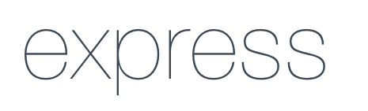
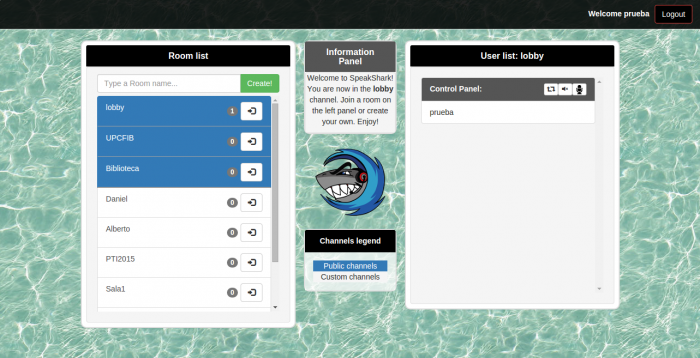
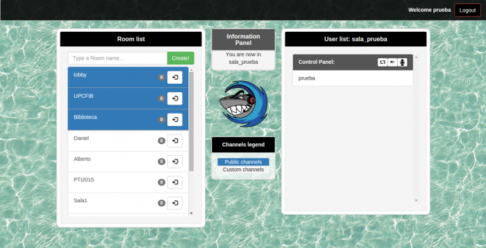

## Contents

* [1 Proyecto SpeakShark](#Proyecto_SpeakShark)
  + [1.1 Objetivos del proyecto](#Objetivos_del_proyecto)
  + [1.2 Características](#Caracter.C3.ADsticas)
  + [1.3 Tecnologías](#Tecnolog.C3.ADas)
  + [1.4 How to Use](#How_to_Use)

# Proyecto SpeakShark[[edit](/pti/index.php?title=Categor%C3%ADa:SpeakShark&veaction=edit&section=1 "Edit section: Proyecto SpeakShark") | [edit source](/pti/index.php?title=Categor%C3%ADa:SpeakShark&action=edit&section=1 "Edit section: Proyecto SpeakShark")]

**SpeakShark es una aplicación web**  que tiene como objetivo comunicar diferentes usuarios por VoIP de forma fácil sin necesidad de

tener conocimientos de un programa específico, ni de realizar una descarga.

SpeakShark propone una solución sencilla para establecer comunicaciones entre usuarios (personas) mediante un navegador web, ya sea

desde un ordenador con micrófono y webcam, un ordenador portátil, una tablet o un smartphone.

## Objetivos del proyecto[[edit](/pti/index.php?title=Categor%C3%ADa:SpeakShark&veaction=edit&section=2 "Edit section: Objetivos del proyecto") | [edit source](/pti/index.php?title=Categor%C3%ADa:SpeakShark&action=edit&section=2 "Edit section: Objetivos del proyecto")]

Tomando como referencia aplicaciones del estilo a Skype o TeamSpeak, nuestro objetivo es crear una aplicación web multiplataforma,

accesible desde cualquier dispositivo y sin necesidad de instalación de software, que sea capaz de establecer una comunicación mediante

VoIP entre varios clientes a la vez a través de Peer-to-Peer y si es posible de una forma más rápida y sencilla que las actuales. Todo

ello unido a un presupuesto y unos recursos limitados, utilizamos una Raspberry Pi B+ conectada a Internet a través de una conexión de

fibra óptica propiedad de uno de los miembros del grupo y al uso de tecnologías basadas en software libre.

Adicionalmente también estaba en nuestros planes ser sostenibles con el medio ambiente y para cumplir con un mínimo de sostenibilidad

decidimos escoger como servidor, el hardware que lleva la Raspberry Pi B+, ya que permite proporcionar el servicio esperado consumiendo

el mínimo de energía posible.

## Características[[edit](/pti/index.php?title=Categor%C3%ADa:SpeakShark&veaction=edit&section=3 "Edit section: Características") | [edit source](/pti/index.php?title=Categor%C3%ADa:SpeakShark&action=edit&section=3 "Edit section: Características")]

* Creación de salas y listado de usuarios en las mismas.

* Creación de salas privadas protegidas con contraseña en un futuro.

* Compresión de audio con el codec OPUS de código abierto (<http://www.opus-codec.org/>).

* Total ausencia de aplicación en el cliente, con el navegador Chrome basta, hay que destacar que dicha característica hace posible la comunicación mediante cualquier dispositivo que tenga instalado este navegador.

* Protocolo WebRTC para streaming de audio, con posibilidad de video y datos en un futuro.

* Implementación de un chat de texto en un futuro.

* Posibilidad de compartir un enlace directo a una sala creada sin necesidad de registro previo.

* Notificaciones por texto.

## Tecnologías[[edit](/pti/index.php?title=Categor%C3%ADa:SpeakShark&veaction=edit&section=4 "Edit section: Tecnologías") | [edit source](/pti/index.php?title=Categor%C3%ADa:SpeakShark&action=edit&section=4 "Edit section: Tecnologías")]

* Servicio Web: NodeJS

  
* Framework: Express

  
* Web dinámica: AJAX

  
* Base de datos: MySQL Server

  

## How to Use[[edit](/pti/index.php?title=Categor%C3%ADa:SpeakShark&veaction=edit&section=5 "Edit section: How to Use") | [edit source](/pti/index.php?title=Categor%C3%ADa:SpeakShark&action=edit&section=5 "Edit section: How to Use")]

En este apartado haremos una pequeña guía de uso (How to use) de nuestra aplicación web. A modo de ejemplo recorreremos toda la página

viendo y explicando cada funcionalidad a través de capturas de imagen reales.

Si nos dirigimos a speakshark.ddns.net entraremos en la pantalla de login donde podemos ver dos formularios el primero para poder loguearse y el segundo para registrarse.

En la pantalla de registro podremos registrarnos si aun no lo hemos hecho, solo hará falta un nombre de usuario y contraseña.

Si no hay error podremos entrar con nuestro usuario y contraseña.

En la pantalla principal podemos hacer el resto de cosas. Unirnos a salas, crear salas, ver quién hay en las salas, compartir salas.

Para crear una sala es tan fácil como escribir un nombre de sala en el recuadro de texto y hacer click al botón Create!

Una vez creada si queremos entrar en esa sala o en cualquier otra solo hay que hacer click en el símbolo correspondiente de “entrar” ubicada en la sala deseada. También podemos además silenciar nuestro micro o silenciar nuestro altavoz para no escuchar al resto de participantes con los botones diseñados para tal fin en la parte superior derecha de la pantalla.

Estando en una sala tenemos la oportunidad de compartir nuestra sala para invitar a que entren sin necesidad de registro previo. Solo hay que entrar en la sala que deseemos compartir y hacer click en el botón correspondiente de compartir link en la parte superior derecha de la pantalla.

Esta pantalla sería el ejemplo de entrar con el link de la figura 8. podemos observar que entramos con un usuario especial llamado guest (invitado). Los invitados no pueden crear salas.