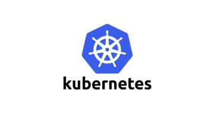
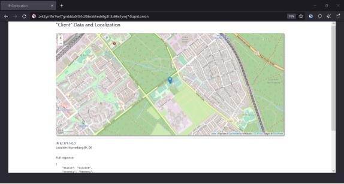
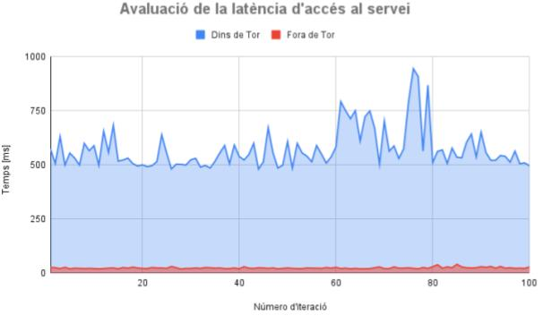

## Contents

* [1 Introducció](#Introducci.C3.B3)
* [2 Tor](#Tor)
* [3 Kubernetes](#Kubernetes)
* [4 Integració](#Integraci.C3.B3)
* [5 Web Service](#Web_Service)
* [6 Avaluació de Rendiment](#Avaluaci.C3.B3_de_Rendiment)
* [7 Conclusions](#Conclusions)

# Introducció[[edit](/pti/index.php?title=Categor%C3%ADa:SpyWaiter&veaction=edit&section=1 "Edit section: Introducció") | [edit source](/pti/index.php?title=Categor%C3%ADa:SpyWaiter&action=edit&section=1 "Edit section: Introducció")]

No és estrany llegir notícies de censura a Internet. El control que es du a terme sobre la xarxa no para de créixer. I sembla que el futur continuarà amb aquesta tendència. Una de les eines més populars que s’utilitza per saltar-se aquest control és Tor.

Per una altra banda, el món dels serveis web s’ha revolucionat en els últims anys. Degut a l’augment de tràfic de la xarxa, s’ha creat la necessitat de dissenyar la web de manera escalable. D’aquesta manera, ha aparegut el concepte de containerització i de microservei. L’eina utilitzada per gestionar-ho és Kubernetes (K8s), i ha obtingut moltíssima popularitat.

Aquest treball consisteix a dissenyar una infraestructura Kubernetes escalable i integrar-la dins de la xarxa Tor.

# Tor[[edit](/pti/index.php?title=Categor%C3%ADa:SpyWaiter&veaction=edit&section=2 "Edit section: Tor") | [edit source](/pti/index.php?title=Categor%C3%ADa:SpyWaiter&action=edit&section=2 "Edit section: Tor")]

Pel que fa a Tor, hem instal·lat el servei en la màquina de la FIB. Hi hem configurat la connexió ssh i un hidden service per tal de poder accedir als dos serveis a través de la xarxa de Tor fent servir adreces *onion*.

Crear un hidden service ens dona l’adreça .onion mitjançant la qual podrem accedir a un determinat servei. Per tal d’indicar al servei de Tor que volem un hidden service cal que modifiquem el fitxer de configuració de Tor que es troba a: /etc/tor/torrc. Aquest fitxer, que és el de configuració de Tor i és on podem reencaminar les diferents peticions que rebem a l'adreça onion a diferents serveis que tinguem dins la màquina. Ens caldrà modificar aquest fitxer, també, per la integració amb Kubernetes.

En el treball també expliquem com s'estableix la connexió, com el hidden service passa a ser accessible des de qualsevol client de Tor i com es manté l'anonimat de totes les parts.

Logo de Tor

# Kubernetes[[edit](/pti/index.php?title=Categor%C3%ADa:SpyWaiter&veaction=edit&section=3 "Edit section: Kubernetes") | [edit source](/pti/index.php?title=Categor%C3%ADa:SpyWaiter&action=edit&section=3 "Edit section: Kubernetes")]

Cal instal·lar Kubernetes juntament amb Kubeadm, per inicialitzar el cluster de nodes, Kubelet, per inicialitzar els pods i els containers, i Kubectl, per poder controlar el cluster per linea de comandes. També hem d'instal·lar un add-on de xarxa per a que els diferents nodes es puguin connectar amb el Control-plane. Hi ha un munt d’add-on’s diferents pero nosaltres utilitzarem flannel.

Els pods que hi ha per defecte en el nostre clúster són els següents:

* **kube-apiserver**: Es un pod que serveix per a que puguis gestionar el cluster utilitzant crides desde l’exterior.
* **etcd**: Es un pod que serveix per emmagatzemar les dades de tot el cluster.
* **kube-scheduler**: Es un pod que actua com a planificador, que pot crear nou pods i asignarlos a diferents nodes.
* **kube-controller-manager**: Es un pod que executa diferents controladors, com pot ser els dels nodes o els dels endpoints.
* **kubelet**: Es un pod que s’encarrega de que els containers s’executin dins d’un pod.
* **kube-proxy**: Es un pod que s’encarrega d’una part del Service que hi ha en el cluster.

El deployment del nostre servei és mitjançant el tipus ClusterIP, que fa que el servei només pugui ser accedit des de dins del clúster.

Una de les característiques del deployment de kubernetes és la capacitat d’augmentar dinàmicament el nombre de rèpliques que té. D’aquesta manera, cada deployment és molt escalable. La comanda *kubectl scale --replicas=X deployment/Y* permet fer-ho, on X és el nou nombre de rèpliques i Y el nom del deployment.

Una altra opció molt interessant és permetre a Kubernetes escalar dinàmicament el nombre de rèpliques segons el tràfic de la xarxa. Un exemple per definir que volem un mínim de quatre rèpliques i un màxim de deu és el següent: kubectl autoscale deployment Y --min=4 --max=10, on Y és el nom del deployment.

Logo de Kubernetes

# Integració[[edit](/pti/index.php?title=Categor%C3%ADa:SpyWaiter&veaction=edit&section=4 "Edit section: Integració") | [edit source](/pti/index.php?title=Categor%C3%ADa:SpyWaiter&action=edit&section=4 "Edit section: Integració")]

La integració ha consistit a utilitzar un proxy. Bàsicament, disposem d’una adreça IP (privada) i d’un port específic que identifica cada servei de tipus ClusterIP. Per tant, cal un pont entre les peticions que venen de la xarxa Tor i aquest servei que és intern a la xarxa Kubernetes.

El resultat va consistir a aprofitar el propi proxy que té Tor. D’aquesta manera, Tor rep les peticions i s’encarrega de redireccionar-les, internament, cap al servei. La resposta del servei passa també per Tor. Així, l’accés a la pàgina web és exclusiu de Tor.

# Web Service[[edit](/pti/index.php?title=Categor%C3%ADa:SpyWaiter&veaction=edit&section=5 "Edit section: Web Service") | [edit source](/pti/index.php?title=Categor%C3%ADa:SpyWaiter&action=edit&section=5 "Edit section: Web Service")]

Pel que fa al Web Service, voliem fer una web sencilla, ja que no era l’objectiu principal d’aquest treball, però tampoc trivial. Per això vam decidir fer una web amb un mapa i la informació relacionada del node que es connecta, per així demostrar que la ip del que es connecta al servei no és la del client.

Per fer tot això vam utilitzar dos recursos, el primer ip-api, una api per aconseguir la informació relacionada a la ip i el segon Leaflet, una llibreria open source de mapes interactius. No vam utilitzar el tipic mapa de Google Maps perquè creiem que trenca una mica amb tot aquest entorn de anonimat que hem creat. Apart també vam utilitzar Bootstrap, una biblioteca open source, per donar-li un look més vistós a la web.

Pàgina Web del Servei

# Avaluació de Rendiment[[edit](/pti/index.php?title=Categor%C3%ADa:SpyWaiter&veaction=edit&section=6 "Edit section: Avaluació de Rendiment") | [edit source](/pti/index.php?title=Categor%C3%ADa:SpyWaiter&action=edit&section=6 "Edit section: Avaluació de Rendiment")]

Hem fet un petit anàlisi estadístic, per veure la latència que afegeix l'accés al servei des de dins de la xarxa Tor i des d'Internet. El resultat és que el temps d’accés mitjançant Tor és 2.385,27% vegades més lent que l’accés a partir d’Internet. No obstant això, la desviació del temps d’accés és molt similar proporcionalment en els dos casos. Per tant, Tor triga més, però el temps d'accés és bastant constant.

Gràfic del temps d'accés.

# Conclusions[[edit](/pti/index.php?title=Categor%C3%ADa:SpyWaiter&veaction=edit&section=7 "Edit section: Conclusions") | [edit source](/pti/index.php?title=Categor%C3%ADa:SpyWaiter&action=edit&section=7 "Edit section: Conclusions")]

Amb aquest treball, doncs, hem demostrat que és possible tenir un servei web en un clúster Kubernetes dins de la xarxa Tor. No obstant això, cal tenir en compte la latència que afegeix la xarxa. El temps d’accés és bastant constant, així que un servei que no requereixi baixes latències podria plantejar-se seguir l’arquitectura que hem desenvolupat en aquest projecte. Sens dubte, les principals avantatges de Tor i Kubernetes - anonimat i escalabilitat - poden ser molt interessants i convenients per molts serveis.