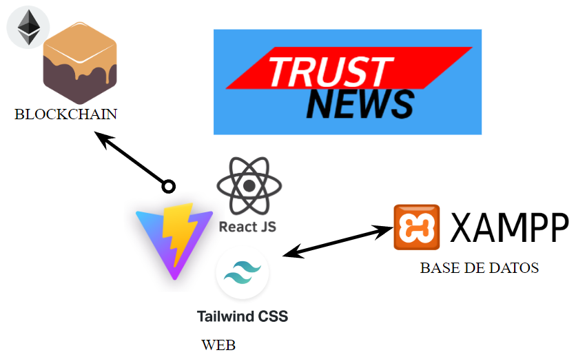
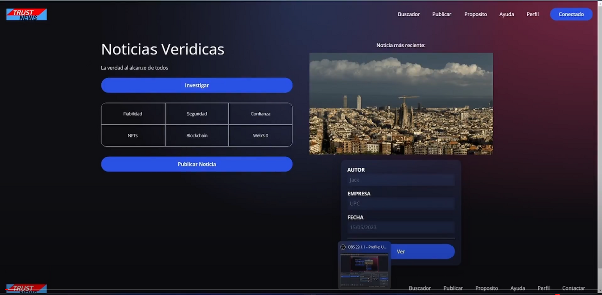
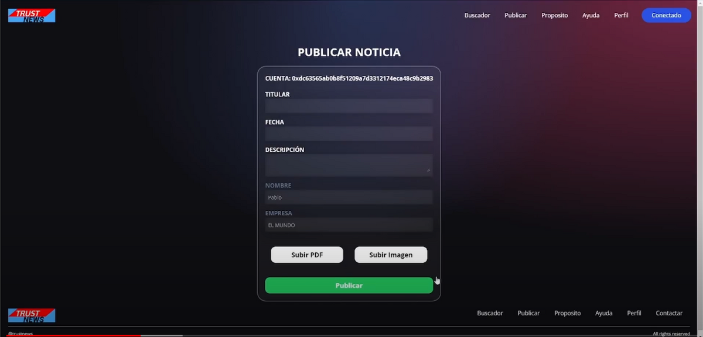

## Contents

* [1 Introducción](#Introducci.C3.B3n)
  + [1.1 ¿Qué es TrustNews?](#.C2.BFQu.C3.A9_es_TrustNews.3F)
* [2 Idea del proyecto](#Idea_del_proyecto)
* [3 Infraestructura](#Infraestructura)

# Introducción[[edit](/pti/index.php?title=Categor%C3%ADa:TRUSTNEWS&veaction=edit&section=1 "Edit section: Introducción") | [edit source](/pti/index.php?title=Categor%C3%ADa:TRUSTNEWS&action=edit&section=1 "Edit section: Introducción")]

## ¿Qué es TrustNews?[[edit](/pti/index.php?title=Categor%C3%ADa:TRUSTNEWS&veaction=edit&section=2 "Edit section: ¿Qué es TrustNews?") | [edit source](/pti/index.php?title=Categor%C3%ADa:TRUSTNEWS&action=edit&section=2 "Edit section: ¿Qué es TrustNews?")]

TrustNews es un proyecto realizado con la finalidad de luchar contra las FakeNews utilizando la tecnología Blockchain de una forma sencilla para usuarios.
Las Fake News son noticias con información falsa o engañosa presentada como noticias verídicas. Conllevan problemas como la desinformación, la manipulación de la opinión pública, el deterioro de la confianza en los medios de comunicación y la polarización de la sociedad.

# Idea del proyecto[[edit](/pti/index.php?title=Categor%C3%ADa:TRUSTNEWS&veaction=edit&section=3 "Edit section: Idea del proyecto") | [edit source](/pti/index.php?title=Categor%C3%ADa:TRUSTNEWS&action=edit&section=3 "Edit section: Idea del proyecto")]

Nuestra idea para acabar con las Fake News es hacer NFTs que se relacionen con las noticias, de esta manera cada vez que veamos una información por internet podremos ver quien la ha realizado, con que fecha y que dice exactamente esta noticia. De esta manera definimos una noticia en la Blockchain como un dueño, su dirección de la red, un timestamp que identifica el tiempo y un hash del contenido que tiene la información. Así pues podremos garantizar que esa información se ha mantenido igual desde el día que se minteo, fuera de la blockchain, es decir en nuestra web, podemos encontrar mas parámetros a rellenar cada vez que queramos identificar una noticia.

También existe un apartado donde un usuario se puede registrar para quitar el anonimato que ofrece la tecnología WEB3, de tal manera pueden haber periodistas verificados como usuarios y en su perfil se pueden ver sus noticias.

# Infraestructura[[edit](/pti/index.php?title=Categor%C3%ADa:TRUSTNEWS&veaction=edit&section=4 "Edit section: Infraestructura") | [edit source](/pti/index.php?title=Categor%C3%ADa:TRUSTNEWS&action=edit&section=4 "Edit section: Infraestructura")]

Nuestro proyecto esta dividido en 3 grandes partes independientes, tecnológicamente, entre si. Estas partes son: Blockchain, Web y Base de Datos.

La Blockchain esta implementada sobre Ganache, una aplicación que permite tener una red de Ethereum en local para hacer pruebas pero identica a la exterior. Para programar el contrato se ha utilizado Solidity y para desplegarlo en la red JavaScript.

Para el servidor web se ha usado Vite, una herramienta que permite crear y lanzar servidores web de forma muy senzilla. Para programar todas las funcionalidades de la web hemos usado react js, y para la parte estetica Tailwind CSS.

Para la Base de datos hemos usado XAMPP, que permite crear una base de datos mysql y un servidor apache. Hemos conectado la web con la base de datos mediante una API programada en javascript, con funciones get y post.

