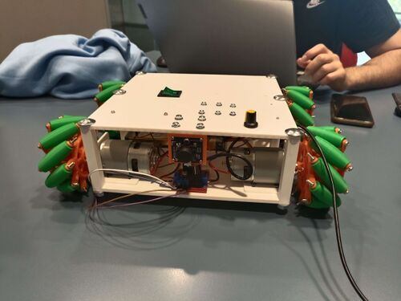
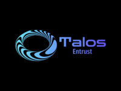
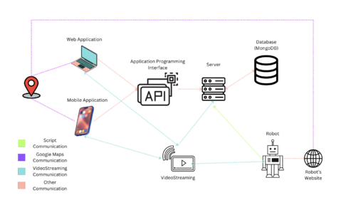

## Contents

* [1 Introducción](#Introducci.C3.B3n)
* [2 Arquitectura](#Arquitectura)
* [3 Materials del robot](#Materials_del_robot)
  + [3.1 Servidor Web](#Servidor_Web)
  + [3.2 API](#API)
  + [3.3 Aplicació mòbil](#Aplicaci.C3.B3_m.C3.B2bil)
  + [3.4 Transmissió de vídeo](#Transmissi.C3.B3_de_v.C3.ADdeo)

## Introducción[[edit](/pti/index.php?title=Categor%C3%ADa:Talos&veaction=edit&section=1 "Edit section: Introducción") | [edit source](/pti/index.php?title=Categor%C3%ADa:Talos&action=edit&section=1 "Edit section: Introducción")]

La seguretat és un concepte fonamental de qualsevol civilització. Les bèsties ferotges, els cataclismes meteorològics o simplement altres homes; la societat no pot florir sense la certesa que, el que construeixis avui, no es desfondrarà demà. Per tant, en paral·lel amb moltes altres invencions, la ment humana va començar a analitzar maneres potencials de reduir els riscos i el seu impacte. Talos és un projecte basat en aquesta idea: assegurar la seguretat del que has de protegir. El curs tenia diversos condicionants pel que fa al projecte, principalment centrats en la interconnexió de múltiples i diverses tecnologies. Per consegüent, es va preveure que Talos englobaria components des dels nivells més alts d'abstracció (programari) fins als més baixos (electrònica). Per tant, vam decidir desenvolupar un robot complex des de zero, alhora que proporcionàvem interfícies mòbils i web per gestionar-lo. En altres paraules, aquest projecte és un sistema de seguretat en la seva totalitat. Tot i que no vam aconseguir acabar la majoria dels nostres objectius, vam treballar durant hores sense fi mentre apreníem moltes tecnologies. Els components de programari, que requerien molt de treball, estaven gairebé acabats, però el maquinari està lluny de ser completat. Malgrat tot, creiem que la entrega final va ser un gran èxit, ja que vam aconseguir dissenyar part d'un sistema molt complex i intrincat, alhora que proporcionàvem documentació de gran qualitat.

## Arquitectura[[edit](/pti/index.php?title=Categor%C3%ADa:Talos&veaction=edit&section=2 "Edit section: Arquitectura") | [edit source](/pti/index.php?title=Categor%C3%ADa:Talos&action=edit&section=2 "Edit section: Arquitectura")]

# Materials del robot[[edit](/pti/index.php?title=Categor%C3%ADa:Talos&veaction=edit&section=3 "Edit section: Materials del robot") | [edit source](/pti/index.php?title=Categor%C3%ADa:Talos&action=edit&section=3 "Edit section: Materials del robot")]

La següent llista inclou els materials més importants necessaris per construir el robot. No inclou cap eina com ara els destornilladors i la impressora 3D.

Lichee Pi 4A (1) - Principal SBC responsable de les funcionalitats principals. S'utilitza per comunicar-se amb les interfícies d'usuari i amb l'Arduino UNO per obtenir dades dels sensors. A més, també gestiona la càmera USB i allotja el lloc web de configuració local del robot. Es va escollir perquè és RISC-V i té una NPU dedicada, que podria haver-se utilitzat per executar el codi d'IA. L'ús d'un SBC tenia la intenció de reduir la càrrega de treball del UNO i simplificar la programació de tasques, ja que l'SBC executa un sistema operatiu. El sistema operatiu és la pròpia implementació de Debian de Sipeed, que vaig modificar i recompilar per habilitar les altres interfícies UART (Vaig cremar UART1, que és necessària per comunicar-se amb el UNO, així que vaig haver d'habilitar UART2 i UART3. Es va solucionar modificant l'arbre de dispositius i recompilant el nucli.).

Arduino UNO (1) - Placa de desenvolupament utilitzada per gestionar la majoria dels sensors. Tot i que preferíem altres alternatives més interessants, l'Arduino IDE ofereix molt suport i biblioteques, el que va simplificar la programació i la configuració.

Controlador de motor L298N (2) - Aquest era necessari per controlar les rodes, principalment perquè la tensió necessària seria massa alta per a l'Arduino per subministrar-la per si mateix. Si us plau, tingueu en compte que la tensió subministrada per les bateries és $> 12V$, així que s'ha de treure el saltador que controla el seu regulador intern i afegir un subministrament extern de 5V (per exemple, per l'Arduino).

Motor DC 755 (4) - Com que és un cotxe mecànic, necessita un motor per roda. A més, com que el robot és gran i pesat, es va escollir un motor potent amb un parell alt, el 755. A més, vam decidir-nos per un motor DC ja que és el més senzill i s'ajusta perfectament a les necessitats del nostre projecte (Els motors de servo i pas a pas poden controlar la posició de les rodes, però és inútil en aquest cas.).

Mòdul GPS (1) - Responsable de conèixer la ubicació actual del robot. És necessari per fer que Talos sigui un vehicle autònom i fer que segueixi la ruta traçada per l'usuari.

Mòdul de navegació (1) - Comprendre cap on apunta el robot és fonamental abans d'ajustar el moviment. S'utilitza per complementar el GPS. Ambdós són necessaris per fer que el robot sigui autònom.

Filament d'impressió PLA / PETG - Necessari per imprimir totes les peces del robot.

Torns, cargols i rodes M2, M3, M4 i M8 (x) - Peces necessàries per muntar les múltiples peces. També es van necessitar cargols de diferents longituds, però en aquest informe la llista no serà exhaustiva.

Bateries de 15,2V (2) - Cada controlador de motor pot subministrar dues rodes, així que es van necessitar 2 bateries. Òbviament, es pot simplificar tenint una única font d'alimentació comuna (i també posar les bateries en sèrie i aconseguir 30,4V), però el nostre coneixement és limitat i volíem mantenir el disseny senzill.

Adaptador de cable XT90 (2) - El connector de la bateria (femení XT90) necessitava ser adaptat a alguna cosa que poguéssim connectar fàcilment al controlador de motor o interruptor.

Cable AWG (1) - Aquest cable, que suporta corrent elevat (recorda que estem utilitzant bateries de alta tensió amb 6500mAh), s'utilitza per connectar els motors DC i el controlador de motor (Es tallaria amb tisores, després s'eliminarà amb peladors de cables el protector dels dos extrems i finalment es soterraran tots els filaments junts.).

Càmera USB (1) - Necessària per a la transmissió de vídeo.

Altres - PCB, regulador, interruptor i molts altres components, però ja que no són tan rellevants i ocuparien massa espai, queden exempts d'aquesta llista.

## Servidor Web[[edit](/pti/index.php?title=Categor%C3%ADa:Talos&veaction=edit&section=4 "Edit section: Servidor Web") | [edit source](/pti/index.php?title=Categor%C3%ADa:Talos&action=edit&section=4 "Edit section: Servidor Web")]

El servidor web és permet la visualització de dades i proporciona una interfície d'usuari amigable per monitoritzar i controlar les funcionalitats del robot.

El servidor web està construït utilitzant tecnologies web modernes com HTML, CSS i JavaScript. Per ser més precisos, està construït utilitzant les següents tecnologies:

HTML: Aquesta tecnologia s'utilitza per crear l'estructura i el disseny de la pàgina web.

CSS: Aquesta tecnologia s'utilitza per estil·litzar i formatar la pàgina web.

JavaScript: Aquesta tecnologia s'utilitza per afegir interactivitat i comportament dinàmic a la pàgina web.

Node.js: Aquesta tecnologia s'utilitza per construir la lògica del servidor del servidor web.

El servidor web s'allotja en un servidor Linux i és accessible a través d'un navegador web. Per això, un dels requisits de l'aplicació és tenir un servidor centralitzat per allotjar el servidor web.

## API[[edit](/pti/index.php?title=Categor%C3%ADa:Talos&veaction=edit&section=5 "Edit section: API") | [edit source](/pti/index.php?title=Categor%C3%ADa:Talos&action=edit&section=5 "Edit section: API")]

L'API REST que hem desenvolupat és un conjunt d'endpoints que permeten que diferents components del sistema es comuniquin entre si, com ara el nostre lloc web/aplicació amb la nostra base de dades. Aquests endpoints s'utilitzen per recuperar i actualitzar dades en el sistema. L'API està dissenyada per ser flexible i es pot ampliar per donar suport a noves funcionalitats en el futur. També hem implementat mecanismes d'autenticació i autorització per garantir que només els usuaris autoritzats puguin accedir a certs punts finals. Principalment, podem diferenciar entre els punts finals de robots i els de usuaris. Hem utilitzat el llenguatge de programació Golang i hem connectat l'API a una base de dades MongoDB.

## Aplicació mòbil[[edit](/pti/index.php?title=Categor%C3%ADa:Talos&veaction=edit&section=6 "Edit section: Aplicació mòbil") | [edit source](/pti/index.php?title=Categor%C3%ADa:Talos&action=edit&section=6 "Edit section: Aplicació mòbil")]

L'aplicació mòbil és una interfície d'usuari per a la visualització de dades. Proporciona una experiència amigable per a mòbils per monitoritzar i controlar les funcionalitats del robot.

L'aplicació mòbil està construïda utilitzant un conjunt diferent de tecnologies que el servidor web. Està construïda utilitzant Flutter, un marc de desenvolupament d'aplicacions mòbils multiplataforma.

Flutter és una opció popular per construir aplicacions mòbils perquè permet als desenvolupadors escriure el codi una vegada i implementar-lo en múltiples plataformes, incloent iOS, Android i web. Aquesta és una de les raons per les quals vam triar Flutter per a l'aplicació mòbil.

## Transmissió de vídeo[[edit](/pti/index.php?title=Categor%C3%ADa:Talos&veaction=edit&section=7 "Edit section: Transmissió de vídeo") | [edit source](/pti/index.php?title=Categor%C3%ADa:Talos&action=edit&section=7 "Edit section: Transmissió de vídeo")]

La transmissió de vídeo és una característica imprecidnibledel nostre projecte de robot de vigilància. Permet la transmissió de vídeo en temps real des de les càmeres del robot. D'aquesta manera podem monitoritzar l'entorn del robot en temps real.

Per implementar la transmissió de vídeo, vam utilitzar la biblioteca opencv, que és una biblioteca popular de visió per ordinador de codi obert. Proporciona una àmplia gamma de funcionalitats per al processament d'imatges i vídeos, incloent-hi la transmissió de vídeo.

L'únic requisit per a la funció de transmissió de vídeo és tenir una càmera connectada al robot. Per saber com activar aquesta funció, consulteu la secció d'Instal·lació.