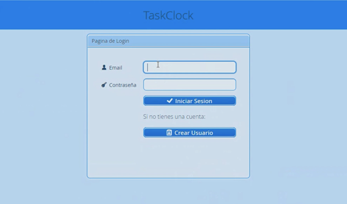
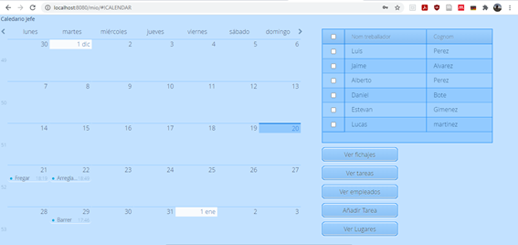
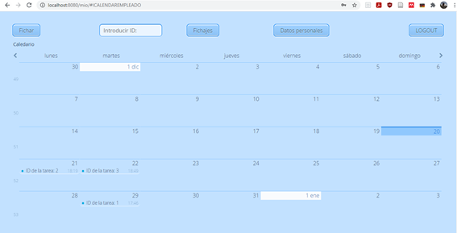

## Contents

* [1 ¿Qué es taskclock?](#.C2.BFQu.C3.A9_es_taskclock.3F)
* [2 Infraestructura](#Infraestructura)
* [3 Vaadin](#Vaadin)
* [4 Cliente](#Cliente)
* [5 Servidor](#Servidor)

# ¿Qué es taskclock?[[edit](/pti/index.php?title=Categor%C3%ADa:Taskclock&veaction=edit&section=1 "Edit section: ¿Qué es taskclock?") | [edit source](/pti/index.php?title=Categor%C3%ADa:Taskclock&action=edit&section=1 "Edit section: ¿Qué es taskclock?")]

Taskclock es un proyecto orientado a la gestión de fichajes para trabajadores que tienen servicios descentralizados, como es personal de mantenimiento o de limpieza. El usuario a través de la aplicación puede fichar en la tarea correspondiente que le toca en aquel instante de tiempo. Además también puede ver todas las tareas hechas o por hacer a través de un calendario.

# Infraestructura[[edit](/pti/index.php?title=Categor%C3%ADa:Taskclock&veaction=edit&section=2 "Edit section: Infraestructura") | [edit source](/pti/index.php?title=Categor%C3%ADa:Taskclock&action=edit&section=2 "Edit section: Infraestructura")]

Para llevar a cabo el proyecto se han usado distintas tecnologías. El desarrollo del proyecto se ha llevado a través del IDE Netbeans 8. El programa ha estado escrito en Java y se ha usado un framework llamado Vaadin, del cual hemos usado la versión 8. Para la gestión de datos se ha usado una base de datos SQL alojada en un servidor remoto. Este servidor remoto, es una máquina virtual que ha proporcionado la FIB.

# Vaadin[[edit](/pti/index.php?title=Categor%C3%ADa:Taskclock&veaction=edit&section=3 "Edit section: Vaadin") | [edit source](/pti/index.php?title=Categor%C3%ADa:Taskclock&action=edit&section=3 "Edit section: Vaadin")]

Vaadin es un framework que estiliza la parte de front-end de la aplicación. Funciona sobre Java u el usuario tiene que programar en este lenguaje, de esta forma no hace falta que toque código HTML ya que es el propio framework el que se encarga de ello.
Ofrece una gran variedad de funcionalidades en cuanto a diseño.

# Cliente[[edit](/pti/index.php?title=Categor%C3%ADa:Taskclock&veaction=edit&section=4 "Edit section: Cliente") | [edit source](/pti/index.php?title=Categor%C3%ADa:Taskclock&action=edit&section=4 "Edit section: Cliente")]

La parte del cliente se ha dividido en dos. Por un lado tenemos las vistas de un trabajador y por la otra las vistas del cliente.
El trabajador una vez inicia la sesión en la aplicación, va a un calendario donde se muestran todas las tareas que tiene, tanto las que están hechas como las que faltan por hacer. En esta página de calendario puede realizar varias acciones como fichar en la tarea que le toque en ese momento, ver sus datos personales y ver todos los fichajes. En la vista de ver todos los fichajes, puede aceptar los cambios de un fichaje en caso que se haya modificado la hora o haya hecho horas extras, todo esto bajo previo consentimiento del jefe.

El jefe, una vez ha iniciado la sesión, ve un calendario donde se muestran todas las tareas de los trabajadores. Dispone de un panel donde puede filtrar por trabajadores. Además tiene la opción de añadir tareas, añadir lugares y ver fichajes. En esta última vista, la de ver fichajes, podrá editar un fichaje de un trabajador una vez haya fichado. Para que los cambios se acepten, el trabajador tendrá que aceptar las modificaciones.

# Servidor[[edit](/pti/index.php?title=Categor%C3%ADa:Taskclock&veaction=edit&section=5 "Edit section: Servidor") | [edit source](/pti/index.php?title=Categor%C3%ADa:Taskclock&action=edit&section=5 "Edit section: Servidor")]

Para desarrollar el programa se ha separado la parte de front-end de la de back-end. El back-end, es una aplicación web, que se encarga de gestionar las llamadas con la base de datos y enviar o recibir datos del cliente. La recepción y/o envío de datos con el cliente se hace mediante llamadas SOAP.
La aplicación servidor, esta alojada en una máquina virtual de la FIB y se puede acceder a través de una IP. Previamente tienes que conectar el ordenador a la VPN de la FIB a través de UPCLink.