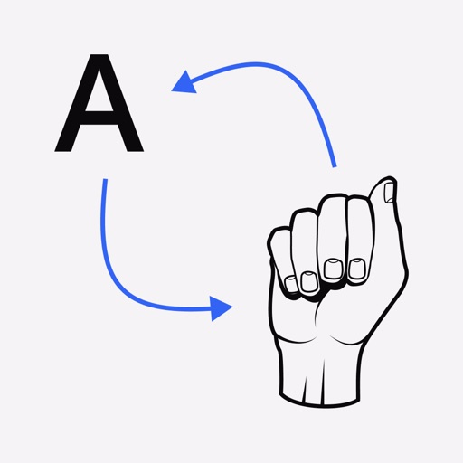
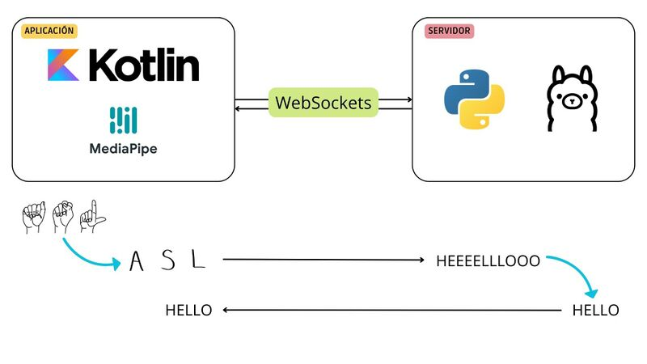
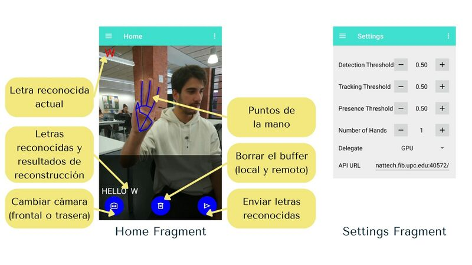
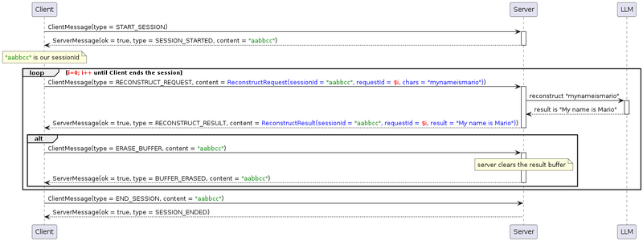

## Contents

* [1 Introducción](#Introducci.C3.B3n)
  + [1.1 Descripción del proyecto](#Descripci.C3.B3n_del_proyecto)
  + [1.2 Objetivos del proyecto](#Objetivos_del_proyecto)
* [2 Infraestructura](#Infraestructura)
  + [2.1 Arquitectura](#Arquitectura)
* [3 Aplicación](#Aplicaci.C3.B3n)
* [4 Comunicación](#Comunicaci.C3.B3n)

# Introducción[[edit](/pti/index.php?title=Categor%C3%ADa:TrASLate&veaction=edit&section=1 "Edit section: Introducción") | [edit source](/pti/index.php?title=Categor%C3%ADa:TrASLate&action=edit&section=1 "Edit section: Introducción")]

## Descripción del proyecto[[edit](/pti/index.php?title=Categor%C3%ADa:TrASLate&veaction=edit&section=2 "Edit section: Descripción del proyecto") | [edit source](/pti/index.php?title=Categor%C3%ADa:TrASLate&action=edit&section=2 "Edit section: Descripción del proyecto")]

Nuestro proyecto consiste en una aplicación que utiliza inteligencia artificial (IA) para traducir el lenguaje de signos a texto escrito. Es una herramienta diseñada para facilitar la comunicación entre personas sordas y oyentes, eliminando barreras lingüísticas y promoviendo la inclusión social y laboral.

## Objetivos del proyecto[[edit](/pti/index.php?title=Categor%C3%ADa:TrASLate&veaction=edit&section=3 "Edit section: Objetivos del proyecto") | [edit source](/pti/index.php?title=Categor%C3%ADa:TrASLate&action=edit&section=3 "Edit section: Objetivos del proyecto")]

Los objetivos principales del proyecto són:

1. Facilitar la Comunicación: Permitir que las personas sordas puedan comunicarse de manera efectiva con aquellos que no conocen el lenguaje de signos.
2. Promover la Inclusión: Reducir las barreras de comunicación en diversos entornos, incluyendo educativos, laborales y sociales.
3. Accesibilidad: Crear una herramienta fácil de usar que esté disponible para cualquier persona que necesite asistencia en la traducción de lenguaje de signos a texto.
4. Precisión y Eficiencia: Desarrollar un sistema que proporcione traducciones precisas y en tiempo real.

# Infraestructura[[edit](/pti/index.php?title=Categor%C3%ADa:TrASLate&veaction=edit&section=4 "Edit section: Infraestructura") | [edit source](/pti/index.php?title=Categor%C3%ADa:TrASLate&action=edit&section=4 "Edit section: Infraestructura")]

El proyecto consta de dos grandes boques los quales incorporan los siguientes componentes

* Aplicación:
  + IA de reconocimiento de ASL
  + Conexión con el servidor
* Servidor:
  + Conexión con la aplicación
  + LLM (llama3) para pasar las letras que traduce a palabras bien escritas

El proyecto cuenta con una aplicación que tiene una IA que traduce de lenguaje de signos a letras sueltas. La aplicación se conecta a un servidor a través de websockets. El servidor recibe peticiones de las letras mal escritas y se las pasa a llama3 para que interprete las letras que recibe y las pase a palabras bien escritas. La palabra bien escrita se pasa a la aplicación para que la muestre en pantalla.

## Arquitectura[[edit](/pti/index.php?title=Categor%C3%ADa:TrASLate&veaction=edit&section=5 "Edit section: Arquitectura") | [edit source](/pti/index.php?title=Categor%C3%ADa:TrASLate&action=edit&section=5 "Edit section: Arquitectura")]

Arquitectura del proyecto

El proyecto esta compuesto por una aplicación y un servidor. La aplicación està programada en Kotlin y usa mediapipe para hacer el reconocimiento de puntos de la mano. Además tiene incorporada la inteligencia artificial. Por otro lado el servidor està programado en python y usa websockets para establecer la conexión con la aplicación. Además puede acceder a llama3 gràcias a ollama

# Aplicación[[edit](/pti/index.php?title=Categor%C3%ADa:TrASLate&veaction=edit&section=6 "Edit section: Aplicación") | [edit source](/pti/index.php?title=Categor%C3%ADa:TrASLate&action=edit&section=6 "Edit section: Aplicación")]

Pantallas de la aplicación

La aplicación consta de una pantalla principal en la que se muestra lo que se ve de la camara. Además tiene tres botones, uno para cambiar la camara (frontal/trasera), eliminar el texto y enviar el texto. En la parte superior derecha de la pantalla aparece la letra que ha traducido y en la parte inferior de la pantalla aparecen las letras que se han ido captando. Además en la imagen aparecen los puntos que se traquean de la mano.

Por otro lado, hay un apartado de settings que te permite modificar los parámetros de captación de las letras.

# Comunicación[[edit](/pti/index.php?title=Categor%C3%ADa:TrASLate&veaction=edit&section=7 "Edit section: Comunicación") | [edit source](/pti/index.php?title=Categor%C3%ADa:TrASLate&action=edit&section=7 "Edit section: Comunicación")]

Esquema de comunicación

La comunicación del proyecto consta de tres partes. Por una parte la aplicaión, por otra parte el servidor y finalmente llama3. En primer lugar, cuando se abre la aplicaión se establece la conexion entre el servidor y la aplicación y se deja abierta hasta que se cierre la aplicación. Una vez establecida esta conexión el servidor se queda a la espera de recibir peticiones de la aplicación. Cuando recibe una petición el servidor envia una petición a llama3 y envia la respuesta que recibe a la aplicación.