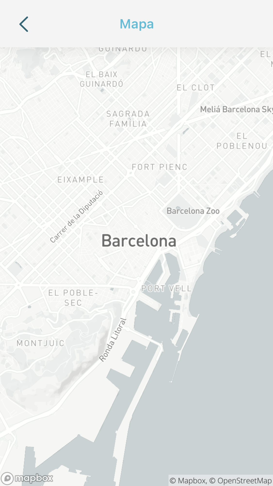

## Contents

* [1 Introducción](#Introducci.C3.B3n)
  + [1.1 ¿Qué es TrainUp?](#.C2.BFQu.C3.A9_es_TrainUp.3F)
* [2 Objetivos](#Objetivos)
* [3 Herramientas y tecnologías](#Herramientas_y_tecnolog.C3.ADas)
  + [3.1 Crowdsensing](#Crowdsensing)
  + [3.2 Cell Towers](#Cell_Towers)
  + [3.3 Base de Datos: MongoDB](#Base_de_Datos:_MongoDB)
  + [3.4 Android Studio](#Android_Studio)
  + [3.5 Contenedor de servlets: Tomcat7](#Contenedor_de_servlets:_Tomcat7)
* [4 Esquema General](#Esquema_General)
* [5 Servidor](#Servidor)
  + [5.1 Base de Datos](#Base_de_Datos)
    - [5.1.1 Tabla Ruta](#Tabla_Ruta)
    - [5.1.2 Tabla users](#Tabla_users)
    - [5.1.3 Tabla posTrenes](#Tabla_posTrenes)
  + [5.2 Servidor Web FIB](#Servidor_Web_FIB)
  + [5.3 Servlets](#Servlets)
    - [5.3.1 register.java](#register.java)
    - [5.3.2 outdoorsRemainingTime.java](#outdoorsRemainingTime.java)
    - [5.3.3 intrainRemainingTime.java](#intrainRemainingTime.java)
    - [5.3.4 login.java](#login.java)
    - [5.3.5 localizacion.java](#localizacion.java)
* [6 Aplicación Android Cliente](#Aplicaci.C3.B3n_Android_Cliente)
  + [6.1 Información General](#Informaci.C3.B3n_General)
  + [6.2 Activities](#Activities)
    - [6.2.1 About](#About)
    - [6.2.2 AddTravel](#AddTravel)
    - [6.2.3 Alarma](#Alarma)
    - [6.2.4 AlarmReceiver](#AlarmReceiver)
    - [6.2.5 DatabaseAccess](#DatabaseAccess)
    - [6.2.6 DatabaseOpenHelper](#DatabaseOpenHelper)
    - [6.2.7 FavoritesDBHelper](#FavoritesDBHelper)
    - [6.2.8 FavoritesAccess](#FavoritesAccess)
    - [6.2.9 Hash](#Hash)
    - [6.2.10 InTrain](#InTrain)
    - [6.2.11 LoginActivity](#LoginActivity)
    - [6.2.12 MainActivity](#MainActivity)
    - [6.2.13 ResultActivity](#ResultActivity)
    - [6.2.14 RingtonePlayingService](#RingtonePlayingService)
    - [6.2.15 MapActivity](#MapActivity)
    - [6.2.16 SigninActivity](#SigninActivity)
    - [6.2.17 Travel](#Travel)
    - [6.2.18 TravelAdapter](#TravelAdapter)
    - [6.2.19 ViewHolder](#ViewHolder)
  + [6.3 Alarma](#Alarma_2)
  + [6.4 Mapa](#Mapa)
  + [6.5 Lista de Favoritos](#Lista_de_Favoritos)
* [7 Seguridad](#Seguridad)
  + [7.1 SHA1](#SHA1)
* [8 Modelo de negocio](#Modelo_de_negocio)
  + [8.1 App for enterprises](#App_for_enterprises)
  + [8.2 Freemium](#Freemium)
  + [8.3 Infomediary model](#Infomediary_model)
* [9 Evaluación, limitaciones y planes de futuro](#Evaluaci.C3.B3n.2C_limitaciones_y_planes_de_futuro)
* [10 Referencias](#Referencias)

# Introducción[[edit](/pti/index.php?title=Categor%C3%ADa:TrainUp&veaction=edit&section=1 "Edit section: Introducción") | [edit source](/pti/index.php?title=Categor%C3%ADa:TrainUp&action=edit&section=1 "Edit section: Introducción")]

## ¿Qué es TrainUp?[[edit](/pti/index.php?title=Categor%C3%ADa:TrainUp&veaction=edit&section=2 "Edit section: ¿Qué es TrainUp?") | [edit source](/pti/index.php?title=Categor%C3%ADa:TrainUp&action=edit&section=2 "Edit section: ¿Qué es TrainUp?")]

Hoy en día, la tecnología de la información se está extendiendo en muchas áreas de nuestra sociedad. A pesar de eso, en algunos campos esta evolución es más lenta, un ejemplo es el transporte público, donde los usuarios echan en falta la implantación de elementos tecnológicos que hagan posible un servicio más eficaz, cómodo y puntual.
Concretamente nos queremos centrar en el servicio de tren de Renfe, ya que somos usuarios habituales. Después de analizar el mercado actual, se puede observar la precariedad de la tecnología informática en este transporte en comparación con otros tipos de servicios de transporte. Uno de estos ejemplos es la aplicación TMB que explora los beneficios de TI para conocer en tiempo real la ubicación de los autobuses e incluye un tiempo de cuenta atrás que muestra el tiempo restante para llegar al destino. Este proyecto intenta identificar y solucionar esta falta de información en tiempo real del sistema actual del servicio de Renfe.

Por lo tanto TrainUp es una aplicación para mantener informados en tiempo real a los usuarios del tren. De esta manera los usuarios pueden ser conscientes de los retrasos y ajustarse al estado actual del servicio. Los diseñadores de TrainUp tenemos en cuenta la importancia de la optimización del tiempo y hemos diseñado esta aplicación que permite a los usuarios ser conscientes del estado del tren. Así, TrainUp es una aplicación que proporciona fácilmente toda la información necesaria al usuario, esto incluye el tiempo restante en la llegada del tren, la ubicación actual de los trenes, un sistema de alarma y un mapa de la posición actual del tren. Con este nuevo servicio, los usuarios podrán comprobar antes de salir de sus casas que su transporte no ha sufrido retrasos, decidir si tendrán suficiente tiempo para llegar a la estación de tren y olvidarse de todas aquellas preocupaciones causadas por la falta de información del tren.

# Objetivos[[edit](/pti/index.php?title=Categor%C3%ADa:TrainUp&veaction=edit&section=3 "Edit section: Objetivos") | [edit source](/pti/index.php?title=Categor%C3%ADa:TrainUp&action=edit&section=3 "Edit section: Objetivos")]

El objetivo de nuestro proyecto es poder tener un control de la posición de los trenes, a través de la información recibida de las torres de telefonía y puntos wifi y así poder estimar el tiempo exacto que falta para la llegada del tren a la estación destino seleccionada.

En este proyecto, los objetivos tecnológicos principalmente consisten en aprender sobre el crowdsensing y el funcionamiento de las antenas de telefonía que han sido usadas para obtener la localización de los usuarios y posteriormente poder extraer la posición de los trenes. Otros objetivos son la configuración de servidores y base de datos, seguridad y encriptación de datos y finalmente ampliar los conocimientos de Android especialmente centrados en la conexión con el servidor. En referencia a la base de datos, nuestro modelo de aplicación tenderá, en un futuro, a albergar cantidades de información muy elevadas, ya que Renfe posee una red muy extensa de trenes. Es por eso que una base de datos NoSQL satisface nuestra necesidad de procesar un gran volumen de datos, frente a las típicas bases de datos relacionales. Esto sumado a la voluntad de explorar un campo que no es común para nosotros, nos hace decantarnos en la utilización de la tecnología MongoDB.

El punto de partida de la idea ha sido la necesidad de una aplicación con estas características, ya que actualmente no existe ninguna aplicación que te permita conocer la localización del tren. De este modo el usuario será informado en tiempo real del estado de los trenes tanto de su localización como del tiempo restante a la destinación. Son muchos los usuarios de Renfe que cada día utilizan este transporte y creemos que este proyecto será muy interesante y útil para todos ellos, ya que los retrasos constantes del servicio hacen que la hora exacta de llegada de los trenes sea una quimera para los usuarios.

Somos conscientes que otros servicios de transporte actuales utilizan apps parecidas, pero se basan principalmente en autobuses u otros transportes, en nuestro caso se centrará exclusivamente en trenes.

# Herramientas y tecnologías[[edit](/pti/index.php?title=Categor%C3%ADa:TrainUp&veaction=edit&section=4 "Edit section: Herramientas y tecnologías") | [edit source](/pti/index.php?title=Categor%C3%ADa:TrainUp&action=edit&section=4 "Edit section: Herramientas y tecnologías")]

## Crowdsensing[[edit](/pti/index.php?title=Categor%C3%ADa:TrainUp&veaction=edit&section=5 "Edit section: Crowdsensing") | [edit source](/pti/index.php?title=Categor%C3%ADa:TrainUp&action=edit&section=5 "Edit section: Crowdsensing")]

Crowdsensing, a veces denominada crowdsensing móvil, es una técnica en la que un gran grupo de personas que tienen dispositivos móviles capaces de detectar y computar (tales como teléfonos inteligentes, tabletas, portátiles) comparten datos y extraen información para medir, mapear, analizar o estimar cualquier proceso de interés común.
La principal razón por la que decidimos utilizar esta tecnología fue debido al impedimento que tuvimos al instalar un dispositivo fijo en el tren que nos fuese enviando constantemente su localización.
Alternativamente, TrainUp utiliza la técnica de crowdsensing para enviar la posición de los pasajeros, con el fin de analizar estos datos, ejecutar los correspondientes cálculos y poder extraer la posición de los trenes.

## Cell Towers[[edit](/pti/index.php?title=Categor%C3%ADa:TrainUp&veaction=edit&section=6 "Edit section: Cell Towers") | [edit source](/pti/index.php?title=Categor%C3%ADa:TrainUp&action=edit&section=6 "Edit section: Cell Towers")]

La geolocalización en nuestro proyecto juega un papel muy importante para obtener la localización de los usuarios. La implementación está basada en las torres celulares en lugar de la tecnología GPS común. Durante el progreso del proyecto y tras varias fases de testeo comprobamos que las torres celulares son más fiables y nos ofrecen una mayor cobertura en tramos subterráneos del trayecto y regiones con abundancia de túneles. La red celular está formada por múltiples celdas o células que delimitan las regiones de cobertura, hay torres con antenas (estaciones base) que se encargan de enviar y recibir esas señales de radio. Los móviles tienen transmisores de baja potencia que le permiten comunicarse con la antena de la estación base más cercana. De este modo, a partir de la intensidad de las señales y el tiempo de respuesta entre las torres y los dispositivos móviles, somos capaces de triangularizar la posición de los dispositivos y situarlo en un sistema de coordenadas con una excelente precisión.

## Base de Datos: MongoDB[[edit](/pti/index.php?title=Categor%C3%ADa:TrainUp&veaction=edit&section=7 "Edit section: Base de Datos: MongoDB") | [edit source](/pti/index.php?title=Categor%C3%ADa:TrainUp&action=edit&section=7 "Edit section: Base de Datos: MongoDB")]

MongoDB es una base de datos que no sigue los tradicionales esquemas empleados en las bases de datos SQL, sino utiliza documentos JSON donde cada entrada puede tener un esquema diferente. MongoDB está clasificado como un programa de base de datos NoSQL.
Utilizamos MongoDB en nuestro servidor con el propósito de almacenar todos los datos necesarios para los cálculos, de una forma más dinámica, ágil y escalable gracias a los documentos NoSQL.
Nuestro sistema está pensado para almacenar en un futuro cantidades de datos abundantes, ya que debido a la tecnología crowdsensing requiere recopilar la posición de todos los usuarios, hemos utilizado una base de datos NoSQL ya que es más eficaz en estos casos.

## Android Studio[[edit](/pti/index.php?title=Categor%C3%ADa:TrainUp&veaction=edit&section=8 "Edit section: Android Studio") | [edit source](/pti/index.php?title=Categor%C3%ADa:TrainUp&action=edit&section=8 "Edit section: Android Studio")]

Android Studio es el entorno de desarrollo integrado oficial (IDE) para la plataforma Android. Utilizamos esta plataforma para desarrollar nuestra aplicación móvil, tanto sus cálculos, procedimientos e interfaz.

## Contenedor de servlets: Tomcat7[[edit](/pti/index.php?title=Categor%C3%ADa:TrainUp&veaction=edit&section=9 "Edit section: Contenedor de servlets: Tomcat7") | [edit source](/pti/index.php?title=Categor%C3%ADa:TrainUp&action=edit&section=9 "Edit section: Contenedor de servlets: Tomcat7")]

Nuestra aplicación realiza peticiones HTTP a un contenedor de servlets para poder satisfacer correctamente las funcionalidades del sistema. Es por esto que hemos decidido instalar Tomcat 7 en el servidor, este es un programa capaz de recibir peticiones HTTP y redireccionar estas peticiones a un objeto Servlet. Y este Servlet a través del contenedor devuelve la respuesta a la aplicación.
La petición HTTP se realiza a través del método GET y POST, como ya sabemos su funcionalidad es obtener información en el servidor.

# Esquema General[[edit](/pti/index.php?title=Categor%C3%ADa:TrainUp&veaction=edit&section=10 "Edit section: Esquema General") | [edit source](/pti/index.php?title=Categor%C3%ADa:TrainUp&action=edit&section=10 "Edit section: Esquema General")]

Explicada las diferentes tecnologías utilizadas en nuestro proyecto, es momento de explicar cómo están estructuradas y cómo interactúan entre ellas. En nuestro proyecto, el esquema general que utilizamos consta de tres partes principales: el servidor que tiene una base de datos asociada, la aplicación móvil cliente y las torres celulares.
La aplicación móvil registra constantemente la posición del usuario a través de las torres celulares y wifi, concretamente lee una posición cada 30 segundos o cuando se recorre una distancia de 10 metros. Esta información se envía a través de peticiones HTTP al servidor, donde se guarda en la base de datos. Las búsquedas y alarma también requieren de peticiones HTTP.
A continuación una representación gráfica de nuestro esquema en el proyecto:

# Servidor[[edit](/pti/index.php?title=Categor%C3%ADa:TrainUp&veaction=edit&section=11 "Edit section: Servidor") | [edit source](/pti/index.php?title=Categor%C3%ADa:TrainUp&action=edit&section=11 "Edit section: Servidor")]

## Base de Datos[[edit](/pti/index.php?title=Categor%C3%ADa:TrainUp&veaction=edit&section=12 "Edit section: Base de Datos") | [edit source](/pti/index.php?title=Categor%C3%ADa:TrainUp&action=edit&section=12 "Edit section: Base de Datos")]

Como ya hemos comentado anteriormente, decidimos utilizar la base de datos MongoDB, la cual es NoSQL, y hemos implementado diferentes tablas para clasificar la información que necesitamos y tener un orden establecido. Las tablas las explicamos con detalle a continuación.

### Tabla Ruta[[edit](/pti/index.php?title=Categor%C3%ADa:TrainUp&veaction=edit&section=13 "Edit section: Tabla Ruta") | [edit source](/pti/index.php?title=Categor%C3%ADa:TrainUp&action=edit&section=13 "Edit section: Tabla Ruta")]

Esta tabla nos sirve para delimitar todos los puntos de la ruta R2 entre las paradas Montmeló y Sants, que es la que utilizamos en nuestro proyecto. En dicha tabla hay diferentes campos de información para cada objeto (punto) como su latitud, longitud, tiempo en segundos desde que se sale de la estación de Sants (para cálculos de tiempo), su dirección y finamente también el nombre de la parada solamente en aquellos puntos que de verdad lo sean.

### Tabla users[[edit](/pti/index.php?title=Categor%C3%ADa:TrainUp&veaction=edit&section=14 "Edit section: Tabla users") | [edit source](/pti/index.php?title=Categor%C3%ADa:TrainUp&action=edit&section=14 "Edit section: Tabla users")]

En esta tabla tenemos la información representativa de los usuarios. Entre los diferentes campos nos encontramos con el nombre del usuario, su contraseña encriptada y el e-mail-
Además a partir de la tecnología de crowdsensing registramos las tres últimas posiciones del usuario representadas con {latitud,longitud,date}, dichas posiciones serán guardadas con un 0 si dicho usuario está fuera del rango de la vía. Dado que en nuestra aplicación queremos proteger la identidad del usuario no deseamos guardar el valor real de aquellas posiciones que no nos interesan, por eso se almacenan con un valor de 0. Si detectamos que el usuario sí que está en la vía, esta vez sí que guardamos la longitud y la latitud. En el caso de que el usuario tenga 3 posiciones consecutivas válidas y se aprecie movimiento el usuario quedará asociado a un identificador de tren.

### Tabla posTrenes[[edit](/pti/index.php?title=Categor%C3%ADa:TrainUp&veaction=edit&section=15 "Edit section: Tabla posTrenes") | [edit source](/pti/index.php?title=Categor%C3%ADa:TrainUp&action=edit&section=15 "Edit section: Tabla posTrenes")]

Esta tabla contiene la información representativa de cada tren, y con estos datos podemos calcular la estimación de cuando un tren llega al destino seleccionado. Los campos que nos encontramos en esta tabla son la latitud, longitud y dirección de cada tren.
Como hemos comentado en el anterior punto un tren será insertado en la base de datos, cuando un usuario tenga 3 posiciones consecutivas en la vía y se aprecie movimiento. Dicho tren tendrá la longitud y latitud referente a la última posición del usuario.

## Servidor Web FIB[[edit](/pti/index.php?title=Categor%C3%ADa:TrainUp&veaction=edit&section=16 "Edit section: Servidor Web FIB") | [edit source](/pti/index.php?title=Categor%C3%ADa:TrainUp&action=edit&section=16 "Edit section: Servidor Web FIB")]

Tal y como se nos indicó en la asignatura, la facultad proporciona máquinas virtuales como servidores a los alumnos a través de la plataforma OpenNebula. Por lo tanto, decidimos utilizar este recurso para poder implementar y configurar nuestro servidor. Dicha máquina virtual no es muy potente, ya que sus características son 0.5 CPU, 0.75Gb RAM, 10GB Disco-325 y utiliza Ubuntu 16.04.

## Servlets[[edit](/pti/index.php?title=Categor%C3%ADa:TrainUp&veaction=edit&section=17 "Edit section: Servlets") | [edit source](/pti/index.php?title=Categor%C3%ADa:TrainUp&action=edit&section=17 "Edit section: Servlets")]

### register.java[[edit](/pti/index.php?title=Categor%C3%ADa:TrainUp&veaction=edit&section=18 "Edit section: register.java") | [edit source](/pti/index.php?title=Categor%C3%ADa:TrainUp&action=edit&section=18 "Edit section: register.java")]

En este fichero se recibe como parámetros el nombre del user que se quiere registrar, la password para dicho user y también un email con el correspondiente formato. En el momento que se hace un registro de un nuevo un usuario el servidor consulta la base de datos para comprobar que ese usuario no esté creado.
En caso de haberse registrado correctamente el usuario recibirá un correo donde el equipo de TrainUp le informará de su satisfactorio registro.
En el momento que el usuario forma parte de la comunidad TrainUp, éste también se vuelve partícipe del crowdsensing. En esta primera versión de la aplicación para facilitar la implementación del sistema asignamos un tren a un único usuario. Además, hemos añadido un sistema de control de errores en el cual registramos las tres últimas coordenadas enviadas del usuario. De este modo, cuando detectamos que el usuario deja de enviar coordenadas situadas en la muestra de las vías ferroviarias nos indicará que ha dejado de estar en el tren original y se dejará de registrar la posición de dicho tren, en un caso real en el tren permanecerían más usuarios que nos seguirían informando de dicha posición. En el register.java se accede en el momento que el usuario se registra por primera vez, se inicializan los valores de esta variable a 0 esperando a que los 3 registros contengan coordenadas acordes con la muestra para empezar a registrar un tren.

### outdoorsRemainingTime.java[[edit](/pti/index.php?title=Categor%C3%ADa:TrainUp&veaction=edit&section=19 "Edit section: outdoorsRemainingTime.java") | [edit source](/pti/index.php?title=Categor%C3%ADa:TrainUp&action=edit&section=19 "Edit section: outdoorsRemainingTime.java")]

Este fichero hace referencia a la versión de búsqueda de trenes en caso que el usuario quiera consultar cuánto tiempo falta para que llegue el próximo tren a una estación seleccionada. El fichero java recibe como parámetros la línea del tren (siempre será R2), la dirección hacia la que el tren se dirige (Sants o Montmeló) y también la parada destino. En nuestra implementación de TrainUp nos hemos centrado en desarrollar el funcionamiento sobre una sola línea de tren en este caso la R2. En cuanto a la dirección es necesario saber en qué dirección quiere ir el usuario ya que la frecuencia del tráfico de trenes entre direcciones puede variar. Finalmente la estación nos permite situar la posición a partir de la cual queremos calcular y fijar el tiempo restante que queremos mostrar al usuario. El fichero después de realizar los cálculos correspondientes devuelve el tiempo restante que falta para que el tren más próximo llegue a esa parada seleccionada.

### intrainRemainingTime.java[[edit](/pti/index.php?title=Categor%C3%ADa:TrainUp&veaction=edit&section=20 "Edit section: intrainRemainingTime.java") | [edit source](/pti/index.php?title=Categor%C3%ADa:TrainUp&action=edit&section=20 "Edit section: intrainRemainingTime.java")]

Este tercer fichero representa la otra versión de búsqueda implementada en nuestro proyecto. La segunda versión de búsqueda está ideada para aquellos usuarios que deseen consultar desde dentro del tren cuanto tiempo les falta para llegar a la destinación indicada. Como parámetros recibe el nombre del usuario que está en el tren, su localización mediante latitud y longitud y la estación destino.
Este tipo de búsqueda sólo será permitida cuando el usuario tenga los 3 registros de posición con valores de coordenadas dentro de la muestra. El fichero intrainRemainingTime.java hará la comprovación y en caso que el usuario esté correspondido con un tren se le permitirá hacer dicha búsqueda. Esta segunda versión, puede ser interesante para ver el tiempo restante al destino en caso que el usuario vaya con el tiempo justo y quiera hacer algún transbordo o cambio de línea.
Finalmente, el resultado que devolverán los cálculos de este fichero será el tiempo restante para que el tren, representado por el usuario, llegue a la estación destino.

### login.java[[edit](/pti/index.php?title=Categor%C3%ADa:TrainUp&veaction=edit&section=21 "Edit section: login.java") | [edit source](/pti/index.php?title=Categor%C3%ADa:TrainUp&action=edit&section=21 "Edit section: login.java")]

El login.java es el fichero donde se ha programado el acceso del usuario a la aplicación. Para realizar este procedimiento, se recibe como parámetros el nombre del usuario y su contraseña enviados desde la aplicación. Con estos valores el login.java es el responsable de comprobar que exista la tupla {User,Password} en la tabla users de la base de datos. Si existen ambas combinaciones se podrá acceder a la app, en caso contrario se denegará el acceso.

### localizacion.java[[edit](/pti/index.php?title=Categor%C3%ADa:TrainUp&veaction=edit&section=22 "Edit section: localizacion.java") | [edit source](/pti/index.php?title=Categor%C3%ADa:TrainUp&action=edit&section=22 "Edit section: localizacion.java")]

El funcionamiento de este fichero es de vital importancia, ya que nos permite calcular si un usuario está dentro de la vía del tren o no. Como parámetros recibe el nombre del usuario y su localización mediante las coordenadas de latitud y longitud. En la base de datos siempre tenemos guardadas las tres últimas posiciones del usuario, y mediante estas podemos comprobar si hay movimiento dentro de la vía cuando recibimos su último registro de posición. Después de realizar unos precisos cálculos, en caso que el usuario sea nuevo en el sistema se registrará un nuevo tren en la tabla trenes con las últimas coordenadas recibidas del usuario como su posición actual. En caso que el tren del usuario ya estuviera registrado en la base de datos, sería necesario actualizar su posición con las coordenadas más recientes del usuario. Finalmente, en el caso que el usuario haya salido de la muestra i la coordenada enviada al servidor no esté dentro del rango de la muestra ferroviaria, el tren será eliminado de la tabla de trenes de base de datos.
Como resultado de los cálculos de este fichero, el usuario en la aplicación verá modificaciones en la localización del tren en el mapa y en el tiempo restante a la destinación, en caso que el tren haya avanzado. Finalmente si se deja de registrar el tren, éste dejará de ser visible para los usuarios en TrainUp.

# Aplicación Android Cliente[[edit](/pti/index.php?title=Categor%C3%ADa:TrainUp&veaction=edit&section=23 "Edit section: Aplicación Android Cliente") | [edit source](/pti/index.php?title=Categor%C3%ADa:TrainUp&action=edit&section=23 "Edit section: Aplicación Android Cliente")]

## Información General[[edit](/pti/index.php?title=Categor%C3%ADa:TrainUp&veaction=edit&section=24 "Edit section: Información General") | [edit source](/pti/index.php?title=Categor%C3%ADa:TrainUp&action=edit&section=24 "Edit section: Información General")]

Para empezar a utilizar nuestra aplicación el primer paso es registrarse en ella. Lo primero que nos encontramos al ejecutar la app es la posibilidad de hacer el login o registrarse si el usuario no tiene una cuenta.

Al hacer el registro, se pide un nombre de usuario que no esté registrado en nuestra base de datos, una contraseña y un correo electrónico real que será verificado, para posteriormente enviar la confirmación del registro. A continuación mostramos un screenshot del correo que envía la app.

Una vez registrado, la app te rellena automáticamente el login con los datos y podemos entrar cuando queramos. Una vez dentro, lo primero que nos encontramos es la lista de nuestras búsquedas favoritas, con su información y detalles. También tenemos un botón ubicado en la parte superior derecha para realizar una actualización de estas búsquedas, y ejecutar una petición al servidor y obtener un tiempo aún más acurado. Una vez que obtenemos este tiempo la aplicación lo muestra y se decrementa una unidad cada segundo hasta que vuelva a ser actualizado mediante el servidor.

En la parte lateral disponemos de un menú con diferentes opciones, entre la cuales nos encontramos: la posibilidad de realizar dos tipos de búsquedas distintas, información sobre la app (About) y un log out para salir de la aplicación.

Al realizar cualquiera de las dos tipos de búsqueda, la app nos lleva a una nueva ventana donde se nos pide que indiquemos los datos necesarios para realizar la búsqueda del tren que deseamos buscar. Al completar los datos se realiza una petición al servlet correspondiente y la aplicación muestra los datos obtenidos en una nueva ventana con un mapa detallado de la posición del tren. También disponemos de un botón para agregar dicha búsqueda a la lista de favoritos del menú principal.

## Activities[[edit](/pti/index.php?title=Categor%C3%ADa:TrainUp&veaction=edit&section=25 "Edit section: Activities") | [edit source](/pti/index.php?title=Categor%C3%ADa:TrainUp&action=edit&section=25 "Edit section: Activities")]

En nuestra aplicación móvil tenemos diferentes activities con el fin de organizar las tareas de la aplicación y hacer una interfaz sencilla y agradable para el usuario. A continuación damos una pequeña explicación de cada una de ellas con su principal funcionalidad.

### About[[edit](/pti/index.php?title=Categor%C3%ADa:TrainUp&veaction=edit&section=26 "Edit section: About") | [edit source](/pti/index.php?title=Categor%C3%ADa:TrainUp&action=edit&section=26 "Edit section: About")]

Tal y como su nombre indica se encarga de plasmar al usuario el about de la aplicación.

### AddTravel[[edit](/pti/index.php?title=Categor%C3%ADa:TrainUp&veaction=edit&section=27 "Edit section: AddTravel") | [edit source](/pti/index.php?title=Categor%C3%ADa:TrainUp&action=edit&section=27 "Edit section: AddTravel")]

La funcionalidad principal de esta activity es realizar el paso de parámetros al server para la búsqueda “Where is my train?”. Es decir, una vez el usuario ha introducido los parámetros necesarios para la búsqueda, ésta activity tiene la función de realizar una petición al server y enviarle los parametros para que los analice y calcule el tiempo final. Posteriormente se invocara la result activity para mostrar los resultados obtenidos de la búsqueda.

### Alarma[[edit](/pti/index.php?title=Categor%C3%ADa:TrainUp&veaction=edit&section=28 "Edit section: Alarma") | [edit source](/pti/index.php?title=Categor%C3%ADa:TrainUp&action=edit&section=28 "Edit section: Alarma")]

En esta activity es en general donde se gestiona la alarma, también se encarga de consultar el tiempo del tren en el servidor y con el valor seleccionado por el usuario calcular el tiempo restante para su activación. Además implementa un countdown de dicho tiempo que se irá actualizando en función de si el tiempo del tren se ve modificado, de este modo se logra que la alarma sea dinámica.

### AlarmReceiver[[edit](/pti/index.php?title=Categor%C3%ADa:TrainUp&veaction=edit&section=29 "Edit section: AlarmReceiver") | [edit source](/pti/index.php?title=Categor%C3%ADa:TrainUp&action=edit&section=29 "Edit section: AlarmReceiver")]

Esta activity contiene la clase que proporciona acceso a los servicios de alarma de sistema. Estos servicios permiten programar la alarma para que se ejecute en algún momento del futuro. Las alarmas registradas se mantienen activas aunque el dispositivo esté dormido, activando el dispositivo cuando el tiempo de la alarma indica que ha de sonar. En esta activity se llama al servicio de ringstone que proporciona sonido a la alarma.

### DatabaseAccess[[edit](/pti/index.php?title=Categor%C3%ADa:TrainUp&veaction=edit&section=30 "Edit section: DatabaseAccess") | [edit source](/pti/index.php?title=Categor%C3%ADa:TrainUp&action=edit&section=30 "Edit section: DatabaseAccess")]

Esta activity es la encargada de gestionar la base de datos externa. Consiste en una serie de métodos para abrir, hacer consultas a la base de datos y cerrarla. Esta activity no tiene métodos para hacer inserciones ni para eliminar datos ya que esta base de datos sólo será de lectura.

### DatabaseOpenHelper[[edit](/pti/index.php?title=Categor%C3%ADa:TrainUp&veaction=edit&section=31 "Edit section: DatabaseOpenHelper") | [edit source](/pti/index.php?title=Categor%C3%ADa:TrainUp&action=edit&section=31 "Edit section: DatabaseOpenHelper")]

Cómo ya se ha comentado anteriormente, en el momento de hacer una búsqueda tienes que seleccionar entre otras cosas la estación. Para poder hacer esto hemos creado una base de datos externa con todas las estaciones de la línea R2 (nuestra línea de pruebas). Esta activity simplemente tiene una función que abre esta base de datos externa para poder leer los datos.

### FavoritesDBHelper[[edit](/pti/index.php?title=Categor%C3%ADa:TrainUp&veaction=edit&section=32 "Edit section: FavoritesDBHelper") | [edit source](/pti/index.php?title=Categor%C3%ADa:TrainUp&action=edit&section=32 "Edit section: FavoritesDBHelper")]

En nuestra aplicación también tenemos una base de datos interna para gestionar los viajes favoritos y que se queden guardados para siempre, a no ser que el usuario los quiera borrar por cualquier motivo. Esta activity es la encargada de crear la base de datos si aún no está creada o actualizarla en el caso de que haya una versión más reciente de ella.

### FavoritesAccess[[edit](/pti/index.php?title=Categor%C3%ADa:TrainUp&veaction=edit&section=33 "Edit section: FavoritesAccess") | [edit source](/pti/index.php?title=Categor%C3%ADa:TrainUp&action=edit&section=33 "Edit section: FavoritesAccess")]

Esta activity es la encargada de gestionar la base de datos externa. Tiene funciones para abrir o cerrar la base de datos y para hacer consultas, inserciones o eliminar cualquier favorito que se encuentre en la base de datos.

### Hash[[edit](/pti/index.php?title=Categor%C3%ADa:TrainUp&veaction=edit&section=34 "Edit section: Hash") | [edit source](/pti/index.php?title=Categor%C3%ADa:TrainUp&action=edit&section=34 "Edit section: Hash")]

La función principal de este fichero java, es la de encriptar la contraseña del usuario con el método SHA-1.

### InTrain[[edit](/pti/index.php?title=Categor%C3%ADa:TrainUp&veaction=edit&section=35 "Edit section: InTrain") | [edit source](/pti/index.php?title=Categor%C3%ADa:TrainUp&action=edit&section=35 "Edit section: InTrain")]

La funcionalidad principal de esta activity es realizar el paso de parámetros al server para la búsqueda “When my train will arrive?”. Es decir, una vez el usuario ha introducido los parámetros necesarios para la búsqueda, ésta activity tiene la función de realizar una petición al server y enviarle los parametros para que los analice y calcule el tiempo final. Posteriormente se invocara la result activity para mostrar los resultados obtenidos de la búsqueda.
Además ésta activity controla que la localización del dispositivo esté activa ya que es necesario para calcular la posición actual del usuario. También en caso de que el usuario esté fuera del rango de la vía se le avisa, ya que como recordamos esta búsqueda solo es válida para pasajeros del tren.

### LoginActivity[[edit](/pti/index.php?title=Categor%C3%ADa:TrainUp&veaction=edit&section=36 "Edit section: LoginActivity") | [edit source](/pti/index.php?title=Categor%C3%ADa:TrainUp&action=edit&section=36 "Edit section: LoginActivity")]

Esta activity es la encargada en enviar al servidor el nombre y la contraseña que el usuario ha introducido para entrar con su cuenta. El servidor busca en la tabla users de la base de datos y si encuentra estos parámetros en ella devuelve un parámetro positivo y el usuario entra, de otro modo el usuario recibirá la información de que algún campo está mal.

### MainActivity[[edit](/pti/index.php?title=Categor%C3%ADa:TrainUp&veaction=edit&section=37 "Edit section: MainActivity") | [edit source](/pti/index.php?title=Categor%C3%ADa:TrainUp&action=edit&section=37 "Edit section: MainActivity")]

Esta activity tiene la función de mostrar la lista de viajes favoritos y la de mostrar el menú lateral con todas las funciones descritas anteriormente. También es la encargada de leer la localización.

### ResultActivity[[edit](/pti/index.php?title=Categor%C3%ADa:TrainUp&veaction=edit&section=38 "Edit section: ResultActivity") | [edit source](/pti/index.php?title=Categor%C3%ADa:TrainUp&action=edit&section=38 "Edit section: ResultActivity")]

Esta activity es la encargada de mostrar el tiempo restante para que un tren llegue a su destino y el mapa en una búsqueda concreta. Es necesario el envío de la localización del usuario y el mapa nos enseña la localización exacta del tren.

### RingtonePlayingService[[edit](/pti/index.php?title=Categor%C3%ADa:TrainUp&veaction=edit&section=39 "Edit section: RingtonePlayingService") | [edit source](/pti/index.php?title=Categor%C3%ADa:TrainUp&action=edit&section=39 "Edit section: RingtonePlayingService")]

En esta activity básicamente se asigna la melodía que se quiere cuando la alarma esta activada, se gestiona cuando debe sonar y cuando debe tenerse, y finalmente se implementa un sistema de notificaciones que en el caso que el usuario no esté en la aplicación TrainUp le facilita el hecho de parar la melodía sin tener que entrar de nueva en la aplicación y hacer el login.

### MapActivity[[edit](/pti/index.php?title=Categor%C3%ADa:TrainUp&veaction=edit&section=40 "Edit section: MapActivity") | [edit source](/pti/index.php?title=Categor%C3%ADa:TrainUp&action=edit&section=40 "Edit section: MapActivity")]

Esta activity es la encargada de mostrar el mapa en una búsqueda concreta. Es necesario el envío de la localización del usuario y el mapa nos enseña la localización exacta del tren.

### SigninActivity[[edit](/pti/index.php?title=Categor%C3%ADa:TrainUp&veaction=edit&section=41 "Edit section: SigninActivity") | [edit source](/pti/index.php?title=Categor%C3%ADa:TrainUp&action=edit&section=41 "Edit section: SigninActivity")]

Esta activity envía al server los tres campos que ha introducido el usuario para registrarse a la aplicación, estos campos son el user, la password y el correo electrónico. Si ya hay un usuario registrado con el mismo nombre de usuario, no se podrá realizar el registro y se informará al usuario de esta situación. Si no, se registra y puede entrar a la aplicación.

### Travel[[edit](/pti/index.php?title=Categor%C3%ADa:TrainUp&veaction=edit&section=42 "Edit section: Travel") | [edit source](/pti/index.php?title=Categor%C3%ADa:TrainUp&action=edit&section=42 "Edit section: Travel")]

La principal funcionalidad de esta activity es la de definir un objeto Travel con sus parámetros (en nuestro caso, tiene un string para línea, un string para la estación, un string para la dirección y un Long para el tiempo restante) con todos sus métodos de getters y setters.

### TravelAdapter[[edit](/pti/index.php?title=Categor%C3%ADa:TrainUp&veaction=edit&section=43 "Edit section: TravelAdapter") | [edit source](/pti/index.php?title=Categor%C3%ADa:TrainUp&action=edit&section=43 "Edit section: TravelAdapter")]

Para mostrar el tiempo que queda para que llegue el tren a la estación seleccionada tenemos un contador dinámico. Esta activity es la encargada de actualizar el tiempo que se muestra a parte de “llenar” un ArrayAdapter para que se pueda mostrar en la MainActivity la lista de favoritos con todos sus ítems.

### ViewHolder[[edit](/pti/index.php?title=Categor%C3%ADa:TrainUp&veaction=edit&section=44 "Edit section: ViewHolder") | [edit source](/pti/index.php?title=Categor%C3%ADa:TrainUp&action=edit&section=44 "Edit section: ViewHolder")]

Esta activity es la encargada de ayudar a TravelAdapter a “llenar” el ArrayAdapter. Su función principal es la de llenar cada ítem de cada fila de la lista de favoritos con los datos del viaje, que són la línea, la estación, la dirección y el tiempo actualizado.

## Alarma[[edit](/pti/index.php?title=Categor%C3%ADa:TrainUp&veaction=edit&section=45 "Edit section: Alarma") | [edit source](/pti/index.php?title=Categor%C3%ADa:TrainUp&action=edit&section=45 "Edit section: Alarma")]

La funcionalidad de la alarma es una de las partes optativas que hemos implementado en nuestro proyecto. Dicha funcionalidad permite al usuario configurar una alarma a su gusto para que le avise el tiempo seleccionado antes de que el tren llegue a la estación destino, ambas seleccionadas por el propio usuario. La alarma a través de consultas al servidor irá actualizando su coundown ajustándose al tiempo restante para que el tren llegue al destino, de este modo se logra una alarma dinámica de mayor precisión e independiente a la duración del trayecto.

[File:Alarma.png](/pti/index.php?title=Special:Upload&wpDestFile=Alarma.png "File:Alarma.png")

## Mapa[[edit](/pti/index.php?title=Categor%C3%ADa:TrainUp&veaction=edit&section=46 "Edit section: Mapa") | [edit source](/pti/index.php?title=Categor%C3%ADa:TrainUp&action=edit&section=46 "Edit section: Mapa")]

La implementación de un mapa como elemento gráfico en la aplicación también era una tarea opcional en el proyecto. Básicamente, consiste en proporcionar al usuario un mapa con la posición actual del tren una vez se ha realizado una búsqueda concreta. Por lo tanto el usuario dispone de doble información, el tiempo restante que falta para que el tren llegue a su destino y a la vez un mapa indicando la posición exacta del tren.

## Lista de Favoritos[[edit](/pti/index.php?title=Categor%C3%ADa:TrainUp&veaction=edit&section=47 "Edit section: Lista de Favoritos") | [edit source](/pti/index.php?title=Categor%C3%ADa:TrainUp&action=edit&section=47 "Edit section: Lista de Favoritos")]

La implementación de una lista de búsquedas favoritas es la última implementación adicional de nuestro proyecto. Como su nombre indica, en la página principal de la aplicación, después de realizar el login, nos encontramos con una lista de búsquedas favoritas que tiene el usuario registradas en nuestra aplicación. Cada usuario tendrá su propia lista y se puede añadir y eliminar búsquedas de la lista cuando se desee. la opción de añadir una nueva búsqueda a la lista de favoritos se proporciona un vez realizada una búsqueda de cualquier versión. También se pide una confirmación de querer añadir la búsqueda en la lista para que no haya ningún inconveniente.

# Seguridad[[edit](/pti/index.php?title=Categor%C3%ADa:TrainUp&veaction=edit&section=48 "Edit section: Seguridad") | [edit source](/pti/index.php?title=Categor%C3%ADa:TrainUp&action=edit&section=48 "Edit section: Seguridad")]

Con el fin de proporcionar a nuestros usuarios una mayor seguridad al utilizar la aplicación móvil, hemos implementando en nuestro proyecto unos puntos de seguridad. Estos requisitos de seguridad eran necesarios para la aplicación y a continuación los explicamos con detalle.

## SHA1[[edit](/pti/index.php?title=Categor%C3%ADa:TrainUp&veaction=edit&section=49 "Edit section: SHA1") | [edit source](/pti/index.php?title=Categor%C3%ADa:TrainUp&action=edit&section=49 "Edit section: SHA1")]

SHA1 es un algoritmo de encriptación muy potente. Se considera el mejor algoritmo de la familia de Algoritmos HASH y es el que se aplica en la mayoría de las aplicaciones. Este algoritmo consta internamente de 80 pasos y genera una salida de 160 bits de longitud.
SHA-1 ha sido examinado muy de cerca por la comunidad criptográfica pública, y no se ha encontrado ningún ataque efectivo, este es el motivo principal por el que utilizamos este algoritmo para encriptar las contraseñas de los usuarios y de este modo proporcionarles más seguridad al usar la aplicación. Guardamos estas contraseñas en la base de datos del servidor, en la tabla users. Aplicando este algoritmo aportamos una buena seguridad a nuestra aplicación móvil.

# Modelo de negocio[[edit](/pti/index.php?title=Categor%C3%ADa:TrainUp&veaction=edit&section=50 "Edit section: Modelo de negocio") | [edit source](/pti/index.php?title=Categor%C3%ADa:TrainUp&action=edit&section=50 "Edit section: Modelo de negocio")]

Consideramos que a la hora de implementar una app es importante encontrar y saber entender las necesidades de nuestros posibles usuarios de la aplicación. De esta manera asegurarse de que nuestra app sea aprovechable y monetizable.
Hemos considerado los siguientes modelos de negocio para poder monetizar nuestra aplicación:

### App for enterprises[[edit](/pti/index.php?title=Categor%C3%ADa:TrainUp&veaction=edit&section=51 "Edit section: App for enterprises") | [edit source](/pti/index.php?title=Categor%C3%ADa:TrainUp&action=edit&section=51 "Edit section: App for enterprises")]

Desarrollar la aplicación para una empresa, en nuestro caso sería Renfe. Claramente este es el modelo que más nos interesa, ya que daría mucha visibilidad a nuestra aplicación y por consiguiente un número abultado de clientes. La empresa podría incrementar su productividad, ya que actualmente no posee un servicio de este tipo.

### Freemium[[edit](/pti/index.php?title=Categor%C3%ADa:TrainUp&veaction=edit&section=52 "Edit section: Freemium") | [edit source](/pti/index.php?title=Categor%C3%ADa:TrainUp&action=edit&section=52 "Edit section: Freemium")]

Este modelo de negocio es muy popular entre los desarrolladores de aplicaciones, consiste en que el usuario puede descargarse la aplicación gratuitamente y usar parte de sus características. Otras características estarian solo disponibles a aquellos usuarios que se suscriban mediante un sistema de pago. En caso de una primera versión de TrainUp todas las búsquedas estarían disponibles para todos los usuarios, y el sistema de alarma sería de pago.

### Infomediary model[[edit](/pti/index.php?title=Categor%C3%ADa:TrainUp&veaction=edit&section=53 "Edit section: Infomediary model") | [edit source](/pti/index.php?title=Categor%C3%ADa:TrainUp&action=edit&section=53 "Edit section: Infomediary model")]

Todos los datos de los usuarios tienen un valor, especialmente cuando esos datos son cuidadosamente analizados y utilizados en campañas de marketing. En nuestra aplicación podriamos utilizar los datos de geolocalización de los usuarios y poder analizar el volumen de tráfico, esto puede ser monetizable.

# Evaluación, limitaciones y planes de futuro[[edit](/pti/index.php?title=Categor%C3%ADa:TrainUp&veaction=edit&section=54 "Edit section: Evaluación, limitaciones y planes de futuro") | [edit source](/pti/index.php?title=Categor%C3%ADa:TrainUp&action=edit&section=54 "Edit section: Evaluación, limitaciones y planes de futuro")]

Después de finalizar este proyecto y analizando todo el trabajo realizado, estamos muy satisfechos con el resultado final. Al principio teníamos pensado utilizar unas determinadas tecnologías para llevar a cabo el proyecto, como por ejemplo el GPS, pero nos hemos ido encontrando con diferentes limitaciones que han perjudicado nuestro desarrollo. Al no disponer de un dispositivo de localización dentro del tren, el trabajo de saber la posición exacta del tren es más complicado, y como hemos explicado anteriormente cambiamos GPS por Cell Towers para tener más precisión.

En un futuro, sería muy interesante expandir este proyecto para las otras líneas de tren que no están implementadas, ya que creemos que es una buena aplicación para mantener informados a los usuarios que utilizan este transporte dia a dia.

Además para que nuestra aplicación tenga suficientes datos para mostrar a cualquier usuario en cualquier estación es necesario una cantidad de usuarios elevada, por eso creemos que para que la aplicación crezca es necesario que Renfe se involucre en el proyecto, de esta forma la aplicación tendría más popularidad y aceptación.

# Referencias[[edit](/pti/index.php?title=Categor%C3%ADa:TrainUp&veaction=edit&section=55 "Edit section: Referencias") | [edit source](/pti/index.php?title=Categor%C3%ADa:TrainUp&action=edit&section=55 "Edit section: Referencias")]

[1] **Aplicación de referencia**: <http://www.ambmobilitat.cat/Principales/appAMBMobilitat.aspx>
Last check: 04/05/2017

[2] **MongoDB manual**: <https://docs.mongodb.com/manual/>
Last check: 30/04/2017

[3] **Servidor FIB**: <http://www.fib.upc.edu/es/la-fib/servicios-tic/vpn-upclink>
Last check: 15/04/2017

[4] **Android Asynchronous Http client**: <http://loopj.com/android-async-http/>
Last check: 23/03/2017

[5] **Página de consultas implementación**: <http://stackoverflow.com/questions/5184877/how-to-find-user-location-using-cell-tower>
Last check: 01/03/2017

[6] **Location Manager**: <https://developer.android.com/reference/android/location/LocationManager.html>
Last check: 07/03/2017

[7] **Alarm Manager**: <https://developer.android.com/reference/android/app/AlarmManager.html>
Last check: 18/04/2017