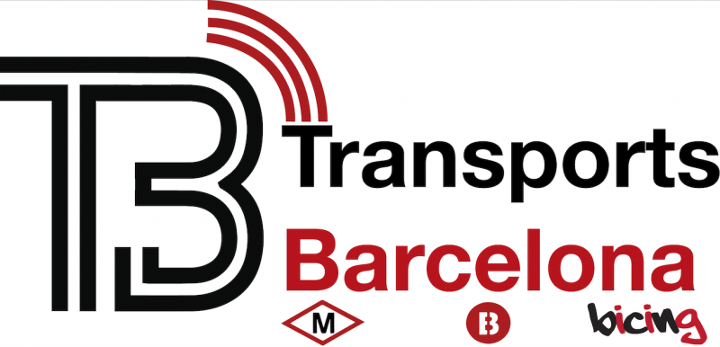
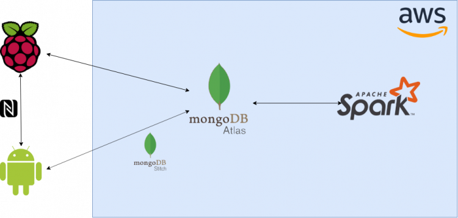

Logo de la aplicación.

## Contents

* [1 Introducción](#Introducci.C3.B3n)
  + [1.1 ¿Qué es TransportsBarcelona?](#.C2.BFQu.C3.A9_es_TransportsBarcelona.3F)
  + [1.2 Elementos tecnológicos usados](#Elementos_tecnol.C3.B3gicos_usados)
  + [1.3 Arquitectura de la aplicación](#Arquitectura_de_la_aplicaci.C3.B3n)
* [2 Front-end](#Front-end)
  + [2.1 Android App](#Android_App)
  + [2.2 NFC](#NFC)
  + [2.3 APIs](#APIs)
  + [2.4 Mongo Stitch](#Mongo_Stitch)
* [3 Raspberry Pi](#Raspberry_Pi)
  + [3.1 Raspberry Pi](#Raspberry_Pi_2)
  + [3.2 Periféricos](#Perif.C3.A9ricos)
* [4 Back-end](#Back-end)
  + [4.1 Amazon Web Services EC2 instances](#Amazon_Web_Services_EC2_instances)
  + [4.2 MongoDB Atlas](#MongoDB_Atlas)
  + [4.3 Apache Spark](#Apache_Spark)

## Introducción[[edit](/pti/index.php?title=Categor%C3%ADa:TransportBarcelona&veaction=edit&section=1 "Edit section: Introducción") | [edit source](/pti/index.php?title=Categor%C3%ADa:TransportBarcelona&action=edit&section=1 "Edit section: Introducción")]

### ¿Qué es TransportsBarcelona?[[edit](/pti/index.php?title=Categor%C3%ADa:TransportBarcelona&veaction=edit&section=2 "Edit section: ¿Qué es TransportsBarcelona?") | [edit source](/pti/index.php?title=Categor%C3%ADa:TransportBarcelona&action=edit&section=2 "Edit section: ¿Qué es TransportsBarcelona?")]

Nuestro proyecto consiste en una apliación móvil que pemite a los usuarios de transporte público de Barcelona y su área metropolitana planificar rutas y pagar el billete en cada trayecto realizado. Además permite obtener predicciones de demanda mediante el uso de herramientas de machine learning a través del análisis de los datos de trayectos realizados previamente.

### Elementos tecnológicos usados[[edit](/pti/index.php?title=Categor%C3%ADa:TransportBarcelona&veaction=edit&section=3 "Edit section: Elementos tecnológicos usados") | [edit source](/pti/index.php?title=Categor%C3%ADa:TransportBarcelona&action=edit&section=3 "Edit section: Elementos tecnológicos usados")]

Para la creaciónde la aplicación se ha utilizado Android Studio. La aplicación se basa en la versión 7.1.1 de Android (Nougat). Se ha utilizado una Raspberry Pi Model 3B+ como base para la creación del terminal de validación usando el lector NFC MFRC522 de Mifare y también de un LCD. En el back-end hemos utilizado el servicio Elastic Cloud Compute (EC2) de Amazon Web Services, una base de datos MongoDB Atlas (alojada en la nube) y también Apache Spark para realizar las tareas de machine learning.

### Arquitectura de la aplicación[[edit](/pti/index.php?title=Categor%C3%ADa:TransportBarcelona&veaction=edit&section=4 "Edit section: Arquitectura de la aplicación") | [edit source](/pti/index.php?title=Categor%C3%ADa:TransportBarcelona&action=edit&section=4 "Edit section: Arquitectura de la aplicación")]

Diagrama de la arquitectura de la aplicación con las tecnologías usadas y las dependencias entre ellas.

La aplicación se compone de una aplicación Android y una Raspberry Pi en el front-end. En el back-end se usa una base de datos MongoDB para almacenar la información de trayectos y usuarios junto a Apache Spark para las tareas de machine learning.

La Raspberry Pi y la aplicación se comunican entre ellas mediante NFC cada vez que se quiere validar un trayecto. Ambas se comunican con la base datos alojada en el servicio cloud de MongoDB: Atlas. La aplcación se conecta mediante la API integrada de Stitch mientras que la Raspberry lo hace a través de un conector basado en Python (pymongo).

Apache Spark también se conecta a Atlas ya que es la fuente de los datos que se usan para entrenar el algoritmo de machine learning empleado.

## Front-end[[edit](/pti/index.php?title=Categor%C3%ADa:TransportBarcelona&veaction=edit&section=5 "Edit section: Front-end") | [edit source](/pti/index.php?title=Categor%C3%ADa:TransportBarcelona&action=edit&section=5 "Edit section: Front-end")]

### Android App[[edit](/pti/index.php?title=Categor%C3%ADa:TransportBarcelona&veaction=edit&section=6 "Edit section: Android App") | [edit source](/pti/index.php?title=Categor%C3%ADa:TransportBarcelona&action=edit&section=6 "Edit section: Android App")]

Se ha programado una aplicación Android utilizando Android Studio y programada en Java. La aplicación parte de la versión 7.1.1 de Android (Nougat).

La aplicación tiene la función principal de permitir a los usuarios validar el pago en un terminal. Para poder realizar el pago se hace uso de tecnología NFC que por defecto está disponible en la gran mayoría de dispositivos móviles que se venden en la actualidad.
En la apliación también se integran varias APIs para permitir el uso por ejemplo de Mapas.

La aplicación también permite ver e incrementar el saldo del usuario. Mediante MongoDB Stitch se realizan las transacciones directamente a la base de datos junto a la gestión de usuarios y controlar los accesos.

### NFC[[edit](/pti/index.php?title=Categor%C3%ADa:TransportBarcelona&veaction=edit&section=7 "Edit section: NFC") | [edit source](/pti/index.php?title=Categor%C3%ADa:TransportBarcelona&action=edit&section=7 "Edit section: NFC")]

En la aplicación utilizamos dos modos distintos de comunicación NFC: reader/writer mode y card emulation mode. Reader/writer mode permite al dispositivo NFC leer y escribir tags NFC pasivos. Card emulation mode permite al dispositivo NFC actuar como una tarjeta NFC. Al emular el comportamiento de una tarjeta NFC, esta puede ser accedida desde un lector NFC externo (en nuestro caso el terminal de validación).

### APIs[[edit](/pti/index.php?title=Categor%C3%ADa:TransportBarcelona&veaction=edit&section=8 "Edit section: APIs") | [edit source](/pti/index.php?title=Categor%C3%ADa:TransportBarcelona&action=edit&section=8 "Edit section: APIs")]

Hemos utilizado dos APIs en la aplicación: Maps SDK for Android y Google Directions API.

La primera permite mostrar un mapa del mundo en nuestra aplicación. Puesto que la aplicación está pensada para Barcelona, este será el punto inicial. Esta API requiere una API Key. Para obtenerla basta con solicitarla a Google. Una vez tenemos la API Key ya podemos mostrar el mapa. La API nos permite también añadir marcadores y crear líneas que se muestren en el mapa.

La segunda API también requiere una API Key para poder trabajar con ella.Para obtenerla deberemos crear una cuenta en Google Cloud Platform. Desde esta plataforma se nos permitirá monitorizar el número de llamadas a la API. Debemos transmitir información de origen, destino y modo de transporte de la ruta elegidos a la API.

### Mongo Stitch[[edit](/pti/index.php?title=Categor%C3%ADa:TransportBarcelona&veaction=edit&section=9 "Edit section: Mongo Stitch") | [edit source](/pti/index.php?title=Categor%C3%ADa:TransportBarcelona&action=edit&section=9 "Edit section: Mongo Stitch")]

MongoDB Stitch es una plataforma serverless construida sobre MongoDB Atlas, integrando automáticamente la conexión a la base de datos desde la aplicación.

Antes de poder utilizar Stitch debemos configurarlo en un clúster de MongoDB Atlas. Para ello definimos el método de autentificació que queremos usar de entre los que nos ofrece Stitch (en nuestro caso de manera anónima). También definimos a qué colecciones tendrá acceso Stitch y los privilegios que tendrá sobre los documentos de estas colecciones.

Stitch nos permite conocer qué información dispone de los diferentes usuarios que han hecho login. Estos datos nos pueden ser muy útiles a la hora de revisar los logs para poder controlar si los accesos son correctos y detectar posibles fallos y errores que se hayan producido.

## Raspberry Pi[[edit](/pti/index.php?title=Categor%C3%ADa:TransportBarcelona&veaction=edit&section=10 "Edit section: Raspberry Pi") | [edit source](/pti/index.php?title=Categor%C3%ADa:TransportBarcelona&action=edit&section=10 "Edit section: Raspberry Pi")]

### Raspberry Pi[[edit](/pti/index.php?title=Categor%C3%ADa:TransportBarcelona&veaction=edit&section=11 "Edit section: Raspberry Pi") | [edit source](/pti/index.php?title=Categor%C3%ADa:TransportBarcelona&action=edit&section=11 "Edit section: Raspberry Pi")]

La Raspberry se ha usado para simular un terminal de pago que se ajuste a los requerimientos técnicos de nuestro proyecto. Para ello hemos utilizado una Raspberry Pi Model 3B+, aunque cualquier otro modelo hubiese funcionado correctamente.

Conjunto del Hardware utilizado.

### Periféricos[[edit](/pti/index.php?title=Categor%C3%ADa:TransportBarcelona&veaction=edit&section=12 "Edit section: Periféricos") | [edit source](/pti/index.php?title=Categor%C3%ADa:TransportBarcelona&action=edit&section=12 "Edit section: Periféricos")]

Se ha usado un lector NFC modelo MFRC522 de Mifare junto a una pantalla LCD.

El lector NFC, utilizado para la lectura y escritura de una etiqueta NFC, conectándolo a la Raspberry Pi mediante puerto serie. El display LCD 16x2 se conecta a la Raspberry mediante I2C (un protocolo serie simplificado a dos cables).

Imagen de los dos periféricos en funcionamiento.

El display no era estrictamente necesario para el proyecto, no obstante aportaba estética visual al proyecto, asemejándose más a una terminal de pago real. En la Raspberry es necesario activar los protocolos de comunicación ya que, por defecto, están cerrados.

## Back-end[[edit](/pti/index.php?title=Categor%C3%ADa:TransportBarcelona&veaction=edit&section=13 "Edit section: Back-end") | [edit source](/pti/index.php?title=Categor%C3%ADa:TransportBarcelona&action=edit&section=13 "Edit section: Back-end")]

### Amazon Web Services EC2 instances[[edit](/pti/index.php?title=Categor%C3%ADa:TransportBarcelona&veaction=edit&section=14 "Edit section: Amazon Web Services EC2 instances") | [edit source](/pti/index.php?title=Categor%C3%ADa:TransportBarcelona&action=edit&section=14 "Edit section: Amazon Web Services EC2 instances")]

Se han usado dos máquinas virtuales alojadas en AWS. Una con la versión 18.04 de Ubuntu y la otra con 16.04 de Ubuntu (esto se debe a que no fueron configuradas a la vez y mas tarde se reaprovechó una máquina ya creada en lugar de lanzar una nueva).

Para conectarnos a las MVs por primera vez es preciso generar un par de claves. Idealmente hay que generar un par de claves distinto por cada máquina virtual, pero no hay impedimento para usar varias veces un mismo juego de claves.

Se han hecho algunos ajustes en las políticas de seguridad (puertos) para permitir algunas conexiones entrantes adicionales que nos permitan sacar mayor provecho de las herramientas que ofrece Spark. En la sección sobre Apache Spark se detallan estos cambios.

En ambas máquinas se ha instalado la vesión 8 de Java, concretamente el paquete *openjdk-8-jdk*. También la Python3 y por supuesto Apache Spark (versión 2.4.4). Apache Spark ha sido instalados mediante el uso de la herrmaienta Curl, ya que no disponemos de entorno de escritorio en estas máquinas virtuales.

### MongoDB Atlas[[edit](/pti/index.php?title=Categor%C3%ADa:TransportBarcelona&veaction=edit&section=15 "Edit section: MongoDB Atlas") | [edit source](/pti/index.php?title=Categor%C3%ADa:TransportBarcelona&action=edit&section=15 "Edit section: MongoDB Atlas")]

En lugar de una solución más tradicional usando MongoDB Server, se ha utilizado el servicio cloud de MongoDB: MongoDB Atlas. Este servicio permite alojar un clúster que usar como base de datos sobre Amazon Web Services, Google Cloud Platform o Azure de Microsoft. Esta es una solución orientada a pequeños proyectos o a pruebas de concepto como la realizada.

Adicionalmente nos permitía una conexión directa entre la base de datos y la aplicación mediante Stitch y también nos simplificaba mucho el trabajo de conexión de la Raspberry Pi y Apache Spark con la base de datos al integrar funcionalidades típicas de una API externa.

Vista principal del clúster en MongoDB Atlas.

Trabajamos con una colección para almacenar los datos de cada usuario de la aplicación y otra conexión donde guardamos distintos parámetros de cada trayecto para poder entrenar el algoritmo de machine learning posteriormente (día de la semana, hora, medio de transporte, línea, meteorología y afluencia de pasajeros en el momento de la validación en esa línea).

### Apache Spark[[edit](/pti/index.php?title=Categor%C3%ADa:TransportBarcelona&veaction=edit&section=16 "Edit section: Apache Spark") | [edit source](/pti/index.php?title=Categor%C3%ADa:TransportBarcelona&action=edit&section=16 "Edit section: Apache Spark")]

Hemos utilizado la herramienta Apache Spark para realizar machine learning sobre los datos que recogemos de cada trayecto. Usamos Spark en *Standalone Mode*, que consiste en la instalación de Spark en cada nodo que conforma el clúster. Instalamos la versión 2.4.4 de Spark en dos instancias EC2 de Amazon Web Services.

El clúster que hemos usado cuenta con un *master* que se encarga de la gestión de recursos del clúster. También contamos con dos *slaves* o trabajadores instanciados uno en cada una de las máquinas virtuales que aportan recursos de computación al clúster (1 GB cada uno). Hemos utilizado Pyhton 3 para realizar los scripts que más tarde hemos enviado al clúster para ser procesados allí.

Master y slave ofrecen una interfaz web desde la que se puede ver el estado de cada uno de los componentes del clúster, nos podemos conectar a esta interfaz mediante los puertos 8080 en el caso de la instancia master y 8081 en el caso de la instancia slave.

Interfaz Web del master de un clúster.

En cuanto al machine learning hemos utilizado el modelo de regresión lineal basándonos en la implementación que se ofrece en la web de Spark sobre MLlib. Nuestra implementación también guarda el modelo una vez entrenado para poder reutilizarlo en varias predicciones sin requerir volver a realizar el entrenamiento del mismo en cada ocasión.