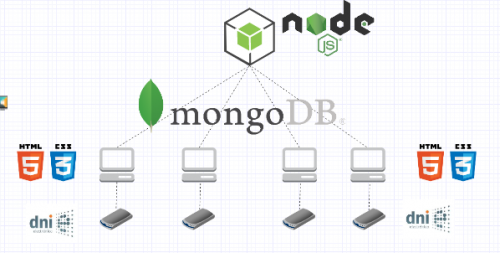
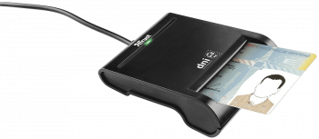
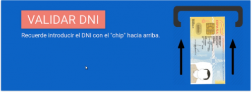
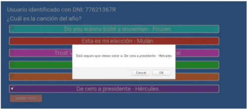

## Contents

* [1 Introducción](#Introducci.C3.B3n)
  + [1.1 ¿Qué es TrustVote?](#.C2.BFQu.C3.A9_es_TrustVote.3F)
* [2 Infraestructura](#Infraestructura)
  + [2.1 MongoDB](#MongoDB)
  + [2.2 NodeJS](#NodeJS)
  + [2.3 Lector DNI-e](#Lector_DNI-e)
* [3 Desarrolo y resultados](#Desarrolo_y_resultados)
  + [3.1 Aspecto visual](#Aspecto_visual)
  + [3.2 Interacción](#Interacci.C3.B3n)
  + [3.3 Identificación](#Identificaci.C3.B3n)
  + [3.4 Datos y gestión](#Datos_y_gesti.C3.B3n)
  + [3.5 Seguridad](#Seguridad)
* [4 Bibliografía](#Bibliograf.C3.ADa)

# Introducción[[edit](/pti/index.php?title=Categor%C3%ADa:TrustVote&veaction=edit&section=1 "Edit section: Introducción") | [edit source](/pti/index.php?title=Categor%C3%ADa:TrustVote&action=edit&section=1 "Edit section: Introducción")]

## ¿Qué es TrustVote?[[edit](/pti/index.php?title=Categor%C3%ADa:TrustVote&veaction=edit&section=2 "Edit section: ¿Qué es TrustVote?") | [edit source](/pti/index.php?title=Categor%C3%ADa:TrustVote&action=edit&section=2 "Edit section: ¿Qué es TrustVote?")]

Este proyecto consiste en un sistema electónico de votación. TrustVote se trata de un sistema electoral, que como el actual utiliza puntos de votación definidos y apuesta por mantener y mejorar las garantías del sistema actual.
El escenario principal es que el usuario acuda a un punto de votación y, con el soporte de un lector de DNI, se identifique y emita el voto en una pantalla táctil de uso intuitivo.
El sistema estará siempre offline para evitar ataques durante el periodo de elecciones. Cuando haya finalizado la jornada, el dispositivo cliente abrirá una única conexión segura con el servidor para transmitir los datos.
Este sistema está pensado para que pueda utilizarlo cualquier persona con un DNI 2.0 o posterior. En versiones posteriores está previsto permitir a personas sin DNIe introducir manualmente el número de identificación a través de un responsable del punto de voto.

# Infraestructura[[edit](/pti/index.php?title=Categor%C3%ADa:TrustVote&veaction=edit&section=3 "Edit section: Infraestructura") | [edit source](/pti/index.php?title=Categor%C3%ADa:TrustVote&action=edit&section=3 "Edit section: Infraestructura")]

## MongoDB[[edit](/pti/index.php?title=Categor%C3%ADa:TrustVote&veaction=edit&section=4 "Edit section: MongoDB") | [edit source](/pti/index.php?title=Categor%C3%ADa:TrustVote&action=edit&section=4 "Edit section: MongoDB")]

Esquema conceptual de las tecnologías de TrustVote

Los datos en MongoDB se almacenan en clúster. Un clúster es una agrupación de ordenadores, a menudo llamados en este contexto nodos. Los datos de cada colección se reparten entre los nodos, logrando así el soporte de cantidades masivas de datos.
Hay que tener en cuenta a la hora de almacenar datos, el tiempo que tarda una operación de escritura (creación, modificación o eliminación) en llevarse a cabo en MongoDB, se bloquea el acceso a toda la base de datos en la que se efectúa la operación, como solo se podrá votar en un ordenador, nos servirá para assegurar que no se hace ningún otro tipo de acceso a la base de datos.
Una de las grandes características de MongoDB es el escalado horizontal que se puede conseguir, si el almacenamiento del clúster llega a resultar escaso, siempre podemos añadir nuevos nodos aumentado así el escalado.
La replicación en MongoDB permite conseguir una altísima disponibilidad y tolerancia a fallos,
El formato de almacenamiento de los datos en Mongo DB no son las tablas ya que no existen las relaciones (NOSQL), los datos se almacenan en documentos y estos en colecciones, los documentos comparten un índice y se relacionan entre ellos de algún modo(decidido por nosotros).

En nuestra infraestructura, el servidor tendría una base de datos que contendría unicamente la unión de votos emitidos de todos los puntos de votación y cada nodo contendría 3 colecciones diferentes. La primera contendría el censo con los votantes y la información de si ya había ejercido su voto o no, la segunda contendría solamente los votos emitidos y la tercera contendría las preguntas y respuestas que se mostrarían en el programa.

En el momento de realizar la conexión segura con el servidor solamente se enviaría la colección con los votos emitidos independientes de los emisores de dichos votos.

## NodeJS[[edit](/pti/index.php?title=Categor%C3%ADa:TrustVote&veaction=edit&section=5 "Edit section: NodeJS") | [edit source](/pti/index.php?title=Categor%C3%ADa:TrustVote&action=edit&section=5 "Edit section: NodeJS")]

Node.js es una plataforma que se usa principalmente para desarrollar aplicaciones web usando Javascript en el servidor. Nos proporciona una manera fácil para construir un programa de red escalable, ya que en lugar de crear un nuevo hilo por cada conexión, esta dispara una ejecución de evento dentro del proceso del motor de Node.

Funciona de manera muy rápida, usa el motor v8 de Google, y está construido para funcionar de manera asíncrona, no se bloquea al recibir una petición de entrada/salida, funciona con eventos, y nos irá muy bien para hacer accesos a la base de datos MongoDB.

Permite a los desarrolladores escribir en javascript tanto en el lado del servidor como en el lado del cliente, de esta forma, no es necesario conocer varios lenguajes de programación.

## Lector DNI-e[[edit](/pti/index.php?title=Categor%C3%ADa:TrustVote&veaction=edit&section=6 "Edit section: Lector DNI-e") | [edit source](/pti/index.php?title=Categor%C3%ADa:TrustVote&action=edit&section=6 "Edit section: Lector DNI-e")]

Lector de Dni-e

El lector de DNI-e es un dispositivo electrónico que se utiliza para la obtención de datos, firmas digitales...
En TrustVote lo utilizamos para obtener los datos del DNI-e introducido, esos datos son procesados a través de un script para comprovar la validez del mismo y si la persona se encuentra en el censo.

# Desarrolo y resultados[[edit](/pti/index.php?title=Categor%C3%ADa:TrustVote&veaction=edit&section=7 "Edit section: Desarrolo y resultados") | [edit source](/pti/index.php?title=Categor%C3%ADa:TrustVote&action=edit&section=7 "Edit section: Desarrolo y resultados")]

## Aspecto visual[[edit](/pti/index.php?title=Categor%C3%ADa:TrustVote&veaction=edit&section=8 "Edit section: Aspecto visual") | [edit source](/pti/index.php?title=Categor%C3%ADa:TrustVote&action=edit&section=8 "Edit section: Aspecto visual")]

Inicialmente acordamos mantener las bases de material polls. Era sencillo, colorido e intuitivo pero necesitabamos adaptarlo al uso táctil y para todo tipo de usuarios. Además necesitábamos dividir el programa en 2 partes claramente diferenciadas. Por un lado la funcionalidad de crear diferentes encuestas y por otro la de consultarlas y emitir voto sobre las mismas.
Claramente diferenciadas porque estaban destinadas a grupos de usuarios diferentes.
Por una parte los organizadores de una votación y por otra a los usuarios de dicha votación.

Tras dividir el programa decidimos dejar la parte de creación de encuestas prácticamente igual que en la versión original a nivel visual, eso sí, añadiendo la opción de elegir el color con que se mostrará la opción en la encuesta.
En este caso el aspecto es algo más complejo y son necesarios los periféricos habituales, ratón y teclado, para su correcto uso.
Permite introducir la pregunta, las posibles opciones y un color para cada una de ellas.
La segunda parte del programa iba dirigida a todo tipo de usuarios con todo tipo de conocimientos, edades, problemas, enfermedades y particularidades.
Decidimos hacer opciones claras, grandes, contrastadas con el fondo por un recuadro blanco, fácilmente seleccionables con el dedo.
Esta parte del programa se pensó para utilizarse únicamente con pantalla táctil.

Incluimos, además, una primera pantalla de identificación utilizando los colores rojo y verde para indicar con más facilidad el significado de las opciones con una única opción posible para maximizar la facilidad de uso además de unas instrucciones ilustradas de cómo debe introducirse el DNIe en el lector.

## Interacción[[edit](/pti/index.php?title=Categor%C3%ADa:TrustVote&veaction=edit&section=9 "Edit section: Interacción") | [edit source](/pti/index.php?title=Categor%C3%ADa:TrustVote&action=edit&section=9 "Edit section: Interacción")]

Lector de Dni-e

Lo primero que pensamos y que teníamos claro desde un principio respecto a cómo los usuarios debían utilizar el programa es que sería a través de una pantalla táctil dado que el sistema exige un dispositivo lo más robusto posible y que fuesen cuales fuesen las funcionalidades finales debían poder llevarse a cabo rápido, de forma fácil e intuitiva con el mínimo número de “clicks” posibles.
Especialmente nos preocupaba la parte del programa de voto dado que el generador de encuestas estaba destinado a un tipo de usuario capaz de manejarse con soltura en un sistema informático. Sin embargo el voto lo debía poder emitir cualquier tipo de persona incluyendo personas con capacidades visuales limitadas o personas que cariñosamente apodamos “dinosaurios digitales”.
Nuestro objetivo era que con solo 2 “clicks” pudiéramos emitir el voto de forma que el sistema fuese muy rápido además de sencillo.
Pese a que queríamos llevar a cabo la máxima simplicidad e intuitividad posible, debido al carácter irrestituible del ejercicio de voto, consideramos absolutamente necesario introducir constantemente avisos de confirmación para cada opción tomada lo que incrementó el número de pulsaciones necesarias a 4.

Una para seleccionar la opción, otra para confirmar, una tercera presionar la opción de emitir el voto seleccionado y una más para confirmar la emisión de voto.
Aún con este incremento en el número de selecciones y la ligera reducción de simplicidad seguimos considerando TrustVote un sistema muy fácil de utilizar por cualquier persona.

## Identificación[[edit](/pti/index.php?title=Categor%C3%ADa:TrustVote&veaction=edit&section=10 "Edit section: Identificación") | [edit source](/pti/index.php?title=Categor%C3%ADa:TrustVote&action=edit&section=10 "Edit section: Identificación")]

Lector de Dni-e

En cuanto a la identificación debía ser por DNI-electrónico. Para conseguirlo encotnramos un programa en linux mediante terminal que leía los valores del DNI-e de la primera capa y los retornaba también por terminal.

Dado que siempre retornaba el mismo formato pudimos recortar específicamente el número de DNI entre todos los datos que ofrecía, guardarlo en un fichero local y leerlo desde la aplicación.
Con lo anterior en mente hicimos un script que ejecutaba el comando cada 3 segundos y si el número de DNI era diferentes al último introducido lo guardabamos en un documento local. Desde la aplicación solo necesitábamos comprobar el número del DNI del documento contra la base de datos para verificar si esa identificación podía ejercer su derecho a voto.
El resultado fue sorprendentemente bueno, fluido y cómodo de utilizar, transparente al usuario y muy preciso.

## Datos y gestión[[edit](/pti/index.php?title=Categor%C3%ADa:TrustVote&veaction=edit&section=11 "Edit section: Datos y gestión") | [edit source](/pti/index.php?title=Categor%C3%ADa:TrustVote&action=edit&section=11 "Edit section: Datos y gestión")]

Como hemos comentado utilizamos MongoDB. Nos encontramos ante una base de datos no relacional que, en lugar de tener tablas y tuplas, divide los datos en colecciones y documentos más sencillos de manejar que lo visto en SQL. Permite también la escalabilidad, una mejora de rendimiento, y gran disponibilidad. Una buena elección para el proyecto.

En cuanto a datos se refiere, tenemos dos grandes focos: el censo, que permite reconocer a la persona a la hora de votar, y los votos, que deben desacoplarse de cualquier identificación previa. Con ese razonamiento, creamos dos colecciones totalmente independientes con los atributos específicos de cada cual.
En la colección CENSO se incluye: nombre, apellidos, dni, fecha de nacimiento, nodo de votación y un booleano. En la colección VOTOS, solo recopilamos el partido.

Decidimos que el servidor tendría una base de datos que contendría únicamente la unión de votos emitidos de todos los puntos de votación y cada nodo contendría 3 colecciones diferentes. La primera contendría el censo con los votantes y la información de si ya había ejercido su voto o no, la segunda contendría solamente los votos emitidos y la tercera contendría las preguntas y respuestas que se mostrarían en el programa.

En el momento de realizar la conexión segura con el servidor solamente se enviaría la colección con los votos emitidos independientes de los emisores de dichos votos.

## Seguridad[[edit](/pti/index.php?title=Categor%C3%ADa:TrustVote&veaction=edit&section=12 "Edit section: Seguridad") | [edit source](/pti/index.php?title=Categor%C3%ADa:TrustVote&action=edit&section=12 "Edit section: Seguridad")]

Desde un principio la seguridad fue el punto que más nos preocupaba.
Inicialmente y dadas las características del proyecto del proyecto necesitábamos tener las comunicaciones encriptadas, autenticar puntos de voto y aplicar técnicas de hashing.

Decidimos utilizar llave simétrica (AES) para encriptar los datos y llave asimétrica (Diffie-Hellman) para encriptar la llave simétrica.
La razón por la cual elegimos Diffie-Hellman es porqué este algoritmo no requiere de una autoridad certificadora y con el objetivo de tener un sistema fácilmente escalable queríamos complicar la estructura lo mínimo posible.

En cuanto a las técnicas de hashing, para garantizar que no se pudiese relacionar voto y votante queríamos hashear los datos. Y obtenerlos por fuerza bruta. Una mala idea que inicialmente no teníamos clara y la mantuvimos así hasta conocer mejor mongo y dar con algo mejor.
Respecto a la autenticación queríamos usar tokens para garantizar que solamente los puntos autorizados podían conectarse al servidor central.
Tras investigar un poco en el resto de direcciones llegamos a la conclusión de que mongo no disponía de soporte para el algoritmo de clave asimétrica Diffie-Hellman y que el único soporte que ofrecía en sus versiones básicas era SSL (AES+ASR).
Debido al cambio nos vimos obligados también a incluir una autoridad certificadora propia en la estructura.

Respecto a la organización de las colecciones y con ellas los datos de los usuarios, decidimos modificar la estructura separando los datos de votantes y votaciones en colecciones diferentes e independientes que se modifican con cada votación, de forma que en el envío los datos serían independientes de los votantes.
Con ello desaparecía la necesidad de hashear los datos de las colecciones aunque no descartamos hashear los datos de la tabla de votantes para garantizar que no se pudiese saber si alguien había votado ya o no obteniendo los datos de forma ilícita.

Respecto a los tokens dejaban de ser necesarios dado que los certificados digitales emitidos por la nueva y necesaria autoridad certificadora ya cumplen con la función de autenticación de los puntos de votación.
Finalmente creamos la autoridad certificadora y firmamos los certificados de los puntos de voto y del servidor central y utilizamos las librerias SSL incluidas en mongo para implementar la encriptación.

# Bibliografía[[edit](/pti/index.php?title=Categor%C3%ADa:TrustVote&veaction=edit&section=13 "Edit section: Bibliografía") | [edit source](/pti/index.php?title=Categor%C3%ADa:TrustVote&action=edit&section=13 "Edit section: Bibliografía")]

* Documentación DNI-e  
  <https://www.incibe.es/extfrontinteco/img/File/intecocert/dnie/pdf/guiades.pdf> '
* Controlador Java del DNI-e  
  <https://www.muycomputer.com/2012/10/10/acceso-a-dnie-mas-facil-para-todos-gracias-a-una-api-java/> '
* Front-end API  
  <https://github.com/nearbycoder/materialpoll> '
* Problemas del voto electrónico  
  <https://www.infobae.com/opinion/2016/10/31/problemas-que-el-voto-electronico-trae-y-los-que-no-evita/> '
* Países que han implementado voto electrónico   
  <http://www.euskadi.eus/botoelek/otros_paises/ve_mundo_impl_c.htm>
* Documentación oficial de *NodeJS*   
  <https://nodejs.org/en/docs/> '
* Documentación oficial de *MongoDB*   
  <https://docs.mongodb.com/> '