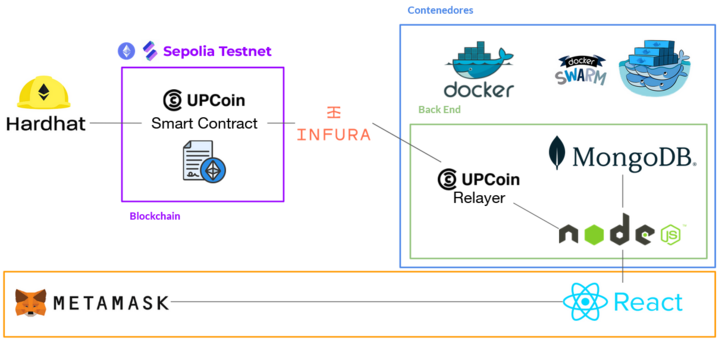
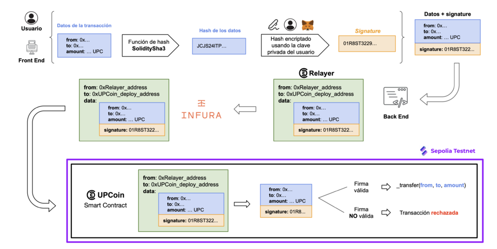

[](/pti/index.php/File:UPCoin-logo.png "UPCoin.")

## Contents

* [1 Introducción](#Introducci.C3.B3n)
  + [1.1 ¿Qué es UPCoin?](#.C2.BFQu.C3.A9_es_UPCoin.3F)
* [2 Tecnologías](#Tecnolog.C3.ADas)
  + [2.1 Frontend](#Frontend)
  + [2.2 Backend](#Backend)
    - [2.2.1 Tecnologias usadas para el backend](#Tecnologias_usadas_para_el_backend)
    - [2.2.2 Estructura del backend](#Estructura_del_backend)
    - [2.2.3 Seguridad en el backend](#Seguridad_en_el_backend)
  + [2.3 Creación de UPCoin](#Creaci.C3.B3n_de_UPCoin)
    - [2.3.1 Base Tecnológica de UPCoin](#Base_Tecnol.C3.B3gica_de_UPCoin)
    - [2.3.2 Concepto de tarifa de Gas](#Concepto_de_tarifa_de_Gas)
    - [2.3.3 Meta-Transacciones basadas en firmas y Relayer UPCoin](#Meta-Transacciones_basadas_en_firmas_y_Relayer_UPCoin)
    - [2.3.4 Despliegue del Smart Contract en la Sepolia Testnet](#Despliegue_del_Smart_Contract_en_la_Sepolia_Testnet)
    - [2.3.5 Diagrama de flujo de transacciones UPCoin](#Diagrama_de_flujo_de_transacciones_UPCoin)
  + [2.4 Uso de Contenedores](#Uso_de_Contenedores)
    - [2.4.1 Contenedores](#Contenedores)
    - [2.4.2 Docker](#Docker)
    - [2.4.3 Contenerización](#Contenerizaci.C3.B3n)
      * [2.4.3.1 Creación de Imágenes](#Creaci.C3.B3n_de_Im.C3.A1genes)
      * [2.4.3.2 Comunicación entre Componentes](#Comunicaci.C3.B3n_entre_Componentes)
    - [2.4.4 Orquestación de Contenedores](#Orquestaci.C3.B3n_de_Contenedores)
    - [2.4.5 Docker Swarm](#Docker_Swarm)
      * [2.4.5.1 Aspectos Clave](#Aspectos_Clave)

# Introducción[[edit](/pti/index.php?title=Categor%C3%ADa:UPCoin&veaction=edit&section=1 "Edit section: Introducción") | [edit source](/pti/index.php?title=Categor%C3%ADa:UPCoin&action=edit&section=1 "Edit section: Introducción")]

UPCoin es un proyecto innovador diseñado para transformar la economía dentro del entorno universitario de la Universitat Politècnica de Catalunya, modernizando las formas de pago y promoviendo la adopción de tecnologías avanzadas.

El proyecto se basa en la implementación de blockchain para crear un ecosistema económico propio, introduciendo un token exclusivo, el UPCoin.

## ¿Qué es UPCoin?[[edit](/pti/index.php?title=Categor%C3%ADa:UPCoin&veaction=edit&section=2 "Edit section: ¿Qué es UPCoin?") | [edit source](/pti/index.php?title=Categor%C3%ADa:UPCoin&action=edit&section=2 "Edit section: ¿Qué es UPCoin?")]

UPCoin es un token exclusivo diseñado para la UPC que permite a los usuarios realizar transacciones, adquirir productos y servicios.

# Tecnologías[[edit](/pti/index.php?title=Categor%C3%ADa:UPCoin&veaction=edit&section=3 "Edit section: Tecnologías") | [edit source](/pti/index.php?title=Categor%C3%ADa:UPCoin&action=edit&section=3 "Edit section: Tecnologías")]

[](/pti/index.php/File:TecnologiesUPCoin.PNG)

## Frontend[[edit](/pti/index.php?title=Categor%C3%ADa:UPCoin&veaction=edit&section=4 "Edit section: Frontend") | [edit source](/pti/index.php?title=Categor%C3%ADa:UPCoin&action=edit&section=4 "Edit section: Frontend")]

**Diseño de la web**

La web tiene 2 funcionalidades principales, la parte del cliente y la de administración.

-Parte del cliente: No requiere de autenticación, en esta parte el cliente puede utilizar la página de la tienda donde puede añadir productos a un carrito para comprarlos y los servicios relacionados con hacer transacciones en la blockchain como hacer transferencias de UPCoins a otra wallet de metamask, pagar los productos del carrito, reclamar sus UPCoins iniciales, etc.

-Parte de administración: Esta parte requiere autenticación con usuario y password, al entrar a las páginas de gestión se comprueban las cookies del navegador del usuario. Las funcionalidades que ofrece esta parte es modificar la base de datos, se pueden añadir o eliminar productos, y también modificar el precio o la imagen de cada producto. Este apartado también permite registrar nuevos usuarios para poder utilizar las funcionalidades anteriores. El usuario por defecto es username: adm, password: adm.

**Estructura del frontend**

-package.json: Este fichero se encarga de especificar las dependencias del proyecto y que versión de las dependencias utiliza. También define scripts de react.

-public/index.html: Punto de entrada del navegador. Contiene el elemento root desde donde se renderiza la aplicación y es el punto de conexión entre react y el navegador.

-src/App.js: Es el componente principal de la aplicación, incluye los otros componentes, es donde se definen las rutas a las páginas y maneja el estado de la aplicación.

-src/components: En esta carpeta se definen los componentes de la aplicación. Dentro los componentes se clasifican por los componentes de autenticación, pagos, productos. Aquí también encontramos los estilos.

-src/pages: En esta carpeta encontramos las páginas de la web, las páginas agrupan diferentes componentes para ofrecer una funcionalidad concreta, el cliente puede interactuar con los componentes de la página para obtener un servicio. Las rutas están definidas en App.js.

-src/services: En esta carpeta se encuentran ficheros .js que ofrecen funciones que realizan llamadas de servicio para comunicarse con el backend y obtener una respuesta.

**React**

-Componentes: Permiten crear interfaces modulares y reutilizables facilitando así el mantenimiento de la app debido a que son independientes entre sí. Se pueden juntar varios componentes entre sí para crear una interfaz más compleja y que juntos ofrezcan una funcionalidad.

-Virtual DOM: DOM (Document Object Model) es una representación estructurada del contenido de una página web en forma de árbol de objetos a partir de la cual se puede manipular la estructura y el contenido de los ficheros. Virtual DOM es una optimización, al hacer un cambio se crea una nueva versión del Virtual DOM y se hace una comparación con la anterior. Finalmente en el DOM real solo se actualizan las partes que han cambiado de una versión a otra.

-Ficheros .jsx: Dejan escribir código HTML directamente en javascript, lo que facilita la forma de construir la interfaz.

-Hooks: Agregan una funcionalidad a un componente.

```
- useState: Permite agregar un estado
- useEffect: Permite manejar efectos secundarios y se ejecuta después de cada renderizado
- useRef: Crea una referencia que se mantiene durante todo el ciclo de vida del componente
- useContext: Permite acceder al contexto de react desde un componente, sirve para compartir datos globales en un árbol de componentes

```

-Renderizado declarativo: Permite definir el estado final describiendo cómo se tiene que ver la interfaz en cada estado en lugar de especificar paso por paso como cambiar la interfaz.

**Metamask**

Metamask es una wallet de criptomonedas que funciona como una extensión del navegador, diseñada para interactuar con la blockchain de Ethereum. Permite a los usuarios almacenar, enviar y recibir Ether o tokens ERC-20, así como conectarse a aplicaciones descentralizadas y participar en finanzas descentralizadas de manera sencilla y segura.

## Backend[[edit](/pti/index.php?title=Categor%C3%ADa:UPCoin&veaction=edit&section=5 "Edit section: Backend") | [edit source](/pti/index.php?title=Categor%C3%ADa:UPCoin&action=edit&section=5 "Edit section: Backend")]

### Tecnologias usadas para el backend[[edit](/pti/index.php?title=Categor%C3%ADa:UPCoin&veaction=edit&section=6 "Edit section: Tecnologias usadas para el backend") | [edit source](/pti/index.php?title=Categor%C3%ADa:UPCoin&action=edit&section=6 "Edit section: Tecnologias usadas para el backend")]

El backend usa dos tecnologías principales:

-Node.js se usa como entorno del backend, este proporciona un gran número de herramientas y librerías para el desarrollo web.

-MongDB se usa para la persistencia de los datos en el servidor, específicamente se guarda información sobre usuarios y sobre productos.

### Estructura del backend[[edit](/pti/index.php?title=Categor%C3%ADa:UPCoin&veaction=edit&section=7 "Edit section: Estructura del backend") | [edit source](/pti/index.php?title=Categor%C3%ADa:UPCoin&action=edit&section=7 "Edit section: Estructura del backend")]

El backend de la aplicación tiene dos tipos de llamadas principales.

**Llamadas relacionadas con los usuarios**
El backend proporciona 3 llamadas relacionadas con los usuarios:

-Login: permite a un usuario privilegiado autenticarse para gestionar la aplicación.

-Logout: permite a un usuario autenticado finalizar su sesión.

-Register: permite a un usuario autenticado crear un nuevo usuario.

**Llamadas relacionadas con los productos**
El backend proporciona 4 llamadas relacionadas con los productos:

-addProduct: permite añadir un nuevo producto a la base de datos.

-deleteProduct: permite eliminara un producto de la base de datos.

-modifyproduct: permite modificar un producto de la base de datos.

-dashboard: permite listar todos los productos de la base de datos.

### Seguridad en el backend[[edit](/pti/index.php?title=Categor%C3%ADa:UPCoin&veaction=edit&section=8 "Edit section: Seguridad en el backend") | [edit source](/pti/index.php?title=Categor%C3%ADa:UPCoin&action=edit&section=8 "Edit section: Seguridad en el backend")]

Otro componente que se ha tenido muy en cuenta durante el desarrollo del backend ha sido la seguridad de este, por este motivo se han implementado las siguientes políticas:

-Uso de hash y salt para guardar las contraseñas en la base de datos.

-Uso de cookies para hacer cualquier operación privilegiada en la aplicación.

-Cross-origin resource sharing (CORS) para restringir des de que orígenes se pueden hacer las peticiones.

-Desinfectar los inputs del usuario en busca de ataques de tipo Cross Site Scripting (XSS).

-Desinfectar los inputs del usuario en busca de ataques de tipo NOSQL injection.

-Protección contra ataques de fuerza bruta en el login de la aplicación.

-Eliminación de cabeceras de respuesta opcionales.

## Creación de UPCoin[[edit](/pti/index.php?title=Categor%C3%ADa:UPCoin&veaction=edit&section=9 "Edit section: Creación de UPCoin") | [edit source](/pti/index.php?title=Categor%C3%ADa:UPCoin&action=edit&section=9 "Edit section: Creación de UPCoin")]

### Base Tecnológica de UPCoin[[edit](/pti/index.php?title=Categor%C3%ADa:UPCoin&veaction=edit&section=10 "Edit section: Base Tecnológica de UPCoin") | [edit source](/pti/index.php?title=Categor%C3%ADa:UPCoin&action=edit&section=10 "Edit section: Base Tecnológica de UPCoin")]

UPCoin utiliza **Ethereum** como blockchain debido a su seguridad, descentralización y extenso ecosistema, ideal para proyectos basados en tokens. Implementa el estándar **ERC20**, que permite funcionalidades como consulta de saldos y transacciones. Para el desarrollo, pruebas y despliegue del smart contract, se empleó el framework **Hardhat**, reconocido por su potencia y facilidad de uso en entornos de desarrollo blockchain.

### Concepto de tarifa de Gas[[edit](/pti/index.php?title=Categor%C3%ADa:UPCoin&veaction=edit&section=11 "Edit section: Concepto de tarifa de Gas") | [edit source](/pti/index.php?title=Categor%C3%ADa:UPCoin&action=edit&section=11 "Edit section: Concepto de tarifa de Gas")]

La tarifa de gas es el coste a pagar para la ejecución de una transacción o contrato en la blockchain. Todas las transacciones tienen una tarifa de gas asociada, tanto en una blockchain local, en una testnet como en la mainnet, la cual ha de ser pagada por el usuario que envía la transacción, mediante el token nativo de la blockchain, ETH, SepoliaETH, etc.

En UPCoin se ha implementado un **modelo sin costes para los usuarios**, lo que significa que todas las transacciones realizadas a través de la aplicación web no generan ningún gasto para ellos. Esto ha sido posible gracias a la implementación de un sistema innovador en el ámbito de las transacciones en la blockchain: meta-transacciones basadas en firma, gestionadas mediante un Relayer.

### Meta-Transacciones basadas en firmas y Relayer UPCoin[[edit](/pti/index.php?title=Categor%C3%ADa:UPCoin&veaction=edit&section=12 "Edit section: Meta-Transacciones basadas en firmas y Relayer UPCoin") | [edit source](/pti/index.php?title=Categor%C3%ADa:UPCoin&action=edit&section=12 "Edit section: Meta-Transacciones basadas en firmas y Relayer UPCoin")]

El sistema de **meta-transacciones permite** que un **Relayer** cubra las tarifas de gas, actuando como intermediario entre el usuario y la blockchain. Este Relayer encapsula los datos de la transacción que el usuario desea realizar en una transacción propia, que es enviada a la blockchain en su nombre. Al ser el Relayer quien envía la transacción, es también quien asume la tarifa de gas correspondiente.

Para garantizar la seguridad y evitar cualquier manipulación de datos, los usuarios firman un hash con la información relevante de la transacción, denominado **signature**. Cuando el contrato inteligente de UPCoin recibe toda la información enviada por el Relayer, valida la firma y, si esta es correcta, procede a ejecutar la transacción. Este enfoque asegura un proceso seguro, eficiente y completamente libre de costes para el usuario.

### Despliegue del Smart Contract en la Sepolia Testnet[[edit](/pti/index.php?title=Categor%C3%ADa:UPCoin&veaction=edit&section=13 "Edit section: Despliegue del Smart Contract en la Sepolia Testnet") | [edit source](/pti/index.php?title=Categor%C3%ADa:UPCoin&action=edit&section=13 "Edit section: Despliegue del Smart Contract en la Sepolia Testnet")]

Como paso final en el desarrollo e implementación de UPCoin, hemos migrado el proyecto a la **testnet de Sepolia**, un entorno prácticamente idéntico a la **mainnet** de Ethereum. Esta testnet permite realizar pruebas de contratos inteligentes y aplicaciones descentralizadas (dApps) sin incurrir en costos reales, ya que utiliza un token sin valor económico para cubrir las tarifas de gas, lo que facilita la validación del comportamiento de UPCoin antes de su despliegue en la red principal.

Para interactuar con la testnet, se utilizó **Infura**, un servicio que proporciona acceso remoto a la red Ethereum sin necesidad de ejecutar nodos completos. Infura simplifica el proceso de conexión con Sepolia y facilita el despliegue y la interacción con el contrato inteligente de UPCoin, integrándose con Web3.js en el backend, lo que nos permite realiza las transacciones.

Con el smart Contract de UPCoin desplegado en la testnet de Sepolia, hemos asegurado que UPCoin funcione correctamente en un entorno similar al de la mainnet, reflejando con precisión las condiciones bajo las cuales operan criptomonedas más conocidas, lo que nos permite validar su seguridad, eficiencia y fiabilidad antes de su lanzamiento definitivo.

### Diagrama de flujo de transacciones UPCoin[[edit](/pti/index.php?title=Categor%C3%ADa:UPCoin&veaction=edit&section=14 "Edit section: Diagrama de flujo de transacciones UPCoin") | [edit source](/pti/index.php?title=Categor%C3%ADa:UPCoin&action=edit&section=14 "Edit section: Diagrama de flujo de transacciones UPCoin")]

A continuación se presenta un diagrama de flujo que ilustra todo el proceso involucrado en el ciclo de vida de una transacción de UPCoin. Este diagrama abarca desde la inicialización de la transacción por parte del usuario hasta su ejecución final en la blockchain a través del **Relayer**, cubriendo los pasos clave, como la firma de la transacción, la validación de la firma en el contrato inteligente, y la ejecución final de la operación.

[](/pti/index.php/File:DFT-UPCoin.png)

## Uso de Contenedores[[edit](/pti/index.php?title=Categor%C3%ADa:UPCoin&veaction=edit&section=15 "Edit section: Uso de Contenedores") | [edit source](/pti/index.php?title=Categor%C3%ADa:UPCoin&action=edit&section=15 "Edit section: Uso de Contenedores")]

### Contenedores[[edit](/pti/index.php?title=Categor%C3%ADa:UPCoin&veaction=edit&section=16 "Edit section: Contenedores") | [edit source](/pti/index.php?title=Categor%C3%ADa:UPCoin&action=edit&section=16 "Edit section: Contenedores")]

Para este proyecto se decidió utilizar contenedores con el objetivo de garantizar aislamiento, seguridad, portabilidad y escalabilidad. Esta elección permite gestionar de forma eficiente las diferentes partes del sistema y experimentar con una tecnología ampliamente adoptada en la industria.

### Docker[[edit](/pti/index.php?title=Categor%C3%ADa:UPCoin&veaction=edit&section=17 "Edit section: Docker") | [edit source](/pti/index.php?title=Categor%C3%ADa:UPCoin&action=edit&section=17 "Edit section: Docker")]

Se utilizó Docker como herramienta principal para implementar la contenerización debido a su robustez, popularidad y relevancia en proyectos profesionales.

### Contenerización[[edit](/pti/index.php?title=Categor%C3%ADa:UPCoin&veaction=edit&section=18 "Edit section: Contenerización") | [edit source](/pti/index.php?title=Categor%C3%ADa:UPCoin&action=edit&section=18 "Edit section: Contenerización")]

El proceso de contenerización se dividió en dos etapas:

#### Creación de Imágenes[[edit](/pti/index.php?title=Categor%C3%ADa:UPCoin&veaction=edit&section=19 "Edit section: Creación de Imágenes") | [edit source](/pti/index.php?title=Categor%C3%ADa:UPCoin&action=edit&section=19 "Edit section: Creación de Imágenes")]

Se crearon tres imágenes:

* **Frontend**: Basada en Node 20 y Alpine Linux, una opción ligera y eficiente. Incluye los pasos de copiar dependencias, instalar paquetes, y exponer el puerto 8080.
* **Backend**: Similar al frontend, pero se enfocó en copiar únicamente los archivos JavaScript necesarios para las funcionalidades, utilizando el puerto 8081.
* **MongoDB**: Basada en una imagen preconstruida de Docker Hub (v4.0) debido a problemas de compatibilidad con hardware para versiones más recientes.

#### Comunicación entre Componentes[[edit](/pti/index.php?title=Categor%C3%ADa:UPCoin&veaction=edit&section=20 "Edit section: Comunicación entre Componentes") | [edit source](/pti/index.php?title=Categor%C3%ADa:UPCoin&action=edit&section=20 "Edit section: Comunicación entre Componentes")]

Se diseñó una arquitectura con tres componentes principales:

* Frontend
* Backend
* MongoDB (base de datos)

Se estableció una red entre backend y base de datos para permitir la comunicación interna. El frontend interactúa directamente con el nodo master, que redirige las solicitudes HTTP al backend.

### Orquestación de Contenedores[[edit](/pti/index.php?title=Categor%C3%ADa:UPCoin&veaction=edit&section=21 "Edit section: Orquestación de Contenedores") | [edit source](/pti/index.php?title=Categor%C3%ADa:UPCoin&action=edit&section=21 "Edit section: Orquestación de Contenedores")]

Inicialmente, se intentó usar Kubernetes como orquestador, pero surgieron problemas relacionados con `kubelet` debido a incompatibilidad de versiones. Finalmente, se optó por Docker Swarm, que proporciona una solución más simple y está integrada con Docker.

### Docker Swarm[[edit](/pti/index.php?title=Categor%C3%ADa:UPCoin&veaction=edit&section=22 "Edit section: Docker Swarm") | [edit source](/pti/index.php?title=Categor%C3%ADa:UPCoin&action=edit&section=22 "Edit section: Docker Swarm")]

El despliegue con Docker Swarm incluyó los siguientes pasos:

1. Definir el nodo master ejecutando el comando: `docker swarm init`.
2. Registrar los nodos workers con: `docker swarm join`.
3. Configurar los servicios en un archivo `compose.yaml` que detalla imágenes, puertos, redes y restricciones de despliegue.

#### Aspectos Clave[[edit](/pti/index.php?title=Categor%C3%ADa:UPCoin&veaction=edit&section=23 "Edit section: Aspectos Clave") | [edit source](/pti/index.php?title=Categor%C3%ADa:UPCoin&action=edit&section=23 "Edit section: Aspectos Clave")]

* Las imágenes se subieron a Docker Hub para garantizar su disponibilidad en todos los nodos.
* Se utilizaron archivos `.env` para manejar variables de entorno en frontend y backend.
* Una red interna conecta backend y base de datos para mayor eficiencia.
* En MongoDB se implementó un volumen para garantizar persistencia de datos.
* Se evitaron despliegues en el nodo master y se asignó el contenedor de MongoDB a un nodo específico para mantener la integridad de los datos.

El despliegue del clúster se realizó con: `docker stack deploy -c compose.yaml <nombre_contenedor>`, y su eliminación con: `docker stack rm <nombre_contenedor>`.