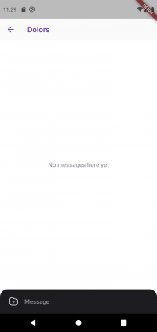

Aplicación Venus.

## Contents

* [1 **Introducció**](#Introducci.C3.B3)
  + [1.1 Què és Venus?](#Qu.C3.A8_.C3.A9s_Venus.3F)
  + [1.2 Motivació](#Motivaci.C3.B3)
* [2 **Infraestructura**](#Infraestructura)
* [3 **Microserveis**](#Microserveis)
  + [3.1 Autenticació i gestió de perfils](#Autenticaci.C3.B3_i_gesti.C3.B3_de_perfils)
  + [3.2 Algorisme](#Algorisme)
  + [3.3 Xat](#Xat)
* [4 **Cloud**](#Cloud)
  + [4.1 Docker](#Docker)
  + [4.2 Kubernetes](#Kubernetes)
* [5 **Geolocalització**](#Geolocalitzaci.C3.B3)
* [6 **Base de Dades**](#Base_de_Dades)
* [7 **Aplicació Mòbil**](#Aplicaci.C3.B3_M.C3.B2bil)
  + [7.1 Pàgina d'inici i Formularis](#P.C3.A0gina_d.27inici_i_Formularis)
  + [7.2 Home](#Home)
  + [7.3 Xat](#Xat_2)
  + [7.4 Localització](#Localitzaci.C3.B3)
  + [7.5 Perfil](#Perfil)

# **Introducció**[[edit](/pti/index.php?title=Categor%C3%ADa:Venus&veaction=edit&section=1 "Edit section: Introducció") | [edit source](/pti/index.php?title=Categor%C3%ADa:Venus&action=edit&section=1 "Edit section: Introducció")]

En aquesta Wiki volem introduir el nostre projecte així com els punts clau del seu desenvolupament i arquitectura.

## Què és Venus?[[edit](/pti/index.php?title=Categor%C3%ADa:Venus&veaction=edit&section=2 "Edit section: Què és Venus?") | [edit source](/pti/index.php?title=Categor%C3%ADa:Venus&action=edit&section=2 "Edit section: Què és Venus?")]

Venus és una app per relacionar-se amb gent del teu voltant o de l'altre punta del món. La app està ambientada en l'espai, aprofitant el doble sentit de la paraula "Venus", que fa referència al planeta del nostre sistema solar i a la deesa romana de l'amor i la belesa. Es pot considerar una app de cites, però hi ha intenció de portar el projecte més enllà i crear un entorn on poder conèixer gent nova però també seguir relacionan-te amb els coneguts de sempre.

## Motivació[[edit](/pti/index.php?title=Categor%C3%ADa:Venus&veaction=edit&section=3 "Edit section: Motivació") | [edit source](/pti/index.php?title=Categor%C3%ADa:Venus&action=edit&section=3 "Edit section: Motivació")]

Si mai heu usat una app de cites, sabeu de primerà mà que es basen en un catàleg de persones on decideixes si vols conèixer algú o no en funció del seu físic. Nosaltres vam voler cambiar aixó posant funcionalitats noves i gamificant el concepte de relacionar-se amb gent. Tot hi això, vam decidir fer només l'arquitectura del projecte amb les funcionalitats més simples degut al temps i a la finalitat de l'assignatura de PTI.

# **Infraestructura**[[edit](/pti/index.php?title=Categor%C3%ADa:Venus&veaction=edit&section=4 "Edit section: Infraestructura") | [edit source](/pti/index.php?title=Categor%C3%ADa:Venus&action=edit&section=4 "Edit section: Infraestructura")]

La nostra infraestructura consisteix en diversos elements que juntament formen el frontend més el backend.
Frontend: Hem desenvolupat una aplicació mòbil utilitzant Flutter i Dart. Aquesta aplicació fa peticions HTTP dirigides al backend (diferents microserveis).
Backend: Consta de diversos microserveis allotjats al núvol i una base de dades. Hi ha 3 microserveis (Autenticació i gestió de perfils, algorisme, i Xat) allotjats a Azure i llavors la base de dades de MongoDB, que està allotjada a MongoDB Atlas (núvol extern a la nostra infraestructura). Tots els microserveis s'han desenvolupat utilitzant Node.js. També s'ha utilitzat GraphQL per gestionar totes les peticions i dades. Addicionalment, pel microservei de xat, s'ha utilitzat Socket.io, ja que ens permetia cobrir les necessitats de desenvolupar un xat que funcioni en temps real. Finalment, cal destacar que tots els microserveis s'han dockeritzat i treballen sota Kubernetes.

No chat page.

# **Microserveis**[[edit](/pti/index.php?title=Categor%C3%ADa:Venus&veaction=edit&section=5 "Edit section: Microserveis") | [edit source](/pti/index.php?title=Categor%C3%ADa:Venus&action=edit&section=5 "Edit section: Microserveis")]

## Autenticació i gestió de perfils[[edit](/pti/index.php?title=Categor%C3%ADa:Venus&veaction=edit&section=6 "Edit section: Autenticació i gestió de perfils") | [edit source](/pti/index.php?title=Categor%C3%ADa:Venus&action=edit&section=6 "Edit section: Autenticació i gestió de perfils")]

Aquest microservei ha estat el primer que s’ha desenvolupat i és un del punts vitals del backend del projecte. Com el seu nom indica, la seva funció és englobar tot el que comporta autenticació i gestió de perfils d’usuaris. Això inclou el registre d’usuaris, el login i qualsevol petició que impliqui manipular o consultar dades del perfil de l’usuari en qüestió.

S’ha optat per utilitzar Node.js com a entorn de programació a l’hora de desenvolupar-lo i addicionalment s’ha fet servir Graphql. Cal destacar que també s’han afegit les dependències necessàries per aconseguir que es pugui comunicar amb la base de dades (mongoDB).

## Algorisme[[edit](/pti/index.php?title=Categor%C3%ADa:Venus&veaction=edit&section=7 "Edit section: Algorisme") | [edit source](/pti/index.php?title=Categor%C3%ADa:Venus&action=edit&section=7 "Edit section: Algorisme")]

En aquest microservei hem decidit incloure totes les funcionalitats relacionades amb els likes i matches entre usuaris i, potser la part més important, és l’algorisme de decisió que selecciona quines persones mostrar com a candidats a cada usuari. En aquesta part es poden tenir en compte els paràmetres que han posat els usuaris en el seu perfil per fer un filtratge i mirar si els altres usuaris són compatibles o no. En aquest algorisme també entra la geolocalització, un punt molt important a tenir en compte a l'hora de saber si una persona és candidata o no.

## Xat[[edit](/pti/index.php?title=Categor%C3%ADa:Venus&veaction=edit&section=8 "Edit section: Xat") | [edit source](/pti/index.php?title=Categor%C3%ADa:Venus&action=edit&section=8 "Edit section: Xat")]

Aquest microservei, a diferència de la resta, no fem servir ni endpoints habituals ni de graphql. No és òptim per un xat anar fent Polling a un endpoint mirant si tens nous missatges, ja que no escalaria gens bé. És per aquest motiu que hem decidit usar Websockets. Hem utilitzat la llibreria socket.io. La part del servidor d'aquest microservei consisteix en rebre sockets dels usuaris i assignar els usernames a cada socket. Al mateix temps escolta el socket i si rep un missatge d'un usuari, busca a quin altre socket va destinat i far un forward. Per últim, la part del client consisteix en crear una instància socket i connectar-se al servidor. Cada cop que l'usuari vulgui enviar un missatge, usarà el socket i posara el username del destinatari.

# **Cloud**[[edit](/pti/index.php?title=Categor%C3%ADa:Venus&veaction=edit&section=9 "Edit section: Cloud") | [edit source](/pti/index.php?title=Categor%C3%ADa:Venus&action=edit&section=9 "Edit section: Cloud")]

## Docker[[edit](/pti/index.php?title=Categor%C3%ADa:Venus&veaction=edit&section=10 "Edit section: Docker") | [edit source](/pti/index.php?title=Categor%C3%ADa:Venus&action=edit&section=10 "Edit section: Docker")]

Tots els Microserveis explicats anteriorment han de ser dockeritzats per tal de que puguin ser afegits en un pod de Kubernetes. Per tal de dockeritzar-los hem fet un Dockerfile per cada un d'aquests. Aquest Dockerfile ens serveix per personalitzar i configurar el comportament d'aquest microservei quan estigui dins d'un pod de Kubernetes amb la forma de contenidor. Un cop creat el Dockerfile cal generar la imatge de cada Microservei i penjar-la al Conatiner Registry del cloud. Un cop aquesta està al núvol ja tota la part de docker estarà llesta.

## Kubernetes[[edit](/pti/index.php?title=Categor%C3%ADa:Venus&veaction=edit&section=11 "Edit section: Kubernetes") | [edit source](/pti/index.php?title=Categor%C3%ADa:Venus&action=edit&section=11 "Edit section: Kubernetes")]

Per tal de fer la nostra aplicació escalable i independent entre microserveis vam decidir optar a usar Kubernetes. Kubernetes és un clúster de nodes on a cada node va un microservei. Aquest clúster té la capacitat de decidir si vol duplicar un servei (ja que per exemple aquest té molta càrrega), redirigir el tràfic entre nodes amb un mateix microserivei a dins o altres caracteristiques similars. Per poder configurar el clúster de Kubernetes es necessita un host al cloud, òbviament, i nosaltres vam decidir triar Azure. A més també necessita un Container Registry, que és una especie de base de dades on es guarden totes les imatges de Kubernetes i un node Master, que controla tots els nodes amb microserveis.

# **Geolocalització**[[edit](/pti/index.php?title=Categor%C3%ADa:Venus&veaction=edit&section=12 "Edit section: Geolocalització") | [edit source](/pti/index.php?title=Categor%C3%ADa:Venus&action=edit&section=12 "Edit section: Geolocalització")]

La geolocalització ens serveix per saber on està cada usuari i, utilitzant una distància màxima que ell mateix ens indicarà, poder filtrar els perfils i buscar aquells que només entrin dins del rang delimitat per les seves coordenades i la distància indicada. Per aconseguir això, hem declarat un índex nou de la base de dades i l'hem associat al paràmetre de les coordenades. Si definim aquest índex com a *2dsphere* ens permetrà usar unes operacions geomètriques que filtraran els perfils. Un exemple es $near, on li passem unes coordenades i unla distància i buscara tots els perfils que entrin dins del rang.

# **Base de Dades**[[edit](/pti/index.php?title=Categor%C3%ADa:Venus&veaction=edit&section=13 "Edit section: Base de Dades") | [edit source](/pti/index.php?title=Categor%C3%ADa:Venus&action=edit&section=13 "Edit section: Base de Dades")]

El tipus de base de dades utilitzat és MongoDB. Una base de dades noSQL. La nostra base de dades queda externa a la infraestructura d'Azure, que és on hi ha allotjats els diferents microserveis implementats. Així doncs, ha estat necessari buscar alternatives. S'ha optat per utilitzar MongoDB Atlas, una base de dades del núvol. Atlas permet definir clústers i dins d'aquests, diverses col·leccions que poden contenir diversos fitxers (cada fitxer està associat a un usuari). Per l'abast d'aquest projecte ha estat necessari guardar diferents tipus de dades, és per això que s'han definit diverses col·leccions (users,profiles,matches,likes) que contenen tot el que és necessari per el correcte funcionament de l'aplicació. Finalment, cal destacar que Atlas permet fer un control d'accés, fet que permet restringir quines adreces IP poden accedir a la nostra base de dades i conseqüentment permet augmentar la seguretat davant possibles atacs.

# **Aplicació Mòbil**[[edit](/pti/index.php?title=Categor%C3%ADa:Venus&veaction=edit&section=14 "Edit section: Aplicació Mòbil") | [edit source](/pti/index.php?title=Categor%C3%ADa:Venus&action=edit&section=14 "Edit section: Aplicació Mòbil")]

Una part molt important del projecte consisteix en la part del frontend. En el nostre cas ens decantarem per fer una aplicació per mòbils i vam fer ús del framework de flutter per tal de fer-la multiplataforma. La idea consistia en entendre una mica com funcionava el seu llenguatge de programació "Dart" i adaptar-se a l'entorn de programació.

|  |  |
| --- | --- |
|  Flutter framework. |  Flutter framework. |

L'aplicació es divideix en una sèrie de parts:

## Pàgina d'inici i Formularis[[edit](/pti/index.php?title=Categor%C3%ADa:Venus&veaction=edit&section=15 "Edit section: Pàgina d'inici i Formularis") | [edit source](/pti/index.php?title=Categor%C3%ADa:Venus&action=edit&section=15 "Edit section: Pàgina d'inici i Formularis")]

A la pàgina d'inici, com a tota aplicació trobem un logo amb un text donant la benvinguda a l'aplicació. A més el fons és un .gif de l'espai fent referència a la linia de disseny que portem.
A continuació es troba la pàgina de login i registre tal i com es pot veure a les imatges de sobre.

* **Login**
  + Conté dos camps, l'email (o usuari) i la contrasenya. A més conté validació de camps per saber si s'està introduïnt el format del email. La contrassenya s'amaga i es fa hash sha256 per enviar-lo al servidor.
* **Registre**
  + La pàgina de registre consta de dues parts:
    - A la primera part trobem el registre típic amb dades d'usuari com el nom, email i password.
    - L'altre pàgina consisteix en omplir informació més personal com una descripció, l'edat, el sexe. (Aquests paràmetres serveixen per l'algosirme d'elecció.)

|  |  |  |  |
| --- | --- | --- | --- |
|  Front page. |  Login page. |  Register page. |  Register page2. |

## Home[[edit](/pti/index.php?title=Categor%C3%ADa:Venus&veaction=edit&section=16 "Edit section: Home") | [edit source](/pti/index.php?title=Categor%C3%ADa:Venus&action=edit&section=16 "Edit section: Home")]

La pàgina de home és la primera que apareix quan un usuari fa login a l'aplicació.

Cal destacar que a l'aplicació s'ha implementat una "bottom bar" amb la qual ens podem desplaçar per tots els apartats i pàgines de l'aplicació. Així doncs en aquesta mena de dock podem trobar el home (la caseta), el xat (la bafarada), la localització (la lupa), el perfil (la persona).

* Aquesta primera pàgina és a la que apareixen els candidats amb qui podem fer match, donar like o no. Així doncs apareix a dalt de tot l'usuari de la persona, sota la imatge de perfil d'aquesta persona i finalment dos butons que ens permeten donar like o no al candidat.
* Podem relliscar amb el dit la foto cap a l'esquerra o dreta. O si es prefereix usar els botons.
* Quan li donem like a una persona que ens ha donat like a nosaltres fem un match i apareix una alerta.

|  |  |  |  |
| --- | --- | --- | --- |
|  Loading. |  Candidates page. |  Slide example. |  Match page. |

## Xat[[edit](/pti/index.php?title=Categor%C3%ADa:Venus&veaction=edit&section=17 "Edit section: Xat") | [edit source](/pti/index.php?title=Categor%C3%ADa:Venus&action=edit&section=17 "Edit section: Xat")]

A continuació es presenta l'apartat de xat. Aquest apartat consta de 2 parts.

* A la primera pàgina trobem el nom de les persones amb qui hem fet match i per tant, amb qui podem xatejar.
* Un cop seleccionem la persona amb qui volem parlar apareix la pantalla del xat on podem escriure missatges, enviar fotos, arxius...

|  |  |  |  |
| --- | --- | --- | --- |
|  No chat page. |  Chats page. |  Personal Chat. |  Personal Chat2. |

## Localització[[edit](/pti/index.php?title=Categor%C3%ADa:Venus&veaction=edit&section=18 "Edit section: Localització") | [edit source](/pti/index.php?title=Categor%C3%ADa:Venus&action=edit&section=18 "Edit section: Localització")]

Aquesta tercera funcionalitat tracta sobre la localització doncs podem especificar on estem situats en cada moment. D'aquesta manera podem establir un rang de posicions que usarà l'algorisme per a què ens apareguin uns candidats o altres en funció de la distància.

Map page.

## Perfil[[edit](/pti/index.php?title=Categor%C3%ADa:Venus&veaction=edit&section=19 "Edit section: Perfil") | [edit source](/pti/index.php?title=Categor%C3%ADa:Venus&action=edit&section=19 "Edit section: Perfil")]

Per acabar trobem l'apartat del perfil. S'ha implementat diverses funcionalitats com poder observar i canviar la foto. També podem observar el nostre usuari, nom i descripció. A més s'ha implementat una funcionalitat relacionada amb la personalització del perfil.

Així doncs es pot personalitzar els gustos com hobbies, personalitat, tipus de relació... Això es fa mitjançant unes targetes desplegables amb opcions.

|  |  |  |
| --- | --- | --- |
|  Profile page. |  Profile2 page. |  Personalization. |