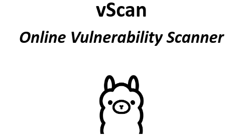

Small demo video of a scan petition:

https://youtu.be/bFLZvObZgGM?si=kz4psicpi3EM8qEJ

# Introducció[[edit](/pti/index.php?title=Categor%C3%ADa:VulnerabilityScanner&veaction=edit&section=1 "Edit section: Introducció") | [edit source](/pti/index.php?title=Categor%C3%ADa:VulnerabilityScanner&action=edit&section=1 "Edit section: Introducció")]

En l’actualitat, la seguretat informàtica es troba en el punt de mira de totes les empreses i organitzacions, degut a l’augment en la ciberdelinqüència i els efectes catastròfics que aquesta pot tenir sobre les organitzacions, tant a nivell econòmic com en la seva pròpia reputació. És per això que moltes empreses opten per a realitzar auditories de seguretat sobre la seva infraestructura per a detectar qualsevol tipus de vulnerabilitat existent i trobar una solució.

## ¿Què és vScan?[[edit](/pti/index.php?title=Categor%C3%ADa:VulnerabilityScanner&veaction=edit&section=2 "Edit section: ¿Què és vScan?") | [edit source](/pti/index.php?title=Categor%C3%ADa:VulnerabilityScanner&action=edit&section=2 "Edit section: ¿Què és vScan?")]

vScan és un servei que pretén facilitar la feina als equips encarregats de realitzar les auditories o tests de penetració, ja que automatitza les fases inicials d’aquests tipus de proves:

1. Information Gathering
2. **Reconnaissance / OSINT**
3. **Scanning**
4. **Vulnerability Assessment**
5. Exploitation
6. Reporting
7. Remediation

Tal com podem observar a la llista, vScan realitza tasques de reconeixement, escaneig i descobriment de vulnerabilitats, tot de forma completament autònoma. Això permet als grups encarregats de les auditories centrar els esforços en les fases més complexes dels tests i millorar el seu rendiment, factors clau alhora de protegir la infraestructura de l’organització.

Addicionalment, vScan aprofita els últims avenços en intel·ligència artificial per a integrar un LLM (Large Language Model), el qual permet generar informes dels resultat de cada escaneig de forma completament autònoma i personalitzada.

# Infraestructura[[edit](/pti/index.php?title=Categor%C3%ADa:VulnerabilityScanner&veaction=edit&section=3 "Edit section: Infraestructura") | [edit source](/pti/index.php?title=Categor%C3%ADa:VulnerabilityScanner&action=edit&section=3 "Edit section: Infraestructura")]

Schematic view of how vScan works

La infraestructura del servei vScan està distribuïda en 5 diferents blocs:

* **Seguretat**:

És un programa modular que fa una automatització d'un conjunt d'eines d'*scaneig* com poden ser nmap, papi i altres.

* **API**:

Una API implementada en *flask* que permet fer peticions al servei des d'aplicacions de tercers, per consultar i/o peticionar *scans*.

* **Base de dades**:

La base de dades feta amb el MySQL on es guarden les peticions i resultats dels *scans* fets pels diferents usuaris del servei

* **LLM** (IA):

El component d'Intel·ligència artificial. Es tracta de la versió 3 de LlaMa, un LLM de Meta que permet generar els informes dels *scans* per a usuaris no experimentats en xarxa puguin entendre els resultats.

* **Front-end**:

El front-end implementat amb el framework Vue JS que permet al usuari, registrar-se, fer peticions al escàner i consultar-ne els resultats.

En el esquema es poden observar les diferents connexions que existeixen des de que els usuaris es connecten al front-end fins que aquest guarda les dades a la DB que posteriorment pot ser consultada.