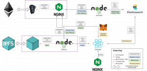
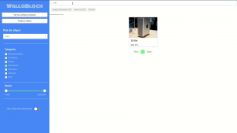
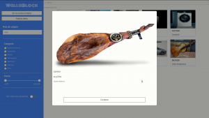
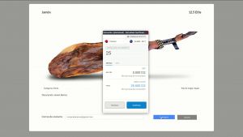
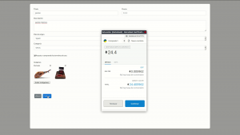
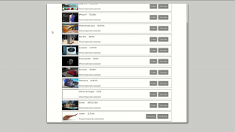
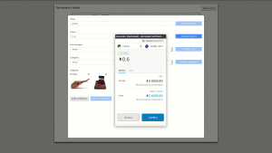
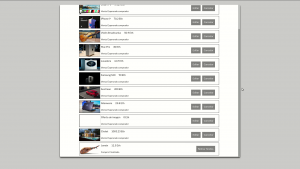

## Contents

* [1 ¿Qué es WallaBlock?](#.C2.BFQu.C3.A9_es_WallaBlock.3F)
* [2 Arquitectura](#Arquitectura)
  + [2.1 Almacenamiento distribuído](#Almacenamiento_distribu.C3.ADdo)
  + [2.2 Base de datos](#Base_de_datos)
  + [2.3 Descentralización](#Descentralizaci.C3.B3n)
* [3 Diseño del contrato](#Dise.C3.B1o_del_contrato)
  + [3.1 Ejemplo de intercambio](#Ejemplo_de_intercambio)
  + [3.2 Cancelación de la transacción](#Cancelaci.C3.B3n_de_la_transacci.C3.B3n)
* [4 Ejemplos de uso](#Ejemplos_de_uso)
  + [4.1 Buscar](#Buscar)
  + [4.2 Ver oferta](#Ver_oferta)
  + [4.3 Comprar](#Comprar)
  + [4.4 Publicar oferta](#Publicar_oferta)
  + [4.5 Ver ofertas en las que el usuario participa](#Ver_ofertas_en_las_que_el_usuario_participa)
  + [4.6 Editar oferta](#Editar_oferta)
  + [4.7 Retirar fondos de una oferta](#Retirar_fondos_de_una_oferta)
* [5 Enlaces de interés](#Enlaces_de_inter.C3.A9s)

# ¿Qué es WallaBlock?[[edit](/pti/index.php?title=Categor%C3%ADa:Wallablock&veaction=edit&section=1 "Edit section: ¿Qué es WallaBlock?") | [edit source](/pti/index.php?title=Categor%C3%ADa:Wallablock&action=edit&section=1 "Edit section: ¿Qué es WallaBlock?")]

WallaBlock es un framework para la publicación de ofertas de compra-venta de forma descentralizada y segura.

# Arquitectura[[edit](/pti/index.php?title=Categor%C3%ADa:Wallablock&veaction=edit&section=2 "Edit section: Arquitectura") | [edit source](/pti/index.php?title=Categor%C3%ADa:Wallablock&action=edit&section=2 "Edit section: Arquitectura")]

Arquitectura del proyecto

WallaBlock se compone de diversos componentes:

* *Blockchain* ([Ethereum](https://ethereum.org/)): Guarda los datos principales de las ofertas.
* Almacenamiento distribuído ([IPFS](https://ipfs.io/)): Ver sección [#Almacenamiento distribuído](#Almacenamiento_distribu.C3.ADdo)
* Base de datos ([ElasticSearch](https://www.elastic.co/)): Ver sección [#Base de datos](#Base_de_datos)
* Cliente web ([React.js](https://reactjs.org/)): Frontend que permite al usuario interactuar con el resto de componentes de forma cómoda y, siempre que sea posible, transparente.

## Almacenamiento distribuído[[edit](/pti/index.php?title=Categor%C3%ADa:Wallablock&veaction=edit&section=3 "Edit section: Almacenamiento distribuído") | [edit source](/pti/index.php?title=Categor%C3%ADa:Wallablock&action=edit&section=3 "Edit section: Almacenamiento distribuído")]

Aunque la *blockchain* nos ofrece garantías de disponibilidad e inmutabilidad, almacenar datos es caro, especialmente si se trata de datos grandes. Para algunos de los datos, como el título o el precio, hemos considerado que son datos críticos para la validez de la oferta. Sin embargo, otros datos más pesados, como las imágenes y la descripción, no necesitan esta garantía tan fuerte, así que hemos decidido almacenarlos en IPFS.

IPFS nos ofrece una garantía de inmutabilidad, pero no de disponibilidad. Para aquellos datos en los que esto sea aceptable, los almacenamos en IPFS y guardamos un enlace (CID) en la cadena de bloques.

## Base de datos[[edit](/pti/index.php?title=Categor%C3%ADa:Wallablock&veaction=edit&section=4 "Edit section: Base de datos") | [edit source](/pti/index.php?title=Categor%C3%ADa:Wallablock&action=edit&section=4 "Edit section: Base de datos")]

Como novedad, incorporamos una base de datos además de la cadena de bloques. Aunque podría parecer redundante, ambas cumplen una función crítica.

La *blockchain* permite que varias partes puedan intercambiar información entre ellas sin necesidad de confiar las unas en las otras. Esto permite que dos clientes puedan interactuar con la misma oferta desde nodos independientes. Sin embargo, las búsquedas en la cadena de bloques son, por lo general, muy lentas, lo que empeora considerablemente la experiencia de usuario.

Para paliar esta situación, incluímos una base de datos NoSQL, como es el caso de ElasticSearch, que se especializa en hacer búsquedas rápidamente. Esta base de datos no nos ofrece las garantías de seguridad que tenemos con la *blockchain*, ya que está controlada por una única entidad; a cambio, tampoco tenemos las mismas restricciones, por lo que podemos permitir al usuario hacer las búsquedas a las que está acostumbrado, filtrando por categorías o por títulos parciales, por ejemplo.

Para que los datos de la base de datos coincidan con los de la cadena de bloques, hemos desarrollado un sincronizador que mantiene la coherencia entre las dos, editando la base de datos como sea oportuno.

## Descentralización[[edit](/pti/index.php?title=Categor%C3%ADa:Wallablock&veaction=edit&section=5 "Edit section: Descentralización") | [edit source](/pti/index.php?title=Categor%C3%ADa:Wallablock&action=edit&section=5 "Edit section: Descentralización")]

Todo esto nos permite que la red de WallaBlock no dependa de una única entidad: cualquiera puede unirse a la red Ethereum, la red IPFS, crear una base de datos ElasticSearch y alojar el cliente web en su servidor (o incluso crear otro cliente). De hecho, también se puede elegir alojar una parte de la infraestructura y delegar el resto a terceros, según las limitaciones del proveedor.

# Diseño del contrato[[edit](/pti/index.php?title=Categor%C3%ADa:Wallablock&veaction=edit&section=6 "Edit section: Diseño del contrato") | [edit source](/pti/index.php?title=Categor%C3%ADa:Wallablock&action=edit&section=6 "Edit section: Diseño del contrato")]

Con tal de conseguir nuestro objetivo de un intercambio sin la intervención de terceros, hemos diseñado el contrato con la idea general de que ambas partes tengan siempre la misma cantidad económica a perder.

## Ejemplo de intercambio[[edit](/pti/index.php?title=Categor%C3%ADa:Wallablock&veaction=edit&section=7 "Edit section: Ejemplo de intercambio") | [edit source](/pti/index.php?title=Categor%C3%ADa:Wallablock&action=edit&section=7 "Edit section: Ejemplo de intercambio")]

1. Alicia crea una oferta con precio 1 Ξ (Ether: Moneda utilizada en la *blockchain*). Para ello, deposita 2 Ξ como depósito.
2. Bob compra la oferta. Para ello, deposita 2 Ξ: 1 Ξ del precio del producto y 1 Ξ de depósito.
3. Alicia envía el objeto
4. Bob confirma la recepción
5. Alicia recibe 3 Ξ (2 Ξ del depósito + 1 Ξ como pago); Bob recibe 1 Ξ del depósito

| Paso | Ethers Alicia | Ethers Bob | Objeto en manos de... | Valor total Alicia | Valor total Bob |
| --- | --- | --- | --- | --- | --- |
| 1 | 2 Ξ |  | Alicia | 3 Ξ |  |
| 2 | 2 Ξ | 2 Ξ | Alicia | 3 Ξ | 2 Ξ |
| 3 | 2 Ξ | 2 Ξ | (En tránsito) | 2 Ξ | 2 Ξ |
| 4 | 2 Ξ | 2 Ξ | Bob | 2 Ξ | 3 Ξ |
| 5 |  |  | Bob |  | 1 Ξ |

Finalmente, respecto al valor inicial, Alicia ha ganado 1 Ξ y Bob ha perdido 1 Ξ, intercambiando el objeto.

En los pasos 2 y 4, vemos que el valor no es igual, pero en el segundo paso, Alicia (pero no Bob) puede abortar la transacción y todo el mundo recuperaría su dinero; en el cuarto paso, Bob podría negarse a confirmar, pero sería contrario a su propio interés: perdería 1 Ξ (el depósito) sin beneficio alguno.

## Cancelación de la transacción[[edit](/pti/index.php?title=Categor%C3%ADa:Wallablock&veaction=edit&section=8 "Edit section: Cancelación de la transacción") | [edit source](/pti/index.php?title=Categor%C3%ADa:Wallablock&action=edit&section=8 "Edit section: Cancelación de la transacción")]

Para evitar problemas entre la compra y la confirmación, cuando el paquete se puede encontrar en tránsito, solo el vendedor puede cancelar una transacción. Si el comprador quiere cancelar, debe contactar con el vendedor para que este lo haga por él. Un posible caso problemático es si el vendedor no quiere o no puede (ha dejado de usar la plataforma, ha perdido sus credenciales...) hacerlo. El contrato no contempla este caso debido a la dificultad de diseñar una solución segura para ambas partes pero sin intervención de terceros, aunque sería una posible mejora.

# Ejemplos de uso[[edit](/pti/index.php?title=Categor%C3%ADa:Wallablock&veaction=edit&section=9 "Edit section: Ejemplos de uso") | [edit source](/pti/index.php?title=Categor%C3%ADa:Wallablock&action=edit&section=9 "Edit section: Ejemplos de uso")]

## Buscar[[edit](/pti/index.php?title=Categor%C3%ADa:Wallablock&veaction=edit&section=10 "Edit section: Buscar") | [edit source](/pti/index.php?title=Categor%C3%ADa:Wallablock&action=edit&section=10 "Edit section: Buscar")]

Pantalla de búsqueda

La acción más habitual que realizarán los usuarios será la de buscar ofertas. Para ello, se servirán de los filtros disponibles en el menú izquierdo y del campo de búsqueda para concretar el título de la oferta deseada.

## Ver oferta[[edit](/pti/index.php?title=Categor%C3%ADa:Wallablock&veaction=edit&section=11 "Edit section: Ver oferta") | [edit source](/pti/index.php?title=Categor%C3%ADa:Wallablock&action=edit&section=11 "Edit section: Ver oferta")]

Detalles de una oferta

Para ver toda la información relativa a una oferta, es suficiente con que el usuario pinche sobre ella y se desplegará un *pop-up*. En este, el usuario encontrará información como el título, el precio de la oferta y una breve descripción del artículo.

## Comprar[[edit](/pti/index.php?title=Categor%C3%ADa:Wallablock&veaction=edit&section=12 "Edit section: Comprar") | [edit source](/pti/index.php?title=Categor%C3%ADa:Wallablock&action=edit&section=12 "Edit section: Comprar")]

Compra de una oferta, con el diálogo de MetaMask esperando autorización

A la hora de comprar una oferta, el usuario es redirigido a una página específica la cual se encarga de obtener la información relativa a la oferta desde la *blockchain*, para asegurar la veracidad y fiabilidad de los datos. Antes de proceder a realizar la compra, el usuario debe introducir un correo de contacto para permitir la comunicación entre comprador y vendedor.

## Publicar oferta[[edit](/pti/index.php?title=Categor%C3%ADa:Wallablock&veaction=edit&section=13 "Edit section: Publicar oferta") | [edit source](/pti/index.php?title=Categor%C3%ADa:Wallablock&action=edit&section=13 "Edit section: Publicar oferta")]

Publicación de una oferta, con el diálogo de MetaMask esperando confirmación

El proceso de publicar una oferta en WallaBlock es muy sencillo. Para ello, es suficiente con rellenar un formulario compuesto por diversos campos obligatorios como: título, precio, categoría y país de origen, combinado con otros dos campos opcionales como son descripción e imágenes.

## Ver ofertas en las que el usuario participa[[edit](/pti/index.php?title=Categor%C3%ADa:Wallablock&veaction=edit&section=14 "Edit section: Ver ofertas en las que el usuario participa") | [edit source](/pti/index.php?title=Categor%C3%ADa:Wallablock&action=edit&section=14 "Edit section: Ver ofertas en las que el usuario participa")]

Lista de ofertas en las que el usuario ha participado

El usuario tiene la opción de ver todas las ofertas en las que este participa. Por cada oferta, el usuario puede realizar una serie de acciones en función del estado actual en el que se encuentra la oferta (esperando comprador, esperando confirmación, finalizada o cancelada) y del rol del usuario en la oferta (comprador o vendedor). Cabe mencionar que estas ofertas son obtenidas desde la *blockchain*.

## Editar oferta[[edit](/pti/index.php?title=Categor%C3%ADa:Wallablock&veaction=edit&section=15 "Edit section: Editar oferta") | [edit source](/pti/index.php?title=Categor%C3%ADa:Wallablock&action=edit&section=15 "Edit section: Editar oferta")]

Edición de una oferta. MetaMask espera autorización para realizar un cambio de precio

Una vez la oferta ha sido publicada, pero siempre que no haya un comprador, el vendedor tiene la opción de editar ciertos campos, como el título, el precio, el país de origen, la categoría o las imágenes. Quizá la acción más interesante es la de cambiar el precio, que se encarga de requerir los fondos necesarios en el caso de que el precio indicado sea superior al original, o de devolver los fondos correspondientes si es inferior.

## Retirar fondos de una oferta[[edit](/pti/index.php?title=Categor%C3%ADa:Wallablock&veaction=edit&section=16 "Edit section: Retirar fondos de una oferta") | [edit source](/pti/index.php?title=Categor%C3%ADa:Wallablock&action=edit&section=16 "Edit section: Retirar fondos de una oferta")]

Lista de ofertas con una oferta esperando la retirada de fondos

Cuando una oferta ha sido finalmente confirmada por el comprador, ambas partes pueden proceder a retirar los fondos que estaban retenidos dentro del contrato. Por ende, esta acción debe ser realizada tanto por parte del vendedor como del comprador para recuperar su depósito y cobro en el caso del vendedor. Cabe destacar que el coste de esta acción es únicamente el coste del gas. Esta acción també se debe realizar cada vez que el contrato nos devuelva dinero (por ejemplo, al cancelar la oferta o cuando bajamos el precio).

# Enlaces de interés[[edit](/pti/index.php?title=Categor%C3%ADa:Wallablock&veaction=edit&section=17 "Edit section: Enlaces de interés") | [edit source](/pti/index.php?title=Categor%C3%ADa:Wallablock&action=edit&section=17 "Edit section: Enlaces de interés")]

* [Código fuente del proyecto](https://github.com/wallablock)