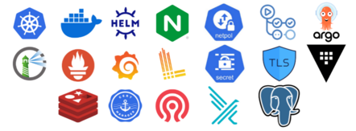

Logo of WellTrack

**WellTrack** es una plataforma web inteligente que utiliza visión por computador e inteligencia artificial para **monitorear, analizar y mejorar los hábitos de salud durante el trabajo digital**, enfocándose especialmente en problemas derivados del teletrabajo como la mala postura, la fatiga visual o el sedentarismo.

Su propuesta es única: **monitoreo en tiempo real sin hardware adicional**, procesamiento local de datos sensibles, y un sistema completo de recomendaciones y gamificación para mejorar la adherencia a hábitos saludables.

## Contents

* [1 Objetivos principales](#Objetivos_principales)
* [2 Componentes del sistema](#Componentes_del_sistema)
  + [2.1 Frontend Web](#Frontend_Web)
  + [2.2 Backend de Microservicios](#Backend_de_Microservicios)
  + [2.3 Inteligencia Artificial](#Inteligencia_Artificial)
  + [2.4 Portal de Intranet](#Portal_de_Intranet)
* [3 Paquetes de Trabajo](#Paquetes_de_Trabajo)
* [4 Funcionalidades Clave](#Funcionalidades_Clave)
* [5 Resultados Esperados](#Resultados_Esperados)
* [6 Innovación y Potencial](#Innovaci.C3.B3n_y_Potencial)
* [7 Conclusión](#Conclusi.C3.B3n)
* [8 Anexo: Imágenes de la aplicación final](#Anexo:_Im.C3.A1genes_de_la_aplicaci.C3.B3n_final)

## Objetivos principales[[edit](/pti/index.php?title=Categor%C3%ADa:WellTrack&veaction=edit&section=1 "Edit section: Objetivos principales") | [edit source](/pti/index.php?title=Categor%C3%ADa:WellTrack&action=edit&section=1 "Edit section: Objetivos principales")]

* Monitorear la postura corporal, nivel de actividad, hidratación y signos de fatiga.
* Analizar comportamientos como uso de móvil vs. ordenador.
* Ofrecer recomendaciones personalizadas mediante un modelo de lenguaje (LLM).
* Proporcionar dashboards históricos, desafíos diarios y gamificación.

* Garantizar privacidad mediante procesamiento local y autenticación JWT.

## Componentes del sistema[[edit](/pti/index.php?title=Categor%C3%ADa:WellTrack&veaction=edit&section=2 "Edit section: Componentes del sistema") | [edit source](/pti/index.php?title=Categor%C3%ADa:WellTrack&action=edit&section=2 "Edit section: Componentes del sistema")]

Stacks diagram of WellTrack

Deploy diagram of WellTrack

### Frontend Web[[edit](/pti/index.php?title=Categor%C3%ADa:WellTrack&veaction=edit&section=3 "Edit section: Frontend Web") | [edit source](/pti/index.php?title=Categor%C3%ADa:WellTrack&action=edit&section=3 "Edit section: Frontend Web")]

* Desarrollado con **Next JS + Tailwind (ShadCn)**.
* Captura de vídeo en tiempo real con superposición de análisis.
* Dashboards interactivos de métricas, alertas y preferencias.

### Backend de Microservicios[[edit](/pti/index.php?title=Categor%C3%ADa:WellTrack&veaction=edit&section=4 "Edit section: Backend de Microservicios") | [edit source](/pti/index.php?title=Categor%C3%ADa:WellTrack&action=edit&section=4 "Edit section: Backend de Microservicios")]

* API REST con **Npm + Hono**.
* Comunicación por HTTP/REST.

### Inteligencia Artificial[[edit](/pti/index.php?title=Categor%C3%ADa:WellTrack&veaction=edit&section=5 "Edit section: Inteligencia Artificial") | [edit source](/pti/index.php?title=Categor%C3%ADa:WellTrack&action=edit&section=5 "Edit section: Inteligencia Artificial")]

* Modelos de detección de postura (MediaPipe, MoveNet).
* Reconocimiento de gestos y acciones (HAR con EfficientNetB7).
* Análisis de fatiga mediante expresiones faciales.
* Servicio de recomendaciones usando **LLM** de **Dify AI**.

### Portal de Intranet[[edit](/pti/index.php?title=Categor%C3%ADa:WellTrack&veaction=edit&section=6 "Edit section: Portal de Intranet") | [edit source](/pti/index.php?title=Categor%C3%ADa:WellTrack&action=edit&section=6 "Edit section: Portal de Intranet")]

* Calendario de objetivos y sistema de metas personalizadas.
* Visualización de progresos y tendencias a largo plazo.

Deploy diagram

Microservicios que hemos utilzado en el cluster de kubernetes

2 of WellTrack

| Área | Tecnologías destacadas |
| --- | --- |
| Frontend | Next JS, TailwindCSS, ShadCn |
| Backend | Npm, Bun, Hono, PostgreSQL, Supabase |
| ML/IA | MediaPipe, MoveNet, EfficientNetB7 |
| DevOps | Docker, Kubernetes, Helm, Argo CD, GitHub Actions |
| Monitoreo | Prometheus, Grafana, Loki, Promtail |
| Seguridad | JWT, HTTPS, Network Policies, Secrets TLS |

## Paquetes de Trabajo[[edit](/pti/index.php?title=Categor%C3%ADa:WellTrack&veaction=edit&section=7 "Edit section: Paquetes de Trabajo") | [edit source](/pti/index.php?title=Categor%C3%ADa:WellTrack&action=edit&section=7 "Edit section: Paquetes de Trabajo")]

| Código | Nombre del paquete | Líder |
| --- | --- | --- |
| PT1 | Contexto tecnológico y definición de arquitectura | Coordinador |
| PT2 | Implementación de modelos de ML | ML Engineer |
| PT3 | Desarrollo del frontend web | Frontend |
| PT4 | Desarrollo de microservicios backend | Backend |
| PT5 | Contenerización y despliegue en Kubernetes | DevOps |
| PT6 | Monitoreo con Prometheus y Grafana | DevOps |
| PT7 | Intranet y sistema de metas | Frontend |
| PT8 | Análisis con LLM y generación de recomendaciones (extra) | ML Engineer |

Diagrama de Gantt con la distribución de trabajo entre los miembros del equipo.

| Rol | Miembro | Responsabilidades clave |
| --- | --- | --- |
| Coordinador General | Marina Fabregat | Gestión del proyecto y coordinación de equipos |
| Ingeniero de ML | Songhe Wang | Modelos de visión, fatiga, gestos y LLM |
| Desarrollador Frontend | Marina Fabregat | Interfaz React, dashboards, integración de modelos |
| Desarrollador Backend | Shenghao Ye | Microservicios, base de datos, APIs |
| Ingeniero DevOps | Hongda Zhu | Contenerización, CI/CD, monitoreo, seguridad |

## Funcionalidades Clave[[edit](/pti/index.php?title=Categor%C3%ADa:WellTrack&veaction=edit&section=8 "Edit section: Funcionalidades Clave") | [edit source](/pti/index.php?title=Categor%C3%ADa:WellTrack&action=edit&section=8 "Edit section: Funcionalidades Clave")]

| Funcionalidad | Detalles |
| --- | --- |
| Postura | Detección de encorvamiento, cuello inclinado, alertas y ejercicios |
| Actividad física | Detección de sedentarismo, pausas activas, desafíos personalizados |
| Hidratación | Recordatorios, seguimiento, estadísticas y metas |
| Fatiga | Parpadeo, bostezos, micromovimientos y sugerencias de descanso |
| Control por gestos | Manos levantadas, dedos, movimientos para controlar la app |
| Análisis de comportamiento | Diferenciar móvil vs. ordenador, tiempo invertido, recomendaciones |
| Sistema de metas | Calendario, desafíos diarios. |
| Recomendaciones por LLM | Informes automáticos, predicción de hábitos, consejos personalizados |

## Resultados Esperados[[edit](/pti/index.php?title=Categor%C3%ADa:WellTrack&veaction=edit&section=9 "Edit section: Resultados Esperados") | [edit source](/pti/index.php?title=Categor%C3%ADa:WellTrack&action=edit&section=9 "Edit section: Resultados Esperados")]

1. Aplicación web funcional con análisis en tiempo real.
2. Backend escalable y seguro desplegado en Kubernetes.
3. Modelos IA integrados para detección precisa de hábitos.
4. Sistema de monitoreo robusto con dashboards y alertas.
5. Intranet con seguimiento de metas y visualización avanzada.
6. Servicio de recomendaciones personalizadas con LLM.
7. Documentación completa de arquitectura, APIs y uso.

## Innovación y Potencial[[edit](/pti/index.php?title=Categor%C3%ADa:WellTrack&veaction=edit&section=10 "Edit section: Innovación y Potencial") | [edit source](/pti/index.php?title=Categor%C3%ADa:WellTrack&action=edit&section=10 "Edit section: Innovación y Potencial")]

* **Valor diferencial**: sin necesidad de sensores físicos ni dispositivos adicionales.
* **Privacidad garantizada**: análisis local y datos protegidos.
* **IA personalizada**: combina visión por computador + análisis de lenguaje.
* **Modular y escalable**: ideal para teletrabajo, salud ocupacional y wellness corporativo.

## Conclusión[[edit](/pti/index.php?title=Categor%C3%ADa:WellTrack&veaction=edit&section=11 "Edit section: Conclusión") | [edit source](/pti/index.php?title=Categor%C3%ADa:WellTrack&action=edit&section=11 "Edit section: Conclusión")]

El desarrollo de **WellTrack** ha supuesto un esfuerzo técnico y organizativo de gran envergadura. Desde la concepción del sistema hasta su implementación final, hemos abordado una cantidad considerable de desafíos que abarcan múltiples áreas de conocimiento: **visión por computador, machine learning, desarrollo frontend y backend, despliegue en Kubernetes, monitorización avanzada y seguridad de datos**.

Cada uno de los módulos planteados al inicio del proyecto —detección de postura, seguimiento de actividad, monitoreo de hidratación, análisis de fatiga, control por gestos, sistema de metas y desafíos, generación de recomendaciones personalizadas con LLM— ha sido **implementado con éxito**. El sistema resultante no es una simple prueba de concepto, sino una **aplicación web funcional, robusta y completamente desplegada**, capaz de ejecutarse en condiciones reales de uso.

La magnitud del trabajo queda reflejada no solo en la cantidad de componentes desarrollados, sino también en la calidad técnica alcanzada, el grado de integración entre subsistemas y el cumplimiento riguroso de los objetivos tecnológicos definidos. **Concluir un proyecto de estas características en el marco de un entorno académico, con recursos limitados y en un tiempo restringido, constituye un logro destacable.**

Este resultado demuestra la viabilidad de soluciones avanzadas de salud digital que no requieren dispositivos externos, y pone de manifiesto la capacidad del equipo para abordar proyectos complejos con una visión integral, aplicando buenas prácticas de ingeniería y metodologías ágiles.

Los urls correspondientes de repositorios son:

<https://github.com/SalieeriW/PTI-WellTrackDevops>

<https://github.com/SalieeriW/PTI-WellTrackGitOps>

<https://github.com/SalieeriW/PTI-WellTrackBack>

<https://github.com/SalieeriW/PTI-WellTrackFront>

<https://github.com/SalieeriW/PTI-WellTrackML>

## Anexo: Imágenes de la aplicación final[[edit](/pti/index.php?title=Categor%C3%ADa:WellTrack&veaction=edit&section=12 "Edit section: Anexo: Imágenes de la aplicación final") | [edit source](/pti/index.php?title=Categor%C3%ADa:WellTrack&action=edit&section=12 "Edit section: Anexo: Imágenes de la aplicación final")]

* 
* 
* 
* 
* 
* 
* 