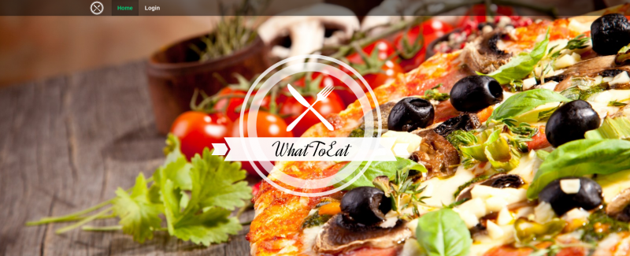
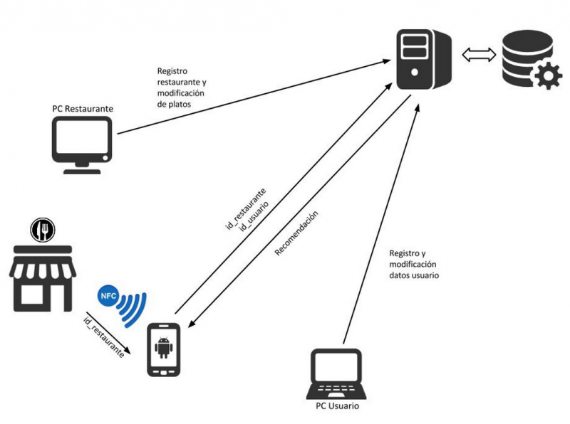
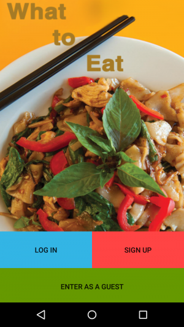

[Visita WhatToEat](http://54.69.42.107)

## Contents

* [1 Introducción](#Introducci.C3.B3n)
  + [1.1 ¿Qué es WhatToEat?](#.C2.BFQu.C3.A9_es_WhatToEat.3F)
  + [1.2 ¿Cómo funciona?](#.C2.BFC.C3.B3mo_funciona.3F)
  + [1.3 Contexto del proyecto](#Contexto_del_proyecto)
* [2 Componentes](#Componentes)
  + [2.1 Esquema del proyecto](#Esquema_del_proyecto)
  + [2.2 Android App](#Android_App)
  + [2.3 Web page](#Web_page)
  + [2.4 Rest API](#Rest_API)
    - [2.4.1 Funciones relativas a usuarios](#Funciones_relativas_a_usuarios)
    - [2.4.2 Funciones relativas a restaurantes](#Funciones_relativas_a_restaurantes)
    - [2.4.3 Funciones relativas a ingredientes](#Funciones_relativas_a_ingredientes)
  + [2.5 Database](#Database)

# Introducción[[edit](/pti/index.php?title=Categor%C3%ADa:WhatToEat&veaction=edit&section=1 "Edit section: Introducción") | [edit source](/pti/index.php?title=Categor%C3%ADa:WhatToEat&action=edit&section=1 "Edit section: Introducción")]

## ¿Qué es WhatToEat?[[edit](/pti/index.php?title=Categor%C3%ADa:WhatToEat&veaction=edit&section=2 "Edit section: ¿Qué es WhatToEat?") | [edit source](/pti/index.php?title=Categor%C3%ADa:WhatToEat&action=edit&section=2 "Edit section: ¿Qué es WhatToEat?")]

¿Cuántas veces nos hemos sentado a la mesa en un restaurante y, tras mirar la carta durante unos minutos, somos incapaces de elegir un plato que pedir?

¿Cuántas veces hemos tenido que preguntar al camarero si este plato lleva algún ingrediente al que somos alérgicos, y por ende no podemos pedir?

¿Cuántas veces hemos tenido que pedir al camarero que nos recomiende alguno de los platos de la carta para poder tomar nuestra decisión?

Estas situaciones nos generan una pérdida de tiempo, y en algunas personas pueden llegar a provocar ansiedad.

What To Eat nace con el propósito de resolver estos conflictos y proporcionar al cliente una mejor experiencia a la hora de sentarse a la mesa.

Se trata de una aplicación Android que nos permite obtener una recomendación personalizada de los platos disponibles en la carta del restaurante, permitiéndonos elegir un plato con mayor facilidad y centrarnos en disfrutar de la comida sin tener que pasar por esos quebraderos de cabeza.

What To Eat se basa en el perfil de un usuario para efectuar un análisis exhaustivo de sus alergias, preferencias e historial reciente, y de esa forma poder recomendarle cuáles son los platos de un restaurante que más se ajustan a sus gustos y necesidades.

## ¿Cómo funciona?[[edit](/pti/index.php?title=Categor%C3%ADa:WhatToEat&veaction=edit&section=3 "Edit section: ¿Cómo funciona?") | [edit source](/pti/index.php?title=Categor%C3%ADa:WhatToEat&action=edit&section=3 "Edit section: ¿Cómo funciona?")]

Cuando el usuario se sienta en la mesa del restaurante puede escanear una etiqueta NFC colocada en la propia mesa. La aplicación recogerá los datos del restaurante y del usuario y se encargará de analizar los datos para elaborar una recomendación y enseñarla en la pantalla del móvil.

Para ello es necesario que el usuario se registre en el sistema What To Eat y complete su perfil, en el que se le pedirá que introduzca sus alergias y preferencias básicas, como por ejemplo indicar si es vegetariano o diabético.

Una vez escogido el plato el usuario puede indicar a la aplicación cuál ha sido su elección, e incluso puntuar el plato. El sistema registrará esta información para poder basarse en ella en futuras recomendaciones del mismo usuario.

El hecho de puntuar los platos permite al sistema efectuar análisis de Big Data, no solo teniendo en cuenta las preferencias propias del usuario, sino también basándose en las puntuaciones de otros usuarios para poder posicionar un plato concreto en la lista de recomendados.

Para que el sistema funcione correctamente, es necesario conocer la carta de cada restaurante. Por ello, What To Eat cuenta con una web que permite a los restaurantes darse de alta en el sistema, completar su perfil e insertar los platos que ofrece en su carta, indicando para cada uno los ingredientes que lo componen.
Una vez que el restaurante forma parte del sistema, puede encargar las pegatinas NFC para colocar en sus mesas, y What To Eat se las proporcionará con sus datos grabados en ellas, listas para ser utilizadas por los clientes.

Si lo prefieren, los usuarios también pueden utilizar la web para completar y gestionar sus perfiles, de modo que no es obligatorio que utilicen la app Android para ello.

## Contexto del proyecto[[edit](/pti/index.php?title=Categor%C3%ADa:WhatToEat&veaction=edit&section=4 "Edit section: Contexto del proyecto") | [edit source](/pti/index.php?title=Categor%C3%ADa:WhatToEat&action=edit&section=4 "Edit section: Contexto del proyecto")]

En el mercado actual existen numerosas webs y aplicaciones que permiten conocer opiniones y valoraciones sobre restaurantes. Con una simple búsqueda en google es posible encontrar varios blogs/páginas con críticas sobre restaurantes y los platos que los mismos ofrecen.

Todas estas aplicaciones y webs comparten un punto en común: se basan en una información estática (críticas y opiniones sobre experiencias de usuarios o expertos) y no ofrecen al usuario una personalización o interacción.

El principal objetivo de What To Eat es el de ocupar este hueco en el actual mercado de aplicaciones y páginas web.

El proyecto encaja muy bien con las tendencias actuales de los usuarios.
Incluye un contenido social en lo que respecta a compartir gustos sobre platos y restaurantes.
Incluye contenido saludable, ya que permite recomendar comidas en función de alergias y restricciones intrínsecas al estado de salud de un usuario, como puede ser la diabetes.
Incluye nuevas tecnologías, como lo es NFC, para comunicar a la aplicación el lugar en el que se encuentra un usuario.

En lo que respecta a las tendencias de las empresas que desarrollan aplicaciones y a inversores, el proyecto cuenta con un importante componente de análisis y tratamiento de datos (Big Data), que en la actualidad está en primera línea.

# Componentes[[edit](/pti/index.php?title=Categor%C3%ADa:WhatToEat&veaction=edit&section=5 "Edit section: Componentes") | [edit source](/pti/index.php?title=Categor%C3%ADa:WhatToEat&action=edit&section=5 "Edit section: Componentes")]

## Esquema del proyecto[[edit](/pti/index.php?title=Categor%C3%ADa:WhatToEat&veaction=edit&section=6 "Edit section: Esquema del proyecto") | [edit source](/pti/index.php?title=Categor%C3%ADa:WhatToEat&action=edit&section=6 "Edit section: Esquema del proyecto")]

El proyecto consiste en un sistema cliente/servidor, con componentes muy definidos. Forman parte del sistema la página web, la aplicación android, la base de datos, la API rest y el propio restaurante en el que se sitúa el tag NFC.

## Android App[[edit](/pti/index.php?title=Categor%C3%ADa:WhatToEat&veaction=edit&section=7 "Edit section: Android App") | [edit source](/pti/index.php?title=Categor%C3%ADa:WhatToEat&action=edit&section=7 "Edit section: Android App")]

La aplicación para Android proporciona una interfaz simple e intuitiva a los usuarios. Es la pieza clave del sistema, ya que será lo que utilice el usuario para obtener las recomendaciones.

## Web page[[edit](/pti/index.php?title=Categor%C3%ADa:WhatToEat&veaction=edit&section=8 "Edit section: Web page") | [edit source](/pti/index.php?title=Categor%C3%ADa:WhatToEat&action=edit&section=8 "Edit section: Web page")]

El objetivo principal de la página web es ser una plataforma para que los restaurantes puedan registrarse en la aplicación y gestionar sus platos y para que los usuarios puedan registrarse y gestionar su perfil.

La web consta principalmente de 3 secciones:

Home page. En esta sección encontraremos una pequeña explicación de la aplicación junto con un link para descargarla, un link de contacto para aquellos restaurantes que quieran trabajar con nosotros y finalmente un mapa con la localización de los restaurantes que cuentan con soporte para nuestra aplicación.

Login page. Desde esta sección todos los usuarios pueden hacer login para modificar sus perfiles y/o el de su restaurante. El login se realiza introduciendo el email y la contraseña de registro.

Registration page. Para aquellos usuarios que no estén registrados lo pueden hacer a través de esta sección introduciendo su nombre, contraseña y email.

## Rest API[[edit](/pti/index.php?title=Categor%C3%ADa:WhatToEat&veaction=edit&section=9 "Edit section: Rest API") | [edit source](/pti/index.php?title=Categor%C3%ADa:WhatToEat&action=edit&section=9 "Edit section: Rest API")]

La API es una parte fundamental del sistema. Es el nexo entre la aplicación Android (cliente) y el servidor (base de datos + algoritmo de recomendación).

Para que el sistema funcione correctamente es necesario disponer de una interfaz que la aplicación cliente pueda utilizar para manipular la base de datos, de modo que el objetivo la API es el de proporcionar a la aplicación las funciones necesarias par interactuar con el servidor.

Está diseñada siguiendo la filosofía RESTful en el diseño de las funciones. Las respuestas son devueltas a la aplicación móvil en formato JSON, y los parámetros que recoge con métodos POST y PUT también siguen el mismo formato.

### Funciones relativas a usuarios[[edit](/pti/index.php?title=Categor%C3%ADa:WhatToEat&veaction=edit&section=10 "Edit section: Funciones relativas a usuarios") | [edit source](/pti/index.php?title=Categor%C3%ADa:WhatToEat&action=edit&section=10 "Edit section: Funciones relativas a usuarios")]

| HTTP METHOD | URI | Descripción |
| --- | --- | --- |
| POST | <http://54.69.42.107/api/users> | Create a new user |
| GET | <http://54.69.42.107/api/users/1?token=xxxx> | Get information of user |
| PUT | <http://54.69.42.107/api/users/1?token=xxxx> | Update info of user |
| DELETE | <http://54.69.42.107/api/users/1?token=xxxx> | Delete user |
| GET | <http://54.69.42.107/api/users/1/allergies?token=xxx&limit=20&offset=0> | Get a list of allergies of user |
| POST | <http://54.69.42.107/api/users/1/allergies?token=xxx> | Update allergies of user |
| GET | <http://54.69.42.107/api/users/1/history?token=xxxx&limit=20&offset=0> | Get a list of the historial of user |
| POST | <http://54.69.42.107/api/users/1/history?token=xxxx> | Insert new record in the history of user |
| GET | <http://54.69.42.107/api/users/1/favourites?token=xxxx&limit=20&offset=0> | Get a list of the favourite dishes of user |
| POST | <http://54.69.42.107/api/users/1/favourites?token=xxxx> | Insert new record in the favourites of user |
| DELETE | <http://54.69.42.107/api/users/1/favourites/5?token=xxxx> | Remove dish with id=5 from favourites of user |
| GET | <http://54.69.42.107/api/users/1/restaurants/3/?token=xxxx&limit=20&offset=0> | Get dishes of restaurant customized to user |
| PUT | <http://54.69.42.107/api/login> | Log user in |
| PUT | <http://54.69.42.107/api/logout?token=xxxx> | Log user out |

### Funciones relativas a restaurantes[[edit](/pti/index.php?title=Categor%C3%ADa:WhatToEat&veaction=edit&section=11 "Edit section: Funciones relativas a restaurantes") | [edit source](/pti/index.php?title=Categor%C3%ADa:WhatToEat&action=edit&section=11 "Edit section: Funciones relativas a restaurantes")]

| HTTP METHOD | URI | Descripción |
| --- | --- | --- |
| GET | <http://54.69.42.107/api/restaurants?limit=20&offset=0> | Get a list of all restaurants |
| GET | <http://54.69.42.107/api/restaurants/1> | Get information of restaurant |
| GET | <http://54.69.42.107/api/restaurants/1/dishes?limit=20&offset=0> | Get a list of dishes of restaurant |

### Funciones relativas a ingredientes[[edit](/pti/index.php?title=Categor%C3%ADa:WhatToEat&veaction=edit&section=12 "Edit section: Funciones relativas a ingredientes") | [edit source](/pti/index.php?title=Categor%C3%ADa:WhatToEat&action=edit&section=12 "Edit section: Funciones relativas a ingredientes")]

| HTTP METHOD | URI | Descripción |
| --- | --- | --- |
| GET | <http://54.69.42.107/api/ingredients?limit=200&offset=0> | Get a list of all available ingredients |
| POST | <http://54.69.42.107/api/ingredients> | Create new ingredient |
| PUT | <http://54.69.42.107/api/ingredients/1> | Update ingredient |

## Database[[edit](/pti/index.php?title=Categor%C3%ADa:WhatToEat&veaction=edit&section=13 "Edit section: Database") | [edit source](/pti/index.php?title=Categor%C3%ADa:WhatToEat&action=edit&section=13 "Edit section: Database")]

El resultado final es una base de datos consistente y completamente operativa que se comunica con la web y con la aplicación para que clientes y trabajadores del restaurante puedan usar sus datos.

Se ha implementado con PHPMyAdmin que permite al administrador/diseñador de la DB modificarla con facilidad.

Cualquier modificación a través de PHPMyAdmin se verá reflejada automáticamente tanto a la web como a la aplicación.