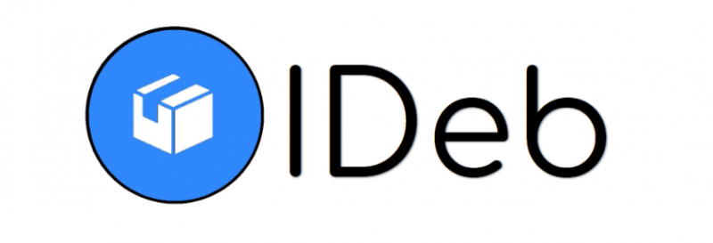
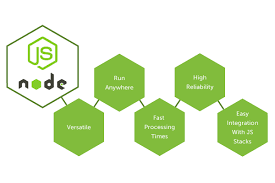

Logo de iDeb

## Contents

* [1 Introducción](#Introducci.C3.B3n)
  + [1.1 ¿Qué es iDeb?](#.C2.BFQu.C3.A9_es_iDeb.3F)
* [2 Infraestructura](#Infraestructura)
* [3 Tecnologías usadas](#Tecnolog.C3.ADas_usadas)
  + [3.1 Frontend](#Frontend)
  + [3.2 Backend](#Backend)
  + [3.3 IPFS](#IPFS)
  + [3.4 Base de datos](#Base_de_datos)
  + [3.5 Aplicación de usuario](#Aplicaci.C3.B3n_de_usuario)
* [4 Desarrollo](#Desarrollo)
  + [4.1 IPFS](#IPFS_2)
  + [4.2 Backend](#Backend_2)
  + [4.3 Frontend](#Frontend_2)
  + [4.4 Base de datos](#Base_de_datos_2)
  + [4.5 Aplicación de usuario](#Aplicaci.C3.B3n_de_usuario_2)
* [5 Memoria completa](#Memoria_completa)

# Introducción[[edit](/pti/index.php?title=Categor%C3%ADa:iDeb&veaction=edit&section=1 "Edit section: Introducción") | [edit source](/pti/index.php?title=Categor%C3%ADa:iDeb&action=edit&section=1 "Edit section: Introducción")]

## ¿Qué es iDeb?[[edit](/pti/index.php?title=Categor%C3%ADa:iDeb&veaction=edit&section=2 "Edit section: ¿Qué es iDeb?") | [edit source](/pti/index.php?title=Categor%C3%ADa:iDeb&action=edit&section=2 "Edit section: ¿Qué es iDeb?")]

Este proyecto consiste en la creación de un repositorio similiar a un repositorio genérico Debian (usado por la aplicación apt en Linux) pero con un distribución de contenido descentralizado. Es decir, tener una infraestructura que permite subir paquetes debian, que después se pueden descargar (lo equivalente a un *apt-get install paquete.deb*) de manera que en caso que el servidor que gestiona los dichos paquetes falla, siguen siendo disponibles los ficheros. Así, la gestión de los paquetes es centralizado mientras que su distribución no lo es.

Este proyecto seria capaz de competir con servidores debian de hoy en día gracias a la infinita disponibilidad garantizada por la descentralización. Un objetivo principal fue intentar esconder la parte descentralizada para no tener que exponer todas las complejidades de gestión al usuario final.

# Infraestructura[[edit](/pti/index.php?title=Categor%C3%ADa:iDeb&veaction=edit&section=3 "Edit section: Infraestructura") | [edit source](/pti/index.php?title=Categor%C3%ADa:iDeb&action=edit&section=3 "Edit section: Infraestructura")]

Caso de uso genérico de iDeb

Nuestro infraestructura consiste de distintos componentes (las tecnologías usadas para implementarlas se explica en el siguiente apartado).
El caso de uso genérico implica todos estos componentes, que son los siguientes, en orden de uso:

* Browser del usuario
* Servidor
* Sistema de distribución de contenido descentralizado
* Base de datos
* Aplicación de usuario

Se empieza con un usuario en un browser accediendo a la página web del servidor. Puede interaccionar con ello en distintos maneras, como registrarse. En este caso de uso, lo que hace es subir un paquete Debian (.deb), el cual primero es verificado por el servidor para ver que es un paquete Debian valido. Si es valido, se almacena en el sistema de distribución descentralizado, el cual devuelve la información necessaria para descargar dicho fichero del sistema descentralizado. Esta información se almacena en un base de datos, asociado al usuario que lo ha subido. Este usuario entonces puede descargar un archivo que contiene toda la información para bajarse todos los paquetes Debian que ha subido. Este fichero puede ser interpretado por la aplicación de usuario, el cual es capaz de acceder al sistema de distribución de contenido y bajarse los ficheros pedidos por el usuario.

# Tecnologías usadas[[edit](/pti/index.php?title=Categor%C3%ADa:iDeb&veaction=edit&section=4 "Edit section: Tecnologías usadas") | [edit source](/pti/index.php?title=Categor%C3%ADa:iDeb&action=edit&section=4 "Edit section: Tecnologías usadas")]

## Frontend[[edit](/pti/index.php?title=Categor%C3%ADa:iDeb&veaction=edit&section=5 "Edit section: Frontend") | [edit source](/pti/index.php?title=Categor%C3%ADa:iDeb&action=edit&section=5 "Edit section: Frontend")]

Para el frontend se ha utilizado HTML, CSS y JavaScript. Además, también se ha hecho uso de librerías externas como Bootstrap en el caso de CSS, y jQuery en el caso de JavaScript.
Con estas cinco tecnologías hemos obtenido un buen funcionamiento del frontend y con un diseño *user-friendly*.

## Backend[[edit](/pti/index.php?title=Categor%C3%ADa:iDeb&veaction=edit&section=6 "Edit section: Backend") | [edit source](/pti/index.php?title=Categor%C3%ADa:iDeb&action=edit&section=6 "Edit section: Backend")]

Se ha decidido utilizar NodeJs que se trata de una plataforma flexible que se ejecuta con código JavaScript. NodeJs permite realizar diversidad de acciones pero en este proyecto se ha usado para crear una aplicación web.

NodeJs es un programa OpenSource

Una de las características principales que nos ofrece NodeJs respecto al resto de plataformas es su suporte para asincronía: mientras otros programas se bloquean mientras se esperan a entradas y/o salidas de parte de otras aplicaciones del sistema operativo, nodeJs continua ejecutándose en segundo plano.

Tambíen tiene un aplio suporte de funcionalidades addicionales en forma de paquetes. Este proyecto en particular usa modulos como express, https, etcd-js y childprocess para sus ventajas.

## IPFS[[edit](/pti/index.php?title=Categor%C3%ADa:iDeb&veaction=edit&section=7 "Edit section: IPFS") | [edit source](/pti/index.php?title=Categor%C3%ADa:iDeb&action=edit&section=7 "Edit section: IPFS")]

IPFS es un protocolo que permite el almacenimiento y transferencia de datos de manera distribuida, usando una red IPFS donde diferentes nodos se conectan. En vez de usar location-based addresses se utilizan content-based addresses, el cual nos quita la necessidad de un servidor para hacer descargas de un fichero en particular. Para hacerlo, se utiliza un merkle-dag tree, tambíen usado en Blockchain.

Además se utiliza IPFS cluster, que permite sincronizar el estado de distintos nodos IPFS para disponer de los mismos ficheros sin necessidad de sincronización manual.

## Base de datos[[edit](/pti/index.php?title=Categor%C3%ADa:iDeb&veaction=edit&section=8 "Edit section: Base de datos") | [edit source](/pti/index.php?title=Categor%C3%ADa:iDeb&action=edit&section=8 "Edit section: Base de datos")]

Para la base de datos se ha utilizado Etcd, una base de datos distribuida de fuente abierta que destaca por la facilidad que da para la gestión de un clúster.

El formato en que se guardan los datos es de tipo key-value en formato JSON. Además, está diseñado para almacenar de forma segura datos actualizados con poca frecuencia y proporcionar resultados a consultas fiables siempre.

Por si es necesario, Etcd guarda un almacén de todas las versiones que ha tenido el key-value, es decir, operar sobre una llave no actualiza la estructura que ya había sino que crea una nueva actualizada y permite acceder a todas las versiones anteriores. Si se desea tratar los datos para que el almacén no crezca indefinidamente se puede compactar para eliminar las versiones más antiguas de datos reemplazados.

## Aplicación de usuario[[edit](/pti/index.php?title=Categor%C3%ADa:iDeb&veaction=edit&section=9 "Edit section: Aplicación de usuario") | [edit source](/pti/index.php?title=Categor%C3%ADa:iDeb&action=edit&section=9 "Edit section: Aplicación de usuario")]

Para la aplicación de usuario se ha usado Bash script, ya que solamente tenía que ofrecer unas funcionalidades muy básicas, y para trabajar en el mismo entorno que la aplicación apt.

# Desarrollo[[edit](/pti/index.php?title=Categor%C3%ADa:iDeb&veaction=edit&section=10 "Edit section: Desarrollo") | [edit source](/pti/index.php?title=Categor%C3%ADa:iDeb&action=edit&section=10 "Edit section: Desarrollo")]

## IPFS[[edit](/pti/index.php?title=Categor%C3%ADa:iDeb&veaction=edit&section=11 "Edit section: IPFS") | [edit source](/pti/index.php?title=Categor%C3%ADa:iDeb&action=edit&section=11 "Edit section: IPFS")]

IPFS recibe ficheros del backend, lo processa y lo sube a la red IPFS para que sea disponible a descargar. Después devuelve un hash identificador del fichero al backend.

## Backend[[edit](/pti/index.php?title=Categor%C3%ADa:iDeb&veaction=edit&section=12 "Edit section: Backend") | [edit source](/pti/index.php?title=Categor%C3%ADa:iDeb&action=edit&section=12 "Edit section: Backend")]

Por parte del servidor, la función a realizar des de NodeJs ha sido en combinar las diversas funciones y permitir la comunicación entre el Frontend, la base de datos e IPFS. Tambien incluye el hecho de guardar ficheros subidos por el usuario, validar que el fichero es realmente un paquete debian valido, mantener sesiones y usar un canal encriptado.

## Frontend[[edit](/pti/index.php?title=Categor%C3%ADa:iDeb&veaction=edit&section=13 "Edit section: Frontend") | [edit source](/pti/index.php?title=Categor%C3%ADa:iDeb&action=edit&section=13 "Edit section: Frontend")]

Su función se principal se deriva a llamar a las funciones GET y POST declaradas en los ficheros HTML, las cual permite al usuario una interacción más fácil e interactiva con la aplicación web.

## Base de datos[[edit](/pti/index.php?title=Categor%C3%ADa:iDeb&veaction=edit&section=14 "Edit section: Base de datos") | [edit source](/pti/index.php?title=Categor%C3%ADa:iDeb&action=edit&section=14 "Edit section: Base de datos")]

Mediante funciones Javascript realizadas por parte de la base de datos, el servidor NodeJs se comunica con ella para almacenar y consultar datos de los usuarios, tanto para log in como consulta de identificadores IPFS. Destacamos que el password del usuario se encripta.

Estructura de la base de datos de un usuario

## Aplicación de usuario[[edit](/pti/index.php?title=Categor%C3%ADa:iDeb&veaction=edit&section=15 "Edit section: Aplicación de usuario") | [edit source](/pti/index.php?title=Categor%C3%ADa:iDeb&action=edit&section=15 "Edit section: Aplicación de usuario")]

Para facilitar la descarga de ficheros de la red IPFS también se implementó una aplicación de usuario, que hace toda la interacción necessaria con IPFS sin que el usuario se tenga de preocupar para ello.

Usage de la aplicación de usuario

# Memoria completa[[edit](/pti/index.php?title=Categor%C3%ADa:iDeb&veaction=edit&section=16 "Edit section: Memoria completa") | [edit source](/pti/index.php?title=Categor%C3%ADa:iDeb&action=edit&section=16 "Edit section: Memoria completa")]

Para inspirarse:
<https://drive.google.com/open?id=1MBpsKQimNa6wjlbIualZkRxSvs3mTHhs8v0rGdS4spU>