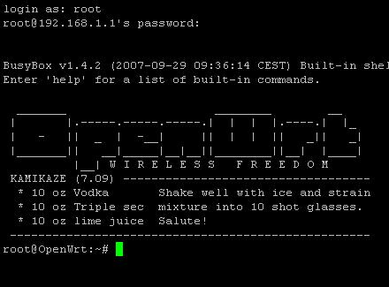

# mates[[edit](/pti/index.php?title=Categor%C3%ADa:mates&veaction=edit&section=1 "Edit section: mates") | [edit source](/pti/index.php?title=Categor%C3%ADa:mates&action=edit&section=1 "Edit section: mates")]

[File:Openwrt-logo.png](/pti/index.php?title=Special:Upload&wpDestFile=Openwrt-logo.png "File:Openwrt-logo.png")

## 1. ¿mates?[[edit](/pti/index.php?title=Categor%C3%ADa:mates&veaction=edit&section=2 "Edit section: 1. ¿mates?") | [edit source](/pti/index.php?title=Categor%C3%ADa:mates&action=edit&section=2 "Edit section: 1. ¿mates?")]

mates ...