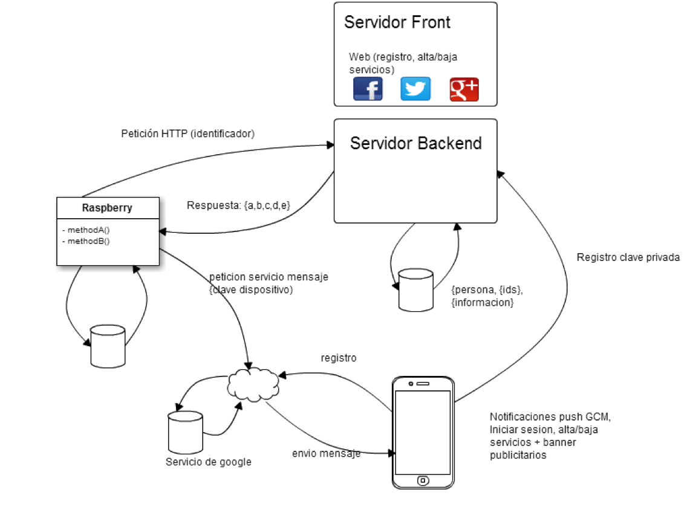
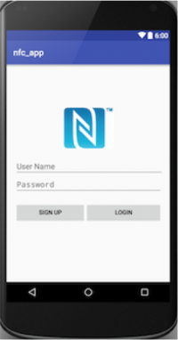
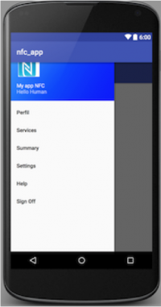
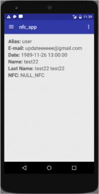
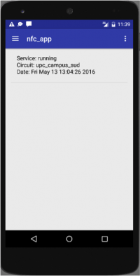
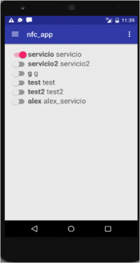
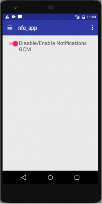
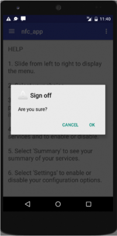

## Contents

* [1 Proyecto myAppNFC](#Proyecto_myAppNFC)
  + [1.1 1. Resumen de la propuesta](#1._Resumen_de_la_propuesta)
    - [1.1.1 MyAppNFC](#MyAppNFC)
    - [1.1.2 RunningApp](#RunningApp)
  + [1.2 2. Tecnologías utilizadas](#2._Tecnolog.C3.ADas_utilizadas)
    - [1.2.1 Composer](#Composer)
    - [1.2.2 Vagrant](#Vagrant)
    - [1.2.3 Zend Framework 2](#Zend_Framework_2)
    - [1.2.4 Apigility](#Apigility)
    - [1.2.5 Raspberry Pi](#Raspberry_Pi)
  + [1.3 Esquema general](#Esquema_general)
  + [1.4 4. Estructura del proyecto](#4._Estructura_del_proyecto)
    - [1.4.1 MyAppNFC](#MyAppNFC_2)
      * [1.4.1.1 Patrones de diseño](#Patrones_de_dise.C3.B1o)
        + [1.4.1.1.1 MVC](#MVC)
        + [1.4.1.1.2 Modelo](#Modelo)
        + [1.4.1.1.3 Vista](#Vista)
        + [1.4.1.1.4 Controlador](#Controlador)
      * [1.4.1.2 Estructura Zend Framework 2](#Estructura_Zend_Framework_2)
        + [1.4.1.2.1 Controller](#Controller)
        + [1.4.1.2.2 Factory](#Factory)
        + [1.4.1.2.3 Form](#Form)
        + [1.4.1.2.4 Mapper](#Mapper)
        + [1.4.1.2.5 Model](#Model)
        + [1.4.1.2.6 Service](#Service)
        + [1.4.1.2.7 Storage](#Storage)
        + [1.4.1.2.8 Router](#Router)
      * [1.4.1.3 Web services](#Web_services)
        + [1.4.1.3.1 LoginUser](#LoginUser)
        + [1.4.1.3.2 ProfileByUser](#ProfileByUser)
        + [1.4.1.3.3 SaveUser](#SaveUser)
        + [1.4.1.3.4 ServicesByUser](#ServicesByUser)
        + [1.4.1.3.5 SetServicesByUser](#SetServicesByUser)
        + [1.4.1.3.6 TokensUser](#TokensUser)
        + [1.4.1.3.7 SetTokenUser](#SetTokenUser)
        + [1.4.1.3.8 TokensUserById](#TokensUserById)
  + [1.5 4. Screenshots](#4._Screenshots)
    - [1.5.1 Web](#Web)
    - [1.5.2 Android](#Android)
  + [1.6 RunningApp](#RunningApp_2)
    - [1.6.1 Configuración Raspberry](#Configuraci.C3.B3n_Raspberry)
      * [1.6.1.1 Instalación entorno](#Instalaci.C3.B3n_entorno)
      * [1.6.1.2 Grabar el sistema operativo en la tarjeta sd](#Grabar_el_sistema_operativo_en_la_tarjeta_sd)
      * [1.6.1.3 Configuración wifi](#Configuraci.C3.B3n_wifi)
      * [1.6.1.4 Configuración del sistema operativo](#Configuraci.C3.B3n_del_sistema_operativo)
      * [1.6.1.5 Instalación apache y php](#Instalaci.C3.B3n_apache_y_php)
      * [1.6.1.6 Instalación librerías y drivers lector nfc](#Instalaci.C3.B3n_librer.C3.ADas_y_drivers_lector_nfc)
      * [1.6.1.7 nxppy](#nxppy)
      * [1.6.1.8 Compatibilidad](#Compatibilidad)
      * [1.6.1.9 Requisitos](#Requisitos)
      * [1.6.1.10 Instalación](#Instalaci.C3.B3n)
      * [1.6.1.11 Aplicación python](#Aplicaci.C3.B3n_python)
    - [1.6.2 Aplicación móvil](#Aplicaci.C3.B3n_m.C3.B3vil)
      * [1.6.2.1 Android](#Android_2)
      * [1.6.2.2 Clases aplicación android](#Clases_aplicaci.C3.B3n_android)
        + [1.6.2.2.1 BaseDeDatos](#BaseDeDatos)
        + [1.6.2.2.2 GcmBroadcastReceiver](#GcmBroadcastReceiver)
        + [1.6.2.2.3 GcmMessageHandler](#GcmMessageHandler)
        + [1.6.2.2.4 LoginActivity](#LoginActivity)
        + [1.6.2.2.5 RegisterActivity](#RegisterActivity)
        + [1.6.2.2.6 MainActivity](#MainActivity)
        + [1.6.2.2.7 EditProfileActivity](#EditProfileActivity)
        + [1.6.2.2.8 Treas asincronas:](#Treas_asincronas:)

# Proyecto myAppNFC[[edit](/pti/index.php?title=Categor%C3%ADa:myAppNFC&veaction=edit&section=1 "Edit section: Proyecto myAppNFC") | [edit source](/pti/index.php?title=Categor%C3%ADa:myAppNFC&action=edit&section=1 "Edit section: Proyecto myAppNFC")]

## 1. Resumen de la propuesta[[edit](/pti/index.php?title=Categor%C3%ADa:myAppNFC&veaction=edit&section=2 "Edit section: 1. Resumen de la propuesta") | [edit source](/pti/index.php?title=Categor%C3%ADa:myAppNFC&action=edit&section=2 "Edit section: 1. Resumen de la propuesta")]

### MyAppNFC[[edit](/pti/index.php?title=Categor%C3%ADa:myAppNFC&veaction=edit&section=3 "Edit section: MyAppNFC") | [edit source](/pti/index.php?title=Categor%C3%ADa:myAppNFC&action=edit&section=3 "Edit section: MyAppNFC")]

El equipo de MyAppNFC después de realizar una investigación sobre el mercado actual
tecnológico nos dimos cuenta que cada vez más se escucha hablar de “Internet of things” y
el 5G, la mayoría de blogs tecnológicos hablan de que algún día todo estará todo
interconectado.
Con esta visión de la tecnología actual indaguemos más sobre el tema de “Internet of
things” y actualmente hay una serie de dispositivos habitualmente utilizados para realizar las
tareas de esta rama de la tecnología, que son dispositivos que responden con información
al aplicar un campo electromagnético.
Esta tecnología de comunicación inalámbrica, de corto alcance y alta frecuencia podemos
diferenciar varios tipos como por ejemplo RFID o NFC.
Hay muchas ideas y proyectos que son desarrollados utilizando estas tecnologías para ir
interconectando las cosas pero hay un problema que no se ha solucionado aún, cómo vamos a
interconectar todo si cada uno monta todo su sistema de almacenamiento de información y
gestión de NFC.
Es aquí donde nosotros aparecemos y es el problema que queremos solucionar, nuestra idea
consiste en montar toda una infraestructura para crear y validar la información que se registran
en los NFC y tener centralizado la información que se quiere consultar, que normalmente será
información de un usuario.

### RunningApp[[edit](/pti/index.php?title=Categor%C3%ADa:myAppNFC&veaction=edit&section=4 "Edit section: RunningApp") | [edit source](/pti/index.php?title=Categor%C3%ADa:myAppNFC&action=edit&section=4 "Edit section: RunningApp")]

De forma paralela al proyecto MyAppNFC hemos implementado un proyecto para demostrar
la utilidad de la plataforma de web services.
El proyecto consiste en que somos una empresa de publicidad que tiene varios carteles de
publicidad repartidos por la ciudad, se ha hecho un estudio para aumentar la efectividad en
las visualizaciones de la publicidad, en el estudio se han dado cuenta que en algunas zonas
que tiene carteles de publicidad los runners que hay por la zona siempre realizan el mismo
circuito y pasan a pocos metros de los carteles.
La empresa de marketing quiere premiar a los runners que observan la publicidad y se han
enterado que las empresas importantes como nike o adidas están introduciendo unos tags
NFC en la suela de las bambas y que hay una empresa que ofrece información del
propietario de las bambas con el identificador que está grabado en el NFC.
La idea que han tenido los responsables de marketing es la de ofrecer el tiempo por vuelta
en ese circuito preestablecido y que el tiempo por vuelta será mostrado en alguna parte del
cartel publicitario y ademas sera enviado al dispositivo móvil del usuario

## 2. Tecnologías utilizadas[[edit](/pti/index.php?title=Categor%C3%ADa:myAppNFC&veaction=edit&section=5 "Edit section: 2. Tecnologías utilizadas") | [edit source](/pti/index.php?title=Categor%C3%ADa:myAppNFC&action=edit&section=5 "Edit section: 2. Tecnologías utilizadas")]

### Composer[[edit](/pti/index.php?title=Categor%C3%ADa:myAppNFC&veaction=edit&section=6 "Edit section: Composer") | [edit source](/pti/index.php?title=Categor%C3%ADa:myAppNFC&action=edit&section=6 "Edit section: Composer")]

Composer es un gestor de dependencias, no un gestor de paquetes. Instala las librerías
que requiere el proyecto con las versiones que necesite, y resuelve las dependencias entre
las librerías. La instalación siempre es local, las librerías se instalan en un directorio por
defecto ‘/vendor’.

### Vagrant[[edit](/pti/index.php?title=Categor%C3%ADa:myAppNFC&veaction=edit&section=7 "Edit section: Vagrant") | [edit source](/pti/index.php?title=Categor%C3%ADa:myAppNFC&action=edit&section=7 "Edit section: Vagrant")]

Vagrant es una herramienta para la creación y configuración de entornos de desarrollo
virtualizados. En Vagrant podemos instalar y configurar software en una máquina virtual
para que podamos simular que estamos en el servidor en el que se alojaría la aplicación
Web. La principal ventaja es que si queremos desarrollar una aplicación Web, Vagrant tiene
“cajas” con sistemas operativos y entornos ya preparados para desarrollar directamente en
ellos.

### Zend Framework 2[[edit](/pti/index.php?title=Categor%C3%ADa:myAppNFC&veaction=edit&section=8 "Edit section: Zend Framework 2") | [edit source](/pti/index.php?title=Categor%C3%ADa:myAppNFC&action=edit&section=8 "Edit section: Zend Framework 2")]

Zend framework 2 es un conjunto de librerías para el lenguaje de programación PHP, este
framework sigue una arquitectura MVC.

### Apigility[[edit](/pti/index.php?title=Categor%C3%ADa:myAppNFC&veaction=edit&section=9 "Edit section: Apigility") | [edit source](/pti/index.php?title=Categor%C3%ADa:myAppNFC&action=edit&section=9 "Edit section: Apigility")]

Módulo del Zend framework para la gestión de los web services.
SOA ­ Arquitectura orientada a servicios
La Arquitectura Orientada a Servicios (SOA, siglas del inglés Service Oriented Architecture)
es un paradigma de arquitectura para diseñar y desarrollar sistemas distribuidos. Las
soluciones SOA han sido creadas para satisfacer los objetivos de negocio las cuales
incluyen facilidad y flexibilidad de integración con sistemas legados, alineación directa a los
procesos de negocio reduciendo costos de implementación, innovación de servicios a
clientes y una adaptación ágil ante cambios incluyendo reacción temprana ante la
competitividad.
Permite la creación de sistemas de información altamente escalables que reflejan el negocio
de la organización, a su vez brinda una forma bien definida de exposición e invocación de
servicios (comúnmente pero no exclusivamente servicios web), lo cual facilita la interacción
entre diferentes sistemas propios o de terceros.

### Raspberry Pi[[edit](/pti/index.php?title=Categor%C3%ADa:myAppNFC&veaction=edit&section=10 "Edit section: Raspberry Pi") | [edit source](/pti/index.php?title=Categor%C3%ADa:myAppNFC&action=edit&section=10 "Edit section: Raspberry Pi")]

Raspberry Pi es un ordenador de placa reducida, ordenador de placa única u ordenador de
placa simple (SBC) de bajo coste desarrollado en Reino Unido por la Fundación Raspberry
Pi, con el objetivo de estimular la enseñanza de ciencias de la computación en las escuelas.

## Esquema general[[edit](/pti/index.php?title=Categor%C3%ADa:myAppNFC&veaction=edit&section=11 "Edit section: Esquema general") | [edit source](/pti/index.php?title=Categor%C3%ADa:myAppNFC&action=edit&section=11 "Edit section: Esquema general")]

## 4. Estructura del proyecto[[edit](/pti/index.php?title=Categor%C3%ADa:myAppNFC&veaction=edit&section=12 "Edit section: 4. Estructura del proyecto") | [edit source](/pti/index.php?title=Categor%C3%ADa:myAppNFC&action=edit&section=12 "Edit section: 4. Estructura del proyecto")]

### MyAppNFC[[edit](/pti/index.php?title=Categor%C3%ADa:myAppNFC&veaction=edit&section=13 "Edit section: MyAppNFC") | [edit source](/pti/index.php?title=Categor%C3%ADa:myAppNFC&action=edit&section=13 "Edit section: MyAppNFC")]

#### Patrones de diseño[[edit](/pti/index.php?title=Categor%C3%ADa:myAppNFC&veaction=edit&section=14 "Edit section: Patrones de diseño") | [edit source](/pti/index.php?title=Categor%C3%ADa:myAppNFC&action=edit&section=14 "Edit section: Patrones de diseño")]

##### MVC[[edit](/pti/index.php?title=Categor%C3%ADa:myAppNFC&veaction=edit&section=15 "Edit section: MVC") | [edit source](/pti/index.php?title=Categor%C3%ADa:myAppNFC&action=edit&section=15 "Edit section: MVC")]

Es probablemente uno de los patrones más usados y cotizados en el mundo de la programación web en los últimos años.

Es un patrón de arquitectura que describe una forma de estructurar nuestra aplicación y las responsabilidades y las interacciones de cada parte en esa estructura. Separa los datos y la lógica de negocio de una aplicación de la interfaz de usuario y el módulo encargado de gestionar los eventos y las comunicaciones. Para ello MVC propone la construcción de tres componentes distintos que son el modelo, la vista y el controlador, es decir, por un lado define componentes para la representación de la información, y por otro lado para la interacción del usuario. Este patrón de arquitectura de software se basa en las ideas de reutilización de código y la separación de conceptos, características que buscan facilitar la tarea de desarrollo de aplicaciones y su posterior mantenimiento.

##### Modelo[[edit](/pti/index.php?title=Categor%C3%ADa:myAppNFC&veaction=edit&section=16 "Edit section: Modelo") | [edit source](/pti/index.php?title=Categor%C3%ADa:myAppNFC&action=edit&section=16 "Edit section: Modelo")]

El modelo contiene la parte más importante de nuestra lógica de la aplicación, la lógica que se aplica al proyecto que desarrollamos. Es la representación de los datos, con lo que el sistema opera, y las reglas, que se aplican a estos datos. Por lo tanto, gestiona todos los accesos a dicha información, tanto consultas como actualizaciones, implementando también los privilegios de acceso que se hayan descrito en las especificaciones de la aplicación (lógica de negocio). Envía a la 'vista' aquella parte de la información que en cada momento se le solicita para que sea mostrada (típicamente a un usuario). Las peticiones de acceso o manipulación de información llegan al 'modelo' a través del 'controlador'.

##### Vista[[edit](/pti/index.php?title=Categor%C3%ADa:myAppNFC&veaction=edit&section=17 "Edit section: Vista") | [edit source](/pti/index.php?title=Categor%C3%ADa:myAppNFC&action=edit&section=17 "Edit section: Vista")]

Ofrece diferentes maneras de visualizar los datos recibidos del modelo. Pueden haber varias vistas diferentes y el controlador tiene que decidir cuál usar.
Una aplicación web se compone generalmente de un conjunto de controladores, modelos y vistas. El controlador puede estar configurado como un controlador principal que recibe todas las peticiones y llama a los controladores específicos que maneja acciones para cada caso, representando la visualización de los datos que contiene el modelo.

##### Controlador[[edit](/pti/index.php?title=Categor%C3%ADa:myAppNFC&veaction=edit&section=18 "Edit section: Controlador") | [edit source](/pti/index.php?title=Categor%C3%ADa:myAppNFC&action=edit&section=18 "Edit section: Controlador")]

Actúa tanto en el modelo como en la vista, haciendo de intermediario entre ambos. Controla el flujo de datos en un objeto de modelo, actualiza la vista siempre que cambian los datos, invoca y coordina los recursos/objetos necesarios para realizar la acción que el usuario desea. Responde a eventos (usualmente acciones del usuario), gestiona las peticiones de los usuarios (recibidos como peticiones HTTP GET o POST cuando el usuario hace clic en los elementos de interfaz gráfica de usuario para llevar a cabo las acciones). Mantiene la vista y el modelo separados.

#### Estructura Zend Framework 2[[edit](/pti/index.php?title=Categor%C3%ADa:myAppNFC&veaction=edit&section=19 "Edit section: Estructura Zend Framework 2") | [edit source](/pti/index.php?title=Categor%C3%ADa:myAppNFC&action=edit&section=19 "Edit section: Estructura Zend Framework 2")]

##### Controller[[edit](/pti/index.php?title=Categor%C3%ADa:myAppNFC&veaction=edit&section=20 "Edit section: Controller") | [edit source](/pti/index.php?title=Categor%C3%ADa:myAppNFC&action=edit&section=20 "Edit section: Controller")]

Un conjunto de clases abstractas de controladores con responsabilidades básicas, tales como escribir eventos e invocar acciones

##### Factory[[edit](/pti/index.php?title=Categor%C3%ADa:myAppNFC&veaction=edit&section=21 "Edit section: Factory") | [edit source](/pti/index.php?title=Categor%C3%ADa:myAppNFC&action=edit&section=21 "Edit section: Factory")]

Proporciona un conjunto de gestores ServiceManager y definiciones para el predeterminado flujo de trabajo y correcto funcionamiento de la aplicación

##### Form[[edit](/pti/index.php?title=Categor%C3%ADa:myAppNFC&veaction=edit&section=22 "Edit section: Form") | [edit source](/pti/index.php?title=Categor%C3%ADa:myAppNFC&action=edit&section=22 "Edit section: Form")]

Muestra un formulario para que el usuario proporcione información y
gestiona el envío de los datos del formulario y los almacena en la base de datos.

##### Mapper[[edit](/pti/index.php?title=Categor%C3%ADa:myAppNFC&veaction=edit&section=23 "Edit section: Mapper") | [edit source](/pti/index.php?title=Categor%C3%ADa:myAppNFC&action=edit&section=23 "Edit section: Mapper")]

Es una capa de software que separa los objetos de la base de datos. Su responsabilidad es la transferencia de datos entre los dos y aislarlos unos de otros. Con el Mapper los objetos no tienen necesidad de código de interfaz SQL, ni ningún conocimiento del esquema de base de datos.

##### Model[[edit](/pti/index.php?title=Categor%C3%ADa:myAppNFC&veaction=edit&section=24 "Edit section: Model") | [edit source](/pti/index.php?title=Categor%C3%ADa:myAppNFC&action=edit&section=24 "Edit section: Model")]

Representa cada entidad de la aplicación y utiliza los objetos Mapper para cargar y guardar la información detallada de estas entidades en la base de datos.

##### Service[[edit](/pti/index.php?title=Categor%C3%ADa:myAppNFC&veaction=edit&section=25 "Edit section: Service") | [edit source](/pti/index.php?title=Categor%C3%ADa:myAppNFC&action=edit&section=25 "Edit section: Service")]

Es un objeto que ejecuta la lógica de aplicación compleja. Es la parte de la aplicación que enlaza todas las cosas difíciles y permite entender de manera fácil los resultados.

##### Storage[[edit](/pti/index.php?title=Categor%C3%ADa:myAppNFC&veaction=edit&section=26 "Edit section: Storage") | [edit source](/pti/index.php?title=Categor%C3%ADa:myAppNFC&action=edit&section=26 "Edit section: Storage")]

Es el intermediario entre el inicio y cierre de la sesión

##### Router[[edit](/pti/index.php?title=Categor%C3%ADa:myAppNFC&veaction=edit&section=27 "Edit section: Router") | [edit source](/pti/index.php?title=Categor%C3%ADa:myAppNFC&action=edit&section=27 "Edit section: Router")]

Es la acción que asigna una petición a un controlador predeterminado. Por lo general, el enrutamiento examina la petición URI, y trata de enlazar el segmento de la ruta URI con las restricciones proporcionadas. Si las restricciones coinciden, se devuelve una serie de "coincidencias", uno de los cuales debe ser el nombre de controlador a ejecutar. Enrutamiento puede utilizar otras partes de la petición URI o del entorno, así - por ejemplo, el host o esquema, los parámetros de consulta, cabeceras, método de la petición, etc.

#### Web services[[edit](/pti/index.php?title=Categor%C3%ADa:myAppNFC&veaction=edit&section=28 "Edit section: Web services") | [edit source](/pti/index.php?title=Categor%C3%ADa:myAppNFC&action=edit&section=28 "Edit section: Web services")]

Los web services es la parte que comunica la lógica de negocio que tenemos implementada en el backend con al exterior, por ello todos los servicios que ofrecemos se tienen que identificar para poder consumir los servicios a través de la cabecera de autentificación introduciendo un usuario y password que para nosotros representa un usuario de tipo Service.
Hay que indicar que para la transmisión de datos entre servicios web hay varias opciones en como enviar y responder en la estructura de datos, en nuestro caso hemos decidido que todo se transmita en JSON.

##### LoginUser[[edit](/pti/index.php?title=Categor%C3%ADa:myAppNFC&veaction=edit&section=29 "Edit section: LoginUser") | [edit source](/pti/index.php?title=Categor%C3%ADa:myAppNFC&action=edit&section=29 "Edit section: LoginUser")]

Este servicio se encarga de validar si un usuario está en el sistema y si la combinación username y password es válida.

##### ProfileByUser[[edit](/pti/index.php?title=Categor%C3%ADa:myAppNFC&veaction=edit&section=30 "Edit section: ProfileByUser") | [edit source](/pti/index.php?title=Categor%C3%ADa:myAppNFC&action=edit&section=30 "Edit section: ProfileByUser")]

Este servicio se encarga de facilitar la información de un usuario del tipo user introduciendo un username válido.
En el caso que el servicio que está utilizando el web service el usuario ha configurado que este servicio no tiene permiso para consultar la información la respuesta sería un error.

##### SaveUser[[edit](/pti/index.php?title=Categor%C3%ADa:myAppNFC&veaction=edit&section=31 "Edit section: SaveUser") | [edit source](/pti/index.php?title=Categor%C3%ADa:myAppNFC&action=edit&section=31 "Edit section: SaveUser")]

Este servicio se encarga de insertar o modificar un usuario en la base de datos. Si al servicio se le envía un usuario sin ID este usuario será insertado pero hay que tener en cuenta que el username y el password no tienen que estar previamente en la base de datos, en el caso que enviemos el ID del usuario se realizará las modificaciones pertinentes al usuario con el ID indicado.

##### ServicesByUser[[edit](/pti/index.php?title=Categor%C3%ADa:myAppNFC&veaction=edit&section=32 "Edit section: ServicesByUser") | [edit source](/pti/index.php?title=Categor%C3%ADa:myAppNFC&action=edit&section=32 "Edit section: ServicesByUser")]

Este servicio devuelve un array con todos los servicios del sistema indicando si ese servicio lo tiene activado o no para el usuario consultado.

##### SetServicesByUser[[edit](/pti/index.php?title=Categor%C3%ADa:myAppNFC&veaction=edit&section=33 "Edit section: SetServicesByUser") | [edit source](/pti/index.php?title=Categor%C3%ADa:myAppNFC&action=edit&section=33 "Edit section: SetServicesByUser")]

Este servicio se utiliza para modificar los permisos que tiene un usuario respecto los servicios.

##### TokensUser[[edit](/pti/index.php?title=Categor%C3%ADa:myAppNFC&veaction=edit&section=34 "Edit section: TokensUser") | [edit source](/pti/index.php?title=Categor%C3%ADa:myAppNFC&action=edit&section=34 "Edit section: TokensUser")]

Este servicio es para consultar todos los tokens GCM de un usuario

##### SetTokenUser[[edit](/pti/index.php?title=Categor%C3%ADa:myAppNFC&veaction=edit&section=35 "Edit section: SetTokenUser") | [edit source](/pti/index.php?title=Categor%C3%ADa:myAppNFC&action=edit&section=35 "Edit section: SetTokenUser")]

Este servicio es para insertar un token a un usuario en concreto

##### TokensUserById[[edit](/pti/index.php?title=Categor%C3%ADa:myAppNFC&veaction=edit&section=36 "Edit section: TokensUserById") | [edit source](/pti/index.php?title=Categor%C3%ADa:myAppNFC&action=edit&section=36 "Edit section: TokensUserById")]

Este servicio es para consultar todos los tokens de un usuario con un identificador de NFC

## 4. Screenshots[[edit](/pti/index.php?title=Categor%C3%ADa:myAppNFC&veaction=edit&section=37 "Edit section: 4. Screenshots") | [edit source](/pti/index.php?title=Categor%C3%ADa:myAppNFC&action=edit&section=37 "Edit section: 4. Screenshots")]

### Web[[edit](/pti/index.php?title=Categor%C3%ADa:myAppNFC&veaction=edit&section=38 "Edit section: Web") | [edit source](/pti/index.php?title=Categor%C3%ADa:myAppNFC&action=edit&section=38 "Edit section: Web")]

### Android[[edit](/pti/index.php?title=Categor%C3%ADa:myAppNFC&veaction=edit&section=39 "Edit section: Android") | [edit source](/pti/index.php?title=Categor%C3%ADa:myAppNFC&action=edit&section=39 "Edit section: Android")]

|  |  |  |  |
| --- | --- | --- | --- |
|  | [File:New.png](/pti/index.php?title=Special:Upload&wpDestFile=New.png "File:New.png") 200px |  |  |
|  |  |  |  |

## RunningApp[[edit](/pti/index.php?title=Categor%C3%ADa:myAppNFC&veaction=edit&section=40 "Edit section: RunningApp") | [edit source](/pti/index.php?title=Categor%C3%ADa:myAppNFC&action=edit&section=40 "Edit section: RunningApp")]

### Configuración Raspberry[[edit](/pti/index.php?title=Categor%C3%ADa:myAppNFC&veaction=edit&section=41 "Edit section: Configuración Raspberry") | [edit source](/pti/index.php?title=Categor%C3%ADa:myAppNFC&action=edit&section=41 "Edit section: Configuración Raspberry")]

Para configurar la raspberry pi necesitaremos una tarjeta sd con su adaptador para poder introducirla en el lector de tarjetas de ésta, un cable ethernet( o un acceso wifi), cable de corriente, una pantalla con entrada hdmi y en particular en nuestro proyecto un lector NFC de la marca NXP con entrada para los pines de la raspberry.

#### Instalación entorno[[edit](/pti/index.php?title=Categor%C3%ADa:myAppNFC&veaction=edit&section=42 "Edit section: Instalación entorno") | [edit source](/pti/index.php?title=Categor%C3%ADa:myAppNFC&action=edit&section=42 "Edit section: Instalación entorno")]

El primer paso es descargar un sistema operativo para la Raspberry Pi. He elegido Raspbian, basado en la distribución de Linux Debian (optimizado para su uso en este dispositivo). La última versión se puede descargar desde la página oficial
<https://www.raspbian.org> (unos 3.3GB).

#### Grabar el sistema operativo en la tarjeta sd[[edit](/pti/index.php?title=Categor%C3%ADa:myAppNFC&veaction=edit&section=43 "Edit section: Grabar el sistema operativo en la tarjeta sd") | [edit source](/pti/index.php?title=Categor%C3%ADa:myAppNFC&action=edit&section=43 "Edit section: Grabar el sistema operativo en la tarjeta sd")]

Hay muchas maneras de copiar la imagen en la tarjeta SD en función del sistema operativo. Yo lo he hecho en Ubuntu Linux con la utilidad “Discos”. Seleccionamos la tarjeta SD y le damos a “Restaurar imagen de disco”.

#### Configuración wifi[[edit](/pti/index.php?title=Categor%C3%ADa:myAppNFC&veaction=edit&section=44 "Edit section: Configuración wifi") | [edit source](/pti/index.php?title=Categor%C3%ADa:myAppNFC&action=edit&section=44 "Edit section: Configuración wifi")]

Sin quitar la tarjeta SD del ordenador, navegamos hasta el archivo /etc/network/interfaces de la tarjeta SD

sudo nano /path/a/la/tarjeta/sd/etc/network/interfaces

lo editamos para que incluya los siguientes parámetros:

auto lo
iface lo inet loopback
iface eth0 inet dhcp
auto wlan0
allow-hotplug wlan0
iface wlan0 inet dhcp
wpa-ssid “nombre de tu RED WIFI”
wpa-psk “tu password WIFI aquí”

#### Configuración del sistema operativo[[edit](/pti/index.php?title=Categor%C3%ADa:myAppNFC&veaction=edit&section=45 "Edit section: Configuración del sistema operativo") | [edit source](/pti/index.php?title=Categor%C3%ADa:myAppNFC&action=edit&section=45 "Edit section: Configuración del sistema operativo")]

Ejecutamos el comando:

sudo raspi-config

Podremos expandir el sistema, configurar el teclado en nuestro caso al español/por defecto viene el americano) idioma, cambiar contraseña, y un paso muy importante, activar los pines de nuestra raspberry ya que por defecto no vienen activados.

Vamos a actualizar la Raspberry Pi con los siguientes comandos:

sudo apt-get update && sudo apt-get upgrade

#### Instalación apache y php[[edit](/pti/index.php?title=Categor%C3%ADa:myAppNFC&veaction=edit&section=46 "Edit section: Instalación apache y php") | [edit source](/pti/index.php?title=Categor%C3%ADa:myAppNFC&action=edit&section=46 "Edit section: Instalación apache y php")]

Para la instalación de Apache y php necesitamos introducir los siguientes comandos:

sudo apt-get install apache2 -y

sudo apt-get install php5 libapache2-mod-php5 -y

Para poder usar nuestras funciones Curl en nuestro fichero .php necesitamos instalar estas dependencias:

sudo apt-get install libapache2-mod-php5 php5 php-pear php5-xcache php5-mysql php5-curl php5-gd

#### Instalación librerías y drivers lector nfc[[edit](/pti/index.php?title=Categor%C3%ADa:myAppNFC&veaction=edit&section=47 "Edit section: Instalación librerías y drivers lector nfc") | [edit source](/pti/index.php?title=Categor%C3%ADa:myAppNFC&action=edit&section=47 "Edit section: Instalación librerías y drivers lector nfc")]

#### nxppy[[edit](/pti/index.php?title=Categor%C3%ADa:myAppNFC&veaction=edit&section=48 "Edit section: nxppy") | [edit source](/pti/index.php?title=Categor%C3%ADa:myAppNFC&action=edit&section=48 "Edit section: nxppy")]

Para poder usar el lector NFC de la marca NXP nos basaremos en el lenguaje python.
Se necesita Reader Library de NXP ya que proporciona una capa para la detección de una etiqueta RFID Mifare, leyendo su UID (identificador único), y los datos de lectura / escritura desde / hasta el área de usuario.

#### Compatibilidad[[edit](/pti/index.php?title=Categor%C3%ADa:myAppNFC&veaction=edit&section=49 "Edit section: Compatibilidad") | [edit source](/pti/index.php?title=Categor%C3%ADa:myAppNFC&action=edit&section=49 "Edit section: Compatibilidad")]

Probado con tanto Python 2.7 y con una versión compilada manualmente de Python 3.4.

#### Requisitos[[edit](/pti/index.php?title=Categor%C3%ADa:myAppNFC&veaction=edit&section=50 "Edit section: Requisitos") | [edit source](/pti/index.php?title=Categor%C3%ADa:myAppNFC&action=edit&section=50 "Edit section: Requisitos")]

La tarjeta NXP se basa en SPI, por lo tanto tiene que estar habilitado. Se activa SPI usando Raspi-config antes de instalar nxppy (como se había nombrado en pasos anteriores).

#### Instalación[[edit](/pti/index.php?title=Categor%C3%ADa:myAppNFC&veaction=edit&section=51 "Edit section: Instalación") | [edit source](/pti/index.php?title=Categor%C3%ADa:myAppNFC&action=edit&section=51 "Edit section: Instalación")]

Nos situamos en el directorio donde queramos descargar los archivos para la instalación y ejecutamos los comandos siguientes:

wget <https://bootstrap.pypa.io/get-pip.py>

sudo python get-pip.py

sudo pip install nxppy

La instalación tarda bastante, ya que tira hacia abajo automáticamente y construye NeardAL, WiringPi, y la Biblioteca del lector de NXP impulsoras.

Fuente

Para instalar desde el código fuente:

sudo apt-get install python-setuptools
sudo python setup.py build install

#### Aplicación python[[edit](/pti/index.php?title=Categor%C3%ADa:myAppNFC&veaction=edit&section=52 "Edit section: Aplicación python") | [edit source](/pti/index.php?title=Categor%C3%ADa:myAppNFC&action=edit&section=52 "Edit section: Aplicación python")]

La aplicación python es la encargada de gestionar las lecturas del lector NFC provenientes de los chip nfc los cuales están asignados a los usuarios. Captura la hora en que se ha hecho la lectura, el identificador del chip NFC, el tipo de servicio.

Con estos datos hace una petición post a la aplicación web que os hablaremos más adelante para proporcionarle todos estos datos.
Aplicación web
La aplicación web de la raspberry se encarga de recibir los parametros por post de la aplicación python para tratarlos y hacer una petición post a nuestro backend pasándole el identificador NFC leído por el lector y de esta forma poder conseguir el token privado del usuario para poder enviarle un mensaje GCM(google cloud message).

Este mensaje consta de, los parámetros capturados por la aplicación python y anotar qué es multicast, es decir, se puede enviar a todos los dispositivos registrados por el usuario(todos los token que tenga)

### Aplicación móvil[[edit](/pti/index.php?title=Categor%C3%ADa:myAppNFC&veaction=edit&section=53 "Edit section: Aplicación móvil") | [edit source](/pti/index.php?title=Categor%C3%ADa:myAppNFC&action=edit&section=53 "Edit section: Aplicación móvil")]

#### Android[[edit](/pti/index.php?title=Categor%C3%ADa:myAppNFC&veaction=edit&section=54 "Edit section: Android") | [edit source](/pti/index.php?title=Categor%C3%ADa:myAppNFC&action=edit&section=54 "Edit section: Android")]

Para la aplicación android nos hemos basado en el modelo vista controlador y el uso de threads para mejorar el rendimiento de la aplicación y entre otras cosas hacer las llamadas a nuestro servidor de backend de una forma óptima y sin hacer “visible” la espera al usuario.

#### Clases aplicación android[[edit](/pti/index.php?title=Categor%C3%ADa:myAppNFC&veaction=edit&section=55 "Edit section: Clases aplicación android") | [edit source](/pti/index.php?title=Categor%C3%ADa:myAppNFC&action=edit&section=55 "Edit section: Clases aplicación android")]

##### BaseDeDatos[[edit](/pti/index.php?title=Categor%C3%ADa:myAppNFC&veaction=edit&section=56 "Edit section: BaseDeDatos") | [edit source](/pti/index.php?title=Categor%C3%ADa:myAppNFC&action=edit&section=56 "Edit section: BaseDeDatos")]

Esta clase se encarga de toda la gestión de salvado y carga de datos de la aplicación (perfil usuario, configuraciones, etc)
Utiliza funciones propias de sqlite

##### GcmBroadcastReceiver[[edit](/pti/index.php?title=Categor%C3%ADa:myAppNFC&veaction=edit&section=57 "Edit section: GcmBroadcastReceiver") | [edit source](/pti/index.php?title=Categor%C3%ADa:myAppNFC&action=edit&section=57 "Edit section: GcmBroadcastReceiver")]

Encargada de recibir el mensaje y levantar el servicio

##### GcmMessageHandler[[edit](/pti/index.php?title=Categor%C3%ADa:myAppNFC&veaction=edit&section=58 "Edit section: GcmMessageHandler") | [edit source](/pti/index.php?title=Categor%C3%ADa:myAppNFC&action=edit&section=58 "Edit section: GcmMessageHandler")]

Trato el mensaje para mostrar la notificación push de la aplicación y llamada a la clase de datos para guardar las variables recibidas por el mensaje.

##### LoginActivity[[edit](/pti/index.php?title=Categor%C3%ADa:myAppNFC&veaction=edit&section=59 "Edit section: LoginActivity") | [edit source](/pti/index.php?title=Categor%C3%ADa:myAppNFC&action=edit&section=59 "Edit section: LoginActivity")]

Clase encargada de gestionar el login del usuario, de cargar la vista de login y de hacer las llamadas asíncronas para que éstas gestionen la información del usuario como pueden ser el set del token privado del servidor de google o la comprobación de las credenciales

##### RegisterActivity[[edit](/pti/index.php?title=Categor%C3%ADa:myAppNFC&veaction=edit&section=60 "Edit section: RegisterActivity") | [edit source](/pti/index.php?title=Categor%C3%ADa:myAppNFC&action=edit&section=60 "Edit section: RegisterActivity")]

Clase encargada de registrar un usuario, para ello hace una llamada a la clase asíncrona correspondiente.
Por otro lado hace una serie de comprobaciones, en el e-mail y contraseña para evitar enviarle peticiones al servidor innecesarias, aunque el servidor las vuelva a comprobar.

##### MainActivity[[edit](/pti/index.php?title=Categor%C3%ADa:myAppNFC&veaction=edit&section=61 "Edit section: MainActivity") | [edit source](/pti/index.php?title=Categor%C3%ADa:myAppNFC&action=edit&section=61 "Edit section: MainActivity")]

Clase encargada del control de contenido de la aplicación, su principal funcionalidad es la presentación de los datos, rellenando y vaciando contenidos dinámicos.

##### EditProfileActivity[[edit](/pti/index.php?title=Categor%C3%ADa:myAppNFC&veaction=edit&section=62 "Edit section: EditProfileActivity") | [edit source](/pti/index.php?title=Categor%C3%ADa:myAppNFC&action=edit&section=62 "Edit section: EditProfileActivity")]

Clase encargada de cargar la vista de editar el perfil del usuario, y de hacer la llamada asincrona para guardar estos datos en el servidor.

##### Treas asincronas:[[edit](/pti/index.php?title=Categor%C3%ADa:myAppNFC&veaction=edit&section=63 "Edit section: Treas asincronas:") | [edit source](/pti/index.php?title=Categor%C3%ADa:myAppNFC&action=edit&section=63 "Edit section: Treas asincronas:")]

MyAsyncTask
MyAsyncTaskEditProfile
MyAsyncTaskListProfile
MyAsyncTaskRegister
MyAsyncTaskServicesByUser
MyAsyncTaskSetTokenUser
MyAsyncTaskSetServicesByUser

Todas estas tareas hacen una llamada al servidor backend de tipo get o post según su funcionalidad, get para consultas y post para modificaciones, utilizan los threads del dispositivo móvil para una gestión más llevadera para la aplicación. Usan la clase BaseDeDatos para guardar la información de procesan.