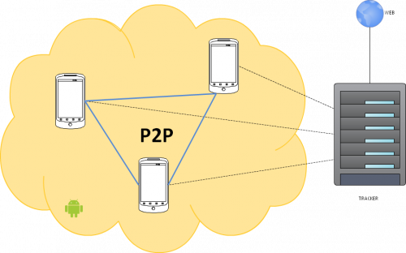

## Contents

* [1 Resumen de la propuesta](#Resumen_de_la_propuesta)
* [2 Objetivos](#Objetivos)
* [3 Tecnologias](#Tecnologias)
  + [3.1 Servidor](#Servidor)
  + [3.2 Android](#Android)
* [4 Interacción de los componentes de la red](#Interacci.C3.B3n_de_los_componentes_de_la_red)
* [5 Resultado final](#Resultado_final)

# Resumen de la propuesta[[edit](/pti/index.php?title=Categor%C3%ADa:p2pMobile&veaction=edit&section=1 "Edit section: Resumen de la propuesta") | [edit source](/pti/index.php?title=Categor%C3%ADa:p2pMobile&action=edit&section=1 "Edit section: Resumen de la propuesta")]

P2PMobile pretende poder compartir archivos con el móvil desde cualquier lugar en una red del tipo peer-to-peer. Los archivos no solo podrán ser compartidos entre móviles sino que la asociación ordenador-móvil, móvil-ordenador también estará presente, es decir, el móvil será capaz de servir archivos.

Para lograr esto hemos creado una aplicación android, que permite al usuario loguearse, crear los torrents que quiera compartir y crear grupos exclusivos de compartición de archivos.

También hay una página web a través de la cual se podrá descargar la aplicación móvil, desde la que los usuarios se podrán registrar, loguearse, configurar sus cuentas y ver estadísticas del tracker y de los demás usuarios registrados.

# Objetivos[[edit](/pti/index.php?title=Categor%C3%ADa:p2pMobile&veaction=edit&section=2 "Edit section: Objetivos") | [edit source](/pti/index.php?title=Categor%C3%ADa:p2pMobile&action=edit&section=2 "Edit section: Objetivos")]

* Realizar un cliente P2P para Android.
* Desarrollar la aplicación web, para la descarga de la aplicación, gestión de usuarios y estadísticas.
* Desarrollar el servidor para gestionar toda la información de la red de compartición con una base de datos Mysql, el tracker y ofrecer servicios web SOAP para la gestión de la base de datos tanto a la aplicación web como a la de Android.
* Profundizar sobre el conocimiento de las redes P2P y en el funcionamiento del modelo cliente-servidor.

# Tecnologias[[edit](/pti/index.php?title=Categor%C3%ADa:p2pMobile&veaction=edit&section=3 "Edit section: Tecnologias") | [edit source](/pti/index.php?title=Categor%C3%ADa:p2pMobile&action=edit&section=3 "Edit section: Tecnologias")]

## Servidor[[edit](/pti/index.php?title=Categor%C3%ADa:p2pMobile&veaction=edit&section=4 "Edit section: Servidor") | [edit source](/pti/index.php?title=Categor%C3%ADa:p2pMobile&action=edit&section=4 "Edit section: Servidor")]

* Ubuntu Server 12.04.2 LTS
* Servidor http Apache 2.2
* Servidor Apache Tomcat 7.0.37
* Php 5.3
* OpenSSH 5.9
* Vsftp 2.3.5
* Mysqlserver 5.5
* build-essential (gcc/g++)
* Openjdk 6 y 7
* opentracker

## Android[[edit](/pti/index.php?title=Categor%C3%ADa:p2pMobile&veaction=edit&section=5 "Edit section: Android") | [edit source](/pti/index.php?title=Categor%C3%ADa:p2pMobile&action=edit&section=5 "Edit section: Android")]

* Java
* Bittorrent API Java
* Android API 17
* SOAP

# Interacción de los componentes de la red[[edit](/pti/index.php?title=Categor%C3%ADa:p2pMobile&veaction=edit&section=6 "Edit section: Interacción de los componentes de la red") | [edit source](/pti/index.php?title=Categor%C3%ADa:p2pMobile&action=edit&section=6 "Edit section: Interacción de los componentes de la red")]

**Dispositivos android:**

* Cliente P2P.
* Registro usuario, login.
* Estadísticas, archivos, grupos...

**Servidor:**

* Tracker, Mysql.

**Aplicación web:**

* Registro usuario, login.
* Estadísticas de los usuarios y del sistema.

# Resultado final[[edit](/pti/index.php?title=Categor%C3%ADa:p2pMobile&veaction=edit&section=7 "Edit section: Resultado final") | [edit source](/pti/index.php?title=Categor%C3%ADa:p2pMobile&action=edit&section=7 "Edit section: Resultado final")]